# 26. 병행성 개요

## 멀티 쓰레드 프로그램

하나 이상의 실행 지점(독립적으로 불러 들여지고 실행될 수 있는 여러 개의 PC 값)을 가짐

각 쓰레드는 프로세스와 유사

### 차이 1 : 쓰레드들 주소 공간 공유, 동일한 값에 접근 가능

문맥교환을 통해 실행중인 쓰레드와 교체, 쓰레드 제어 블럭(thread control block, TCB)에 프로세스의 쓰레드 상태를 저장

쓰레드 간의 문맥교환에서는 주소공간을 그대로 사용

### 차이 2: 스택

단일 쓰레드 - 스택이 1개 존재

멀티 쓰레드 프로그램 - 쓰레드마다 스택할당

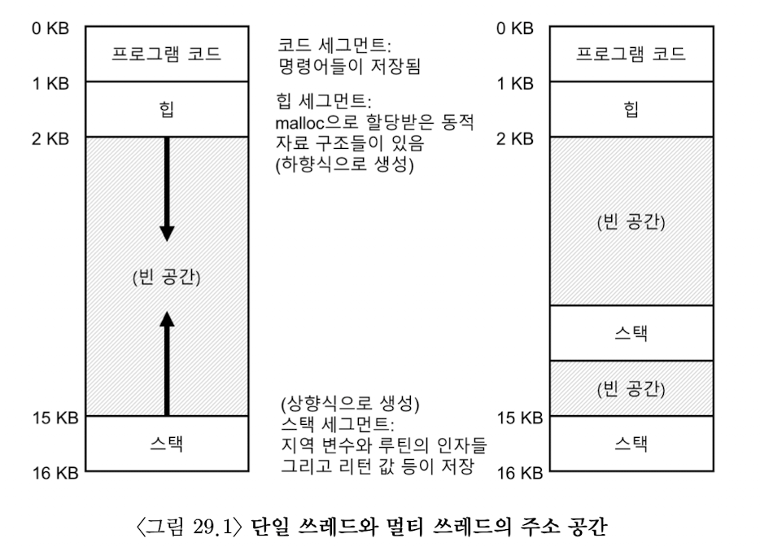

## 쓰레드 생성

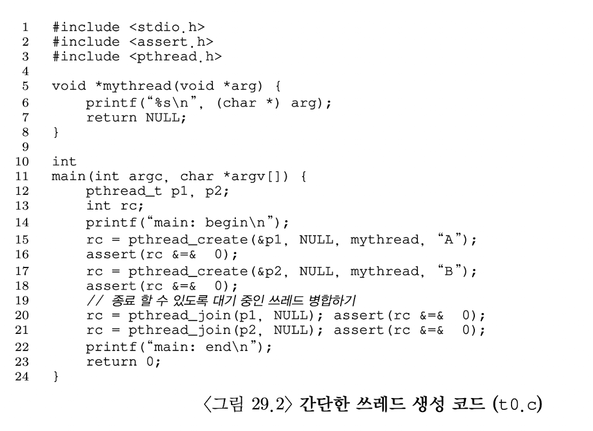

메인 프로그램은 mythread() 함수를 실행할 두 개의 쓰레드 생성 

스케줄러의 동작에 따라 쓰레드가 생성되면 즉시 실행될 수 있고 준비 상태에서 실행되지 않을 수 있음, 도표에서 나타나는 실행순서가 쓰레드의 유일한 실행 가능 순서는 아님 

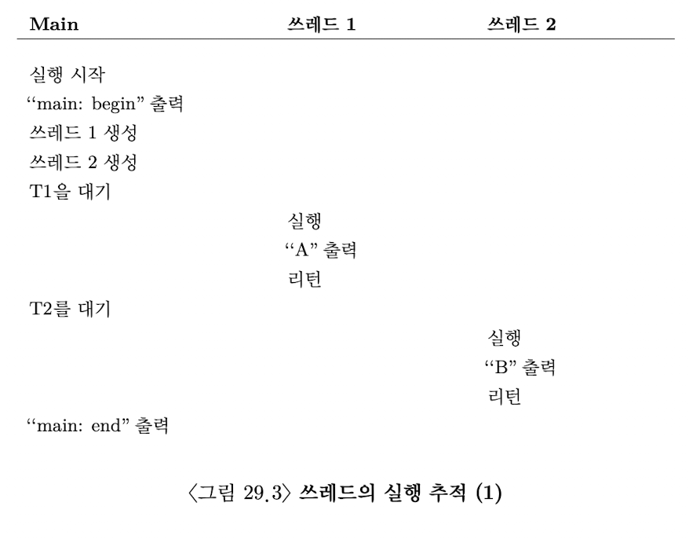

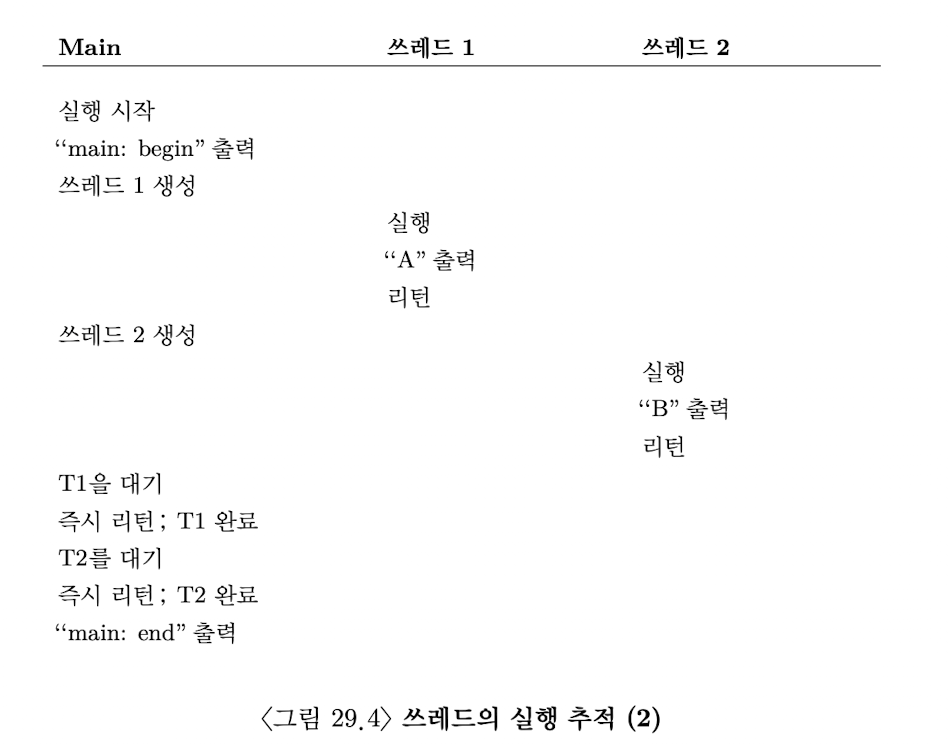

## 훨씬 더 어려운 이유: 데이터의 공유

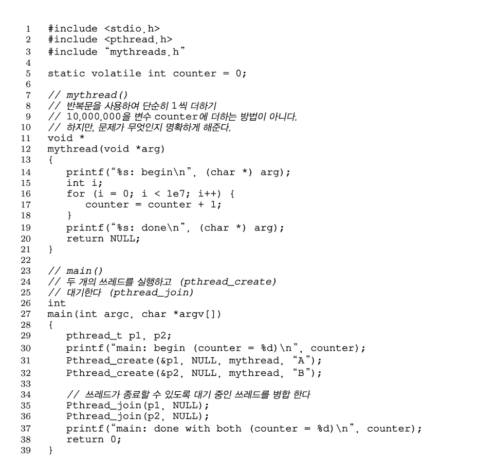

위 프로그램의 실행결과가 다르게 나옴

## 제어 없는 스케줄링

counter 갱신을 위해 컴파일러가 생성한 코드의 실행 순서

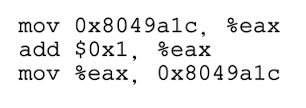

1. mov 명령어가 메모리 주소 값을 읽어들인 후 eax에 넣음
2. 1을 eax 레지스터의 값에 더하는 연산
3. eax 값을 원래 주소에 다시 저장

쓰레드 1이 counter 값을 증가 시키는 코드 영역에 진입, eax가 50에서 51이 된후 인터럽트가 발생하여 쓰레드의 PC 값과 eax를 포함하는 레지스터들 등의 현재 상태를 TCB에 저장

쓰레드 2가 선택되고 똑같이 51이 되고 난 후에 counter를 51로 갱신시킨다. 최종적으로 52가 아닌 51이 된다.

### 경쟁 조건(race condition)

명령어의 실행  순서에 따라 결과가 달라지는 상황, 비결정적인 결과가 나옴

### 임계 영역(critical section)

경쟁 조건이 발생하는 코드 부분, 공유 변수를 접근하고 하나 이상의 쓰레드에서 동시에 실행되면 안되는 코드

### 상호 배제(mutual exclusion)

하나의 쓰레드가 임계 영역 내의 코드를 실행 중일 때는 다른 쓰레드가 실행할 수 없도록 보장

### 비결정적(indeterminate) 프로그램

하나 또는 그 이상의 경쟁 조건을 포함하여 실행결과가 쓰레드가 실행된 시점에 의존하기 때문에 프로그램의 결과가 실행할 때마다  다름

# 27. 막간: 쓰레드 API

### 쓰레드를 생성하고 제어하는 방법

## 쓰레드 생성

쓰레드 생성을 위해서는 해당 인터페이스가 존재해야함

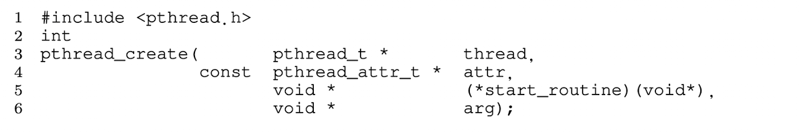

1. thread - pthread_t 타입 구조체를 가리키는 포인터. 이 구조가 쓰레드와 상호작용하는 데 사용되기 때문에 쓰레드 초기화시 pthread_create()이 구조체를 전달
2. attr - 쓰레드의 속성을 지정(스택의 크기, 쓰레드의 스케줄링 우선순위 등), 개별 속성은 pthread_attr_init() 함수를 호출하여 초기화
3. 쓰레드가 실행할 함수 포인터
4. 실행할 함수에게 전달할 인자

## 쓰레드 종료

다른 쓰레드의 완료를 기다리기 위해 pthread_join()을 부름

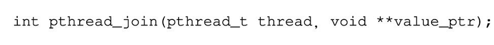

1. pthread_t 어떤 스레드를 기다리려고 하는지 명시, 쓰레드 생성 루틴에 의해 초기화
2. 반환값에 대한 포인터 

- 여러 인자를 한 번에 전달하기 위해 묶고 해체하는 불편한 과정을 항상 해야하는 것은 아님
- 값 하나만 전달해야 한다면 인자를 전달하기 위해 묶을 필요가 없음
- 쓰레드에서 값이 어떻게 반환되는지에 대해 각별한 신경을 써야 함
- pthread_create()을 사용하여 쓰레드를 생성하고 직후에 pthread_join()을 호출한다는 것은 쓰레드를 생성하는 아주 이상한 방법이다. 더 쉬운 방법 → 프로시저 호출
- 모든 멀티 쓰레드 코드가 조인 루틴을 사용하지 않음

## 락

임계 영역에 대한 상호 배제 기법

락의 기본적인 루틴

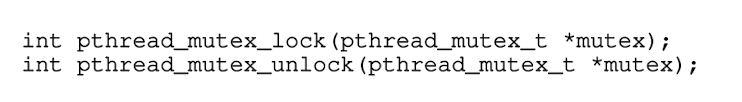
 

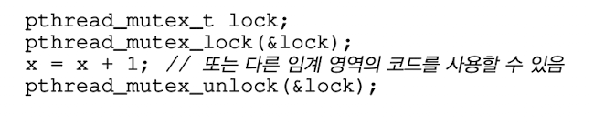

ptrhead_mutex_lock()이 호출되었을 때 다른 어떤 쓰레드도 락을 가지고 있지 않다면 쓰레드가 락을 얻어 임계 영역에 진입, 다른 쓰레드가 락을 가지고 있으면 락 획득을 시도하는 쓰레드는 락을 얻을 때까지 호출에서 리턴하지 않음

1. 초기화 필요 - 모든 락은 올바르게 초기화되어야 함
    1. PTHREAD_MUTEX_INITIALIZER
    2. pthread_mutex_init() 호출
2. 락과 언락을 호출할 때 에러 코드 확인 필요 - 해당 루틴이 성공적으로 처리되었는지 확인

락을 획득하는데 사용하는 루틴

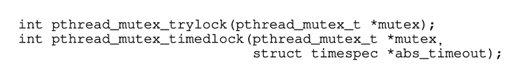

trylock - 락이 이미 사용 중이라면 실패 코드 반환

timedlock - 타임아웃이 끝나거나 락을 확득하거나 두 조건 중 하나가 발생하면 리턴

두 함수는 사용하지 않는게 좋지만 락 획득 루틴에서 무한정 대기하는 상황을 피하기 위해 사용되기도 함

## 컨디션 변수(condition variable)

컨디션 변수 기본 루틴

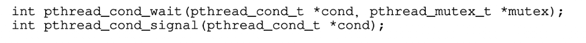

컨디션 변수 사용을 위해선 컨디션 변수와 연결된 락이 반드시 존재해야 함

첫 번째 루틴은 호출 쓰레드를 수면 상태로 만들고 다른 쓰레드로부터의 시그널을 대기

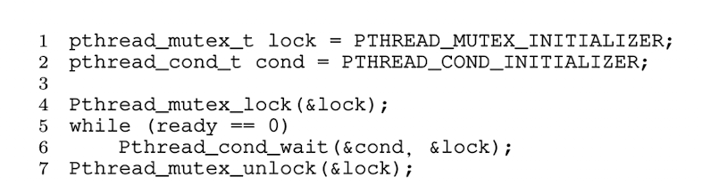

연관된 락과 컨디션 변수를 초기화

쓰레드는 ready 변수가 0인지 검사, 0이면 다른 쓰레드가 깨워줄 때까지 대기 루틴 호출

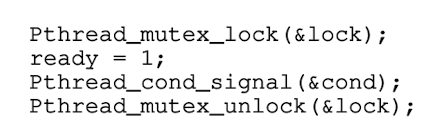

잠자는 쓰레드를 깨우는 코드

유의해야할 점

1. 시그널을 보내고 ready를 수정할 때 반드시 락을 가지고 있어야 함 - 경쟁 조건 발생하지 않음을 보장
2. 시그널 대기 함수에서는 락을 두 번째 인자, 시그널 보내기 함수에서는 조건만을 인자로 받음
    
    → 시그널 대기 함수는 호출 쓰레드를 재우고 락도 반납해야함 
    
3. 대기하는 쓰레드가 조건을 검사할 때 while문 사용 

## 컴파일과 실행

예제 컴파일을 위해서 pthread.h 헤더 포함

# 27. 락

## 락

소스코드의 임계 영역을 락으로 둘러서 임계 영역이 마치 하나의 원자 단위 명령어인 것처럼 실행되도록 함

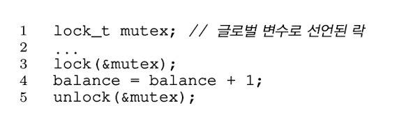

락을 사용하기 위해 락으로 임계영역을 감쌈 

락을 사용하기 위해 락 변수 선언 

- 락 변수는 락의 상태를 가짐
    - 사용 가능 available (해제 또는 free)
    - 사용중  acquired

lock 루틴 - 락 획득 시도, 어떤 쓰레드도 락을 가지고 있지 않으면 쓰레드는 락을 획득하여 임계 영역 내로 진입. 이때 진입한 쓰레드를 락 소유자라고 함

만약 다른 쓰레드가 lock() 호출하면 사용중인 동안에 lock() 함수 리턴하지 않음

락을 보유한 쓰레드가 임계 영역에 진입한 상태에서 다른 쓰레드들은 임계 영역안으로 진입할 수 없음

락 소유자가 unlock을 호출하면 락은 다시 사용가능한 상태가 됨

락은 프로그래머에게 스케줄링에 대한 최소한의 제어권 제공

## Pthread 락

쓰레드 간에 상호 배제 기능을 제공하기 때문에 POSIX 라이브러리는 락을 mutex라고 부름

변수 명을 지정하여 락과 언락함수에 전달  - 서로 다른 데이터와 자료 구조를 보호하기 위해 여러 락을 사용하여 한 번에 여러 쓰레드가 서로 다른 락으로 보호된 코드 내에 각자가 진입 가능하도록 할 수 있음

## 락 구현

락은 어떻게 만들까

## 락의 평가

1. 상호 배제
2. 공정성
3. 성능

## 인터럽트 제어

초창기 단일 프로세스 시스템에서 상호 배제 지원을 위해 임계 영역 내에서는 인터럽트를 비활성화 하는 방법 사용

### 장점

단순함

### 단점

- 요청을 하는 쓰레드가 인터럽트 활성/비활성화 하는 특권 연산 실행할 수 있도록 허가
- 다른 목적으로 사용하지 않음을 신뢰할 수 있어야 함
- 멀티 프로세서에서 적용할 수 없음
- 중요한 인터럽트 시점을 놓칠 수 있음
- 비효율적

## Test-And-Set(또는 원자적 교체 Atomic Exchange)

락 지원을 위한 하드웨어 설계 시작

임계 영역에 진입하는 첫 쓰레드가 lock을 호출하여 플래그 값이 1인지 검사하고 플래그의 값을 1로 설정하여 쓰레드가 락을 보유하고 있다고 표시

임계 영역에서 나오면 쓰레드가 unlock을 호출하여 플래그 값을 초기화하여 락을 더 이상 보유하고 있지 않다고 표시

### 문제

- 정확성 - 적시에 인터럽트가 발생하면 두 쓰레드 모두 플래그를 1로 설정하는 경우가 생길 수 있음
    
    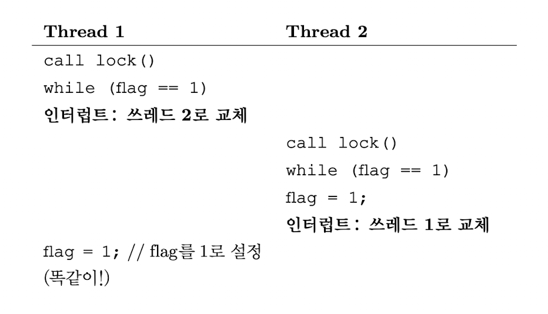
    
- 성능 - spin-wait 방법은 락을 해제할 때까지 시간을 낭비함

## 진짜 돌아가는 스핀 락의 구현

앞의 예제는 하드웨어 지원 없이 동작 불가능

어떤 시스템에서 락 구현을 위한 어셈블리 명령어 제공

(SPARC - ldstub, x86 - xchg)

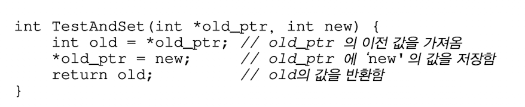

ptr이 가리키고 있던 예전 값을 반환하고 동시에 new에 새로운 값을 저장

동작들이 원자적으로 수행 

처음 쓰레드가 lock 호출, 다른 쓰레드 락을 보유하지 않음 현재 flag는 0

쓰레드가 TestAndSet(flag,1)을 호출하면 flag의 이전 값인 0을 반환

flag 값을 검사한 쓰레드는 while 문에서 회전하지 않고 락을 획득할 수 있음

쓰레드는 flag를 1로 표시하여 락을 보유하고 있음을 나타냄

임계 영역 내의 동작을 마치면 unlock 호출하여 flag 다시 0으로 변경

두번째 쓰레드가 flag가 1인 상태에서 lock 호출하여 TestAndSet(flag, 1) 루틴을 실행하면 1을 반환하고 flag 값을 다시 1로 설정

락을 보유하고 있는 쓰레드가 있으면 계속 1 반환

가장 기초적인 형태의 락

락을 획득할 때까지 CPU 사이클을 소모하면서 회전

선점형 스케줄러를 사용해야함

## 스핀 락 평가

### 정확성

임의의 시간에 단 하나의 쓰레드만이 임계 영역에 진입할 수 있도록 함

### 공정성

공정성을 보장해 줄 수 없음

### 성능

단일 CPU의 경우 성능 오버헤드가 상당히 클 수 있음

CPU가 여러 개인 경우  다른 프로세서에서 락을 획득하기 위해 while문을 회전하면서 대기하는 것은 많은 사이클을 낭비하지 않아서 효율적일 수 있음

## Compare-And-Swap

SPARC의 Compare-And-Swap

x86의 Compare-And-Exchange

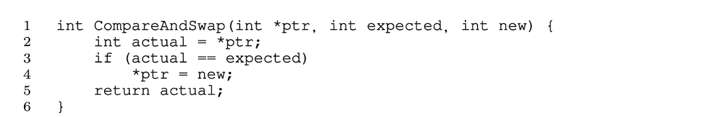

ptr이 가리키고 있는 주소의 값이 expected 변수와 일치하는지 검사, 일치하면 ptr이 가리키는 주소의 값을 새로운 값으로 변경, 불일치하면 아무것도 하지 않음

Test-And-Set 방법을 사용했을 때와 같은 방식으로 락을 막을 수 있음

- 대기없는 동기화

## Load-Linked 그리고 Store-Conditional

MIPS 구조에서는 load-linked와 store-conditional 명령어를 앞뒤로 사용하여 락이나 기타 병행 연산을 위한 자료구조를 만들 수 있음, Alpha, PowerPC, ARM에서도 유사한 명령어 지원

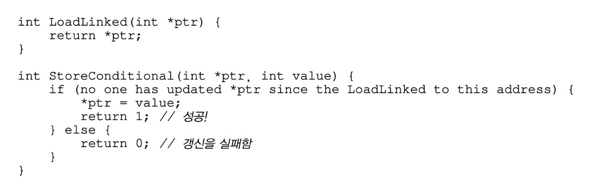

load-linked 메모리 값을 레지스터에 저장

store-conditional  - 동일한 주소에 다른 스토어가 없었던 경우에만 저장을 성공

저장이 성공하면 load-linked가 탑재했던 값을 갱신, 성공시 1반환하고 ptr이 가리키는 value 값 갱신, 실패시 ptr 갱신되지 않고 0반환

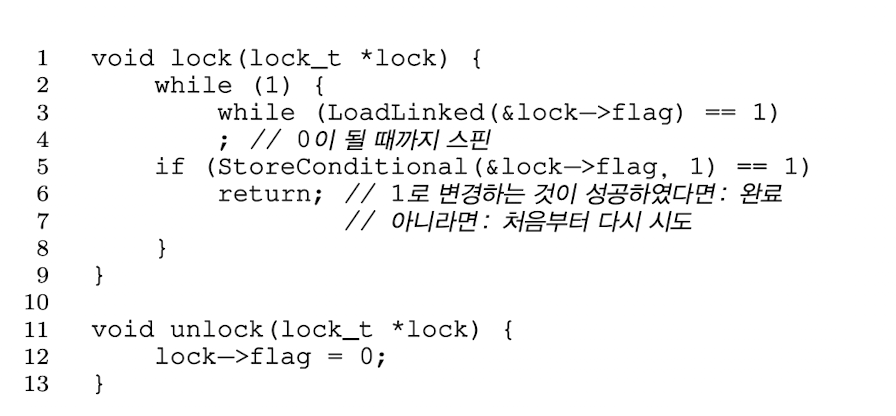

store-conditional 명령어가 실패할 수 도 있음

쓰레드가 lock을 호출하여 load-linked를 실행하고 락이 사용가능한 상태이므로 0을 반환

store-conditional 명령어를 시도하기 전에 쓰레드는 인터럽트에 걸렸고 다른 쓰레드가 락 코드를 호출하고 load-linked를 실행하여 0을 반환 받은 후의 시점에 두 쓰레드 모두 각자가 store-conditional을 부르려고 함. 오직 하나의 쓰레드만 flag를 1로 설정하고 락을 획득할 수 있도록하는 것임 두 번째 쓰레드는 락 획득에 실패

## Fetch-And-Add

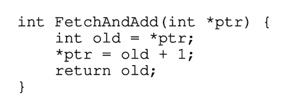

원자적으로 특정 주소의 예전 값을 반환하면서 값을 증가시킴

티켓과 차례의 조합을 사용하여 락을 만듦

하나의 쓰레드가 락 획득을 원하면 티켓 변수에 원자적 동작인 fetch-and-add 명령어를 실행함. 결과 값은 해당 쓰레드의 차례임. 전역 공유 변수인 lock→turn을 사용하여 어느 쓰레드의 차례인지 판단. 조건에 부합하면 임계 영역에 진입할 수 있음. 언락은 차례 변수 값을 증가 시켜 대기 중인 다음 쓰레드에게 차례를 넘겨 줌 

쓰레드들이 각자의 순서에 따라 진행

## 요약: 과도한 스핀

하드웨어 기반의 락은 간단하고 제대로 동작하지만 효율적이지 않은 경우가 있음

### 회전을 피하는 방법

스핀에 CPU 시간을 낭비하지 않는 락 만들기

## 간단한 접근법 : 무조건 양보!

문맥 교환이 되어 쓰레드가 실행이 되었지만 이전 쓰레드가 인터럽트가 걸리기 전에 락을 이미 획득한 상태라서 그 쓰레드가 락을 해제하기를 기다리며 스핀만 무한히 하는 경우

스핀해야하는 경우 할당된 CPU를 다른 쓰레드에게 양보하는 것

쓰레드의 상태

- 실행중
- 준비
- 막힘

yield 시스템 콜: 호출 쓰레드 상태를 실행 중에서 준비 상태로 변환하여 다른 쓰레드가 실행 중 상태로 전이하도록 함

## 큐의 사용: 스핀 대신 잠자기

이전 방법들의 문제: 너무 많은 부분을 운에 맡김

낭비의 여지가 있고 쓰레드가 굶주리게 되는 문제

대기 쓰레드들의 관리 필요 

- park(): 호출하는 쓰레드를 잠재우는 함수
- unpark(threadID): threadID로 명시된 특정 쓰레드를 깨우는 함수

1. Test-And-Set 개념과 락 대기자 전용 큐를 함께 사용해 좀 더 효율적인 락을 만듦
2. 큐를 사용하여 락을 획득할 대상을 제어하여 기아 현상을 피할 수 있도록 함

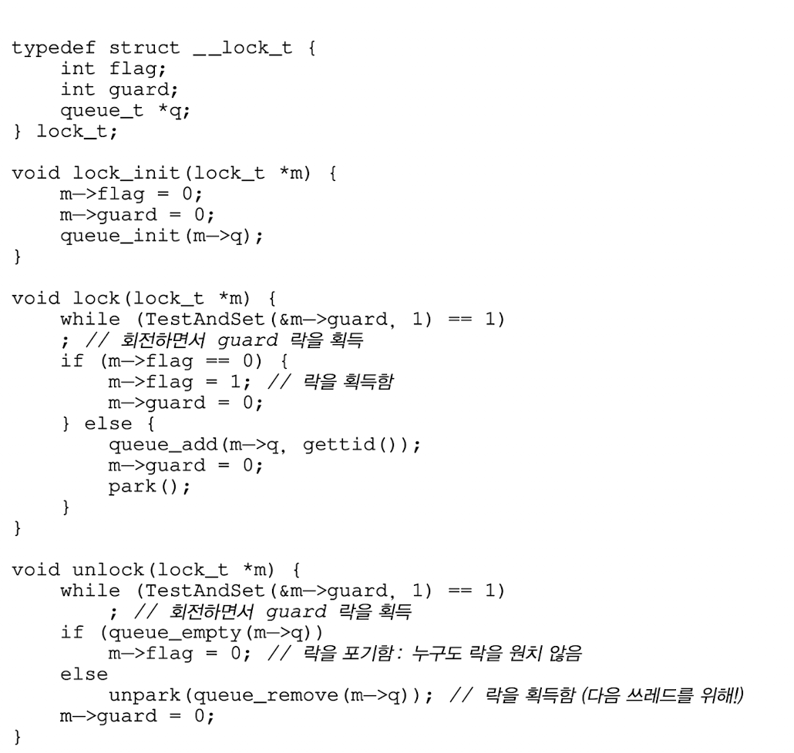

- guard 변수를 사용하여 flag와 큐의 삽입과 삭제 동작을 스핀 락으로 보호하는 데 사용
- 쓰레드는 락을 획득하거나 해제하는 과정에서 인터럽트에 걸려 회전대기할 수 있지만 회전 대기 시간이 꽤 짧으므로 합리적임
- lock을 호출하였는데 다른 쓰레드가 이미 락을 보유했기 때문에 락을 획득할 수 없다면 gettid()를 호출하여 현재 실행중인 쓰레드 id를 얻고 락 소유자의 큐에 자기 자신을 추가하고 guard 변수를 0으로 변경한 후에 CPU 양보
- park() 직전에 경쟁 조건 발생 - 스레드가 락이 사용중이라 park를 수행하려고 하기 직전에 락 소유자에게 CPU가 할당되면 문제 발생. 락을 보유한 쓰레드가 락을 해제했으면 쓰레드가 자기 차례에 park를 수행하면 깨어날 방법이 없음 ⇒ 깨우기/ 대기 경쟁
- ⇒ setpark() , park()를 호출하지 직전임을 표시함. park()가 실제로 호출되기 전에 다른 쓰레드가 unpark()를 먼저 호출한다면 park()문은 잠을 자는 대신 바로 리턴

## 다른 운영체제, 다른 지원

Linux - futex

특정 물리 메모리 주소와 연결, futex마다 커널 내부의 큐를 가짐

## 2단계 락

첫번째 단계에서 락을 획득할 수 있을 것이라는 기대로 회전하며 기다림 첫번째 회전단계에서 락을 획득하지 못했다면 두번째 단계로 진입하여 호출자는 잠에 빠지고 락이 해제된 후에 깨어나도록 함

## 요약

일부 하드웨어 지원과 일부 운영 체제의 지원을 받아 락을 구현

# 29. 락 기반의 병행 자료 구조

### 자료 구조에 락을 추가하는 방법

## 병행 카운터

간단한 구조 중 하나

### 간단하지만 확장성이 없음

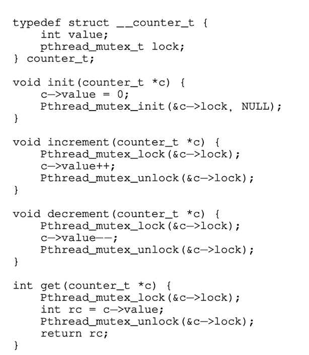

자료 구조를 조작하는 루틴을 호출할 때 락을 추가하였고 호출문이 리턴될 때 락이 해제되도록함 

→ 모니터를 사용하여 만든 자료구조와 유사 (모니터 기법- 객체에 대한 메소드를 호출하고 리턴할 때 자동적으로 락을 획득하고 해제)

성능- 쓰레드 개수가 증가할수록 동기화된 카운터의 확장성이 떨어짐

### 확장성 있는 카운팅

- 엉성한 카운터 기법
    
    하나의 논리적 카운터, CPU 코어마다 존재하는 하나의 물리적 지역 카운터와 하나의 전역 카운터로 구성
    
    - 쓰레드는 지역 카운터 증가, 지역 카운터는 지역 락에 의해 보호
    - CPU는 저마다 지역 카운터를 가지므로 CPU들에 분산되어있는 쓰레드들은 지역 카운터를 경쟁 없이 갱신할 수 있음 → 확장성이 있음
    - 전역 카운터를 최신으로 갱신하기 위해 지역 카운터 값 주기적으로 전역 카운터로 전달되는데 이때 전역 락을 사용하여 지역 카운터의 값을 전역 카운터 값에 더하고 지역 카운터를 0으로 초기화
    - 빈도는 S에 의해 결정 - S값이 작을수록 확장성 없는 카운터처럼 동작 커질수록 전역 카운터 값은 실제 값과 차이

## 병행 연결 리스트

병행 삽입 연산

삽입 연산을 시작하기 전에 락 획득, 리턴 직전에 해제

malloc()이 실패할 경우에 문제가 생길 수 있음 

삽입 연산이 병행하여 진행되는 상황에서 락 해제를 호출하지 않으면서 삽입과 검색이 가능하도록 하기

→ 삽입 코드에서 임계 영역을 처리하는 부분만 락으로 감싸도록 변경

→ 검색 코드의 종료는 검색과 삽입 모두 동일한 코드 패스를 사용토록 함 

검색 루틴의 while문 안에 break를 삽입하여 검색이 성공하면 바로 빠져나오게 함

 

## 확장성있는 연결 리스트

병행 가능한 연결리스트는 확장성이 좋지 않음

개선하기 위해 hand-over-hand locking 기법 개발

전체 리스트에 하나의 락이 있는 것이 아니라 개별 노드마다 락을 추가

다음 노드의 락을 먼저 획득하고 지금 노드의 락을 해제하도록 함

하지만 락 획득 해제의 오버헤드가 매우 커 병행성이 늘어났지만 속도가 빨라지지 않음

## 병행 큐

두개의 락 - 하나는 큐의 헤드, 다른 하나는 큐의 테일

큐의 삽입과 추출에 병행성 부여

더미 노드 - 헤드와 테일 연산을 구분하는 데 사용

## 병행 해시 테이블

성능이 우수 - 해시 버켓 마다 락을 사용

확장성이 매우 좋음

## 요약

락 획득과 해제 시 코드의 흐름에 매우 주의를 기울여야 함

병행성 개선이 반드시 성능 개선으로 이어지는 것은아님

성능 개선은 성능에 문제가 생길 경우에만 해결책을 찾아야함  - 미숙한 최적화를 피하자