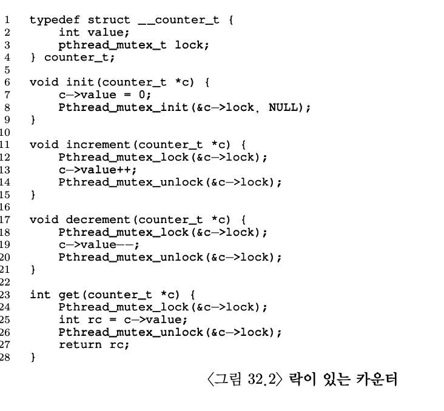

# 병행성: 개요
### 쓰레드
- 하나 이상의 실행 지점을 가진다.
- 주소공간을 공유하기 때문에 동일한 값에 접근 가능
- 쓰레드를 교체할때는 문맥교환(context switching)을 해야한다.
- **쓰레드 제어블럭(thread control block, TCB)** 에 각 쓰레드의 상태를 저장
  

- 단일 스레드는 프로세스에 하나의 스택을 가지지만 멀티 쓰레드의 경우에는 여러 스택을 가진다.
- 스택에서 할당되는 변수, 매개변수, 리턴 값 등은 해당 쓰레드의 스택인 **쓰레드-로컬 저장소(thread-local storage)** 에 저장된다.
## 쓰레드 생성 코드
```c
#include<stdio.h>
#include<assert.h>
#include<pthread.h>

void *mythread(void *arg){
    printf("%s\n", (char*)arg);
    return NULL;
}

int main(int argc, char *argv[]){
    pthread_t t1, t2;
    int rc;
    printf("main: begin\n");

    rc = pthread_create(&t1, NULL, mythread, "A");
    assert(rc &=& 0);
    rc = pthread_create(&t2, NULL, mytrehad, "B");
    assert(rc &=& 0);

    rc = pthread_join(t1, NULL); assert(rc &=& 0);
    rc = pthread_join(t2, NULL); assert(rc &=& 0);
    printf("main: end\n");
    return 0;
}
```
### 실행 순서


쓰레드의 실행 순서는 스케줄러가 특정 시점에 어떤 쓰레드를 실행하냐에 따라 달라진다. 먼저 생성되었다고 먼저 실행되는 것은 아니다. 쓰레드의 생성이 함수의 호출과 유사하게 보이지만 같지는 않다. 함수를 실행후에 호출자에게 리턴하지만 쓰레드 생성은 실행할 명령어를 가지고 있는 새로운 쓰레드가 생성되고 생성된 쓰레드는 호출자와 별개로 실행된다. 쓰레드 생성 함수가 리턴되기 전에 쓰레드가 실행될 수도있고 그보다 이후에 실행될 수도 있다. 이처럼 쓰레드 생성 함수와 쓰레드는 독립적이다.  

## 데이터 공유
병행성에서 중요하게 생각해야하는 것은 데이터의 공유이다. 쓰레드는 같은 프로세스 내에서 데이터를 공유하기 때문에 쓰레드의 실행 순서에 따라서 공유된 데이터를 사용한 값이 바뀔 수 있다. 

무분별하게 공유된 데이터를 참조하여 수정할 시에 어떤 결과를 유발하는지는 아래의 예시에서 보겠다.
```c
#include <stdio.h>
#include <pthread.h>

static volatile int counter = 0;

void* mythread(void *arg){
    printf("%s: begin\n", (char*)arg);
    int i;
    for(i = 0; i < 1e7; i++){
        counter = counter + 1;
    }
    printf("%s: done\n", (char*)arg);
    return NULL;
}

int main(int argc, char* argv[]){
    pthread_t t1, t2;
    printf("main: begin (counter=%d)\n", counter);
    pthread_create(&t1, NULL, mythread, "A");
    pthread_create(&t2, NULL, mythread, "B");

    pthread_join(t1, NULL);
    pthread_join(t2, NULL);
    printf("main: done with both (counter = %d)\n", counter);
    return 0;
}
```

위 코드에서 예상대로라면 counter변수에 쓰레드 t1, t2에 의해서 10000000+10000000의 값이 들어가 있어야한다.


하지만 결과가 예상대로 나오지 않는 것을 확인할 수 있다.

예상대로 결과가 나오지 않는 이유는 **경쟁 조건(race condition)** 상황이기 때문이다. t1에서 counter의 값이 0일 때 가져온 다음 문맥 교환이 t2로 발생하게 되면 t1이 인식하고 있는 counter의 값은 0이지만 t2에서 1을 더한 후에 반환하게 되면 실제 counter의 값은 1이되게 된다. t1는 counter의 값이 증가 된지 모르기 때문에 0에 1을 더햐여 1의 값을 저장하게 된다. 실제로 두번의 덧셈이 발생되었지만 counter의 값은 1이되게 된다.

### 용어
- 임계 영역(critical section): 멀티 쓰레드가 같은 코드를 실행할 때 경쟁 조건이 발생하는 부분
- 상호 배제(mutual exclusion): 하나의 쓰레드가 임계 영역 내의 코드를 실행 중일 때 다른 쓰레드가 실행할 수 없도록 하는 방법

# 쓰레드 API
## 쓰레드 생성 
```c
int pthread_create(       pthread_t*        thread,
                    const pthread_attr_t*   attr,
                          void*             (*start_routine)(void*),
                          void*             arg);
```
- thread: 쓰레드와 상호작용하는 데 사용되는 쓰레드 구조체이다.
- attr: 쓰레드의 속성을 지정하는데 사용된다. 스택의 크기와 쓰레드의 스케줄링 우선순위와 같은 정보를 저장
- start_routine: 이 쓰레드가 실행할 함수를 나타낸다
- arg: 실행할 함수에 전달할 인자를 나타낸다. 
## 쓰레드 종료
```c
int pthread_join(pthread_t thread, void **value_ptr);
```
- thread: 어떤 쓰레드를 기다리는지 명시
- value_ptr: 반환 값에 대한 포인터
### 주의사항
1. 여러 인자를 한번에 전딸하기 위해 묶고 해체하는 과정은 항상해야하는 것이 아니다.
2. 값 하나만 전달해야 한다면 인자를 전달하기 위해 묶을 필요가 없다.
3. 쓰레드에서 값이 어떻게 반환되는지에 대해 각별한 신경을 써야한다.
4. (중요)쓰레드에서 지역변수를 반환하지 않도록 주의해야한다. 쓰레드의 stack은 반환시에 해제된다.
5. pthread_create()를 호출하고 난뒤에 pthread_join()을 호출하는 것은 이상한 방법이다.
   1. 보통 여러 쓰레드를 생성해 놓고 쓰레드가 끝나기를 기다린다. 그렇지 않다면 쓰레드를 사용할 이유가 없다.

## 락(Lock)
"락"을 사용해서  임계 영역에 대한 상호 배제를 적용할 수 있다. 
```c
int pthread_mutex_lock(pthread_mutex_t *mutex);
int pthread_mutex_unlock(pthread_mutex_t *mutex);
```
"락"을 생성할 때와 해지할 때사용한다.

```c
int pthread_mutex_trylock(pthread_mutex_t *mutex);
int pthread_mutex_timeout(pthread_mutex_t *mutex, struct timespec *abs_timeout);
```
위의 두 함수를 "락"을 획득할 때 사용한다. trylock은 락이 이미 사용중이라면 실패 코드를 반환한다. timedlock은 타임아웃이 끝나거나 락을 획득하거나 두 조건 중하나가 발생하면 리턴한다. timedlock을 0으로 설정하면 trylock과 동일하게 사용된다. **근데 이 두 함수는 사용하지 않는 것이 좋다** (이런거는 미리 말해주면 좋겠다.) 그러나 락 획득 루틴에서 무한정 대기하는 상황을 피하기 위해 사용되기도 한다. 
## 컨디션 변수
한 쓰레드가 계속 진행하기 전에 다른 쓰레드가 무언가를 해야한다면 쓰레드 간에 일종의 시그널 교환 메커니즘이 필요하다. 이런 경우에 컨디션 변수가 사용된다. 
```c
int pthread_cond_wait(pthread_cond_t *cond, ptrehad_mutex_t *mutex);
int pthread_cond_signal(pthread_cond_t *cond);
```
wait는 호출 쓰레드를 수면(sleep) 상태로 만들고 다른 쓰레드로부터의 시그널을 대기한다. 현재 수면 중인 쓰레닥 관심 있는 무언가가 변경되면 시그널을 보낸다. 
### 예시
```c
pthread_mutex_t lock = PTHREAD_MUTEX_INITIALIZER;
pthread_cond_t cond = PTHREAD_COND_INITIALIZER;

pthread_mutex_lock(&lock);
while(ready == 0)
    pthread_cond_wait(&cond, &lock);
pthread_mutex_unlock(&lock);
```
위 코드에서는 연관된 락과 컨디션 변수를 초기화한 후에 쓰레드는 ready 변수가 0인지 확인한다. ready가 0이면 다른 쓰레드가 깨워 줄 때 까지 잠들기 위해 대기를 호출한다.

```c
pthread_mutex_lock(&lock);
ready = 1;
pthread_cond_signal(&cond);
pthread_mutex_unlock(&lock);
```
위의 코드를 사용해서 깨워줄 수있다.

### 주의사항
- 시그널을 보내고 전역변수 ready를 수정할 때 반드시 락을 가지고 있어야한다. 이를 통해서 경쟁 조건이 발생하지 않는다는 것을 보장한다.
- 시그널 대기 함수에스는 락을 두번째 인자로 받고 있지만 보내기 함수에서는 조건만을 인자로 받는다. 
- (중요) 대기하는 쓰레드가 조건을 검사할 때 if문을 사용하는 대신 while문을 사용해야 안전하다. 

# 락(Lock)
락은 하나의 변수이므로 락을 사용하기 우해서는 락 변수를 먼저 선언해주어야한다. 락 변수는 락의 상태를 나타낸다. 락의 상태는 **사용가능** 또는 **사용 중** 이다. 락 자료구조에 락을 보유한 쓰레드에 대한 정보나 락을 대기하는 쓰레드들에 대한 정보를 저장할 수도 있다. 이러한 정보는 락 사용자는 알 수 없다.

프로그래머는 락을 통해서 혼란스러운 멀티 쓰레드 실행에서 어느정도 질서를 보장할 수 있다.
## Pthread 락
상호 배제를 적용하기 위해 락을 사용하여 임계 지점에 다른 쓰레드에서 접근하지 못하게 할 수 있다.
```c
pthread_mutex_t lock = PTHREAD_MUTEX_INITIALIZER;

pthread_mutex_lock(&lock);
balance = balance + 1;
pthread_mutex_unlock(&lock);
```

## 락 구현
락의 사용 방법에 대해서는 이해했지만 락을 어떻게 만들어야하는지를 이해해야한다. 사용 가능한 락을 만들기위해서는 하드웨어와 운영체제의 도움을 받아야한다. 
## 락의 평가
락을 만들기 전에는 락의 목표를 이해해야하고 구현의 효율을 어떻게 평가할지 질문해야한다. 
1. 사옿 배제를 제대로 지원하는가
2. 공정성(fairness)를 지원하는가
   1. 쓰레드들이 락 획득에 대한 공정한 기회가 주어지는가
3. 성능(performance): 락 사용 시간적 오버헤드를 평가해야한다. 

## 인터럽트 제어
초창기 단일 프로세스 시스템에서는 상호 배제 지원을 위해 임계 영역 내에서는 인터럽트를 비활성화 하는 방법을 사용했다.
- 장점
  - 단순하다
- 단점
  - 쓰레드가 인터럽트를 활성/비활성화하는 특권(privileged) 연산을 실행할 수 있어야한다. 특권을 부여하는 것은 해당 쓰레드가 다른 목적으로 사용하지않는다는 것을 신뢰해야한다. 악의적으로 독점하여 사용될 수 있다. 
  - 멀티 프로세서에서는 적용할 수 없다.
  - 장시간 동안 인터럽트를 중지시키면 중요한 인터럽트의 시점을 놓칠수 있다.
  - 비효율적이다. 

## Test-And-Set(Atomic Exchange)+ 스핀 락
```c
int TestAndSet(int *old_ptr, int new){
    int old = *old_ptr;
    *old_ptr = new;
    return old;
}
```

```c
typedef struct __lock_t {
    int flag;
} lock_t;

void init(lock_t *lock){
    lock->flag = 0; 
}

void lock(lock_t *lock){
    while(TestAndSet(&lock->flag, 1) == 1)
    ;
}

void unlock(lock_t *lock){
    lock->flag = 0;
}
```
### 스피락 평가
- 스핀락은 상호 배제의 정확성을 가지고 있다.
- 대기 중인 쓰레드들은 스핀락은 공정하지 않다. 굶주릴 수 있다.
- 단일 cpu의 경우 스핀 락의 성능 오버헤드는 상당히 크. 

## Compare-And-Swap
```c
int CompareAndSwap(int* ptr, int expected, int new){
    int actual = *ptr;
    if(actual = expected)
        *ptr = new;
    return actual;
}
```
ptr이 가리키고잇는 주소의 값이 expected 변수와 일치하는지 검사한다. 일치한다면 ptr이 가리키는 주소의 값을 새로운 값으로 변경한다. 불일치한다면 아무것도 하지 않는다. 
  - compare-and-swap은 test-and-set보다 강ㄹㄱ하다. 
  - 대기 없는 동기화를 다룰 때 이 루틴이 갖는 장점을 알 수있다.

## Load-Linked, Store-conditional
어떤 플랫폼은 임계 영역 진입 제어함수를 제작하기 위한 명령어 상을 제공한다. 두 명령어를 앞뒤로 사용하여 락이나 기타 병행 연산을 위한 자료구조를 만들 수잇다. 
load-linked는 일반 로드 명령어와 같이 메모리 값을 레지스터에 저장한다. 실제 차이는 store-conditional 명령어에서 나타난다. 동일한 주소에 다른 스토어가 없었던 경우에만 저장을 성공한다.

## Fetch-And-Add
원자적으로 특정 주소의 예전 값을 반환하면서 값을 증가시킨다. 
```c
int FetchAndAdd(int *ptr){
    int old = *ptr;
    *ptr = old+1;
    return old;
}
```
fetchAndAdd를 사용하여 티켓 락을 구현하면 아래와 같다.
```c
typedef struct __lock_t {
    int ticket;
    int turn;
} lock_t;

void lock_init(lock_t *lock){
    lock->ticket = 0;
    lock->turn = 0; 
}

void lock(lock_t *lock){
    int myturn = FetchAndAdd(&lock->ticket);
    while(lock->turn != myturn)
        ;
}

void unlock(lock_t *lock){
    FetchAndAdd(&lock->turn);
}
```

## 큐의 사용: 스핀 대신 잠자기
어떤 쓰레드가 다음으로 락을 획득할지를 명시적으로 제어할 수 있어야한다. 이를 위해서는 운영체제로 부터 적절한 지원과 큐를 이용한 대기 쓰레드들의관리가 필요하다. 
```c
typedef struct __lock_t {
    int flag;
    int quard;
    queue_t *q;
} lock_t;

void lock_init(lock_t *m){
    m->flag = 0;
    m->guard = 0;
    queue_init(m->q);
}

void lock(lock_t *m){
    while(TestAndSet(&m->guard, 1) == 1)
    ;
    if(m->flag == 0){
        m->flag = 1;
        m->guard = 0;
    } else {
        queue_add(m->q, gettid());
        m->guard = 0;
        park();
    }
}

void unlock(lock_t *m){
    while(TestAndSet(&m->guard, 1) == 1)
        ;
    if(queue_empty(m->q))
        m->flag = 0;
    else
        unpark(queue_remove(m->q));
    m->guard = 0;    
}
```

# 락 기반의 병행 자료구조
## 병행 카운터

락있는 카운터는 간단하게 개발할 수 있지만 느리다는 단점이 있다. 
## 병행 연결 리스트

삽입 코드에서 임계 영역을 처리하는 부분만 락으로 감싸도록 하여 검색 코드의 종료는 검색과 삽입 모두 동일한 코드 패스를 사용하도록한다. malloc() 자체가 쓰레드 안전하다면 쓰레드는 언제든지 경쟁 조건에서 다른 병행성 관련 버그를 걱정하지 않으면서 검색할 수있다. 

검색 루틴의 while문 안에 break를 삽입하여 검색이 성공하면 바로 빠져나오도록 한다. 이렇게 하면 검색 성공이나 실패의 경우 모두 동일한 리턴 코드를 실행하게 된다. 


## 병행 해시 테이블


병행 리스트를 사용하여 구현되었고 우수한 성능을 가진다. 그 이유는 전체 자료 구조에 하나의 락을 사용한 것이 아니라 해시 버켓마다 락을 사용하였기 때문이다. 이렇게 하면 높은 병행성을 가질 수 있다. 

## 요약
- 락 획득과 해제 시 코드의 흐름에 매우 주의를 기울여야한다.
- 병행성 개선이 반드시 성능 개선으로 이어지는 것은 아니다.
- 성능 개선은 성능에 문제가 생길 경우에만 해결책을 간구해야한다. 