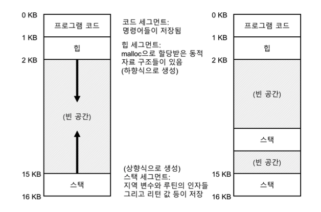

# 26장. 병행성 개요

## 쓰레드(thread)

프로세스와 매우 유사한 아래와 같은 요소들을 가지고 있다.

- 명령어를 어디서 불러 들일지 추적하는 **프로그램 카운터(PC)**
- 연산을 위한 **레지스터**들
- *문맥 교환(context switch)* 을 위한 **쓰레드 제어 블럭(thread control block, TCB)**

하지만 큰 차이점이 몇 가지 존재한다.

- 프로세스와 달리 쓰레드 간의 문맥 교환은 주소 공간을 공유한다.
- 단일 쓰레드 프로세스(아래 그림의 왼쪽) 에서는 스택이 단 하나만 존재하지만, 멀티 쓰레드 프로세스(아래 그림의 오른쪽) 의 경우에는 쓰레드마다 스택이 할당되어 있다.



## 쓰레드의 생성

- 실행할 명령어들을 갖고 있는 새로운 쓰레드를 생성한다.
- 생성된 쓰레드는 호출자와 별개로 실행된다.
    - 쓰레드 생성 함수가 리턴되기 전에 쓰레드가 실행될 수도 있고, 그 이후에 실행될 수도 있다.

→ 함수의 호출과 유사하지만, 함수의 호출은 실행 후 호출자에게 리턴하는 것에서 차이점이 있다.

## 데이터 공유에 대한 문제점


>👉 누가 말해주었는지 기억은 안나지만.... 책에 있는 위 명령어들을 보고 맴도는 말이 있다.
>`counter++` , 우리가 counter 를 1 올리는 데 필요한 코드는 한 줄이지만, 실제 실행되는 명령은 여러개일 것이다. 아무래도 이것이 우리가 병행성을 이해하는 데 있어서 가장 걸림돌 아닐까?

### 경쟁 조건(race condition)

- 명령어의 실행 순서에 따라 결과가 달라지는 상황
- 문맥 교환이 때에 맞지 않게 실행되는 운이 없는 경우에 잘못된 결과를 얻는다.
- 사실, 이 상황에는 매번 다른 결과를 얻는것이 맞다.
    - 결과가 어떨지 모르거나, 실행할 때마다 다르면 **비결정적(indeterminate)** 인 결과라고 한다.

### 임계 영역(critical section)

- 여러개의 쓰레드가 같은 코드를 실행할 때 경쟁 조건이 발생하는 부분
- 공유되는 변수를 접근하고, 두 개 이상의 쓰레드에서 동시에 실행되면 안되는 코드

## 위 사항을 해결하기 위해서 필요한 것은?

### 상호 배제(mutual exclusion)

- 하나의 쓰레드가 임계 영역 내의 코드를 실행 중일 때, 다른 쓰레드가 접근하지 못하게 하는 것

> 🙋 다익스트라(Dijkstra) 님 만세?!
>

### 원자성에 대한 보장


이 명령어 세 줄이 원자성, 즉 한 번에 실행되었으면 걱정할 일이 없을 것이다. 그래서 하드웨어적으로 **동기화 함수(synchronization primitives)** 구현에 필요한 기본적인 명령어 몇 개가 필요하다.

결과적으로는 하드웨어 동기화 명령어와 운영체제의 지원이 있다면, 임계 영역에서 단 하나의 쓰레드만 실행되는 “제대로 잘 작동하는" 멀티 쓰레드 프로그램을 작성할 수 있을 것이다.

## 상대방을 기다려야 하는 또 다른 문제점

지금까지 병행성에 대한 문제점을 공유 변수 접근 시 쓰레드 간의 상호작용의 문제로 정의하였다. 실제로는 하나의 쓰레드가, 다른 쓰레드가 어떤 동작을 끝낼 때까지 대기해야 하는 상황도 빈번하게 발생한다. 이에 대한 내용은 이후에 조금 더 자세히 알아볼 예정이니, 지금은 첫 번째로 다룬 공유 변수에 대한 문제점만 잘 이해해보자.

---

# 27장. 막간: 쓰레드 API

여기서는 쓰레드 API의 주요 부분을 간략하게 다루어 본다.

>❓ 핵심 질문: 쓰레드를 생성하고 제어하는 방법
>
>- 운영체제가 쓰레드를 생성하고 제어하는 데 어떤 인터페이스를 제공해야 할까?
>- 어떻게 이 인터페이스를 설계해야 쉽고 유용하게 사용할 수 있을까?

## 쓰레드 생성

```c
#include <pthread.h> 
int pthread_create(
	      pthread_t *      thread,
	const pthread_attr_t * attr,
	      void *           (*start_routine) (void *),
	      void *           arg
);
```

- `thread` - `pthread_t` 타입 구조체
- `attr` - 쓰레드 속성 지정
  - ex) 스택의 크기, 쓰레드의 스케줄링 우선순위 등의 정보
- `(*start_routine) (void *)` - 이 쓰레드가 실행할 함수
  - C 언어에서 이를 함수 포인터라고 부른다.
  - 이 함수는 `void *` 값을 인자로 받으며, `void *` 값을 반환한다.
- `arg` - 실행할 함수에게 전달할 인자
  - 위의 `start_routine` 에 필요한 인자가 `void *` 이다.

→ 이제 자신만의 스택까지 완벽하게 갖춘, 그리고 프로그램의 실행 중인 모든 쓰레드와 같은 주소 공간에서 실행되는 또 하나의 실행 개체를 보유하게 되었다.

## 쓰레드 종료

```c
int pthread_join(pthread_t thread, void **value_ptr);
```

- `thread` - 어떤 쓰레드를 기다리려고 하는지 명시한다.
- `**value_ptr` - 반환 값에 대한 포인터
  - 루틴이 임의의 데이터 타입을 반환할 수 있기 때문에 `void`에 대한 포인터 타입으로 정의
  - 여기서 루틴은 `pthread_create` 시에 세 번째 인자였던 `start_routine`

→ 모든 멀티 쓰레드 코드가 join 루틴을 사용하는 것은 아니다. 하지만, 특정 작업을 병렬적으로 실행하기 위해 쓰레드를 생성하는 병렬 프로그램의 경우, 종료 전 혹은 계산의 다음 단계로 넘어가기 전 병렬 수행작업이 모두 완료되었다는 것을 확인하기 위해 join 을 사용한다.

## 락

임계 영역에 대한 상호 배제 기법을 위해 존재, 아래는 가장 기본적인 루틴

```c
int pthread_mutex_lock(pthread_mutex_t *mutex);
int pthread_mutex_unlock(pthread_mutex_t *mutex);
```

위를 사용해서 다음과 같은 코드를 생각해낼 수 있다.

```c
pthread_mutex_t lock;
pthread_mutex_lock(&lock);
x = x + 1;  // 또는 다른 임계 영역의 코드를 사용할 수 있음
pthread_mutex_unlock(&lock);
```

안타깝게도, 이 코드는 두 가지 측면에서 올바르게 동작하지 않는다.

- 초기화를 하지 않았다.
  - 올바른 값을 가지고 시작했다는 것을 보장하기 위해 모든 락은 올바르게 초기화되어야 한다.
  - 정적 방식 - `PTHREAD_MUTEX_INITIALIZER`
  - 동적 방식 - `pthread_mutex_init()` / `pthread_mutex_destroy()`
- 락과 언락을 호출할 때 에러 코드를 확인하지 않았다.
  - 코드가 조용히 실패하면, 여러 쓰레드가 동시에 임계 영역에 들어갈 수 있다.
  - 최소한 래퍼 함수를 사용하여 해당 루틴이 성공적으로 처리되었는지 확인해야 한다.

### 추가 루틴 - 한 번 눈여겨 볼 만하다. (사용하지 않는 것이 좋긴 하지만...)

```c
int pthread_mutex_trylock(pthread_mutex_t *mutex); 
int pthread_mutex_timedlock(
  pthread_mutex_t *mutex, 
  struct timespec *abs_timeout
);
```

- `trylock` - 락이 이미 사용 중이라면 실패 코드를 반환
- `timedlock` - 타임아웃이 끝나거나 락을 획득하거나 둘 중 하나가 발생하면 리턴한다.

## 컨디션 변수

쓰레드 간의 시그널 교환 메커니즘에 대한 API, 기본 루틴은 아래와 같다.

```c
int pthread_cond_wait(pthread_cond_t *cond, pthread_mutex_t *mutex);
int pthread_cond_signal(pthread_cond_t *cond);
```

- 컨디션 변수와 연결된 락이 “반드시" 존재해야 한다.
- 위 루틴 중 하나를 호출하기 위해서는 그 락을 갖고 있어야 한다.

## 여담: 쓰레드 API의 지침

- 간단하게 작성하라.
  - 락을 획득하거나 쓰레드끼리 시그널을 주고 받는 코드는 가능한 간단해야 한다.
  - 쓰레드 간의 복잡한 상호 동작은 버그를 만든다.
- 쓰레드 간의 상호 동작은 최소로 하라.
- 락과 컨디션 변수를 초기화하라.
- 반환 코드를 확인하라
- 쓰레드 간의 인자를 전달하고 반환받을 때는 조심해야 한다.
  - 특히, 스택에 할당된 변수에 대한 참조를 전달할 경우 뭔가 잘못되고 있는 것이 맞다.
- 각 쓰레드는 개별적인 스택을 가진다.
- 쓰레드 간에 시그널을 보내기 위해 항상 컨디션 변수를 사용하라.
  - 간단한 플래그를 사용하고 싶어도? 사용하면 안된다.
- 매뉴얼을 사용하라.

---

# 28장. 락

여러개의 명령어를 원자적으로 실행하지 못하는 문제를 락으로 해결해보자.

## 기본 개념부터 알아보자

락을 사용하기 위해서는 락 변수를 먼저 선언해야 한다. 락 변수는 락의 상태를 나타낸다.

- 사용 가능(available) / 해제(unlocked 또는 free)
  - 어느 쓰레드도 락을 갖고 있지 않다.
- 사용 중(acquired)
  - 어떤 쓰레드가 임계 영역을 실행중이다.

### lock, unlock 루틴

간단하다. `lock()` 호출을 통해 락 획득을 시도하고, `unlock()` 호출을 하면 다시 사용 가능한 상태로 되돌려 놓는것이다.

> ☝ 락은 프로그래머에게 스케줄링에 대한 최소한의 제어권을 제공하는 것이다.

## pthread 락 ~= POSIX 라이브러리의 락 == mutex

쓰레드 간의 **상호 배제(mutual exclusion)** 을 제공하기 때문에 POSIX 라이브러리 에서는 mutex 라고 한다.

상호 배제는 한 쓰레드가 임계 영역 내에 있다면 이 쓰레드의 동작이 끝날 때까지 다른 쓰레드가 임계 영역에 들어올 수 없도록 제한한다는 뜻이다.

## 락의 구현은 어떻게 할까?

>❓ 핵심 질문: 락은 어떻게 만들까 - 효율적인 락은 낮은 비용으로 상호 배제 기법을 제공하고 다음에 다룰 몇 가지 속성들을 추가로 가져야 한다.
>
>- 효율적인 락은 어떻게 만들어야 하는가?
>- 하드웨어의 어떤 지원이 필요한가?
>- 운영체제의 어떤 지원이 필요한가?

## 들어가기 앞서, 락의 평가 기준을 알아보자.

1. 상호 배제를 제대로 지원하는가?
2. 공정성 - 쓰레드들이 락 획득에 대한 공정한 기회가 주어지는가?
3. 성능 - 특히, 락 사용 시간적 오버헤드
   1. 경쟁이 전혀 없을 때
   2. 여러 쓰레드가 단일 CPU 상에서 락을 획득하려고 경쟁할 때
   3. 멀티 CPU 상황에서 락 경쟁할 때

## 해결책 1: 인터럽트 제어

초창기에는 임계 영역 내에서 인터럽트를 비활성화하는 방법을 사용했다.

### 장점

- 단순하다 - 인터럽트만 안걸면되니까

### 단점

- 쓰레드가 **특권(privileged)** 연산을 실행할 수 있도록 허가해야 한다.
- 멀티 프로세서에서는 적용을 할 수 없다.
- 장시간 동안 인터럽트를 중지시키는 것은 중요한 인터럽트의 시점을 놓치게 한다.
- 비효율적이다.

## 해결책 2: Test-And-Set (Atomic Exchange)

```c
int TestAndSet(int *old_ptr, int new) {
	int old = *old_ptr;  // old_ptr 의 이전 값을 가져옴
	*old_ptr = new;      // old_ptr 에 'new' 값을 저장함
	return old;          // old 값을 반환
}
```

플래그 값이 유효한지 **검사(test)** 하고, 유효하지 않다면 플래그의 값을 유효값으로 **설정(set)** 하여 쓰레드가 락을 **보유(hold)** 하고 있다고 표시한다.

만약 첫 번째 쓰레드가 임계 영역 내에 있을 때 다른 쓰레드가 `lock()`을 호출하면, 그 쓰레드는 `while` 문으로 **spin-wait**를 하며 처음 쓰레드가 `unlock()`을 호출하여 플래그를 초기화하기를 기다린다.

여기서는 두가지 문제가 있다.

- 정확성
  - 어떤 시점에 정확하게 인터럽트가 발생하면 두 쓰레드 모두 플래그를 1로 설정하는 경우가 생긴다.
  - 임계 영역에 두 쓰레드 모두 진입할 수 있게 된다는 뜻이다.
- 성능
  - **spin-wait**라는 방법을 사용해서 플래그의 값을 무한히 검사한다.
  - 다른 쓰레드가 락을 해제할 때까지의 시간을 낭비하는 것이다.

### 기본적인 스핀 락

위에서 보았던 “test and set” 을 원자적으로 수행하는 명령어가 있다면 아래 코드와 같은 기초적인 **스핀 락(spin lock)** 을 만들 수 있다.

```c
typedef struct __lock_t {
	int flag;
} lock_t;

void init(lock_t *lock) {
	// 0은 락이 획득 가능한 상태, 1은 락을 획득한 상태
	lock->flag = 0;
}

void lock(lock_t *lock) {
	while(TestAndSet(&lock->flag, 1) == 1)
	;  // 스핀 (아무 일도 하지 않음)
}

void unlock(lock_t *lock) {
	lock->flag = 0;
}
```

왜 **스핀 락**이라고 불리냐?

→ 락을 획득할 때까지 CPU 사이클을 소모하면서 회전하기 때문이다.

하지만, 단일 프로세서에서 이 방식을 제대로 사용하려면 **선점형 스케줄러(preemptive scheduler)** 를 사용해야 한다. 선점형이 아니라면 while 문을 회전하며 대기하는 쓰레드가 평생 CPU를 독점하기 때문이다.

### 평가를 해보자

- 🙆 정확한가?
  - 스핀이 돌고 있다면 다른 쓰레드가 임계 영역에 진입할 수 없다.
- 🙅 공정한가?
  - 스핀 락은 어떠한 공정성도 보장해 줄 수 없다.
  - while 문을 계속 돌고있는 쓰레드가 경쟁에 밀린다면, **starving** 현상이 생긴다. (도르마무?)
- 🤷 성능이 납득할만한가?
  - 단일 CPU의 경우 성능 오버헤드가 상당히 클 수 있다.
    - 스케줄러가 대기중인 N-1개의 다른 쓰레드를 일일이 깨울수도 있다.
    - 쓰레드가 할당받은 기간동안 CPU 사이클을 낭비하면서 락을 획득하기 위해 대기한다.
  - 멀티 CPU인 경우 꽤나 합리적이다.
    - 뭐, 당연하다. 스핀을 돌다가 그냥 다른 CPU에 자리가 비면 그리로 가면된다.

## 해결책 3: Compare-And-Swap

```c
int CompareAndSwap(int *ptr, int expected, int new) {
	int actual = *ptr;
	if (actual == expected) {
		*ptr = new;
	}
	return actual;
}
```

기본 개념은 `ptr` 이 가리키고 있는 주소의 값이 `expected` 변수와 일치하는지 검사하는 것이다. 만약 일치한다면 `ptr` 이 가리키는 주소의 값을 새로운 값으로 변경하고, 그렇지 않다면 아무것도 하지 않는다.

그 후 원래의 메모리 값을 반환하여 `CompareAndSwap` 을 호출한 코드가 락 획득의 성공 여부를 알 수 있도록 한다.

Test-And-Set 과 같은 방식으로 락을 만들 수 있다.

```c
void lock(lock_t *lock) {
	while(CompareAndSwap(&lock->flag, 0, 1) == 1)
	;  // 스핀 (아무 일도 하지 않음)
}
```

Test-And-Set 보다 훨씬 강력하며, **대기없는 동기화(wait-free synchronization)** 을 다룰 때 그것을 알 수 있게 될 것이다.

## 해결책 4: Load-Linked, Store-Conditional

```c
int LoadLinked(int *ptr) {
	return *ptr;
}

int StoreConditional(int *ptr, int value) {
	if (no one has updated *ptr since the LoadLinked to this address) {
		*ptr = value;
		return 1;  // 성공
	} else {
		return 0;  // 갱신 실패
	}
}
```

`load-linked`는 일반 로드 명령어와 같이 메모리 값을 레지스터에 저장하고, 실제 차이는 `store-conditional` 명령에서 나타난다. `store-conditional` 명령어는 동일한 주소에 다른 스토어가 없었던 경우에만 저장을 성공한다.

성공하면 `load-linked`가 탑재했던 값을 갱신하고, 실패하면 갱신되지 않고 0을 리턴한다.

### 이를 이용하여 락을 어떻게 만들까?

```c
void lock(lock_t *lock) {
	while (1) {
		while (LoadLinked(&lock->flag) == 1)
		;  // 0이 될 때까지 스핀
		if (StoreConditional(&lock->flag, 1) == 1)
			return;  // 1로 변경하는 것이 성공하였다면 완료, 아니라면 처음부터 다시 시도
	}
}

void unlock(lock_t *lock) {
	lock->flag = 0;
}
```

`store-conditional` 명령어가 오직 하나의 쓰레드만 flag 값을 1로 설정한 후 락을 획득할 수 있게 하는 주요 기능을 가지고 있다.

## 해결책 5: Fetch-And-Add

```c
int FetchAndAdd(int *ptr) {
	int old = *ptr;
	*ptr = old + 1;
	return old;
}
```

단순하게 진짜 특정 주소의 예전 값을 반환하면서 값을 증가시키는 명령어이다.

### 이를 이용하여 티켓 락을 만들어보자.

여기서는 하나의 변수만 사용하는 대신 티켓(ticket) 과 차례(turn) 조합을 사용하여 락을 만든다. turn 변수가 조건에 부합하면 lock 을 얻고, unlock 시에 차례를 하나 더해줌으로써 다음 쓰레드에게 진입 차례를 넘겨준다.

이전까지의 접근 방식과 다른 점은 모든 쓰레드들이 각자의 순서에 따라 진행된다는 것이다. 즉, 언젠가 미래에 실행된다는 보장이 되어있다는 뜻이다.

>👉 개인적으로 이 방법도 starving 현상은 피할 수 없지 않을까?
> 
>앞선 차례의 쓰레드들이 계속 CPU를 독점하는 작업을 한다면 뒤에 차례를 기다리는 쓰레드들은 한없이 기다려야 한다고 생각한다.

>❓ 핵심 질문: 스핀을 피하는 방법
>
>- 어떻게 하면 스핀에 CPU 시간을 낭비하지 않는 락을 만들 수 있을까?

하드웨어의 지원 만으로는 위 문제를 해결할 수 없다. 운영체제의 지원이 필요하다.

## 해결책 6: 양보

락이 해제되기를 기다리며 스핀해야하는 경우 자신에게 할당된 CPU를 다른 쓰레드에게 양보한다.

- 이전에 생각했던 스핀 방식보다는 조금 낫긴 하다.
  - CPU 점유를 양보하니까 당연히 더 낫다.
- 하지만 이 마저도 아직 문맥 교환 비용이 상당하고 낭비가 많다.
- 또한 starving 현상이 하나도 해결되지 않는다.

## 해결책 7: 스핀 대신 잠들게 해버리자 (큐를 사용)

근본적으로 이전에 다루었던 방식들은 대부분을 운에 맡긴다는 것이 문제였다. 스케줄러가 다음 실행될 쓰레드를 선정하는데 운이 억수로 좋으면 괜찮은데, 억수로 안좋으면 대기중인 쓰레드들이 그냥 starving, 굶게된다.

그러니까 어떤 쓰레드가 다음 차례에 락을 얻을 지 명시적으로 제어할 수 있어야 한다는 것이다.

큐 자료구조를 사용하여 대기중인 쓰레드들을 관리한다.

`park()` 는 쓰레드를 잠재우는 함수이고, `unpark()` 는 쓰레드를 깨우는 함수이다. 이 두 루틴을 사용하여 락을 만들 수 있을 것이다.

## 해결책 8: futex, 2단계 락 등

---

# 29장. 락 기반의 병행 자료 구조

### 쓰레드 안전 (thread safe)

어떤 자료 구조에 락을 추가하여 쓰레드가 사용할 수 있도록 만들었을 때 그 구조를 쓰레드 안전이라 한다.

## 병행 카운터

카운터는 가장 간단한 자료구조 중 하나이다. (진짜 그냥 숫자 세는거니까...)

- 간단하지만 확장성이 구리다.
- 성능도 구리다.

그래서 멀티 프로세서에서 실행되는 쓰레드들도 빠르게 작업을 처리하게 하는 **완벽한 확장성(perfect scaling)** 을 원한다.

## 엉성한 카운터(sloppy counter)

하나의 논리적 카운터로 표현되고, CPU 코어마다 존재하는 하나의 물리적인 지역 카운터와 하나의 전역 카운터로 구성되어 있다. 또한 지역 카운터들은 각각의 락을 가지고, 전역 카운터 또한 락을 가진다.

### 기본적인 개념

1. 쓰레드는 지역 카운터를 증가시킨다.
2. 지역 락에 의해서 보호된다.
3. 각 CPU는 저마다의 지역 카운터를 갖기 때문에 CPU 들에 분산되어 있는 쓰레드들은 지역 카운터를 경쟁 없이 갱신할 수 있다.

여기서 주기적으로 전역 카운터의 값을 갱신해야 하기 때문에 전역 락이 또 필요한 것이다.

이 카운터는 전역 카운터의 값을 갱신하는 주기를 조절하여 정확도와 성능의 균형을 조절할 수 있다.

## 병행 연결 리스트

확장성 있는 연결 리스트를 위해 전체 리스트에 하나의 락을 두는 것이 아니라, 각각의 노드마다 락을 추가한다.

개념적으로는 리스트 연산에 병행성이 높아지기 때문에 괜찮아 보이지만, 락 하나를 두는 방법보다 속도에 대한 개선사항은 기대하기 어렵다.

## 병행 큐

큐의 헤드와 테일에 각각 하나씩 락을 두는 것이다. 이 두 개의 락 목적은 큐에 삽입과 추출 연산에 병행성을 부여하는 것이다.

큐는 멀티 쓰레드 프로그램에서 자주 사용된다. 하지만 지금처럼 락"만" 있는 큐는 사용하지 못한다.

## 병행 해시 테이블

전체 자료구조에 하나의 락을 사용하는 것이 아니라, 해시 버켓(리스트로 구현된) 마다 락을 사용하였기 때문에 아주 잘 동작한다.