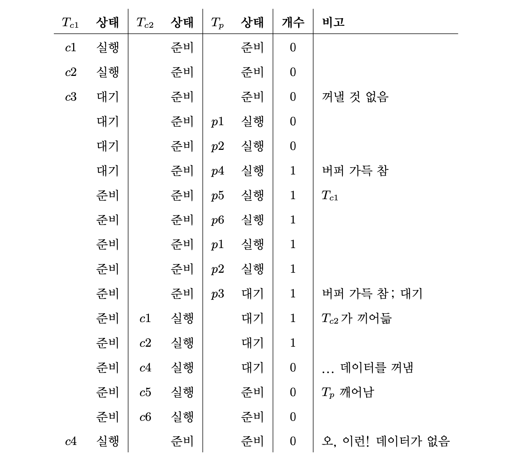
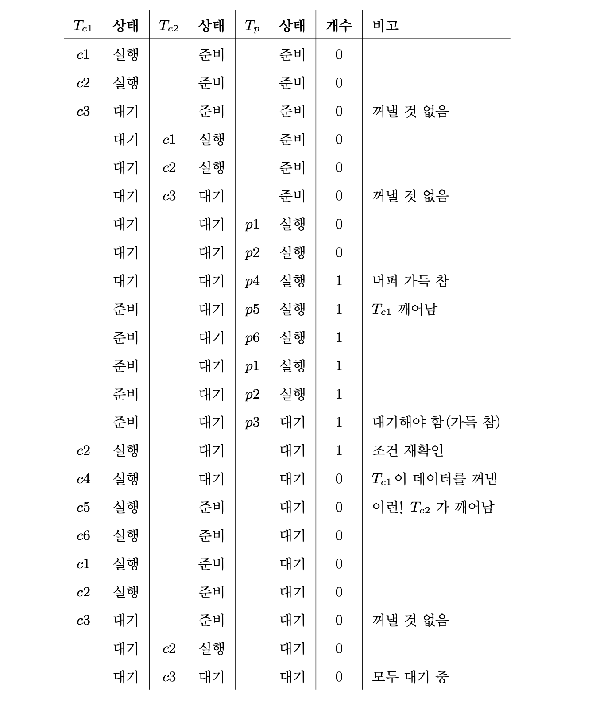
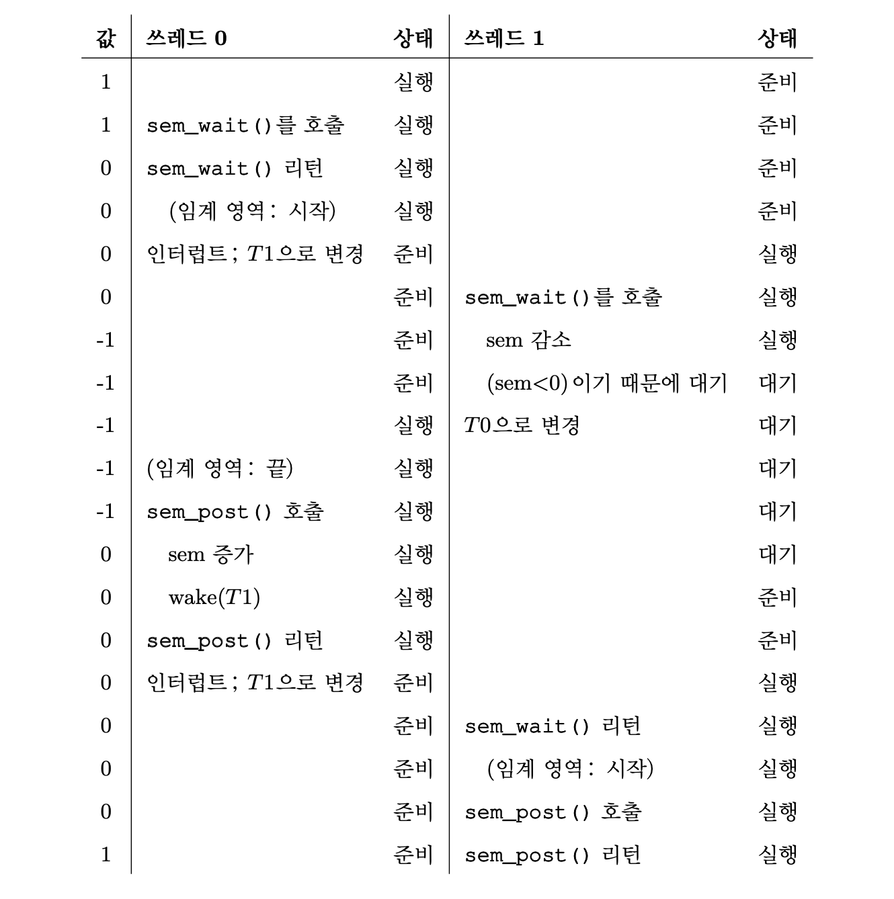
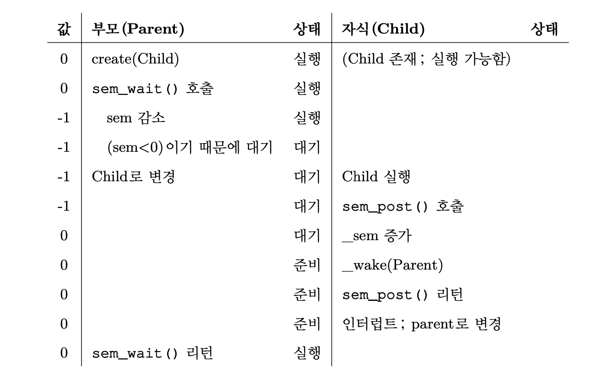
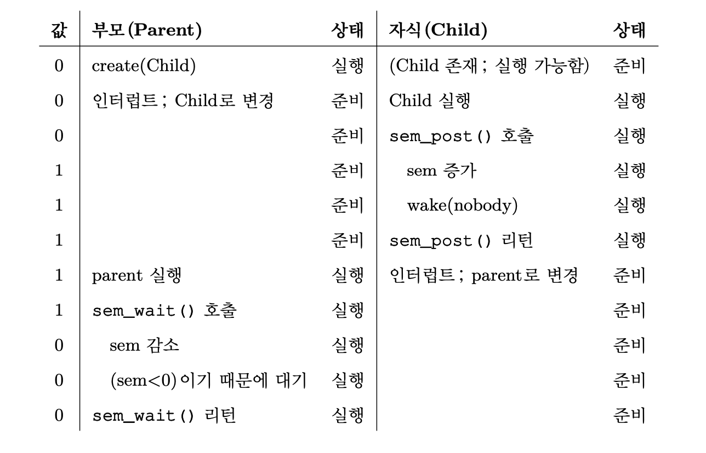
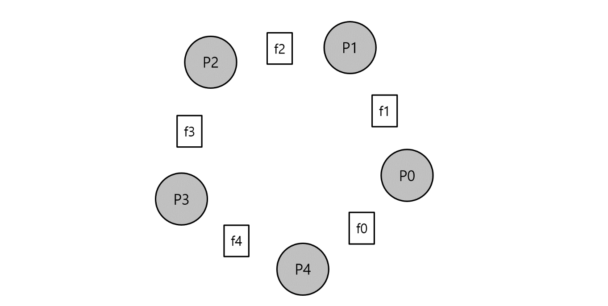
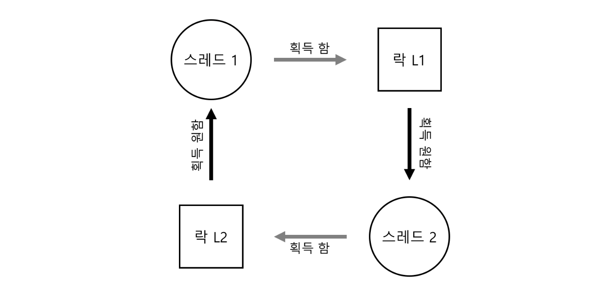

# 30장. 컨디션 변수

지금까지 락에 대해서 알아보았지만, 우리는 “락"만으로는 병행성 프로그램을 제대로 실행시킬 수 없다. 그래서 추가적으로 어떤 조건을 판단하는 **컨디션 변수(condition variable)** 을 활용하려고 한다.

### 일종의 큐 자료구조
- 어떤 실행의 상태(또는 어떤 **조건**)가 원하는 것과 다를 때 조건이 참이 되기를 기다리며 쓰레드가 **대기**할 수 있는 큐
- 다른 쓰레드가 상태를 변경시켰을 때, 대기 중이던 쓰레드를 깨우고, 계속 진행할 수 있도록 한다.
	- 깨울 때, 하나 이상의 쓰레드가 깨어날 수도 있다.
	- 조건에 따라 **시그널**을 보낸다.

POSIX 에서 컨디션 변수를 사용하는 두 가지 함수를 각각 간단히 `wait()`, `signal()` 이라고 하고, 책에서 아주 중요하니 10번 소리내어 읽고 넘어가라는 문장을 한 번 보자.

> `wait()`가 호출될 때 mutex는 잠겨있었다고 가정한다. `wait()`의 역할은 락을 해제하고 호출한 쓰레드를 재우는 것이다. 어떤 다른 쓰레드가 시그널을 보내어 쓰레드가 깨어나면, `wait()`에서 리턴하기 전에 락을 재획득해야 한다.
>

→ 이런 복잡한 과정을 거치는 이유는 쓰레드가 스스로를 재우려고 할 때, 경쟁 조건의 발생을 방지하기 위해서이다.

## 생산자/소비자 (유한 버퍼) 문제

### 생산자

- 생산자 쓰레드가 있다.
- 데이터를 만들어 버퍼에 넣는다.

### 소비자

- 소비자 쓰레드가 있다.
- 버퍼에서 데이터를 꺼내어 사용한다.

### 유한 버퍼

- 공유 자원
- 경쟁 조건의 발생을 방지하기 위해서 동기화가 필요하다.

먼저, 생산자는 넣고 소비자는 꺼내어 쓸 수 있는 공유 버퍼가 하나 필요하다. 그리고 공유 버퍼에 값을 넣는 루틴과 버퍼에서 값을 꺼내는 루틴 두 개가 있다.

```c++
int buffer;
int count = 0;  // 처음에는 비어있음

void put(int value) {
	assert(count == 0);
	count = 1;
	buffer = value;
}

int get() {
	assert(count == 1);
	count = 0;
	return buffer;
}
```

- `put()` 루틴은 값을 공유 버퍼에 넣은 후에 `count`를 1로 설정하여 가득 찼다고 표시한다.
- `get()` 루틴은 공유 버퍼가 찼는지 확인하고, 값을 꺼낸 후 버퍼가 비었다고 설정한다. 읽은 값은 리턴한다.

이 작업들은 두 종류의 쓰레드에 의해 수행되는데, 하나는 생산자 쓰레드 다른 하나는 소비자 쓰레드이다. 아래 코드는 그 두 종류의 쓰레드가 어떻게 동작하는지에 대한 코드이다.

```c++
void *producer(void *arg) {
	int i;
	int loop = (int) arg;
	for (i = 0; i < loops; i++) {
		put(i);
	}
}

void *consumer(void *arg) {
	int i;
	while (1) {
		int tmp = get();
		printf("%d\n", tmp);
	}
}
```

- 생산자는 loop 횟수만큼 공유 버퍼에 데이터를 넣는다.
- 소비자는 무한루프를 돌며 계속해서 데이터를 공유 버퍼에서 꺼낸다.

### 불완전한 해답

생산자와 소비자가 각 하나씩 있다고 가정해보자. 당연히 `put()`과 `get()` 루틴에는 임계 영역이 있으며, `put()`은 버퍼를 갱신하고 `get()`은 버퍼에서 읽는다.

코드에 락을 추가하는 것만으로 제대로 동작하지 않는다. 컨디션 변수를 추가해야 한다.

```c++
cond_t cond;
mutex_t mutex;

void *producer(void *arg) {
	int i;
	for (i = 0; i < loops; i++) {
		Pthread_mutex_lock(&mutex);              // p1
		if (count == 1)                          // p2
			Pthread_cond_wait(&cond, &mutex);    // p3
		put(i);                                  // p4
		Pthread_cond_signal(&cond);              // p5
		Pthread_mutex_unlock(&mutex);            // p6
	}
}

void *consumer(void *arg) {
	int i;
	for (i = 0; i < loops; i++) {
		Pthread_mutex_lock(&mutex);              // c1
		if (count == 0)                          // c2
			Pthread_cond_wait(&cond, &mutex);    // c3
		int tmp = get();                         // c4
		Pthread_cond_signal(&cond);              // c5
		Pthread_mutex_unlock(&mutex);            // c6
		printf("%d\n", tmp);
	}
}
```

- 생산자는 버퍼가 빌때까지 기다린다. (p1 - p3)
- 소비자 또한 버퍼가 차기를 기다린다. (c1 - c3)

생산자와 소비자가 각각 하나인 경우에는 위 코드가 정상 동작한다. 하지만 두 개 이상의 같은 종류의 쓰레드가 있다면 문제가 발생한다.

### 상태가 변경된 것을 모름



- 시그널은 단순히 쓰레드를 깨우기만 한다.
- 상태가 변경되었을 수도 있다는 일종의 힌트에 불과한 것이다.
- 깨어난 쓰레드가 실제 실행되는 시점에도 그 상태가 유지된다는 보장이 없다.

그래서 우리는 간단한 해결책으로 if문을 while문으로 수정하기로 했다.

```c++
cond_t cond;
mutex_t mutex;

void *producer(void *arg) {
	int i;
	for (i = 0; i < loops; i++) {
		Pthread_mutex_lock(&mutex);            	 // p1
		while (count == 1)                       // p2
			Pthread_cond_wait(&cond, &mutex);    // p3
		put(i);                                  // p4
		Pthread_cond_signal(&cond);              // p5
		Pthread_mutex_unlock(&mutex);            // p6
	}
}

void *consumer(void *arg) {
	int i;
	for (i = 0; i < loops; i++) {
		Pthread_mutex_lock(&mutex);              // c1
		while (count == 0)                       // c2
			Pthread_cond_wait(&cond, &mutex);    // c3
		int tmp = get();                         // c4
		Pthread_cond_signal(&cond);              // c5
		Pthread_mutex_unlock(&mutex);            // c6
		printf("%d\n", tmp);
	}
}
```

### 누구를 깨워야 하는지 모름



- 시그널을 보내는 것은 꼭 필요하지만, 대상이 명확해야 한다.
- 소비자는 생산자를 깨우고, 생산자도 소비자만 깨워야 한다.

그래서 두 개의 컨디션 변수를 사용하여 시스템의 상태가 변경되었을 때 깨워야 하는 쓰레드에게만 시그널을 제대로 전달하기로 하였다.

```c++
cond_t empty, fill;
mutex_t mutex;

void *producer(void *arg) {
	int i;
	for (i = 0; i < loops; i++) {
		Pthread_mutex_lock(&mutex);              // p1
		while (count == 1)                       // p2
			Pthread_cond_wait(&empty, &mutex);   // p3
		put(i);                                  // p4
		Pthread_cond_signal(&fill);              // p5
		Pthread_mutex_unlock(&mutex);            // p6
	}
}

void *consumer(void *arg) {
	int i;
	for (i = 0; i < loops; i++) {
		Pthread_mutex_lock(&mutex);              // c1
		while (count == 0)                       // c2
			Pthread_cond_wait(&fill, &mutex);    // c3
		int tmp = get();                         // c4
		Pthread_cond_signal(&empty);             // c5
		Pthread_mutex_unlock(&mutex);            // c6
		printf("%d\n", tmp);
	}
}
```

### 최종 해법

마지막으로 버퍼 공간을 추가하여 대기 상태에 들어가기 전, 여러 값들이 생산될 수 있도록 하고 마찬가지로 여러 개의 값이 대기 상태 전에 소비될 수 있도록 해야한다.

- 하나의 생산자와 소비자의 경우 버퍼가 커지면 쓰레드 간 문맥 교환이 줄어든다.
- 여러 생산자와 여러 소비자의 경우에는 병행성이 좋아진다.

제일 처음 보았던 `put()`, `get()` 루틴을 수정해보자.

```c++
int buffer[MAX];  // 버퍼를 늘렸다.
int fill = 0;
int use = 0;
int count = 0;

void put(int value) {
	buffer[fill] = value;
	fill = (fill + 1) % MAX;
	count++;
}

int get() {
	int tmp = buffer[use];
	use = (use + 1) % MAX;
	count--;
	return tmp;
}
```

버퍼의 크기를 늘리면서, 생산자와 소비자가 대기상태를 판단하는 조건도 달라져야 한다.

```c++
cond_t empty, fill;
mutex_t mutex;

void *producer(void *arg) {
	int i;
	for (i = 0; i < loops; i++) {
		Pthread_mutex_lock(&mutex);              // p1
		while (count == MAX)                     // p2
			Pthread_cond_wait(&empty, &mutex);   // p3
		put(i);                                  // p4
		Pthread_cond_signal(&fill);              // p5
		Pthread_mutex_unlock(&mutex);            // p6
	}
}

void *consumer(void *arg) {
	int i;
	for (i = 0; i < loops; i++) {
		Pthread_mutex_lock(&mutex);              // c1
		while (count == 0)                       // c2
			Pthread_cond_wait(&fill, &mutex);    // c3
		int tmp = get();                         // c4
		Pthread_cond_signal(&empty);             // c5
		Pthread_mutex_unlock(&mutex);            // c6
		printf("%d\n", tmp);
	}
}
```

## 컨디션 변수 사용 시 주의점

### 멀티 쓰레드 기반 메모리 할당 라이브러리

- 메모리 할당 코드를 호출하면 공간이 생길 때까지 기다려야할 수 있다.
- 반대로, 쓰레드가 메모리를 반납 시, 사용가능한 메모리 공간의 발생을 알리는 시그널을 생성한다.

→ 여기서, 어떤 쓰레드가 깨어나야 하는가?

해결방법은 의외로 단순한데, 전부 다 깨우면 된다. 하지만 명확한 단점도 있다. 안 깨워도 되는 쓰레드를 모두 깨운다는 것이다.

---

# 31장. 세마포어

>☝ 정수 값을 갖는 객체로서, 두 개의 루틴으로 조작할 수 있다. 또한 초기값에 의해 동작이 결정되기 때문에 사용하기 전 “제일 먼저" 값을 초기화 해야한다.

### POSIX 표준 두 개의 루틴

- `sem_wait()`
    - 세마포어 s 의 값을 1 뺀다.
    - 세마포어 s 의 값이 음수라면 wait 한다.
- `sem_post()`
    - 세마포어 s 의 값을 1 더한다.
    - 하나 이상의 쓰레드가 대기중이라면, 하나를 깨운다.

### 핵심적인 성질

- `sem_wait()` 함수는 즉시 리턴하거나(세마포어의 값이 1이상이면), 해당 세마포어 값이 1 이상이 될 때까지 호출자를 대기시킨다.
    - 다수의 쓰레드들이 `sem_wait()`를 호출할 수 있기 때문에, 대기큐에는 다수의 쓰레드가 존재할 수 있다.
    - 대기하는 법에는 회전(spin)과 재우기(sleep) 두가지가 있다.
- `sem_wait()` 함수와 달리 `sem_post()` 함수는 대기하지 않는다.
    - 세마포어 값을 증가시키고 대기 중인 쓰레드 중 하나를 깨운다.
- 세마포어가 음수라면 그 값은 현재 대기 중인 쓰레드의 개수와 같다.
    - 일반적으로 사용자는 이 값을 알 수 없다.

## 이진 세마포어 (락)

우리가 친숙한 “락" 부터 세마포어를 적용해보자.

```c++
sem_t m;
sem_init(&m, 0, 1);	// semaphore init
sem_wait(&m);
... // 임계 영역 부분은 여기에 배치
sem_post(&m);
```

아래 그림은 세마포어를 사용하는 두 개의 쓰레드의 상태 흐름을 나타낸다.



- 임계 영역에 락을 걸듯이 `sem_wait()` 함수를 호출하여 세마포어 값을 줄여, 다른 쓰레드가 접근했을 때 세마포어 값을 보고 대기상태로 진입하게 만든다.
- 마찬가지로, 임계 영역에서 볼일을 다보고 락을 해제하듯이, `sem_post()` 함수를 호출하여 세마포어 값을 하나 올린 후, 다른 쓰레드의 접근을 허용하도록 한다.

이와 같이 세마포어는 락으로 쓸 수 있다. 락은 두 개의 상태(사용 가능, 사용 중)를 가지기 때문에 **이진 세마포어(binary semaphore)** 라고도 불린다.

## 컨디션 변수로서의 세마포어

우리는 대기 중인 쓰레드(또는 쓰레드들)가 프로그램에서의 어떤 **조건(condition)** 이 만족되기를 대기하기 때문에, 세마포어를 컨디션 변수처럼 사용할 수 있다.

간단한 예시로, 부모 쓰레드가 자식 쓰레드를 생성하고 자식 쓰레드의 종료를 대기하는 것을 상상해보자. 여기서는 세마포어의 초기값을 0으로 지정하면 된다.



- child를 생성 후, child가 실행되지 않은 경우



- child를 생성하고 부모가 `sem_wait()`를 호출하기 전에 child의 실행이 종료된 경우

## 생산자/소비자 (유한 버퍼) 문제

### empty, full 세마포어

쓰레드는 empty와 full을 사용하여 버퍼 공간이 비었는지 채워졌는지를 표시한다.

해당 방식은 버퍼의 최대 크기가 1보다 크고, 쓰레드가 여러 개일 때 경쟁조건이 발생한다. 아래의 예시를 통해 알아보자.

```c++
sem_t empty;
sem_t full;

void *producer(void *arg) {
	int i;
	for (i = 0; i < loops; i++) {
		sem_wait(&empty);
		put(i);
		sem_post(&full);
	}
}

void *consumer(void *arg) {
	int i, tmp = 0;
	while (tmp != -1) {
		sem_wait(&full);
		tmp = get();
		sem_post(&empty);
		printf("%d\n", tmp);
	}
}
```

1. 두 개의 생산자 Pa, Pb 가 있다고 가정해보자.
2. 두 쓰레드가 거의 동시에 `put()` 함수를 호출한다.
3. Pa 쓰레드가 먼저 실행되고 버퍼의 첫 공간에 값을 넣기 시작한다.
4. Pa 쓰레드가 fill 카운터 변수가 1로 변경하기 전에 인터럽트가 걸린다.
5. 생산자 Pb가 실행되고 마찬가지로 버퍼의 첫 공간에 값을 넣는다.
6. Pa가 기록 해놓았던 이전 값이 덮어 씌워진다.
7. 문제가 발생한다!!

→ 이렇듯, 생산자의 데이터가 일정하지 않게 되는 문제가 발생한다.

### 그렇다면 해법은? 상호 배제의 추가

위에서는 상호 배제를 고려하지 않았다. 버퍼를 채우고 버퍼에 대한 인덱스를 증가하는 동작은 임계 영역이기 때문에 신중해야 한다. 

아래 코드는 이진 세마포어와 몇 개의 락을 추가하여 해결하려고 한 코드다.

```c++
sem_t empty;
sem_t full;
sem_t mutex;

void *producer(void *arg) {
	int i;
	for (i = 0; i < loops; i++) {
		sem_wait(&mutex);
		sem_wait(&empty);
		put(i);
		sem_post(&full);
		sem_post(&mutex);
	}
}

void *consumer(void *arg) {
	int i, tmp = 0;
	while (tmp != -1) {
		sem_wait(&mutex);
		sem_wait(&full);
		tmp = get();
		sem_post(&empty);
		sem_post(&mutex);
		printf("%d\n", tmp);
	}
}
```

좋은 시도였지만, 교착상태가 발생한다는 문제가 있다.

### 어떤 순서로 프로그램이 동작해야 교착 상태에 빠질까?

1. 생산자, 소비자 쓰레드가 각 하나씩 있다고 가정해보자.
2. 소비자가 먼저 실행되었다.
3. mutex를 획득하고, full 변수에 대해 `sem_wait()`를 호출한다.
	1. 아직 데이터가 없기 때문에 소비자는 대기하고, CPU를 양보한다.
    2. 여전히 소비자가 락을 획득하고 있는 중이다.
4. 생산자가 실행된다.
5. 먼저 mutex 세마포어에 대해서 `sem_wait()`를 호출한다.
    1. 이미 락을 소비자가 가지고 있기 때문에 생산자도 대기하게 된다.

→ 순환 고리가 생겨버렸다. 이제 서로를 기다리게 된 것이다.

### 해결하려면? 락의 범위(scope)를 줄인다.

```c++
sem_t empty;
sem_t full;
sem_t mutex;

void *producer(void *arg) {
	int i;
	for (i = 0; i < loops; i++) {
		sem_wait(&empty);
		sem_wait(&mutex);
		put(i);
		sem_post(&mutex);
		sem_post(&full);
	}
}

void *consumer(void *arg) {
	int i, tmp = 0;
	while (tmp != -1) {
		sem_wait(&full);
		sem_wait(&mutex);
		tmp = get();
		sem_post(&mutex);
		sem_post(&empty);
		printf("%d\n", tmp);
	}
}
```

mutex 락의 범위를 위와 같이 안쪽으로 줄여버리면 된다. 그렇게 되면 mutex 락이 딱 임계 영역 내에서만 걸리기 때문에 교착 상태를 방지할 수 있게 된다.

## Reader-Writer 락

우리는 다양한 자료구조를 접근하는 데 여러 종류의 락 기법을 필요로 한다.

예를 들어, 리스트에 삽입하고 간단한 검색을 하는 것과 같은 병행연산이 여러 개 있다고 가정해보자. 

- 삽입 연산은 리스트의 상태를 변경한다.
    - 전통적인 임계 영역 보호 방식으로 해결이 가능하다.
- 검색은 자료 구조를 단순히 읽기만 한다.
- 삽입 연산이 없다는 보장만 된다면 다수의 검색 작업을 동시에 수행할 수 있다.

→ 이와 같은 경우를 위해 만들어진 락이 **reader-writer 락**이다.

## Dining Philosopher



- 다섯 명의 철학자가 식탁 주위를 둘러앉아 있다.
- 총 다섯 개의 포크가 철학자들 사이사이에 하나씩 놓여 있다.
- 철학자는 식사하는 때가 있고 생각할 때가 있다.
- 생각 중일 때는 포크가 필요없다.
- 자신의 양쪽에 있는 포크를 모두 들어야 식사가 가능하다.

→ 이 포크를 잡기 위한 경쟁, 그에 따른 동기화 문제를 다루는 문제이다.

아래는 각 철학자의 동작을 나타낸 기본 의사 코드이다.

```c++
while (1) {
	think();
	getforks();
	eat();
	putforks();
}
```

여기서 주요 쟁점은 `getforks()`와 `putforks()`의 루틴을 작성하되, 교착 상태의 발생을 방지해야 하고, 어떤 철학자도 굶으면 안되며, 최대한 많은 철학자가 동시에 식사를 해야한다.

### 첫 번째: 추가적인 함수들

```c++
int left(int p) { return p; }
int right(int p) { return (p + 1) % 5; }
```

- 철학자 p 가 왼쪽 포크를 잡으려면 `left(p)` 호출
- 철학자 p 가 오른쪽 포크를 잡으려면 `right(p)` 호출
    - 마지막 철학자 (p=4) 가 오른쪽 포크 0을 잡는 것을 고려해 modulo 연산 사용

이 문제를 해결하기 위해서 세마포어가 필요하다. 각 포크마다 한 개씩 `sem_t forks[5]`로 정의한다.

### 두 번째: 세마포어

forks 배열에 있는 각 포크에 대한 세마포어를 1로 초기화 하고, 각 철학자는 자신의 순번을 알고 있다고 가정해보자. 그럼 아래와 같이 루틴을 작성할 수 있다.

```c++
void getforks() {
	sem_wait(forks[left(p)]);
	sem_wait(forks[right(p)]);
}

void putforks() {
	sem_post(forks[left(p)]);
	sem_post(forks[right(p)]);
}
```

- 포크가 필요하면 단순히 “락" 하나를 획득한다.
- 먼저 왼쪽을 잡고, 그 후에 오른쪽을 잡는다.
- 식사 후 순서대로 포크를 놓는다.

### 세 번째: 교착상태 발생

1. 각자가 모두 자신의 왼쪽 포크를, 다른 철학자가 오른쪽 포크를 들기 전에 잡았다.
2. 각자가 모두 자신의 오른쪽 포크를 다른 사람이 놓아주기만을 기다린다.

### 해답: 의존성 제거

최소한 한 명의 철학자가 다른 순서로 포크를 집도록 하면 된다. 코드를 보자.

```c++
void getforks() {
	if (p == 4) {
		sem_wait(forks[right(p)]);
		sem_wait(forks[left(p)]);
	} else {
		sem_wait(forks[left(p)]);
		sem_wait(forks[right(p)]);
	}
}
```

- 마지막 철학자가 오른쪽 포크를 먼저 잡는다.
- 각 철학자가 하나의 포크를 든 채로 다른 포크를 기다리는 현상은 발생하지 않을 것이다.

## 제마포어(Zemaphore)

하나의 락, 하나의 컨디션 변수를 사용하며 세마포어의 값을 나타내는 상태 변수 하나를 사용한다.

### 세마포어와의 차이점

- 세마포어의 음수 값이 대기 중인 쓰레드의 수를 나타낸다.
- 제마포어는 이 값이 0보다 작을 수가 없다.

---

# 32장. 병행성 관련 오류

>❓ 핵심 질문: 일반적인 병행성 관련 오류들을 어떻게 처리하는가
>
>병행성 버그는 몇 개의 전형적인 패턴을 갖고 있다. 튼튼하고 올바른 병행 코드를 작성하기 위한 가장 첫 번째 단계는 어떤 경우들을 피해야 하는지 파악하는 것이다.

## 비 교착 상태 오류

### 원자성 위반(atomicity violation)

>👉 다수의 메모리 참조 연산들 간에 있어 예상했던 직렬성(serializability)이 보장되지 않았다.

즉, 코드의 일부에 원자성이 요구되었으나 실행 시에 그 원자성이 위반되었다.

해결방법은 간단하게도, 락을 추가하여 원자성이 보장되어야 하는 부분에 락 변수를 획득하도록 하면 된다.

### 순서 위반(order violation)

> 👉 두 개의(그룹의) 메모리 참조 간의 순서가 바뀌었다.

즉, A가 항상 B보다 먼저 실행되어야 하지만 실행 중에 그 순서가 지켜지지 않았다.

해결방법은 또한 간단하다. 순서를 강제하면 된다. 컨디션 변수가 알맞다.

## 교착 상태 오류



### 먼저, 왜 발생하는지 알아보자.

- 코드가 많아지면서 구성 요소 간의 복잡한 의존성이 발생하기 때문이다.
- 캡슐화(encapsulation) 의 성질 때문이다.
    - 모듈화와 락은 조화롭지 못하다.

### 그리고, 발생 조건에 대해 알아보자.

- **상호 배제(Mutual Exclusion)**: 쓰레드가 자신이 필요로 하는 자원에 대한 독자적인 제어권을 주장한다.
- **점유 및 대기(Hold-and-wait)**: 쓰레드가 자신에게 할당된 자원을 점유한 채로 다른 자원을 대기한다.
- **비 선점(No preemption)**: 자원을 점유하고 있는 쓰레드로부터 자원을 강제적으로 빼앗을 수 없다.
- **환형 대기(Circular wait)**: 각 쓰레드는 다음 쓰레드가 요청한 하나 또는 그 이상의 자원을 갖고 있는 쓰레드들의 순환 고리가 있다.

이 네 가지 조건 중 하나라도 만족시키지 못하면, 교착상태는 발생하지 않는다.

> 🤷 뭔가 어투가 교착상태가 발생해야만 할 것같다.
> 

### 예방하는 방법부터 알아보자.

***환형 대기(Circular Wait)***

- 락을 획득하는 **전체 순서(total ordering)** 를 정하자.
- 물론, 좀 더 복잡한 경우, 두 개 이상의 락이 존재한다.
    - 전체 순서를 정하는 것이 어렵게 될 수 있다.
    - 그렇다면 **부분 상태(partial ordering)** 를 제공하는 것도 유용하다.
- 락의 순서를 정의하기 위해 코드와 다양한 루틴 간의 상호 호출 관계를 이해해야 한다.

***점유 및 대기(Hold-and-Wait)***

- 원자적으로 모든 락을 단번에 획득하도록 하면된다.

그런데, 이 방식은 문제점이 많다.

1. 필요한 락들을 정확히 파악하고, 그 락들을 미리 획득해야 한다.
2. 미리 모든 락을 획득해 놓기 때문에 병행성이 저하된다.

***비선점(No Preemption)***

많은 쓰레드 라이브러리들이 이 문제를 피하기 위해 유연한 인터페이스 집합을 제공한다.

- trylock() 루틴
    - 락을 획득하거나 현재 락이 점유된 상태이니 락을 획득하기 원한다면 나중에 다시 시도하라는 것을 알리는 -1 값을 리턴한다.
    - 이 인터페이스를 사용하면 교착 상태 가능성이 없고, 획득 순서에 영향을 받지않는 락 획득 방법을 만들 수 있다.

하지만 **무한반복(livelock)** 이라는 새로운 문제점이 생긴다. (물론 해법도 존재한다.)

***상호 배제(Mutual Exclusion)***

- **대기없는(wait-free)** 자료구조를 사용한다.
    - 명시적 락이 필요 없는 강력한 하드웨어 명령어를 사용하여 자료구조를 만들면 된다.
- 이와 같은 방식을 사용하면 락을 획득할 필요도 없고, 교착상태가 발생할 수도 없다.
    - 무한반복에 대한 가능성은 아직 남아있다.

### 회피하는 것도 유용할 때가 있다.

회피하기 위해서는 실행 중인 여러 쓰레드가 어떤 락을 획득하게 될 것인지에 대해 전반적으로 파악하고 있어야 하며, 그것을 바탕으로 쓰레드들을 스케줄링하여 교착상태가 발생하지 않도록 그때그때 보장한다.

예제를 통해 알아보자.


위 그림은 쓰레드 T1, T2, T3, T4 와 두 개의 락 L1, L2 의 연관관계를 나타낸 표이다.

똑똑한 스케줄러라면 아래 그림과 같이 T1, T2가 동시에 실행만 하지 않는다면 교착 상태가 절대 발생하지 않을 것을 알고있다.


더 경쟁이 심각해진 경우를 보자.


이제는 T3도 L1을 필요로 하면서, 경쟁이 치열해졌다.

이제 교착상태가 절대 발생하지 않는 스케줄링은 아래와 같아졌다.


보수적인 방법을 선택하여 교착상태가 아예 발생하지 않지만 성능 하락을 어느정도 감수한다.

***마지막으로, 교착 상태 발생을 허용하고, 교착 상태를 발견하면 복구하게 하는 방법이 있다.***

교착 상태가 가끔가다 한 번씩 발생하는 것이라면, 그냥 재부팅하고 맘편해지자는 것이다.

---

# 33장. 이벤트 기반의 병행성(고급)

이제 쓰레드 없이 병행성을 다루어 보자, 알아볼 개념은 **이벤트 기반의 병행성(event-based concurrency)** 이다. 처음부터 문제점을 다루어서 조금 그렇지만, 이 개념은 두 개의 문제점을 가지고 있다.

- 멀티 쓰레드 프로그램에서 이벤트 기반 병행성을 올바르게 사용하기가 어렵다.
    - 락을 누락시키거나, 교착 상태 또는 다른 골치 아픈 일들이 많다.
- 멀티 쓰레드 프로그램에서는 개발자가 쓰레드 스케줄링 제어권을 가지지 못한다.
    - 개발자는 운영체제가 합리적으로 스케줄링 해주기만을 기도해야 한다.
    - 그렇기에 원치않는 순서로 스케줄링 되는 경우가 허다하다.

>❓ 핵심 질문: 어떻게 쓰레드 없이 병행 서버를 개발할까
>
>쓰레드 없이 병행 서버를 구현할 때, 어떻게 병행성을 유지하면서 각종 문제들을 피할 수 있을까?

## 기본 개념: 이벤트 루프

**이벤트 기반 병행성**의 접근 방식은 아주 간단하다.

1. 특정 이벤트의 발생을 대기한다.
2. 이벤트가 발생하면, 이벤트의 종류를 파악한다.
3. I/O 요청 또는 추후 처리를 위해 다른 이벤트를 발생시키는 등의 작업을 한다.

이제 **이벤트 루프(event loop)** 를 알아보자.

```c++
while (1) {
	events = getEvents();
	for (e in events) {
		processEvent(e);
	}
}
```

1. while 루프 내에서 이벤트를 대기한다.
2. 이벤트가 발생하면 하나씩 처리한다.
    1. 여기서 이벤트를 처리하는 코드를 **이벤트 핸들러(event handler)** 라고 부른다.

여기서 중요한 것은 이벤트의 처리가 시스템의 유일한 작업이기 때문에, 다음 처리할 이벤트를 결정하는 것이 스케줄링과 동일한 효과를 갖는다는 것이다.

### 그런데, 발생한 이벤트가 무슨 이벤트인지 어떻게 아는가?

## 중요 API: select() (또는 poll())

도착한 I/O들 중 주목할 만한 것이 있는지를 검사한다.

`select()` 에 대해서 알아두어야 할 사항이 두 가지가 있다.

- `select()`를 이용하면 디스크립터에 대한 읽기 가능여부, 쓰기 가능여부를 검사할 수 있다.
    - 읽기 가능여부는 처리해야 할 패킷의 도착 여부 파악
    - 쓰기 가능여부는 서비스가 응답전송이 가능한 시점을 파악
- timeout 인자의 존재
    - 일반적으로 NULL 로 설정 - 그러면 디스크립터 준비까지 무한정 대기
    - 오류에 대비해서 다른 값으로 설정하기도 한다.
    - 널리 사용되는 것은 0으로 설정하여 바로 리턴하도록 하는 것

## 왜 간단한가? 락이 필요 없음

매순간 단 하나의 이벤트만 다루기 때문에 락을 획득하거나 해제해야 할 필요가 없다.

이벤트 기반의 서버는 단 하나의 쓰레드만 갖고 있기 때문에 다른 쓰레드에 의해 인터럽트가 걸릴 수가 없다. 그래서 흔한 병행성 버그는 기본적인 이벤트 기반 접근법에서는 나타나지 않는다.

## 문제점 1: 블로킹 시스템 콜(Blocking System Call)

차단될 수도 있는 시스템 콜을 호출하게 되면 문제가 발생한다.

- 이벤트 핸들러가 블로킹 콜을 호출한다.
- 서버 전체가 그 일을 처리하기 위해 명령어가 끝날 때까지 다른 것들을 모두 차단한다.
- 이벤트 루프가 블록되면 시스템은 쉬게된다.
- 심각한 자원 낭비가 발생한다.

→ 그래서 기본 원칙은 블로킹 호출을 허용하면 안된다는 것이다.

## 해법: 비동기 I/O

I/O 요청을 디스크로 내려 보낼 수 있는 새로운 방법을 개발했다.

- I/O 요청을 하면 I/O 요청이 끝나기 전에 제어권을 즉시 호출자에게 다시 돌려준다.
- 추가적으로 여러 종류의 I/O들이 완료되었는지도 판단할 수 있다.

### 그럼 어떻게 종료된 것을 알 수 있을까?

대기중인 모든 비동기 I/O는 주기적으로 시스템 콜을 통해 시스템에 **폴링(poll)** 하여 해당 I/O 가 완료되었는지 확인할 수 있다.

일일이 다 검사해야 하는 것이 귀찮고 시간이 오래걸릴 수 있으니 어떤 시스템들은 **인터럽트** 기반의 접근법을 제공한다. **시그널(signal)** 을 사용하여 완료를 알려준다.

## 문제점 2: 상태 관리

쓰레드 기반의 프로그램보다 일반적으로 더 작성하기 복잡하다.

이벤트 핸들러가 비동기 I/O를 발생시킬 때, I/O 완료 시 사용할 프로그램 상태를 정리해 놓아야 한다. 원래 쓰레드 기반에서는 쓰레드 스택에 이 정보들이 모두 들어있기 때문에 불필요한 작업인 것이다.

우리는 결국 **수동 스택 관리(manual stack management)** 를 해야 한다.

## 단순하고 좋은데 왜 안쓰냐?

- 단일 CPU 에서만 단순하다.
- 페이징과 같은 특정 종류의 시스템과 잘 맞지 않다.
- 루틴의 작동 방식이 계속 변화하기 때문에, 관리가 어렵다.
- 비동기 I/O 가 아직 일관성 있게 적용되지 않았다.
    - 디스크 I/O는 그렇다 쳐도, 네트워크는 아직...