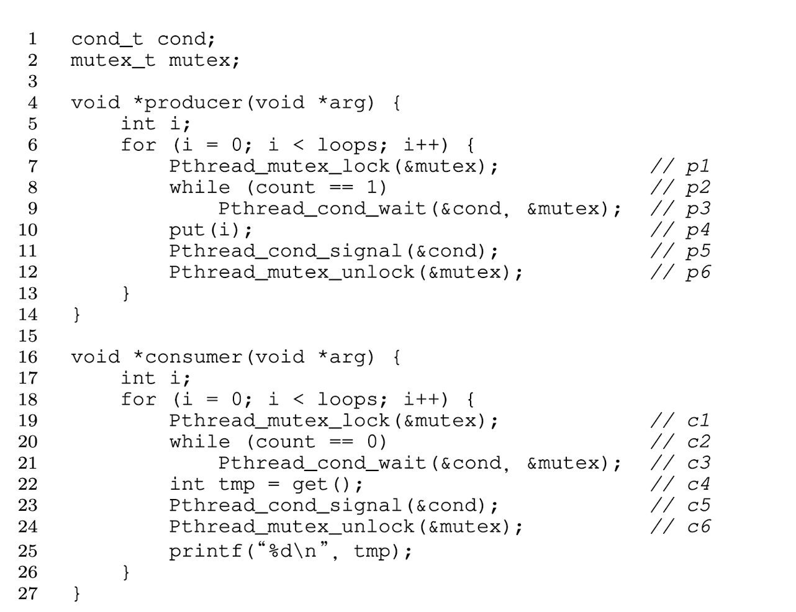
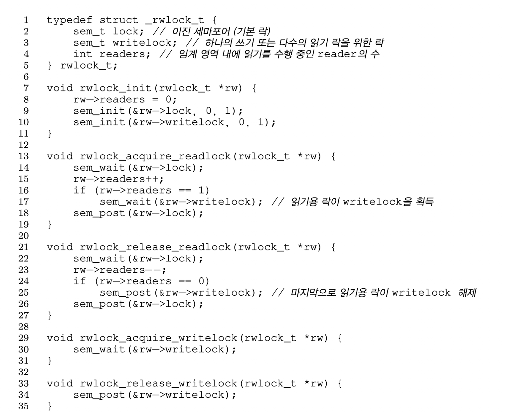
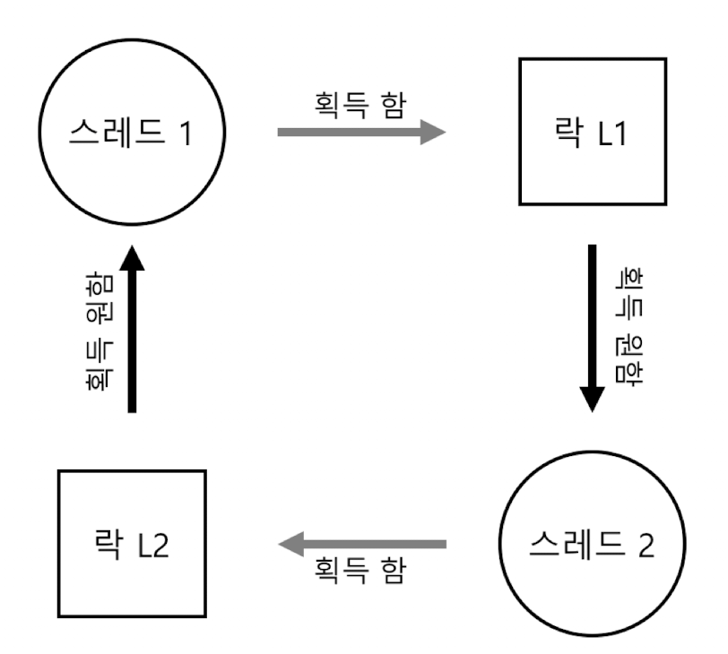

# 30. 컨디션 변수

## 조건을 기다리는 법

조건이 참이 될 때까지 회전을 하며 기다리는 것은 간단하지만 비효율적이고 CPU 사이클을 낭비함

## 컨디션 변수(Conditional variable)

- 조건이 참이 되기를 기다리며 쓰레드가 대기할 수 있는 큐
- 다른 쓰레드가 상태를 변경시켰을 때, 대기 중이던 쓰레드를 깨우고 계속 진행할 수 있도록 함
- pthread_cond_t c;  → 컨디션 변수 선언, 초기화 필요
- pthread_cond_wait(pthread_cond_t *c, pthread_mutex_t *m): 락을 해제하고 호출한 쓰레드를 재우는 연산, “어떤 다른 쓰레드가 시그널을 보내어 쓰레드가 깨어나면, wait에서 리턴하기 전에 락을 재획득해야한다.” (스스로를 재우려 할 때 경쟁 조건  발생을 방지하기 위함)
- pthread_cond_signal(pthread_cond_t *c): 조건이 참이 되기를 기다리며 잠자고 있던 쓰레드를 깨울 때 호출함

> 시그널을 보내기 전에 락을 무조건 획득해야 함
> 

## Join 문제 해법

### 1. 부모 쓰레드가 자식 쓰레드 생성, 계속 실행하여 thr_join()을 호출하고 자식 쓰레드가 끝나기를 기다리는 경우

부모 쓰레드가 락을 획득하고 자식 끝났는지 검사(done이 1인가)

끝나지 않았으면 wait()을 호출하여 스스로 재우고 락을 해제함

자식 쓰레드가 실행되어 “child” 메시지 출력하고 thr_exit()을 호출하여 락을 획득한 후에 상태 변수를 설정하고 부모 쓰레드에 시그널을 보내어 깨어나도록 함

wait()에서 락을 획득한 채로 리턴하여 부모 쓰레드 실행됨

락을 해제하고 parent:end 메시지 출력

### 2. 자식 쓰레드가 생성되면서 즉시 실행

자식 쓰레드가 생성되면서 즉시 실행되고 done 변수를 1로 설정하고 자고 있는 쓰레드르 깨우기 위해 시그널을 보내지만 자고 있는 쓰레드가 없으므로 리턴함

이후 부모 쓰레드가 실행하고 thr_join()을 호출하고 done 변수가 1인 것을 알게되고 대기 없이 바로 리턴함

## thr_exit()과 thr_join()의 틀린 구현 방법

 자식 쓰레드가 생성된 즉시 실행되어 thr_exit()을 호출하는 경우 자식 프로세스가 시그널을 보내겠지만 깨워야할 쓰레드가 없음. 부모 쓰레드가 실행되면 wait()을 호출하고 거기서 멈춰있을 것임 어떤 쓰레드도 부모 쓰레드를 깨우지 않을 것 → done 상태변수의 필요성

이 경우 경쟁 조건이 발생

부모 쓰레드가 thr_join()을 호출하고 나서 done 변수의 값이 0인 것을 확인한 후 잠드려고 wait()을 호출하기 직전에 인터럽트에 걸려 자식 쓰레드가 실행이 되었다고 하자. 자식 쓰레드는 done 상태변수 값을 1로 변경하고 시그널에 보내지만 이 때, 부모 쓰레드는 자고있지 않으므로 시그널을 받지 않는다. 이후 부모 쓰레드가 다시 실행되면 wait()을 호출하고 잠을 자게 되지만 부모 쓰레드를 깨워줄 쓰레드가 없다. 

## 생산자/소비자(유한 버퍼) 문제

여러 개의 생산자 쓰레드와 소비자 쓰레드 존재 

- 멀티 쓰레드 웹 서버 - HTTP 요청 작업 큐에 넣음, 큐에서 유청을 꺼내어 처리)
- grep foo file.txt | wc -l  - 파이프 명령으로 한 프로그램의 결과를 다른 프로그램에게 전달

### 유한 버퍼

공유 자원, 경쟁 조건 발생을 방지하기 위해 동기화 필요

생산자는 넣고 소비자는 꺼내어 쓸 수 있는 공유 버퍼

- put() : 버퍼에 값을 넣음 (count가 0인 경우만)
- get() : 버퍼에서 값을 꺼냄 (count가 1인 경우만)

컨디션 변수 하나와 컨디션 변수와 연결된 mutex 락을 사용

문제 발생 ⇒ 다른 소비자가 끼어들어서 버퍼값을 소비하면 원래 소비자가 빈 버퍼에서 값을 가져오려는 시도를 하게 된다.

원인 ⇒ 시그널은 쓰레드를 깨우기만 하지, 깨어난 쓰레드가 실제 실행되는 시점에도 그 상태가 유지된다는 보장이 없음

if 대신 while문을 사용하여 개선할 수 있지만 아직 불완전함

⇒ 소비자 쓰레드 두개가 먼저 실행한 후에 대기 상태에 있을 경우 하나의 생산자가 실행되어 하나의 대기 중인 쓰레드 하나를 깨운다. 버퍼의 값을 소비하고 나서 생산자를 워야하지만 소비자를 깨운다면 깨운 소비자가 다시 개디 상태에 들어가고 원래 소비자 역시 대기 상태에 들어간다. 세 개의 쓰레드가 모두 대기 상태이다.

⇒ 시그널을 보내는 대상이 명확해야 함, 소비자는 생산자를 깨우고 생산자는 소비자만 깨워야 함

## 단일 버퍼 생산자/소비자 해법

두 개의 컨디션 변수를 사용하여 시스템의 상태가 변경되었을 때, 깨워야하는 쓰레드에게만 시그널 전달

## 최종적인 생산자/소비자 해법

버퍼 공간을 추가하여 병행성을 증가시키고 더 효율적으로 만듦

버퍼가 커지면 쓰레드 간의 문맥 교환이 줄어들기 때문에 더 효율적임

멀티 생산자, 멀티 소비자의 경우 생산과 소비가 병행되므로 병행성이 좋아짐

## 컨디션 변수 사용 시 주의할 점

> 멀티 쓰레드 프로그램에서 조건 검사시 항상 while문을 사용해야 함 - 거짓으로 깨운 경우, 두개의 쓰레드가 깨어나는 경우에 대처 가능
> 

하나 이상의 쓰레드가 대기 중인 경우 어떤 쓰레드가 깨워야 할지 모름

⇒ 모든 쓰레드를 깨우도록 pthread_cond_broadcast() 

단점은 불필요하게 쓰레드들이 깨어날 수 있지만 깨어나야할 쓰레드가 있다면 깨어날 수 있도록 할 수 있음

⇒ **포함 조건(Covering condition): 쓰레드가 깨어나야하는 모든 경우를 다 포함**

## 요약

컨디션 변수 - 주요 동기화 문제 해결

생산자 소비자, 포함 조건 문제

# 31. 세마포어

## 세마포어를 어떻게 사용하는가

- 세마포어 정의
- 세마포어 사용법
- 이진 세마포어
- 락과 컨디션 변수를 사용해 세마포어를 만들 수 있는가
- 세마포어를 사용하여 락과 조건 변수를 만드는 것이 가능한가

## 세마포어

정수 값을 갖는 객체, 초기값에 의해 동작이 결정되므로 사용하기 전 제일 먼저 값 초기화 해야함

- sem_wait(): 세마포어 값이 1이상이면 즉시 리턴하거나 1이상이 될 때까지 호출자를 대기 시킴(회전과 재우기)
- sem_post(): 세마포어 값을 증가시키고 대기 중인 쓰레드 중 하나를 깨움
- 세마포어 음수 : 현재 대기 중인 쓰레드의 개수
- 두 함수 원자적 실행 가정

## 이진 세마포어(락)

락은 두개의 상태 - 사용가능, 사용중 ⇒ 이진 세마포어

세마포어 1으로 초기화

첫 쓰레드 sem_wait(), 세마포어 값을 0으로 만듦 임계영역 진입

sem_post()를 불러 다시 1로 설정

음수인 경우 대기

## 컨디션 변수로서의 세마포어

 대기중인 쓰레드가 프로그램에서의 어떤 조건이 만족되기를 대기 ⇒ 세마포어를 컨디션 변수처럼 사용할 수 있음

 부모 프로세스는 자식 프로세스 생성 후 sem_wait()을 호출하여 자식의 종료를 대기

자식은 sem_post()를 호출하여 종료되었음을 알림

세파포어 값은 0으로 초기화 

## 생산자/소비자(유한 버퍼) 문제

full, empty 두개의 세마포어 사용 - 버퍼 공간이 비었는지 채워졌는지 표시

생산자와 소비자 쓰레드들이 여러개 있으면 경쟁 조건 발생 ⇒ 상호 배제 추가

상호 배제를 위해 락을 추가했을 때, 교착상태가 발생할 수 있다. 

교착 상태가 발생하는 경우 

소비자가 먼저 실행이 되어 mutex를 획득하고 full 변수에 대하여 sem_wait()을 호출

데이터가 없으므로 소비자는 대기하고 CPU 양보, 이후 생산자 실행되어 데이터를 생성하고 소비자 쓰레드 깨움 이미 소비자가 락을 획득한 상태이므로 생산자도 대기 상태로 들어감 

⇒ 교착 상태를 해결 : 락의 범위를 줄임

mutex를 획득하고 해제하는 코드를 임계 영역 바로 이전과 이후로 이동시킴

## Reader-Writer 락

좀 더 융통성 있는 락 기법 

자료 구조 갱신 - 새로운 동기화 연산 쌍 사용

rwlock_acquire_writelock(): 락을 획득

rwlock_release_writelock():  락을 해제 

하나의 쓰기 쓰레드만이 락을 획득할 수 있도록 함

### 읽기 락의 획득과 해제

읽기 락 획득시 읽기 쓰레드가 먼저 락 획득, reader 변수 증가

첫 번째 읽기 쓰레드가 읽기 락을 획득할 때 쓰기 락을 함께 획득(sem_wait) , 읽기 락을 해제(sem_post)

쓰기 쓰레드들은 모든 읽기 쓰레드가 끝날 때까지 대기해야 함

⇒ 기아 현상 발생할 수 있음

## 식사하는 철학자

다섯 명의 철학자가 식탁주위를 둘러앉고 있다. 총 다섯 개의 포크와 철학자가 철학자 사이에 하나씩 놓여있다. 식사할 때 포크가 필요하고 생각 중일때는 필요없다. 철학자는 왼쪽과 오른쪽에 있는 포크를 들어야 식사를 할 수 있다. 

⇒ 포크를 잡기위한 경쟁과 동기화 문제

 getfork()와 putfork()의 루틴, 교착 상태를 방지해야하고, 누구도 굶주리지 않아야하며 병행성이 높아야 한다. (가능한 한 많은 철학자가 식사를 해야함)

최소한 하나의 철학자가 다른 순서로 포크를 집도록 함 

## 세마포어 구현

세마포어의 음수 값이  대기 중인 쓰레드의 수를 나타냄 → 다익스트라가 정의한 세마포어와 제마포어의 차이

# 32. 병행성 관련 오류

## 일반적인 병행성 관련 오류들을 어떻게 처리하는가

## 오류의 종류

- 비 교착 상태의 오류
- 교착 상태의 오류

## 비 교착 상태 오류

병행성 관련 오류의 과반수

- 원자성 위반 → 락을 추가하여 보호한다.
- 순서 위반 → 컨디션 변수를 사용해서 순서를 강제한다.

## 교착 상태(deadlock) 오류

사이클 -  교착 상태 발생 가능성

### 교착 상태 발생 원인

1. 코드가 많아지면서 구성 요소 간에 복잡한 의존성이 발생하기 때문
2. 캡슐화의 성질 → 모듈화와 락이 잘 조화되지 않음

### 교착 상태 발생 조건

- 상호 배제(Mutual Exclusion): 쓰레드가 자신이 필요로 하는 자원에 대한 독자적인 제어권 주장
- 점유 및 대기(Hold-and-wait): 쓰레드가 자신에게 할당된 자원을 점유한 채로 다른 자원을 대기함
- 비선점(No preemption): 자원을 점유하고 있는 쓰레드로부터 자원을 강제적으로 빼앗을 수 없음
- 환형 대기(Circular wait): 각 쓰레드는 다음 쓰레드가 요청한 하나 또는 그 이상의 자원을 갖고 있는 쓰레드들의 순환 고리가 있음

### 교착 상태의 예방

### 순환 대기(Circular Wait)

- 전체 순서 정하기
- 부분 순서 제공

### 점유 및 대기(Hold-and-Wait)

원자적으로 모든 락을 단번에 획득하도록 함

먼저 prevention 락을 획득하여 획득하는 과정 중에 쓰레드 문맥 교환 발생 방지, 교착 상태의 발생 가능성 차단

문제점: 캡슐화 - 필요한 락들을 정확히 파악해야하고 미리 획득해야하기 때문, 병행성 저하

### 비선점(No preemption)

락을 이미 보유하고 있는 채로 다른 락을 대기 → trylock() 루틴

락을 획득하거나 현재 락이 점유된 상태이니 락을 획득하기 원하면 나중에 다시 시도하라고 -1을 리턴

문제점: 무한 반복 ⇒ 반복문에 지연 시간 무작위로 조절하여 해결

캡슐화 관련 문제

### 상호 배제(Mutual Exclusion)

상호 배제 자체를 없애는 방법

명시적 락이 필요없는 강력한 하드웨어 명령어린 사용한 자료구조

### 스케줄링으로 교착 상태 회피하기

교착 상태를 예방하는 대신 회피

실행 중인 여러 쓰레드가 어떤 락을 획득하게 될 것인지에 대해 전반적으로 파악하고 있어야 함

다익스트라 - 은행원 알고리즘

병행성에 제약을 가져올 수 있음, 보편적인 방법은 아님

### 발견 및 복구

교착 상태 발생을 허용하고 발생하면 복구하는 방법

## 요약

교착 상태의 발생 원인과 대응 방법

가장 좋은 방법은 예방

# 33. 이벤트 기반의 병행성(고급)

## 어떻게 쓰레드 없이 병행 서버를 개발할까

이벤트 기반의 병행성(event-based concurrency)

- 멀티 쓰레드 프로그램에서 이벤트 기반 병행성을 올바르게 사용하는 것이 어려움(락 누락, 교착상태 등)
- 개발자가 쓰레드 스케줄링에 대한 제어권을 가지고 있지 않음

 

## 이벤트 루프

이벤트 기반의 병행성

1. 특정 사건의 발생을 대기
2. 사건이 발생하면 종류 파악 후 추후 처리를 위하여 다른 작업을 함

이벤트 루트 코드

루프 내에서 사건 발생을 대기하고 이벤트가 발생하면 하나씩 처리 

### 이벤트 핸들러

각 이벤트를 처리하는 코드

다음에 처리할 이벤트를 결정하는 것 = 스케줄링과 동일한 효과

## 중요 API: select() 또는 poll()

도착한 I/O들 중 주목할 만한 것이 있는지 검사(ex : 웹 서버같은 네트워크 응용 프로그램이 자신이 처리할 패킷의 도착 여부를 검사)

### select()

readfds, writefds, errorfds를 통해 전달된 I/O 디스크립터 집합들을 검사해서 각 디스크립터들에 해당하는 입출력 디바이스가 읽을 준비가 되었는지, 쓸 준비가 되었는지, 처리해야할 예외 조건이 발생했는지 등을 파악한다. 

각 집합의 nfds 개의 디스크립터들을 검사하고 집합을 가리키는 각 포인터들을 준비된 디스크립터들의 집합으로 교체, 전체 집합에서 준비된 디스크립터들의 총 개수를 반환

- 디스크립터에 대한 읽기 가능 여부, 쓰기 가능 여부를 검사할 수 있음
- timeout

select(), poll()과 같은 기본함수로 non-blocking event loop을 만들어 패킷 도착을 확인하고 소켓에서 메시지를 읽고 필요에 응답할 수 있도록 해줌

## Select()의 사용

1. 초기화 후 서버는 무한 루프에 들어감
2. 루프 내에서 FD_ZERO 매크로를 사용하여 파일 디스크립터들을 초기화
3. FD_SET을 사용하여 minFD에서 maxFD까지 파일 디스크립터 집합에 포함시킴
4. 서버는 select를 호출하여 데이터가 도착한 소켓이 있는지 검사 
5. 반복문 내의 FD_ISSET을 사용해 이벤트 서버는 어떤 디스크립터들이 준비된 데이터를 갖고있는지 알 수 있으며 도착하는 데이터를 처리할 수 있게 됨

실제 서버는 이보다 복잡

### 이벤트 기반의 서버 내에서는 블럭을 하지 말자

이벤트 기반 서버는 작업의 스케줄링을 정밀하게 제어할 수 있음

하지만 정밀한 제어를 위해 호출자가 실행한 것을 차단할 수 있는 어떠한 호출도 있어서는 안됨

## 왜 간단한가? 락이 필요 없음

매순간에 단 하나의 이벤트만 다루기 때문에 락을 획득하거나 해제해야 할 필요가 없음

이벤트 기반 서버는 단 하나의 쓰레드만 갖고 있기 때문에 다른 쓰레드에 의해 인터럽트에 걸릴 수 없음

병행성 버그가 나타나지 않음

## 문제: 블로킹 시스템 콜 (blocking system call)

차단될 수 도 있는 시스템 콜을 불러야 하는 이벤트의 경우?

ex: 디스크에서 데이터를 읽어서 그 내용을 사용자에게 전달하는 요청

파일을 열고 읽는 데 오랜 시간이 필요하다

 이벤트 핸들러가 블로킹 콜을 호출을 하면 서버 전체가 오직 그 일을 처리하기 위해 명령어가 끝날 때까지 다른 것들을 차단 하므로 심각한 자원 낭비가 발생

## 해법: 비동기 I/O

현대운영체제들이 비동기 I/O 방법을 개발

프로그램이 I/O 요청을 하면 I/O 요청이 끝나기 전에 제어권을 즉시 다시 호출자에게 돌려주는 것을 가능하게 했으며 여러 종류의 I/O들이 완료가 되었는지도 판단할 수 있도록 함

- 모든 대기 중인 비동기 I/O는 주기적으로 시스템에 폴링하여 완료되었는지 확인한다.

수많은 I/O를 요청하는 프로그램인 경우? 

- 인터럽트 기반의 접근법 제공 - 유닉스의 시그널을 사용해서 완료되었음을 알려줌

 

## 또 다른 문제: 상태 관리

전통적인 쓰레드 기반 코드보다 일반적으로 더 작성하기 복잡

### 수동 스택 관리(manual stack management)

이벤트 핸들러가 비동기 I/O를 발생시킬 때, I/O 완료 시 사용할 프로그램 상태를 정리해 놓아햐 함 

## 해법: continuation 사용

이벤트를 종료하는 데 필요한 자료들을 한곳에 저장해두고 이벤트가 발생하면 저장해놓은 정보들을 활용하여 이벤트 처리

## 이벤트 사용의 어려움

1. 멀티 CPU에서 다수의 이벤트 핸들러를 병렬적으로 실행 → 동기화 문제 발생, 해결에 필요한 기능을 사용할 수 밖에 없음

→ 근례의 멀티코어 시스템은 락이 없는 이벤트 처리방식 사용 불가능

1. 페이징과 같은 특정 종류의 시스템과 잘 맞지 않음 - 페이지 폴트가 발생하면 동작 중단
2. 루틴의 작동 방식이 계속 변화하므로 관리가 어려워짐
3. 비동기 디스크 I/O가 대부분의 플랫폼에서 사용가능하지만 상당히 오랜기간이 걸렸음, 아직까지도 비동기 테느워크는 간단하고 일관성 있게 적용되어 있지 않음 

## 요약

이벤트 기반 서버는 프로그램 자체에 스케줄링에 대한 제어권을 부여하지만 복잡도가 높고 현대 시스템의 다른 부분들로 인해 적용이 어려운 문제가 있음