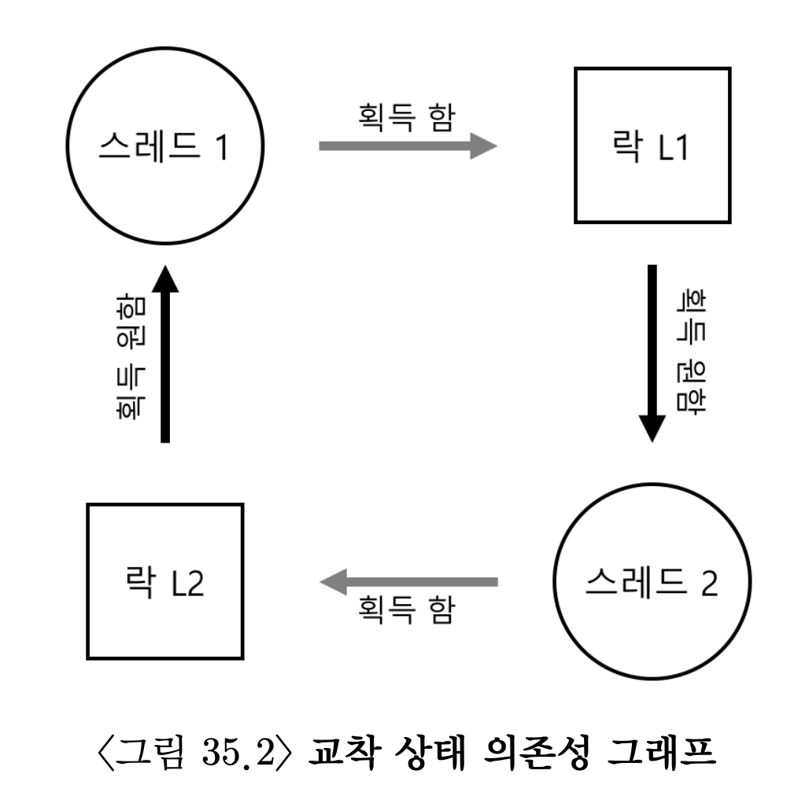
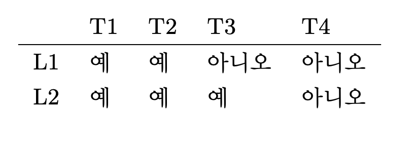

# 컨디션 변수 
> Lock만으로는 병행 프로그램을 제대로 작성할 수 없다.

쓰레드가 계속 진행하기 전에 어떤 "조건"이 참인지 검사해야하는 경우가 있다. 예를 들면 부모 쓰레드가 작업을 시작하기 전에 자식 쓰레드가 작업이 끝났는지 확인을 해봐야하는 경우가 있다.
```c
void *child(void *arg){
    printf("child\n");
    // 작업이 끝났음을 알려주어야한다.
    return NULL;
}

int main(int argc, char* argv[]){
    printf("parent: begin\n");
    pthread_t c;
    pthread_create(&c, NULL, child)
    printf("parent: end\n");
    return 0;
}
```
위의 예제를 사용하여 부모시작 -> 자식종료 -> 부모종료 순서대로 작동하게 해야한다.
공유 변수를 사용하여 검사할 수도 있지만 이 방법을 사용하면 부모 쓰레드가 공회전을 하면서 cpu 시간을 낭비하기 때문에 비효율적이다. 공회전하는 방법 대신 부모 쓰레드가 특정 조건이 참이 될 때까지 잠자면서 기다를 것이 효율적이다.

## 정의와 루틴
조건이 참이 될 때 까지 기다리기 위해 **컨디션 변수(condition variable)** 를 활용할 수 있다. 컵디션 변수는 Queue의 형태를 가지며 특정 조건을 기다리면서 쓰레드가 대기할 수 있다. 다른 쓰레드가 상태를 변경 시키면 대기중인 쓰레드를깨우고 계솔 진행할 수 있도록 한다. 
```c
pthread_cond_wait(pthread_cond_t *c, pthread_mutex_t *m);
pthread_cond_signal(pthread_cont_t *c);
```
- wait()는 쓰레드가 스스로를 잠재우기 위해서 호출 
  - wait() 함수는 mutex를 매개변수로 사용한다. 이는 wait가 호출될 때 mutex는 잠겨있었다고 가정한다. 
  - wait는 락을 해제하고 호출한 쓰레드를 재운다.
  - **다른 쓰레드가 시그널을 보내 깨어날 때 락을 재획득 해야한다.**
    - 조건이 만족되어 잠에서 깨어났더라도 락을 획득 못하면 다시 sleep 상태로 들어간다.
    - 이는 쓰레드가 스스로를 재울 때 경쟁 조건의 발생을 방지하기 위한 기능이다.
- signal()은 쓰레드가 특정 조건을 만족시켜 해당 조건을 기다리고 있는 쓰레드를 깨울 때 호출
### join 
```c
int done = 0;
pthread_mutex_t m = PTHREAD_MUTEX_INITIALIZER;
pthread_cond_t c = PTHREAD_COND_INITIALIZER;

void thr_exit() {
    pthread_mutex_lock(&m);
    done = 1; 
    pthread_cond_signal(&c);
    pthread_mutex_unlock(&m);
}

void *child(void *arg){
    printf("child\n");
    thre_exit();
    return NULL;
}

void thr_join() {
    pthread_mutex_lock(&m);
    while(done == 0)
        pthread_cond_wait(&c, &m)'
    pthread_mutex_unlock(&m);
}

int main(int argc, char *argv[]){
    printf("parent: begin\n");
    pthread_t p;
    pthread_create(&p, NULL, child, NULL);
    thr_join();
    printf("parent: end\n");
    return 0;
}
```
1. 부모 쓰레드가 자식 쓰레드를 생성하고 계속 실행하여 thr_join()을 호출하고 자식 쓰레드가 끝나기를 기다리는 경우
- 부모 쓰레드가 락을 획득하고 자식이 끝났는지를 검사한 후에 자식이 끝나지 않았기 때문에 wait()을 호출하여 스스로를 잠재운다.
- 자식 쓰레드가 나중에 실행된 후 thr_exit()를 호출하여 부모 쓰레드를 깨운다. 
- 해당 코드는 락을 획득한 후에 상태 변수를 done으로 설정하고 부모 쓰레드에 시그널을 보내 깨어나도록 한다.
- wait()에서 락을 획득한 채로 리턴하여 부모 쓰레드가 실행되고 락을 해제하고 나머지 부분이 실행된다.
2. 자식 쓰레드가 생성되면서 즉시 실행되고 done 변수를 1로 설정하고 자고 있는 쓰레드를 깨우기 위해 시그널을 보내는 경우
- 자고있는 쓰레드가 없기 때문에 단순히 리턴한다.
- 부모 쓰레드가 실행되고 thr_join()을 호출하고 done 변수가 1인 것을 알게됨
- done이 1이므로 대기 없이 리턴
  
이번에도 마찬가지로 부모 쓰레드가 조건을 검사할 때 if가 아닌 while을 사용해야한다. 

#### 의문: done 상태 변수가 꼭 필요할까?
```c
void thr_exti(){
    pthread_mutex_lock(&m);
    pthread_cond_signal(&c);
    pthread_mutex_unlock(&m);
}

void thr_join(){
    pthread_mutex_lock(&m);
    pthread_cond_wait(&c, &m);
    pthread_mutex_unlock(&m);
}
```
done 변수가 없이 실행하게 되면 자식 쓰레드가 생성된 즉시 실행되어서 thr_exit()를 호출 하는 경우가 발생될 수 있다.
이러한 경우네 자식 프로세스가 시그널을 보내도 깨워야할 쓰레드가 없기 때문에 부모쓰레드가 실행되면 wait()를 호출하고 멈처있겓괸다.
그렇기 때문에 done이라는 상태변수가 필요하다.

#### 의문: 시그널을 주거나 대기할 때 락을 획득해야할까?
```c
void thr_exit(){
    done = 1; 
    pthread_cond_signal(&m);
}

void thr_join(){
    if(done == 0)
        pthread_cond_wait(&c);
}
```
위의 코드를 사용하게 되면 경쟁 조건이 발생하게 된다. 부모 쓰레드가 thr_join()을 호출하고 나서 done 변수의 값이 0인 것을 확인 한 후에 잠을 자야하는 경우를 생각해보자. 
wait()를 호출하기 직전에 부모 쓰레드가 인터럽트에 걸려서 자식 쓰레드가 실행이 되었다면 자식 쓰레드는 상태 변수 done의 값을 1로 변경하고 시그널을 보내게 된다.
대기중인 쓰레드는 물론 없기 때문에 잠든 부모를 깨울 수 없다.

## 생산자/소비자 (유한 버퍼) 문제 
역시나 다익스트라가 제시한 생산자/소비자 문제를 살펴보자. 유한 버퍼라고라도 불린다.
생산자와 소비자가 있고 생산자는 유한 버퍼에 내용을 생산하고 소비자는 버퍼에서 내용을 꺼내 쓴다. 
메시지 큐잉 방식인 것 같다. 다익스트라 그는 도덕책... 
```c
int buffer;
int count = 0;

void put(int value){
    assert(count == 0);
    count = 1;
    buffer = value;
}

int get(){
    assert(count == 1);
    count = 0;
    return buffer;
}
```
put()은 버퍼가 비어있다고 가정하고 값을 공유 버퍼에 넣은후 count를 1로 설정하여 가득 찼다고 표시한다. 
get() 루틴은 그 반대로 동작한다. 버퍼가 찼는지 확인하고 값을 꺼낸 후 버퍼가 비어있다고 설정하고 읽은 값을 리턴한다.

put과 get 다음으로 버퍼에 데이터를 넣거나 꺼내도 괜찮은지 판단할 수 있어야한다. 버퍼의 count를 사용하여 체크할 수 있다. 
생산자와 소비자는 각각의 쓰레드를 가진다. 

### 불완전한 해답
생산자와 소비자가 각 하나씩 있을 때 put과 get 루틴은 임계 영역이 있다. 코드에 락을 추가할 뿐만 아니라 컨디션 변수를 추가하여 사용해야한다.
#### 생산자/소비자 단일 컨디션 변수
```c
cont_t c;
mutex_t m;

void *producer(void *arg){
    int i;
    for(i = 0;i < loops; i++){
        pthread_mutex_lock(&m);
        if(count == 1)
            pthread_cond_wait(&c, &m);
        put(i);
        pthread_cond_signal(&c);
        pthread_mutex_unlock(&m);s
    }
}
s
void *consumer(void *arg){
    int i;
    for(i = 0; i < loops; i++){
        pthread_mutex_lock(&m);
        if(count == 0)
            pthread_cond_wait(&c, &m);
        int tmp = get();
        phtread_cond_signal(&c);
        phtread_mutex_unlock(&m);
        printf("%d\n", tmp);
    }
}
```
생산자와 소비자에서 생산자는 버퍼에 값을 넣을 수 있을 때까지 기다린다 소비자는 버퍼에 값이 있을 때까지 기다린다.
위의 코드는 생산자와 소비자가 각 하나씩인 경우에는 동작하지만 두개 이상의 생산자 또는 소비자가 있다면 문제가 생긴다.


문제: 위의 그림처럼 중간에 의도치 않는 소비자가 자원을 가로챌 수 있다.

while문을 사용하여 문제를 쉽게 해결할 수 있다.

### 단일 버퍼 생산자/소비자 해법
컨디션 변수화 버퍼 공간을 추가하여 해결 할 수 잇다. 대기 상태에 들어가기 전에 여러 값이 생산될 수 있다면 쓰레드 간의 문맥 교환이 줄어들기 때문에 효율적이된다. 

```c
int buffer[MAX];
int fill = 0;
int use = 0;
int count = 0;

void put(int valeu){
    buffer[fill] = value;
    fill = (fill + 1) % MAX;
    count++;
}

int get(){
    int tmp = buffer[use];
    use = (use+1) % MAX;
    count--;
    return tmp;
}
```
```c
cond_t empty, fill;
mutex_t mutex;

void *producer(void *arg){
    int i;
    for(i = 0; i < loops; i++){
        pthread_mutex_lock(&mutex);
        while(count == MAX
            pthread_cond_wait(&empty, &mutex);
        put(i);
        pthread_cond_signal(&fill);
        pthread_mutex_unlock(&mutex);
    }
}

void *consumer(void *arg){
    int i;
    for(i = 0; i < loops; i++){
        pthread_mutex_lock(&mutex);
        while(count == 0)
            pthread_cond_wait(&fill, &mutex);
        int tmp = get();
        pthread_cond_signal(&empty);
        pthread_mutex_unlock(&mutex);
        printf("%d\n", tmp);
    }
}
```
## 컨디션 변수 사용시 주의점
```c
int bytesLeft = MAX_HEAP_SIZE;

cond_t c;
mutex_t m;

void* allocate(int size){
    pthread_mutex_lock(&m);
    while(bytesLeft < size)
        pthread_cond_wait(&c, &*m);
    void* ptr = ...; // 힙에서 메모리 할당
    bytesLeft -= size;
    pthread_mutex_unlock(&m);
    return ptr; 
}

void free(void* ptr, int size){
    pthread_mutex_lock(&m);
    bytesLeft += size;
    pthread_cond_signal(&c);
    pthread_mutex_unlock(&m);
}
```
메모리 할당 코드를 호출하면 공간이 생일 때까지 기다려야한다. 반대로 쓰레드가 메모리 반납시 사용가능한 메모리 공간의 발생을 알리는 시그널을 생성할 수 있다.
여기서 문제 점은 어떤 쓰레드가 깨어나야할지 정해주어야 하는 것이다.

빈공간이 없을 때 allocate() 함수를 호출하면 호출한 쓰레드는 대기 상태에 들어가야한다. 이때 할당 요청을 한 쓰레드 중에서 하나의 요청에만 만족하는 만큼 메모리가 헤제 된다면 어떤 쓰레드를 깨워야하는지 알려줘야한다.
그래서 천재들은 pthread_cond_signal대신 pthread_cond_broadcast() 함수를 사용하기로 했다. 
그렇게 되면 깨어나야할 쓰레드가 깨어날 수 있도록 한다. 

단점: 대기 중인 아직 깨어나면 안되는 여러 쓰레드가 불필요하게 깨어날 수 있다. 그러면 다시 재워야한다.
-> 이러한 경우를 포함 조건(covering condition)이라고 하는데 쓰레드가 깨어나야 하는 모든 경우를 다 포함해야 하기 때문이라고 한다.
이렇게 되면 문맥 전환 오버해드가 커지기 때문에 물론 성능에 안 좋다.

# 세마포어
병행성 문제를 최초로 인지한 아딕스트라 형님이 세마포어를 개발하셨다.

## 정의
세마포어는 정수 값을 갖는 개체로 두개의 루틴으로 조작할 수 있다.
1. sem_wait()
2. sem_post()

세마포어는 초기값에 의해 동작이 결정되기 때문에 사용하기 전에 값을 초기화 해야한다.
```c
#include<semaphore.h> // 헤더파일 처음 나온 듯
sem_t s;
sem_init(&s, 0, 1);
```
sem_init의 두번째 인자는 0이고 이 값은 같은 프로세스 내의 쓰레드간에서 세마포어를 공유한다는 것을 의미한다.
세번째 인자는 세마포어의 값을 의미하는데 여기서는 1로 초기화해주었다.
```c
int sem_wait(sem_t* s){
    세마포어의값--;
    if(세마포어의값 < 0) wait();
}

int sem_post(sme_t* s){
    세마포어의값++;
    if(기다리고 있는 쓰레드의 수 > 0) wake(some thread);
}
```
이 두 루틴은 다수의 쓰레드들에 의해 동시에 호출된다는 가정하에 진행된다.
그리고 임계 영역은 적절히 보호된다. 뒷골이 살짝 땡기기 시작한다는데 나는 말하는 감자.

### 핵심 성질
1. sem_wait()
   - 즉시 리턴 하거나 해당 세마포어 값이 1 이상이 될때까지 호출자를 대기
   - 다수의 쓰레드들이 호출할 수 있기 때문에 대기 큐에는 다수의 쓰래드가 존재할 수 있다. 
   - 대기하는 방법은 회전과 재우기 두가지가 있다는 것을 명심하자
2. sem_post()
    - 대기하지 않는다.
    - 세마포어의 값을 증가시키고 대기중인 쓰레드 중 하나를 깨운다.
3. 세마포어가 음수라면 그 값은 현재 대기중이 ㄴ쓰레드의 개수와 같다.
> sem_wait()와 sem_post()는 원자적으로 실행된다. 

## 이진 세마포어
세마포어를 락에 적용해보자.
```c
sem_t m;
sem_init(&m, 0, 1);
sem_wait(&m);
// 임계 영역
sem_post(&m);
```
### 설명
쓰레드가 두개인 경우를 가정해보자. 첫 쓰레드가 wait을 호출한다. 그러면 세마포어의 값을 1 감소시켜 0으로 만든 후 리턴한다. 
처음 호출한 쓰레드는 임계영역에 진입하고 임계영역 내에 있을 때 다른 쓰레드가 락을 획득하려 하지 않는다면 이 쓰레드가 post를 불러 다시 세마포어의 값을 1로만든다.

### 좀 더 흥미로운 상황
- 처음 쓰레드가 락을 보유하고 있을 때 다른 쓰레드가 wait을 호출하여 임계영역에 진입을 시도하는 경우(와 흥미로워라)
이 경우 두번 째 쓰레드가 세마포어 값을 -1로 감소 시키고 대기에 들어간다. 첫번째 스레드가 다시 실행되면 post를 호출하고 세마포어의 값을 0으로 증가 시킨 후 잠자는 두번째 쓰레드를 깨운다.
그러면 두번째 스레드가 락을 획득할 수 있게된다. 두번 째 쓰레드도 post를 호출하여 세마포어의 값을 다시 1로 만든다.

이렇게 사용하면 세마포어를 락으로 쓸 수 있다. 락은 두개의 상태(사용가능, 사용중)을 가지므로 이진 세마포어라고 불린다.

### 컨디션 변수로서의 세마포어
일단 코드 먼저 보자
```c
sem_t s;

void* child(void *arg){
    printf("child\n");
    sme_post(&s);
    return NULL;
}

int main(int argc, char *argv[]){
    sem_init(&s, 0, 0);
    printf("parent: begin\n");
    pthread_t c;
    pthread_create(c, NULL, child, NULL);
    sem_wait(&s);
    printf("parent: end\n");
    return 0;
}
```
대기 중이 ㄴ쓰레드가 어던 조건이 만족 되기를 대기하는 상황에서도 세마포어를 사용할 수 있다.
위의 코드에서 부모 쓰레드가 자식 쓰레드의 종료를 기다를 상황을 세마포어를 사용해 유도할 수 있다.

세마포어의 초기값을 0으로 정하면 조건 변수로써 사용할 수 있다. 자식 프로세스가 생성후 실행하지 않은 경우에 sem_post()를 호출하기 전에 부모가 먼저 sem_wait()에 도달하게 된다.
그럼 부모 프로세스는 자식이 실행될때까지 대기해야한다. 이를 위해서 wait() 호출 전에 세마포어 값이 0보다 같거나 작아야한다.
자식이 먼저 실행되어 post를 호출해야 부모 프로세스가 실행될 수 있다.

자식의 post가 먼저 실행되면 뭐 순탄하게 실행되고 지나간다.

## 생산자/소피자 문제
### 첫번째 시도
    그냥 답 먼저 알려주고 왜 그 답이 나왔는지 알려주면 좋겠다.  
    그럼 그냥 책 한번 더 보면 해결된다.
empty와 full 두개의 세마포어를 사용한다. 이름에서 알 수 있듯이 버퍼가 비었는지 찼는지 확인한다.
```c
int buffer[MAX];
int fill = 0;
int use = 0;

void put(int value){
    buffer[fill] = value;
    fill = (fill + 1) % MAX;
}

int get() {
    int tmp = buffer[use];
    use = (use + 1) % MAX;
    return tmp;
}
```
```c
sem_t empty;
sem_t full;

void *producer(void* arg){
    int i; 
    for(i = 0; i < loops; i++){
        sem_wait(&empty);
        put(i);
        sem_post(&full);
    }
}

void *consumer(void *arg){
    int i, tmp = 0;
    while(tmp != -1){
        sem_wait(&full);
        tmp = get();
        sem_post(&empty);
        pritnf("%d\n", tmp);
    }
}

int main(int argc, char *argv[]){
    // ...
    sem_init(&empty, 0, MAX);
    sem_init(&full, 0, 0);
    /...
}
```
full은 0으로 초기화 되어있기 때문에 wait를 호출하면 -1로 감소하여 소비자는 대기한다. 다른 쓰레드가 post를 호출하여 full이 증가하는 것을 기다려야한다.
empty는 MAX로 초기화 되어 있기 때문에 empty가 0이 되어 버퍼의 빈공간 이 없게 되고 다른 소비자가 반환해주기를 기다려야한다.

하지만 문제가 할생할 수 있다.
생산자가 계속 실행한다면 반복문을 돌아서 wait를 다시 실행하게 된다. empty 세마포어의 값이 0이면 대기 상태로 들어간다. 

생산자와 소비자 쓰레드가 여러개 있다면 경쟁 조건이 발생한다. 
두 쓰레드가 put을 동시에 호출한다면 먼저 실행된 쓰레드가 첫 공간에 값을 넣는다. 첫번째 쓰레드가 fill 값을 1로 변경하기 전에 인터럽트가 걸린 후 
두번째 쓰레드가 버퍼의 첫번째 공간에 값을 삽입하는 경우가 발생할 수 있다. 그렇게 되면 첫번째 쓰레드가 기록한 값이 새로운 값으로 대체되게 되므로 문제가 생긴다.

#### 답: 상호 배체의 추가
바로 위의 코드에서는 상호 배제를 고려하지 않았다.
```c
sem_t empty;
sem_t full;
sem_t mutex;

void *producer(void *arg){
    int i;
    for(i = 0; i < loops; i++){
        sem_wait(&mutex);
        sem_wait(&empty);
        put(i);
        sem_post(&full);
        sem_post(&mutex);
    }
}

void *consumer(void *arg){
    int i;
    for(i = 0; i < loops; i++){
        sem_wait(&mutex);
        sem_wait(&full);
        int tmp = get();
        sem_post(&empty);
        sem_post(&mutex);
        printf("%d\n", tmp);
    }ß
}

int main(int argc, char *argv[]){
    // ...
    sem_init(&empty, 0, MAX);
    sem_init(&full, 0, 0);
    sem_init(&mutex, 0 ,1);
}
```
### Reader-Writer 락
융통성있는 락기법. 데이터를 생성/수정하는 기능과 데이터를 읽는 기능이 동시에 작동될 때 생성/수정은 전통적인 임계영역 보호 방식으로 보호할 수 있고 읽기는 생성/수정 연산이 없다는 보장이 있다면 다수의 검색 작업을 동시에 수행할 수 있다. 이를 위해서 reader-writer 락이 만들어졌다.

```c
typedef struct _rwlock_t {
    sem_t lock;
    sem_t writelock;
    int readers
} rwlock_t;

void rwlock_init(wrlock_t *rw){
    rw-> readers = 0;
    sem_init(&rw->lock, 0, 1);
    sem_init(&rw->writelock, 0, 1);
}

void rwlock_acquire_readlock(rwlock_t *rw){
    sem_wait(&rw->lock);
    rw->readers++;
    if(rw->readers == 1)
        sem_wait(&rw->writelock);
    sem_post(&rw->lock);
}

void rwlock_release_readlock(rwlock_t *rw){
    sem_wait(&rw->lock);
    if(rw->readers == 0)
        sem_post(&rw->writelock);
    sem_post(&rw->lock);
}

void rwlock_acquire_writelock(rwlock_t *rw){
    sem_wait(&rw->writelock);
}

void rwlock_release_writelock(rwlock_t *rw){
    sem_post(&rw->writelock);
}
```
위의 코드를 보면 자료구조를 업데이트 할 때 새로운 동기화 연산 쌍을 사용한다. 락 획득을 위해서는 rwlock_acquire_writedlock()을 사용하고 해제하기 위해서 rwlock_release_writelock()을 사용한다.

#### 일기락 획득과 해제
읽기 쓰레드가 락을 획득 -> 읽기 중인 쓰레드의 수를 표현하는 reader 변수 증가

읽기 락을 획득시 writelock 세마포어에 sem_wait()를 호츨하여 쓰기락을 함께 획득한다. 획득한 쓰기 락은 읽기 락을 헤제할 때 sem_post()로 다시 해제한다. -> 쓰기 락을 함께 획득하기 때문에 "두번읽기" 가능(내 생각)

위 과정을 통해서 읽기락을 획득하고 다른 읽기 쓰레드들이 읽기 락을 획득할 수 있도록 한다. 다른 쓰레드가 쓰기락을 획득하려면 모든 읽기가 끝날 때까지 기다려야한다.

- 단점
  - 공정석 문제 -> 읽기 쓰레드가 굶주릴 수 있음
    - 쓰기 쓰레드가 대기 중일 때는 읽기 쓰레드가 락을 획득하지 못하도록 하면 해결 가능
  - 오버헤드가 크다.

### 식사하는 철학자
역시나 다익스트라 형이 제시하셨다. 재미있고 흥미를 유발하는 문제라고 한다. 이 문제를 통과해서 직업을 구했다면 운영체제 교수님에게 스톡옵션을 보내야한다. 명절도 아닌데 취업 잔소리를 들은 것 같다. 

철학자들은 원형 테이블에 앉아있고 왼쪽과 오른쪽에 있는 포크를 사용하여 밥을 먹어야한다. 하지만 철학자들은 굶주려 있기 때문에 양보따윈 없어 경쟁이 발생한다. 각 포크에 락을 사용하고 포크에 락이 해제될 때까지 기다린다면 모든 철학자가 왼쪽의 포크를 잡는 순간 모두가 오른쪽 포크를 기다리다 굶어 죽는 상황이 발생한다. 

철학자들이 오른쪽 포크를 기다리다 굶어 죽는 것을 마긱 위해서 가장 높은 순번의 다른 순서로 포크를 집도록 하면된다. 짬찌는 마지막에 먹어랏.

```c
void getforks(){
    if(p == 4) {
        sem_wait(forks[right(p)]);
        sme_wait(forks[left(p)]);
    } else {
        sem_wait(forks[left(p)]);
        sem_wait(forks[right(p)]);
    }
}
```
마지막 철학자는 오른쪽의 포크를 먼저 잡기 때문에 각 철학자가 굶어 죽는 상황은 발생하지 않는다. 

## 세마포어 구현
제마포어(zemaphore)를 구현해보자. 와 너무 기대된다.
```c
typedef struct__Zem_t {
    int value;
    pthread_cond_t cond;
    pthread_mutex_t lock;
} Zem_t;

void Zem_init(Zem_t *s, int value){
    s->value = value;
    Cond_init(&s->cond);
    Mutex_init(&s->lock);
}

void Zem_wait(Zem_t *s){
    Mutex_lock(&s->lock);
    while(s->value <= 0)
        Cond_wait(&s->cond, &s->lock);
    s->value--;
    Mutex_unlock(&s->lock);
}

void Zem_post(Zem_t *s){
    Mutex_lock(&s->lock);
    s->value++;
    Cond_signal(&s->cond);
    Mutex_unlock(&s->lock);
}
```

# 병행성 관련 오류
## 병행성 오류의 종류
병행성의 오류는 교착상태보다 비교착상태인 오류가 더 많다.
### 원자성 위반 오류(atomic violation)
```c
Thread1::
    if(thd->proc_info) {
        ...
        fputs(thd->proc_info, ...);
        ...
    }

Thread2::
thd->proc_info = NULL
```
스레드1인 값이 null인지 확인하고 스레드2는 Null 값으로 설정해준다. 쓰레드1이 검사를 완료한 후와 fputs 호출 전에 인터럽트가 발생해서 쓰레드2로 넘어가게 되면 fputs함수는 null 포인터를 참조하게 된다.

이 문제를 막기 위해서 락 변수를 사용해서 다른 스레드가 임계영역에 접근할 수 없도록 해야한다.

```c
pthread_mutex_t proc_info_lock = PTHREAD_MUTEX_INITIALIZER;


Thread 1::
pthread_mutex_lock(&proc_info_lock);
if(thd->proc_info){
    ...
    fputs(thd->proc_info, ...);
    ...
}
pthread_mutex_unlock(&proc_info_lock);

Thread 2::
pthraed_mutex_lock(&proc_info_lock);
thd->proc_info = NULL:
pthread_mutex_lock(&proc_info_lock);
```
### 순서 위반(order violation)
```c
Thread 1::
void init() {
    ...
    mThread PR_CreateThread(mMain, ...);
    ...
}

Thread 2::
void mMain(...) {
    ...
    mState = mThread->State;
    ...
}
```
쓰레드2의 코드는 mThread 변수가 이미 초기화 되었다는 가정에 실행된다. 스레드1이 먼저 실행되지 않는다면 스레드2는 null 포인터를 사용하기 때문에 런타임 에러가 발생하게 된다. 

위 문제를 해결하기 위해서 **컨디션 변수** 를 사용해야한다.
```c
pthread_mutex_t mtLock = PTHREAD_MUTEX_INITIALIZER;
pthread_cond_t mtCond = PTHREAD_COND_INITIALIZER;
int mtInit = 0;

Thread 1::
void init() {
    ...
    mThread = PR_CreateThread(mMain, ...);

    pthread_mutex_lock(&mtLock);
    mtInit = 1;
    pthread_cond_signal(&mtCond);
    pthread_mutex_unlock(&mtLock); 
    ...
}

Thread 2::
void mMain(...) {
    ...
    pthread_mutex_lock(&mtLock);
    while(mtInit == 0)
        pthread_cond_wait(&mtCond, &mtLock);
    pthread_mutex_unlock(&mtLock);

    mState = mThraed->State;
    ...
}
```
초기화가 실행되면 mtInit을 1로 설정하고 초기화를 완료했다는 시그널을 생성한다. 쓰레드2가 초기화 전에 실행된다면 상태가 변경되기를 기다려야한다. 이처럼 쓰레드의 순서가 문제가 된다면 컨디션 변수를 사용해서 해결할 수 있다.

### 교착 상태 오류
서로의 락이 해제되기를 기다리는 경우를 교착상태라고 한다. 
#### 교착 상태가 발생하는 이유

위 그림 처럼 원형의 의존관계를 갖게되면 교착상태에 빠질 수 있다.
#### 교착상태 발생 조건
1. 상호배제(Mutual Exclusion): 쓰레드가 자신이 필요로하는 자원에 대한 독자적인 제어권 주장
2. 점유 및 대기(Hold-and-wait): 쓰레드가 자신에게 할당된 자원을 점유한채로 다른 자원을 태기
3. 비선점(No preemption): 자원을 점유하고 있는 쓰레드로부터 자원을 강제적으로 뺏을 수 없다.
4. 환형 대기(Circular wait): 각 쓰레드는 다음 쓰레드가 요청한 하나 또는 그 이상의 자원을 갖고 있는 쓰레드들의 순환고리가 있다.

#### 교착상태 예방
1. 순환 대기 (Circular Wait)
순환대기가 발생하지 않도록 락 코드를 작성하면 교착상태를 예방할 수 있다. 간단한 방법으로 **전체 순서(total ordering)** 을 정하는 것이다. 락의 순서를 미리 정해 놓으면 원형의 형태를 예방 할 수 있다.

전체 순서를 정의하기 어렵다면 **부분 순서** 만 설정해줘도 된다.

2. 점유 및 대기(Hold-and-Wait)
점유 및 대기 상황을 예방하기 위해서는 필요한 모든 락을 원자적으로 얻을 수 있게 설정하면 예방할 수 있다.
```c
lock(prevention);
lock(L1);
lock(L2);
unlock(prevention);
```
prevention 락을 획득함으로써 L1 과 L2 락을 획득하는 부분을 임계영역 취급하여 보호해주면 원자적으로 락을 얻을 수 있다.

3. 비선점(No Preemption)
trylock을 사용하여 락을 획득 가능하다면 획득하거나 다른 곳에서 점유한 상태이면 나중에 다시 시도하게 유도할 수 있다. 
```c
top:
    lock(L1);
    if(trylock(L2) == -1){
        unlock(L1);
        goto top;
    }
```
위 코드를 사용하면 교착상태는 발생하지 않지만 무한반복할 경우가 생긴다. 

4. 상호 배체(Mutual Exclusion)
상호 배제를 없애줌으로써 교착상태를 예방할 수 있다. 하지만 대부분의 코드는 임계영역을 포함하고 있기 때문에 어렵다.

- 대기없는(wait-free) 자료구조(Herlihy가 고안)
  - 명시적 락이 필요없는 하드웨어 명령어를 사용해서 자료구조를 만든다.
- 쉬운 예제
```c 
void AtomicIncrement(int *value, int amount){
    do{
        int old = *value;
    } while(ComapreAndSwap(value, old, old+amount) == 0);
}
```
compareAndSwap을 사용하여 원자적으로 값을 증가시키는 함수를 생성할 수 있다. 락을 획득하여 사용하는 방식 대신에 값에 새로운 값을 갱신하도록한다. 락 없이 사용할 수 잇지만 무한 반복할 가능성이 있다.

- 리스트 삽입
```c
void insert(int value){
    node_t *n = malloc(sizeof(note_t));
    assert(n != NULL);
    n->value = value;
    n->next = head;
    head = n;
}
```
위 삽입 함수는 동시에 호출이되면 경쟁 조건이 발생하게 된다. 헤드를 교환하는 과정에서 머리가 두개가 될 수 있다.

- 락을 사용한 리스트 삽입
```c
void insert(int value){
    note_t *n = malloc(sizeof(node_t));
    assert(n != NULL);
    n->value = value;
    lock(listlock);
    n->next = head;
    head = n;
    unlock(listlock);
}
```
- 상호배제된 리스트 삽입
```c
void insert(int value){
    node_t *n = malloc(sizeof(node_t));
    assert(n != NULL);
    n->value = value;
    do {
        n->next = head;
    } while(CompareAndSwap(&head, n->next, n) == 0);
}
```

5. 스케줄링으로 교착상태 회피
교착상태를 예방하는 대신 회피할 수도 있다. 즐길 수 없으면 피해라. 



똑똑한 스케줄러를 사용해서 T1과 T2가 동시에 실행되지 않게 해주는 방법도 있다. 하지만 동일한 락을 사용하는 스레드가 많아질 경우 한 곳에 일이 집중될 수 있다.

6. 발견 및 복구
교착 상태 발생을 허용하고 교착 상태를 발견한 경우 복구하도록 만들어 줄 수 있다. 피할 수 없으면 즐겨라. 

많은 데이터베이스 시스템에서 교착 상태를 발견하고 회복하는 기술을 사용한다. 교착 상태 발견은 주기적으로 실행되고 자우너 할당 그래프를 그려서 사이클이 생겼는지 검사한다. 교착상태가 발생하는 경우 시스템은 재부팅해야한다. 

# 이벤트 기반의 병행성
이벤드 기반 병행성은 두가지의 문제를 가지고 있다.
1. 멀티 스레드 프로그램에서 이벤트 기반 병행성을 올바르게 사용하기 어려움
2. 멀티 스레드 프로그램에서는 개발자가 쓰레드 스케줄링에 대한 제어권을 가지고 있지 않다.
## 이벤트 루프란
```c
while(1){
    event = getEvents();
    for(e in evnets)
        processEvent(e);
}
```
루프 내에서 계속 이벤트를 수신하고 있고 이벤트가 발생하면 하나씩 처리한다. 이를 이벤트 핸들러(event handler)라고 한다. 하지만 위의 코드는 이벤트가 어떤 이벤트인지 알 수없다.
## select(), poll()
select()나 poll()을 사용해서 이벤트를 수신할 수 있다. 
```c
int select (int nfds,
            fd_set *restrict readfiles,
            fd_set *restrict writefds,
            fd_set *restrict errorfds,
            struct timeval *restrict timeout);
```
- 유의사항 
  - select()를 이용하면 디스크립터에 대한 읽기 가능 여부, 쓰기 가능 여부를 검사할  수 있다.
    - 읽기 가능 여부는 처리해야할 패킷의 도착여부를 파악할 수 있어야한다.
    - 쓰기 가능 여부는 서비스가 응답전송이 가능한 시점을 파악해야한다.
  - timeout 인자 존재
    - 일반적으로는 NULL로 설정하여 무기한 대기하지만 시간초과를 설정해줄 수있다.
    - 보통 0으로 설정해서 즉시 리턴하도록 한다 -> 왜지?

## select() 사용
```c
int main(void) {
    while() {
        fd_set readFDs;
        FD_ZERO(&readFDs); // 초기화

        int fd;
        for(fd = minFD; fd < maxFD; fd++)
            FD_SET(fd, &readFDs);

        int rc = select(maxFD+, &readFDs, NULL, NULL, NULL); // 데이터가 도착한 소켓 있는지 검사

        int fd;
        for(fd = minFD; fd < maxFD; fd++)
            if(FD_ISSET(fd, &readFDs)) // 이벤트 서버는 어떤 디스크립터가 있는지 확인, 도착하는 데이터 처리
                processFD(fd);
    }
}
```

## 락이 필요없다.
단일 CPU를 사용하는 이벤트 기반 프로그램에서는 병행 프로그램을 다룰 때 나타난 문제가 없다. 매 순간 단 하나의 이벤트만을 다루기 때문에 락을 획득하거나 해제할 필요가 없다. 이벤트 기반의 서버는 단 하나의 쓰레드만 갖고 있기 때문에 다른 쓰레드에 의해서 인터럽트에 걸릴 수 없다.

## Blocking System Call 문제
차단 될 수도 있는 시스템 콜을 불러야 하는 경우에 문제가 생긴다. 이벤트 기반의 시스템에서는 여러 쓰레드가 있는 것이 아니기 때문에 문맥교환이 발생하지 않는다. 그렇기 때문에 만약 파일I/O가 발생한다면 다음 작업은 파일 인아웃이 끝날 때 까지 기다려야해서 자원 낭비가 발생한다.

## Blocking System Call 해결 - 비동기 I/O
I/O 명령어가 들어오면 즉시 리턴하여 프로그램은 하던 일을 계속 진행하기 할 수 있다. I/O가 종료되면 확인하는 api를 사용하여 종료 여부를 확인할 수 있다. 이 방법을 사용하게 되면 귀찮다. 그래서 인터럽트 기반의 접근 법을 사용할 수 있다. 유닉스의 시그널을 사용하여 완료되었다는 것을 응용 프로그램에 알려준다. 그래서 귀찮게 여러번 확인하지 않아도 된다. 

## 상태관리 문제
이벤트 기반 접근법은 쓰레드 기반 코드보다 작성하기 어렵다는 단점이 있다. 이벤트 핸들러가 비동기 i/o를 발생 시킬때 i/o 작업 완료후에 사용할 프로그램 상태를 정리해 놓아야한다. 쓰레드 기반 프로그램에서는 스택에 이미 정보들을 가지고 있어서 이러한 고민을 할 필요없다. 수동 스택 관리(mannual stack management) 기법을 사용해서 다음 작업을 정리해주어야한다. 이 작업이 이벤트 기반 프로그래밍의 기본이다. 

i/o가 종료되면 이벤트 기반 서버는 다음으로 무엇을 해야하는지를 알아야한다. continuation 기법을 사용하여 이벤트를 종료할 때 필요한 정보들을 한곳에 저장해둔 다음 i/o가 완료되면 저장해 놓은 정보를 활용해서 이벤트를 처리한다. 

### 이벤트 사용의 어려움
1. 멀티 CPU를 사용하면 병렬성으로 인한 동기화 문제가 발생하여 락없는 이벤트 처리 방식은 사용할 수 없다.
2. 페이징 같은 특정 시스템에 적절하지 않다. 페디지 폴트가 발생하면 해결할 수 없다.
3. 루틴의 작동 방식이 변화하기 때문에 관리가 어렵다. 