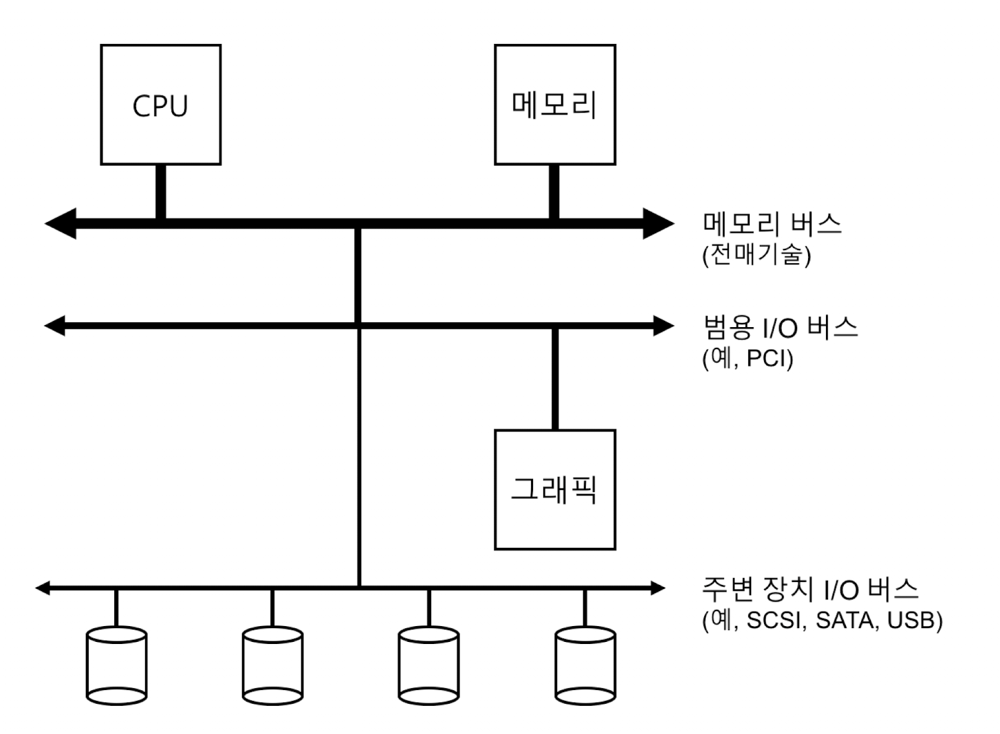

# 영속성

# I/O 장치

## 시스템 구조

CPU와 메인 메모리가 메모리 버스로 연결 

그래픽이나 고성능 I/O 등 범용 I/O 버스 연결 

주변 장치용 버스

### 계층적인 구조를 가지는 이유?

→ 고속의 메모리 버스를 수용할 공간 부족, 고속 성능 버스 기술의 비용 비쌈

고성능 장치는 CPU에 가깝게 배치 

느린 성능의 장치는 멀리 배치

## 표준 장치

1. 하드웨어 인터페이스 - 시스템 소프트웨어가 동작을 제어할 수 있도록 함
2. 내부 구조 - 시스템에게 제공하는 장치에 대한 추상화를 정의

## 표준 방식

3개의 레지스터

1. 상태 레지스터 - 장치의 현재 상태
2. 명령어 레지스터 - 특정 동작을 수행하도록 요청할 때 
3. 데이터 레지스터 - 데이터를 보내거나 받거나 할 때 사용

장치가 운영체제를 대신하여 특정 동작을 할 때 상호 동작의 과정

1. 폴링 - 반복적으로 상태 레지스터 확인
2. 운영체제가 데이터 레지스터에 데이터 전달 -(데이터 전송에 메인 CPU가 관여하는 경우 programmed I/O) 
3. 운영체제가 명령 레지스터에 명령어 기록
4. 운영체제는 디바이스가 처리를 완료했는지 확인

⇒ 비효율적인 폴링 사용, CPU 낭비

## 인터럽트를 이용한 CPU 오버헤드 개선

폴링 대신 운영체제가 입출력 작업을 요청한 프로세스를 블록 시키고 CPU를 다른 프로세스에게 양도

장치가 작업을 마치면 하드웨어 인터럽트를 발생

CPU는 운영체제가 미리 정의해둔 인터럽트 서비스 루틴(or 인터럽트 핸들러)를 실행

인터럽트 핸들러는 입출력 요청의 완료, I/O 대기 중인 프로세스 깨우기 등을 담당, 깨어난 프로세스 작업을 계속할 수 있도록 함

### 인터럽트를 활용 → CPU 연산과 I/O 중첩

운영체제는 디스크의 응답을 기다리면서 다른 일을 할 수 있음 

### 1. 인터럽트가 항상 최적은 아님

⇒ 작업이 매우 빠른 장치인 경우 문맥 교환의 비용이 오히려 비쌈, 이때는 폴링이 최선임

### 하이브리드 방식

짧은 시간 동안만 폴링을 하다가 처리가 완료되지 않으면 인터럽트 사용

### 2. 네트워크 환경

대령으로 도착하는 패킷이 있는 경우 각 패킷마다 인터럽트 발생

인터럽트만 처리하다 사용자 프로세스 요청을 처리할 수 없도록 만드는 **무한반복**에 빠질 수 있음

### 병합

인터럽트를 전달하기 전에 잠시 기다렸다가 인터럽트 발생 ⇒ 여러번 인터럽트 발생시키지 않고 한번만 전달, 인터럽트 처리의 오버 헤드를 줄일 수 있음

## DMA를 이용한 효율적인 데이터 이동

많은 양의 데이터를 디스크로 전달하기 위해 programmed I/O를 사용하면 CPU가 낭비

### 직접 메모리 접근 방식(Direct Memory Access, DMA)

데이터를 장치로 전송할 때, 운영 체제는 DMA 엔진에 메모리 상의 데이터 위치와 전송할 데이터 크기, 대상 장치를 프로그램함. 운영체제는 데이터를 전송하는 동안 다른 일 할 수 있음 DMA 동작이 끝나면 인터럽트 발생

## 디바이스와 상호작용하는 방법

### 1. I/O 명령을 명시적으로 사용

이 명령어들 대부분은 특권 명령어들로, 운영체제가 장치를 제어하는 역할을 함

### 2. memory mapped I/O

하드웨어는 장치의 레지스터들이 마치 메모리에 존재하는 것처럼 만듦

## 운영체제에 연결하기 : 디바이스 드라이버

서로 다른 인터페이스를 갖는 장치들과 운영체제를 연결시키는 방법

→ 추상화 : 디바이스 드라이버에 장치와의 상세한 상호작용이 캡슐화 되어있음

캡슐화 단점: 특수 기능이 있는 장치의 경우 커널이 범용적이 인터페이스만 제공하므로 특수 기능을 사용할 수 없음

 

# 파일과 디렉터리

## 영속 저장 장치

- 하드 디스크 드라이브
- 솔리드 스테이트 드라이브

## 파일과 디렉터리

### 파일

읽거나 쓸 수 있는 순차적인 바이트의 배열

아이노드 번호(저수준의 이름)를 가지고 있음

파일이름, 종류로 명시하는 것이 관용적 표현

### 디렉터리

아이노드 번호를 가짐 하지만 파일과 달리 디렉터리의 내용은 <사용자가 읽을 수 있는 이름, 저수준의 이름> 쌍으로 이루어진 목록을 가지고 있음

디렉터리 내에 다른 디렉터리를 포함해 디렉터리 트리를 구성할 수 있음

루트 디렉터리, 구분자를 사용해 하위 디렉터리 명시

## 파일 시스템 인터페이스

### 파일의 생성

open 시스템 콜을 사용하여 파일을 생성할 수 있음

O_CREAT - 파일 생성 

O_WRONLY - 파일이 열렸을 때 쓰기만 가능 

O_TRUNC - 파일이 이미 존재할 때는 파일의 크기를 0 바이트로 줄여 기존 내용 모두 삭제

open의 리턴값 ⇒ 파일 디스크립터: 프로세스마다 존재하는 정수, 유닉스 시스템에서 파일을 접근하는 데 사용됨, 해당 파일에 대한 권한이 있는 경우 파일을 읽고 쓰는 데 사용됨, 파일 객체를 가리키는 포인터

### 파일의 읽기와 쓰기

strace - 프로그램이 실행되는 동안에 호출된 모든 시스템 콜 추적, 결과를 화면에 보여줌

파일 열기가 성공하면 cat은 read() 시스템 콜을 사용하여 파일에서 몇 바이트씩 반복적으로 읽음

출력 이후 read가 0을 리턴하면 파일의 끝임을 알고 close를 호출하여 파일을 닫고 읽기 작업을 완료함

read 시스템 콜 인자

1. 파일 디스트립터 - 읽어야할 파일을 알 수 있게함
2. 결과를 저장할 버퍼 
3. 버퍼의 크기 

쓰기도 비슷한 단계를 거침

### 비순차적 읽기와 쓰기

lseek() 시스템 콜 인자

1. 파일 디스크립터
2. offset - 파일의 특정 위치
3. whence - 탐색 방식 결정

## fsync()를 이용한 즉시 기록

write - 해당 데이터를 가까운 미래에 영속 저장 장치에 기록해 달라고 요청

성능상의 이유로 버퍼링을 사용해 일정 간격으로 쓰기 요청을 전달

이 때, 데이터가 유실되는 경우 발생

fsync(int fd)를 호출

지정된 파일의 모든 더티 데이터 디스크로 강제로 내려 보냄 

모든 쓰기 처리되면 fsync 루틴은 리턴됨

## 파일 이름 변경

rename 인자

1. 원래 이름
2. 새로운 이름

시스템 크래시에 대해 원자적으로 구현됨

## 파일 정보 추출

### 메타 데이터

파일에 대한 정보

stat, fstat 시스템 콜을 사용해 볼 수 있음

일반적으로 파일 시스템은 아이노드에 메타데이터 보관

## 파일 삭제

unlink - 지워야 하는 파일 이름 인자로 받은 후에 성공하면 0 리턴

## 디렉터리 생성

디렉터리는 파일 시스템의 메타데이터로 분류되며, 간접적으로만 변경됨

mkdir 

처음 디렉터리 생성 2가지 항목 존재

1. 자신을 나타내기 위한 것
2. 부모 디렉터리 가리키기 위한 것

## 디렉터리 읽기

ls와 유사

파일 open과 다른 새로운 시스템 콜 사용

opendir(), readdir(), closedir() 사용

## 디렉터리 삭제하기

rmdir 시스템 콜을 사용해 디렉터리 삭제

파일 삭제와 다른 점은 하나의 명령으로 아주 많은 양의 데이터를 지울 수 있으므로 위험

## 하드링크

link - 파일 시스템 트리에 항목을 추가함

인자

1. 원래의 경로명
2. 새로운 경로명

파일 생성 시

1. 아이노드를 만듦 (파일 크기, 디스크 블럭 위치등)
2. 해당 파일에 읽을 수 있는 이름 연결, 연결 정보를 디렉터리에 생성

파일 삭제시 unlink, 아이노드 번호 참조횟수 검사하고 참조횟수를 하나 줄임.

참조 횟수가 0에 도달하면 아이노드 관련 데이터 블럭 해제하여 파일을 진짜로 삭제함

## 심볼릭 링크

또는 소프트 링크

하드링크에 비해 제한이 적음(하드링크는 디렉터리에 대해 만들 수 없고 다른 디스크 파티션에 있는 파일에 대해서도 만들 수 없음)

ln -s 

-s 플래그 사용해야 함

하드 링크와의 차이점

1. 심볼릭 링크는 다른 형식의 독립된 파일
2. dangling reference 문제 발생할 수 있음 - 원래의 파일을 삭제하면 심볼릭 링크가 가리키는 실제 파일 존재하지 않음

## 파일 시스템 생성과 마운트

여러 개 파일 시스템 파티션들이 모여서 하나의 큰 디렉터리 구성

각각의 파일 시스템을 생성하고 마운트함으로써 단일 디렉터리 구성

# 파일 시스템 구현

## vsfs(Very Simple File System)의 구현

유닉스 파일 시스템을 단순화한 것으로 디스크 자료구조와 접근 방법 그리고 다양한 파일 시스템들의 정책들을 소개하기 위해 제작됨

- 자료구조
- 접근방법

## 전체 구성

- 블럭들로 나누고 일정 부분을 데이터 영역으로 확보
- 아이노드들의 저장을 위한 아이노드 테이블
- 할당 구조 - 각 블럭이 사용중인지
    - 프리 리스트 - 링크드 리스트 형태로 관리
    - 비트맵
- 슈퍼 블럭 - 파일 시스템 전체에 대한 정보

## 파일 구성: 아이노드

아이노드는 인덱스 노드의 줄임말

메타 데이터 저장

데이터 블럭의 위치를 아이노드 내에 여러 개의 직접 포인터를 두어 표현함

## 멀티 레벨 인덱스

### 간접 포인터

데이터 블럭을 가리키는 포인터들이 저장

더 큰 파일을 저장하고 싶은 경우 이중 간접 포인터 추가, 더 큰 파일 삼중 간접 포인터 사용

⇒ 멀티 레벨 인덱스 기법: 디스크 블럭들이 트리형태로 구성되어 하나의 파일을 이

## 디렉터리 구조

항목의 이름, 아이노드 번호 쌍의 배열로 구성

- 가변 크기 레코드
- B-tree :검색 시간 단축, 파일 생성 빠르게

## 빈 공간 관리

아이노드를 할당해야함 

아이노드 비트 맵을 탐색하여 비어있는 아이노드를 찾아 파일에 할당

## 실행 흐름: 읽기와 쓰기

### 디스크에서 파일 읽기

open을 하면 파일 경로를 따라가서 해당 파일 아이노드를 찾음

read 시스템 콜으로 파일을 읽음

### 디스크에 쓰기

파일을 열고 write를 호출하여 새로운 내용으로 파일을 갱신하고 파일을 닫음

I/O 여러번 발생

## 캐싱과 버퍼링

성능 개선을 위해 자주 사용되는 블럭들을 메모리에 캐싱

현대의 시스템은 메모리 낭비가 심한 정적 기법 대신 동적 파티션 방식을 사용

가상 메모리 페이지들과 파일 시스템 테이지들을 통합하여 일원화된 페이지 캐시를 만듦

캐싱, 파일열기

같은 파일을 여는 경우 캐시에서 히트가 되어 추가 I/O가 필요없음

쓰기 캐싱

쓰기 버퍼링을 통해 쓰기 시점을 연기하여 일괄처리(batch), 다수의 I/O들을 스케줄하여 성능 개선 가능

하지만 디스크에 기록되기 전에 시스템이 크래시되면 내용 손실됨

특정 응용프로그램 버퍼링으로 인한 문제점 용납하지 않음

- fsync()
- direct I/O 인터페이스
- 디스크 인터페이스

성능과 영속성의 트레이드 오프