# 36장. I/O 장치

> 어떻게 I/O를 시스템에 통합할까?
> 

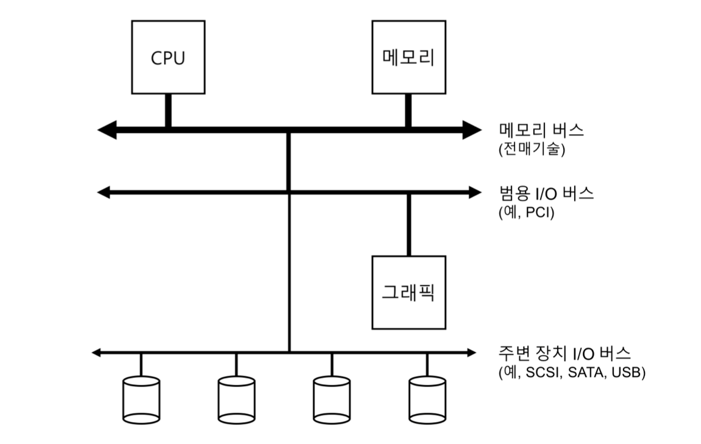

위 그림은 일반적인 시스템 구조이다. 물리학적인 이유와 비용 때문에 계층적인 구조로 이루어져 있다.

## 표준 장치

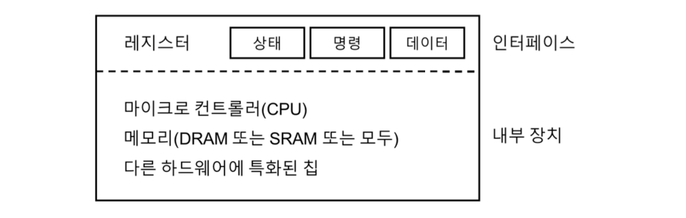

### 인터페이스

- 시스템의 다른 구성 요소에게 제공하는 하드웨어 인터페이스
- 하드웨어도 인터페이스를 제공하여 시스템 소프트웨어가 동작을 제어할 수 있도록 해야한다.

### 내부 구조

- 시스템에게 제공하는 장치에 대한 추상화를 정의하는 책임을 갖는다.

## 표준 방식

인터페이스는 세 개의 레지스터로 구성되어 있다.

- 상태(status) 레지스터
    - 장치의 현재 상태를 읽을 수 있다.
- 명령어(command) 레지스터
    - 장치가 특정 동작을 수행하도록 요청한다.
- 데이터(data) 레지스터
    - 장치에 데이터를 보내거나 받거나 할 때 사용한다.

이제 장치가 운영체제를 대신하여 특정 동작을 할 때에 운영체제와 장치 간에 일어날 수 있는 상호 동작의 과정을 살펴보자. 네 단계로 이루어져 있다.

1. 폴링(polling)
    - 반복적으로 장치의 상태 레지스터를 읽어서 명령의 수신 가능 여부를 확인한다.
2. programmed I/O
    - 운영체제가 데이터 레지스터에 어떤 데이터를 전달한다.
3. 운영체제가 명령 레지스터에 명령어를 기록한다.
4. 운영체제는 디바이스가 처리를 완료했는지 폴링한다.

기본 방식은 간단하면서도 제대로 동작한다. 하지만 매우 비효율적이라는 문제가 있다.

## 인터럽트를 이용한 CPU 오버헤드 개선

이전에 인터럽트에 대해서 이미 다루었기 때문에 정의에 대해서는 넘어가도록하자.

하지만 여기서 중요하게 짚고 넘어가야 하는 점은, ***인터럽트가 항상 최적의 해법은 아니라는 것에 유의해야 한다***는 것이다.

## DMA를 이용한 효율적인 데이터 이동

programmed I/O(PIO) 를 사용하면 CPU는 너무 많은 시간을 데이터를 디스크에서 또는 디스크로 이동하는 데 사용한다. 이 작업을 줄이고, CPU를 더 효율적으로 활용하기 위해 **직접 메모리 접근 방식(Direct Memory Access, DMA)** 를 사용한다.

DMA는 다음과 같이 동작한다.

1. 데이터를 장치로 전송하려고 한다.
2. 운영체제는 DMA 엔진에 메모리 상의 데이터 위치와 전송할 데이터의 크기, 대상 장치를 프로그램한다.
3. 그 시점에 전송하기 위해 할 일은 끝난다.
4. 운영체제는 다른 일을 진행할 수 있다.
5. DMA 동작이 끝나면 DMA 컨트롤러가 인터럽트를 발생시킨다.
6. 운영체제가 데이터 전송이 완료되었음을 알 수 있다.

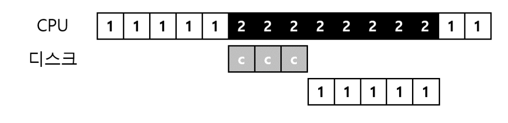

## 디바이스와 상호작용하는 방법

지금까지 장치와 통신하는 두 가지 기본적인 방법이 개발되었다.

### I/O 명령을 명시적으로 사용한다.

- 이 명령어들은 운영체제가 특정 장치 레지스터에 데이터를 전송할 수 있는 방법을 제공한다.
    - 대부분 특권 명령어들이다. → 운영체제가 장치를 제어하는 역할을 한다.
    - 그래서 운영체제만 장치들과 직접 통신이 가능하다.

### memory mapped I/O 를 사용한다.

- 하드웨어가 장치의 레지스터들이 마치 메모리 상에 존재하는 것처럼 만든다.
- 특정 레지스터를 접근하기 위해 운영체제는 해당 주소에 읽기/쓰기를 하면된다.

## 운영체제에 연결하기: 디바이스 드라이버

> 어떻게 장치 중립적인 운영체제를 만드는가?
> 

### 추상화(abstraction)

- 운영체제 최하위 계층의 일부 소프트웨어는 장치의 동작방식을 반드시 알아야 한다.
    - 해당 소프트웨어를 **디바이스 드라이버(device driver)** 라고 부른다.

---

# 39장. 막간: 파일과 디렉터리

> 어떻게 영속 장치를 관리하는가?
> 

## 파일과 디렉터리

### 파일

- 단순히 읽거나 쓸 수 있는 순차적인 바이트 배열
- **저수준의 이름(low-level name)** 을 갖고 있다.
    - **아이노드 번호(inode number)** 라고 한다.
- 대부분 시스템에서 운영체제는 파일의 구조를 모른다.

### 디렉터리

- 디렉터리도 저수준의 이름을 갖는다.
    - 파일과는 달리 디렉터리의 내용은 구체적으로 정해져 있다.
- 디렉터리는 <사용자가 읽을 수 있는 이름, 저수준의 이름> 쌍으로 이루어진 목록을 가진다.
- 디렉터리의 각 항목은 파일 또는 다른 디렉터리를 가리킨다.
    - **디렉터리 트리(directory tree)** 또는, **디렉터리 계층(directory hierarchy)** 를 구성할 수 있다.
    - 디렉터리 계층은 **루트 디렉터리(root directory)** 부터 시작한다.
    - **구분자(separator)** 를 사용하여 하위 디렉터리를 명시할 수 있다.

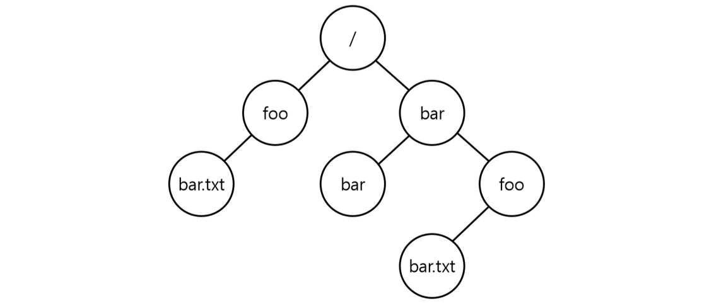

## 파일의 생성

`open` 시스템 콜을 사용하여 파일을 생성할 수 있다. `O_CREAT` 플래그를 전달하면 프로그램은 새로운 파일을 만들 수 있다.

다음은 현재 디렉터리에 “foo”라는 파일을 만드는 코드이다.

```c
int fd = open("foo", O_CREAT | O_WRONLY | O_TRUNC);
```

`open()` 은 다수의 플래그를 받는다. 이 예제에서는 파일을 생성하기 위해 `O_CREAT`, 쓰기만 가능하도록 `O_WRONLY` 플래그를 사용했다. 그리고 `O_TRUNC` 플래그를 사용하여 파일이 이미 존재하면 기존 내용을 삭제하도록 했다.

> `open()` 의 중요한 항목은 리턴값이다: **파일 디스크립터(file descriptor)**
> 

## 파일 읽기와 쓰기

일단 읽는 것부터 시작해보자. 커맨드 라인에서 `cat` 프로그램을 이용하면 파일의 내용을 화면에 덤프할 수 있다.

`cat` 프로그램을 trace 해보자. (가독성을 위해 몇몇 호출들은 삭제했다고 한다.)

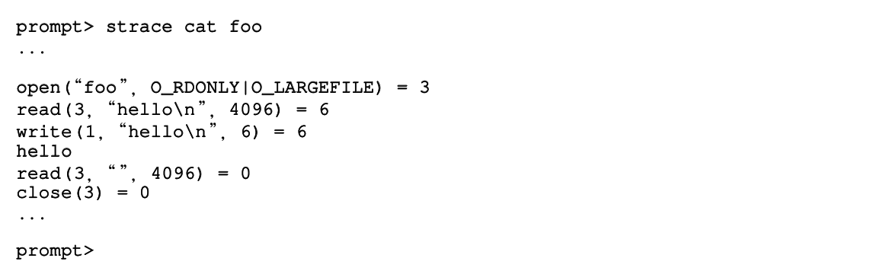

- `O_RDONLY` 플래그로 읽기전용으로 열었고, `O_LARGEFILE` 플래그로 64bit 오프셋이 사용되도록 설정하였다. 그리고 파일 디스크립터로 3을 리턴하였다.
    - 프로세스가 이미 표준 입력, 표준 출력, 표준 에러 세 개의 파일을 열어놓았기 때문에 3이 리턴된다.
- 파일이 열리면 `cat` 은 `read()` 시스템 콜을 사용하여 파일에서 몇 바이트씩 반복적으로 읽는다.
    - `read()` 의 첫 번째 인자는 파일 디스크립터로, 어떤 파일을 읽을 건지 알려준다.
    - 두 번째 인자는 결과를 저장할 버퍼를 가리킨다.
    - 세 번째 인자는 버퍼의 크기이다.
    - `read()` 가 성공적으로 리턴하면서 읽은 바이트 수 6을 반환한다.
- `write()` 시스템 콜을 통해 파일 디스크립터 1번인 표준 출력으로 “hello” 를 출력한다.
- 더 읽으려고 시도해보고, 읽은 바이트가 0이므로 그만한다.
- `close()` 시스템 콜을 통해 할 일이 끝났음을 표시한다.

## 비 순차적 읽기와 쓰기

지금까지 모든 접근이 순차적이었다. 하지만 때로는 파일의 특정 오프셋부터 읽거나 쓰는 것이 유용할 때가 있다.

이를 위해 `lseek()` 이라는 시스템 콜을 사용한다.

```c
off_t lseek(int fildes, off_t offset, int whence);
```

## fsync()를 이용한 즉시 기록

파일 시스템은 지정된 파일의 모든 **더티(dirty, 즉 갱신된)** 데이터를 디스크로 강제로 내려보낸다.

`fsync()` 가 리턴하면 응용 프로그램은 데이터가 영속성을 갖게 되었다는 것을 보장받기 때문에, 안전하게 다음으로 진행할 수 있다.

물론 모든 것을 완벽히 보장하지는 못한다. 어떤 경우에는 파일이 존재하는 디렉터리도 `fsync()` 해주어야 하는 일이 생긴다.

## 파일 이름 변경

커맨드 라인에서 `mv` 명령으로 파일명을 변경할 수 있다.

trace 해보면, `rename(char *old, char *new)` 를 호출하는데, 이 명령어는 시스템 크래시에 대해 **원자적**으로 구현되었다.

이름 변경 중 시스템 크래시가 발생하면 파일 이름이 원래 이름 또는 새로운 이름, 둘 중 하나를 갖게된다.

## 파일 정보 추출

파일에 대한 정보를 **메타데이터(metadata)** 라고 부른다. 이 메타데이터를 보려면 `stat()` 이나 `fstat()` 시스템 콜을 사용한다.

## 파일 삭제

커맨드 라인에서 `rm` 프로그램을 실행하면 파일을 지울 수 있는데, 그렇다면 `rm` 은 어떤 시스템 콜을 사용할까?

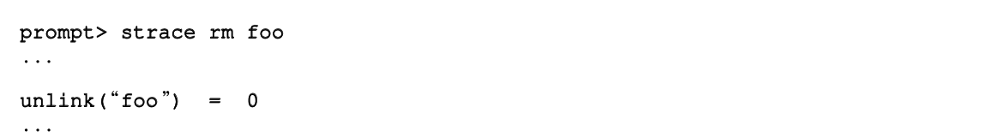

trace 해보면 `unlink()` 라는 시스템 콜을 호출하는 것을 볼 수 있다. 이게 뭐하는 걸까? 이해하기 위해서는 디렉터리에 대해서도 이해해야 하니까 좀 더 있다가 다시 보자.

## 디렉터리 생성/읽기/삭제

디렉터리에는 왜 쓰기가 없지? → 파일 시스템의 메타데이터로 분류되며, 항상 간접적으로만 변경된다.

- 생성 - `mkdir()`
- 읽기 - `ls` 프로그램
    - 내부에서는 `opendir()`, `readdir()`, `closedir()` 시스템 콜을 호출한다.
- 삭제 - `rmdir()`
    - 디렉터리를 삭제하기 전에는 디렉터리가 비어있어야 한다.

## 하드 링크

이제 파일을 삭제할 때 왜 `unlink()` 라는 시스템 콜을 사용하는지 이해하기 위해 `link()` 시스템 콜에 대해 알아보자.

> 당연히 unlink 가 나왔으니 link 가 나와야하지 않겠는가? 방심했나?
> 

### link() 시스템 콜

원래 경로명과 새로운 경로명 두 개의 인자를 받는다. 원래 파일 이름에 새로운 이름을 “link” 하면 동일한 파일을 접근할 수 있는 새로운 방법을 만들게 된다. 

이제 같은 아이노드를 가지는 파일이 두 개의 이름을 가지게 되었다고 볼 수 있다. 이렇게 생각하고 보면 왜 파일을 삭제할 때 `unlink()` 를 호출하는지 알 것 같기도하다.

사실은 파일을 생성할 때 *두 가지* 작업을 한다.

- 파일 관련 거의 모든 정보를 관리하는 자료구조(아이노드)를 만든다.
- 해당 파일에 사람이 읽을 수 있는 이름을 *연결*하고 그 연결 정보를 디렉터리에 생성한다.

파일을 unlink 하면 아이노드 번호의 **참조 횟수(reference count)** 를 검사한다. 이 참조 횟수가 특정 아이노드에 대해 다른 이름이 몇 개나 연결되어 있는지 관리한다.

`unlink()` 가 호출되면 이름과 아이노드 번호 간의 “연결"을 끊고 참조 횟수를 하나 줄인다. 그리고 참조 횟수가 0에 도달하면 파일 시스템은 비로소 아이노드와 관련된 데이터 블럭을 해제하여 진짜 “삭제" 하는 것이다.

## 심볼릭 링크

하드 링크는 제한이 많다.

- 디렉터리에 못 만든다.
- 다른 디스크 파티션에 있어도 못 만든다.

표면적으로는 하드 링크랑 유사한데, 다른 형식의 독립된 파일이라는 차이점이 명확히 있다.

이렇게 심볼릭 링크가 만들어진 방식 때문에 **dangling reference** 라는 문제가 발생할 수도 있다.

- 원래 파일을 지우면 심볼릭 링크가 가리키는 파일은 더 이상 존재하지 않는다.

## 파일 시스템 생성과 마운트

여러 개의 파일 시스템 파티션들이 모여서 하나의 큰 디렉터리를 구성한다. 각각의 파일 시스템을 생성하고, 이들을 “마운트"함으로써 단일 디렉터리 트리를 구성한다.

- 파일 시스템 생성 - `mkfs` 도구

---

# 40장. 파일 시스템 구현

> 어떻게 간단한 파일 시스템을 만들 것인가?
> 

## 생각하는 방법

파일 시스템에 대해 학습할 때, 두 가지 측면에서 접근할 것을 권장한다.

- 파일 시스템의 자료 구조
- 접근 방법(access method)

## 전체 구성

가장 먼저 해야할 것은 디스크를 **블럭(block)** 들로 나누는 것이다. 4KB 블럭이 64개 있는 작은 디스크를 가정해보자.

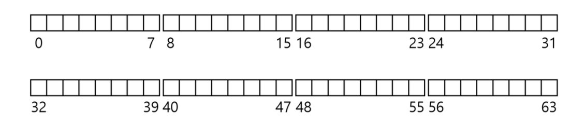

### 사용자 데이터

사용자 데이터가 있는 디스크 공간을 **데이터 영역(data region)** 이라고 해보자. 아래는 56개 블럭을 데이터 영역으로 확보한 것을 나타내는 그림이다.

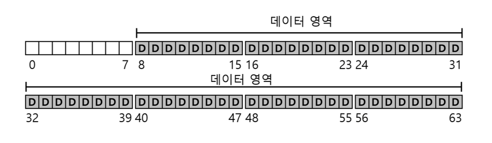

### 메타데이터 - 아이노드

파일 시스템은 파일의 세부 정보(**메타데이터**)를 **아이노드(inode)** 라고 부르는 자료구조에 저장한다. 아이노드를 저장하는 디스크 공간을 **아이노드 테이블(inode table)** 이라고 한다.

아래는 아이노드 테이블을 저장하기 위해 5개의 블럭을 할당한 것을 나타내는 그림이다.

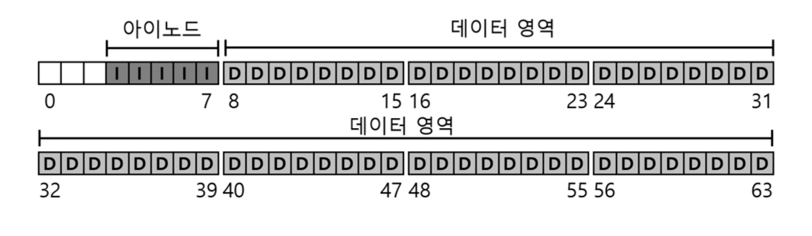

### 할당 구조(allocation structure)

각 블럭이 현재 사용 중인지 아닌지 표현하기 위한 할당 구조가 필요하다. 이는 여러가지 방법이 존재하는데, 우리는 단순한 **비트맵(bitmap)** 을 사용하기로 하자.

아래는 **데이터 비트맵(data bitmap)** 과 **아이노드 비트맵(inode bitmap)** 을 한 블럭씩 할당한 것을 보여준다.

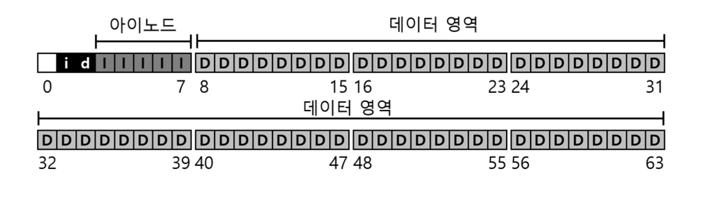

### 슈퍼 블럭(superblock)

- 파일 시스템 전체에 대한 정보를 담고 있다.
- 파일 시스템 식별을 위한 매직 넘버도 갖고 있을 것이다.

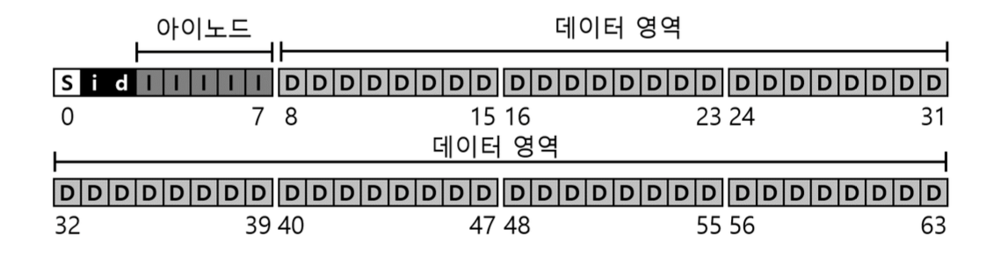

## 파일 구성: 아이노드

파일 시스템의 디스크 자료 구조 중 가장 중요한 것은 **아이노드(inode)** 이다.

- 이 노드들은 원래는 배열로 되어 있었는데, 각 배열은 특정 아이노드를 접근하기 위해 탐색된다.
- 아이노드에는 파일에 대한 정보다 다 들어있다.
    - **메타데이터(metadata)** 라고 한다.

아이노드를 설계할 때 가장 중요한 결정 중 하나는 데이터 블럭의 위치를 표현하는 방법이다. 간단한 방법은 아이노드 내에 여러 개의 **직접 포인터(direct pointer)** 를 두는 것인데, 이는 파일 크기의 제한 때문에 제약이 있다.

### 멀티 레벨 인덱스

그래서 일반적으로 **간접 포인터(indirect pointer)** 를 사용한다.

> 직접 포인터가 문제있으면 당연히 간접 포인터가 해결책일 것 같지 않은가?
> 
- 데이터 블럭을 가리키지 않는다.
- 데이터 블럭을 가리키는 포인터들이 저장된다.
- 더 큰 파일을 저장하려면 **이중 간접 포인터(double indirect pointer)** 를 추가하면 된다.
    - 더욱 더 큰 파일을 저장하려면? ㅎㅎ....

> 근데... 많은 연구 끝에 발견한 사실은.... *대부분의 파일의 크기는 작다!*
> 

## 디렉터리 구조

디렉터리들은 정확히 어디에 저장될까?

- 대부분 파일 시스템에서 디렉터리는 특수한 종류의 파일로 간주한다.
- 자신만의 아이노드를 가지며, 이 아이노드는 아이노드 테이블에 존재한다.
- 또한 자신만의 데이터 블럭을 가진다.

## 빈 공간의 관리

모든 파일 시스템에서 **빈 공간 관리(free space management)** 는 중요하다.

- 연속적으로 여러 개의 블럭들이 비어있는 공간을 할당함으로써 해당 파일에 대한 입출력 성능을 개선한다.
- 이러한 **선할당(pre-allocation)** 정책은 데이터 블럭 할당 시 자주 사용된다.

## 실행 흐름: 읽기와 쓰기

가정: 파일 시스템은 마운트되었고, 슈퍼블럭은 메모리 상에 위치한다. 다른 모든 것들은 디스크에 존재하며, 메모리에는 아직 탑재되지 않았다.

### 디스크에서 파일 읽기

1. 파일 시스템은 경로명을 따라가서(traverse) 원하는 아이노드를 찾는다.
    1. 루트 디렉터리에서 시작한다 → 루트 디렉터리의 아이노드는 알고 있어야 한다.
2. 파일 시스템은 읽어들인 아이노드에서 데이터 블럭의 포인터를 추출한다.
    1. 포인터가 가리키는 블럭에는 루트 디렉터리의 내용이 들어있다.
3. 파일 시스템은 이 포인터들을 사용하여 디렉터리 정보를 읽는다.
4. 경로명을 따라가서 원하는 아이노드를 찾는다.
5. 마지막으로 아이노드를 메모리로 읽어 들인다.
6. 그러면 해당 파일에 대한 접근 권한을 확인하고, 사용자에게 리턴한다.

### 디스크에 쓰기

1. 파일을 연다 (읽기에서 했던 것과 똑같다)
2. `write()` 를 호출하여 새로운 내용으로 파일을 갱신한다.
3. 파일을 닫는다.

읽기와는 다르게 파일 쓰기는 블럭 할당을 필요로 할 수 있다.

## 캐싱과 버퍼링

파일을 읽고 쓰는 것은 많은 I/O를 발생시킨다. 컴퓨터의 전체 성능에 중요한 영향을 미친다. 성능개선을 위해 대부분의 파일 시스템들은 자주 사용되는 블럭들을 메모리(DRAM) 에 캐싱한다.

### 초기의 파일 시스템

- 고정 크기의 캐시는 일반적으로 부팅 시에 할당이 되며, 전체 메모리의 약 10%를 차지한다.
- 이러한 메모리 정적 기법은 낭비가 많이된다.

### 그래서 현대의 파일 시스템은?

- 동적 파티션 방식을 사용한다.
- 가상 메모리 페이지들과 파일 시스템 페이지들을 통합하여 **일원화된 페이지 캐시(unified page cache)** 를 만들었다.

쓰기 캐싱에 대한 영향력도 같이 알아보도록 하자.

- 쓰기에 경우에는 캐시가 읽기에서와 같은 필터 역할을 할 수가 없다.
- 캐시는 쓰기 시점을 연기하는 역할을 하는데, 이를 **쓰기 버퍼링(write buffering)** 이라고 한다.
    - 쓰기 요청을 지연시켜 다수의 쓰기 작업들을 적은 수의 I/O로 일괄처리할 수 있다.
    - 여러 개의 쓰기요청들을 모아둠으로써 다수의 I/O들을 스케줄하여 성능을 개선할 수 있다.
    - 지연시키는 것을 통해 쓰기 자체를 피할 수도 있다.