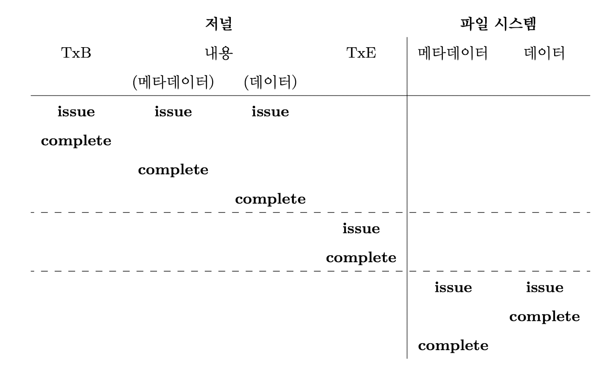
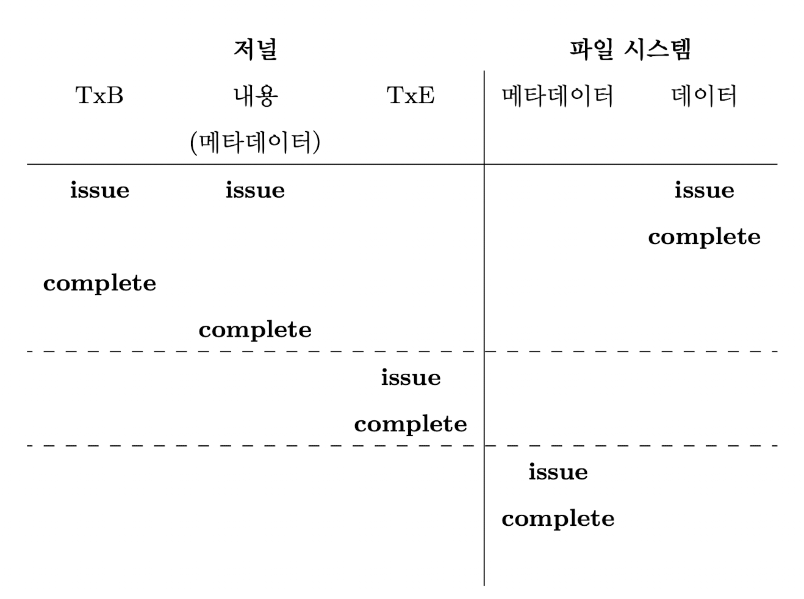
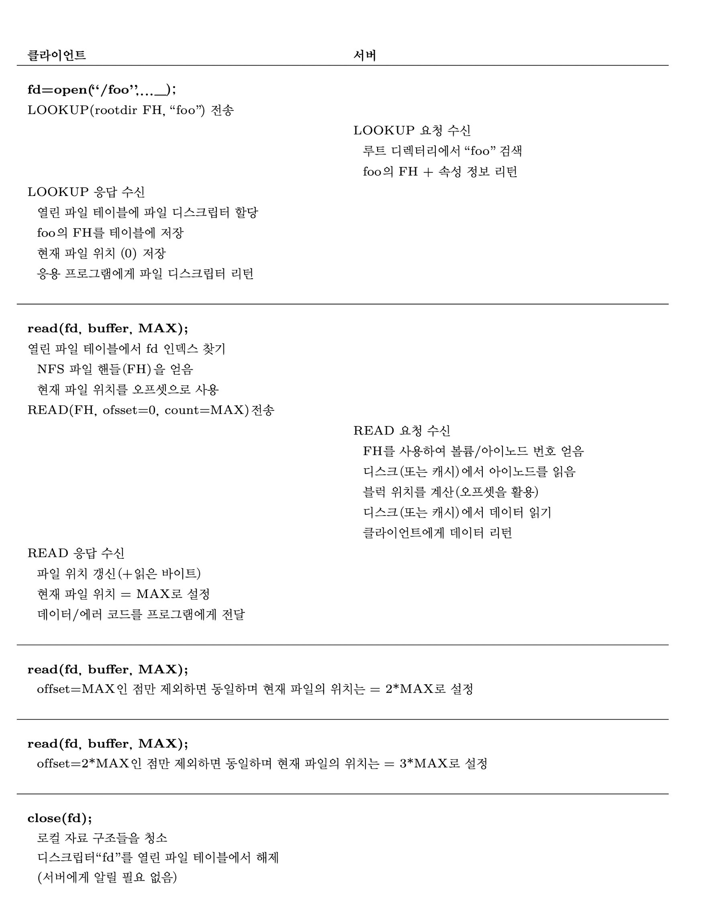

# 42/47~9

Created: April 5, 2022 9:39 PM
Reviewed: No

# 크래시 일관성: FSCK와 저널링

### 크래시 일관성

크래시되거나 전력손실이 발생하면 디스트 상태는 부분적으로 갱신이 되었을 수 있다.

- fsck
- 파일 시스템 검사
- 저널링 또는 write-ahead

파일 시스템이 아이노드 비트맵(아이노드 당 하나씩, 8비트 크기), 데이터 비트맵(데이터 블럭당 하나씩 8비트 크기), 아이노드(총 8개, 0부터 7의 번호를 갖고 4개의 블럭을 사용), 데이터 블럭(총 8개, 0부터 7의 번호를 가짐)으로 구성되어있다고 가정함

### 크래시 시나리오

한 번의 쓰기만 성공한 경우

- 데이터 블록만 디스크에 기록됨 - 크래시 일관성 측면에서 문제 없음
- 갱신된 아이노드만 디스크에 기록됨 - 포인터를 읽으면 디스크에서 의미없는 데이터를 얻게 됨, 일관성 손상
- 갱신된 비트맵만 디스크에 기록됨 - 일관성 손상

세 개의 블록을 디스크에 기록할 때의 크래시 시나리오

- 데이터를 제외한 아이노드와 비트맵은 디스크에 기록됨 - 파일 시스템 메타 데이터의 일관성 보장
- 비트맵을 제외한 아이노드와 데이터는 디스크에 기록됨 - 비트맵과 아이노드 간의 내용이 일관성 없음
- 아이노드를 제외한 비트맵과 데이터는 디스크에 기록됨 - 아이노드와 비트맵 간의 내용이 일치하지 않음 아이노드가 파일을 가리키지 않고 있기 때문에 기록된 블록이 어느 파일에 속한 것인지 알 수 없음

### 크래시 일관성 문제

 파일 시스템 자료 구조간의 불일치, 공간 누수, 사용자에게 의미없는 데이터 전달

### 해결 1: 파일 시스템 검사기

기본적으로 파일 시스템이 일관성이 없더라도 그대로 두었다가 리부팅 시에 일관성 문제를 해결하는 방식

fsck: 일관성 불일치를 발견하고 수정하는 유닉스 도구

fsck가 하는 일

- 슈퍼블럭 - 먼저 슈퍼블럭의 오류 검사
- 프리블럭 - 아이노드와 간접 블럭, 이중 간접 블럭등을 살펴보고 파일 시스템에 현재 어떤 블럭이 할당되었는지에 대한 정보를 생성함. 얻은 정도를 토대로 정확한 할딩 비트맵을 구성하고 기존의 비트맵과 일치하지 않으면 아이노드 정보 기반으로 불일치 해결. 모든 아이노드에 같은 검사를 수행하여 아이노드 비트맵의 유효성 검사하고 필요 시에 아이노드 비트맵 재구성
- 아이노드 상태 - 각 아이노드의 상태를 검사 쉽게 해결이 불가능한 문제가 존재하면 해당 아이노드를 초기화, 아이노드 비트맵고 그에 따라 갱신
- 아이노드 링크 - fsck는 할당된 아이노드 링크 개수를 확인
- 중복 - 같은 블럭을 가리키는 서로 다른 아이노드가 있는지 검사
- 배드 블럭 - 포인터가 배드이면 그 포인터가 유효하지 않은 공간을 참조하고 있음을 의미, 해당 포인터를 삭제함
- 디렉터리 검사 - e디렉터리 내용에 대해서 추가적으로 모든 내용이 제대로 저장되어있는지 검사

fsck를 구현하려면 파일 시스템 전반에 대한 이해가 필요, 너무 느리다는 단점이 있음(디스크가 커지면서 너무 많은 비용이 듬)

### 해결 2: 저널링(또는 Write-Ahead Logging)

디스크 내용을 갱신할 때, 해당 자료구조를 갱신하기 전에, 먼저 수행하고자 하는 작업을 요약해서 기록해둠. 해당 디스크 페이지들을 새값으로 갱신하는 과정에서 크래시가 발생하면 로그를 확인해서 다시 갱신하면 됨(redo)

### Linux ext3

디스크는 블럭 그룹으로 나뉘어 있고, 각 블럭 그룹은 아이노드 비트맵과 데이터 비트맵, 아이노드와 데이터 블럭들로 구성, 저널 자료 구조가 새로운 핵심 자료 구조임

저널 자료 구조는 파일 시스템 포맷 시에 설정

데이터 저널링 - ext3에서 제공하는 저널 모드 중에 하나, 물리 로깅으로도 불림

트랜젝션의 시작 블럭 - 연산에 대한 정보들 기록 (갱신될 블럭 정보, 트랜젝션 식별자 등)

트랜젝션의 종료 블럭 - 트랜젝션의 종료를 알리고 TID를 포함

트랜젝션 종료 블럭이 로그에 기록되면 커밋되었다고 함

트랜젝션이 디스크에 안전하게 기록된 후에 실제 위치에 반영하는 체크 포인팅 과정을 거침 

디스크 쓰기 연산의 원자성이 충족되어야 함,트랜젝션 종료 블럭은 무조건 원자적으로 기록되어야 함 

저널에 기록하는 도중 크래시가 발생하면 문제가 생김

- 복구 - 시스템이 부팅할 때 로그를 탐색해서 디스크에 커밋된 트랜젝션이 있는지 파악, 커밋된 블럭들을 디스크 상의 원래 위치에 씀
- 로그 기록 일괄 처리 방식으로 - 여러개의 저널로그를 모아 한번에 디스크에 커밋
- 로그 공간의 관리 - 로그 공간이 가득차면 더 이상 트랜젝션을 커밋할 수 없게 됨 → 환형 자료구조 사용, 일정 시간 이후 저널 슈퍼블럭을 갱신하여 저널의 트랙젝션을 해제하는 과정 추가
- 메타 데이터 저널링 - 파일 시스템 느려짐 → 간단한 저널링 형태인 Ordered journaling(메타데이터 저널링) 사용, 저널에 데이터 블럭을 기록하지 않음
- 블럭 재활용 - 지워진 블럭이 체크포인트 될 때까지 절대로 재사용하지 않음
1. 데이터 쓰기 - 데이터를 최종 위치에 씀
2. 저널 메타 데이터 쓰기 - 시작 블럭과 메타 데이터를 로그에 씀
3. 저널 커밋 - 트랜젝션 커밋 블럭을 로그에 씀 
4. 체크 포인트 메타 데이터- 갱신한 메타데이터의 내용을 디스크 상의 최종 위치에 갱신
5. 해제 - 저널 슈퍼블럭에 해당 트랜젝션이 해제되었다고 표기

데이터 저널링 시간 흐름표

메타데이터 저널링 시간흐름표

### 해결 3: 그외 방법

Soft Update - 파일 시스템의 모든 쓰기들의 순서를 잘 정해서 디스크 상의 자료구조가 절대로 불일치 상태가 되지 않도록 하는 것, 구현이 쉽지 않음

Copy On Write - 대중적인 파일 시스템에서 사용되는 방법, 사용안된 위치에 갱신 내용을 저장하고 새롭게 갱신된 자료구조를 가리키는 포인터를 포함하도록 변경함. 파일 시스템의 일관성을 유지

백 포인터 기반 일관성(backpointer-based consistency, BBC) - 쓰기 사이에 순서 강요하지 않고 모든 블럭에 백포인터 추가, 앞방향 포인터가 가리키는 블럭이 다시 이 블럭을 가리키고 있는지 검사하면 됨 

Optimistics Crash Consistency - 디스크 쓰기를 대기하는 회수를 줄이는 방법 가장 큰 크기의 쓰기를 디스크로 내려보내고 트랜젝션 체크섬과 다른 기술들을 적용해서 일관성을 보장함. 이 기술로 성능을 수십 배 이상 개선할 수 있었음 하지만 제대로 동작하기 위해서는 새로운 디스크 인터페이스 필요

# 분산 시스템

## 분산시스템의 핵심 사안

- 실패와 고장의 극복
- 시스템 성능
- 보안

## 통신의 기본

통신은 신뢰할 수 없음 - 패킷 손실, 손상

## 신뢰할 수 없는 통신 계층

### UDP/IP

UDP를 사용하기 위해서 소켓 API를 이용하여 통신 지점을 생성하고, UDP 데이터 그램을 원래의 프로세스로 전달

UDP는 신뢰할 수 없는 통신 계층이다. 

## 신뢰할 수 있는 통신 계층

- ack 사용
- 타임아웃/재시도

중복된 메시지 → 순서 카운터사용

### TCP/IP

## 통신 추상화

분산 시스템을 구현하는 데 필요한 통신 개념

- 분산 공유 메모리 시스템 - 하나의 프로세스가 가상 주소 공간을 공유할 수 있도록 함, 멀티 쓰레드 프로그램처럼 보이도록 함 - 성능, 실패를 처리하는 방식때문에 대중적으로 사용되고 있지 않음

## Remote Procedure Call (RPC)

스텁 생성기(프로토콜 컴파일러)와 런타임 라이브러리로 구성

### 스텁 생성기

자동적으로 메시지를 만들어 함수의 임자들을 묶는 불편함을 없앰

클라이언트 스텁 -클라이언트 프로그램이 RPC를 사용할 때 생성하여 호출

- 메시지 버퍼 생성
- 메시지 버퍼에 필요한 정보를 병합
- RPC 서버에 메시지 전송
    - 응답 대기
    - 리턴 코드와 인자 풀기
    - 호출자에게 리턴하기

서버 측에서 수행되는 과정 

- 메시지 풀기
- 실제 함수 호출하기
- 결과 통합
- 응답 전송하기

고려해야할 사항

1. 복잡한 구조의 인자나 다수의 인자 
2. 병행성 고려하여 서버 구성 - 쓰레드 풀 사용

### 런타임 라이브러리

성능과 신뢰성에 관한 대부분의 문제 처리

- 원격 서비스의 위치를 찾는 문제 - 호스트 이름 또는 IP주소, 포트 번호
- 어떤 전송계층 프로토콜을 사용할지 - 성능을 위해 UDP와 같은 것을 사용하여 구현

### 다른 문제들

RPC 런타임이 다루어야할 다른 문제들

- 한 패킷에 담을 수 있는 양보다 더 많은 수의 인자를 가지는 프로시저 호출 처리 - 분철, 재조합
- 바이트 순서 표시 - 빅 엔디안, 리틀 엔디안→ 메시지 포맷에 정의되어있는 엔디안을 사용해 해결
- 클라이언트에게 비동기적 실행을 허가할 것인지 - 어떤 RPC는 동기적으로 동작, 비동기적으로 동작

# Sun 사의 네트워크 파일 시스템(NFS)

클라이언트 서버 구조 

- 클라이언트 간에 데이터 공유가 쉬워진다.
- 중앙잡중형 관리
- 보안

## 기본적인 분산 파일 시스템

클라이언트에서 클라이언트 응용프로그램이 클라이언트 측 파일 시스템을 통해서 파일과 디렉터리를 접근

서버에 있는 파일을 접근하려면 클라이언트 측 파일시스템에 시스템 콜 호출

클라이언트 파일 시스템의 역할 - 시스템 콜을 서비스하기 위해 필요한 동작 실행

클라이언트 서버 기반의 분산 파일 시스템의 핵심 소프트웨어

- 클라이언트 측 파일시스템
- 파일 서버

### NFS

Sun Microsystems가 개발한 오픈 프로토콜

### 핵심: 단순하고 빠른 서버 크래시 복구

상태를 유지하지 않는(stateless) 프로토콜 설계 - 공유상태를 유지하면 서버도 클라이언트 측의 크래시를 고려해야해서 상황이 복잡해짐

### NFSv2 프로토콜

파일 핸들 

- 특정 연산을 수행할 파일이나 디렉터리를 고유하게 설명하는 데 사용됨 (파일 디스크립터와 유사한 개념)
- 볼륨 식별자와 아이노드 번호, 생성 번호 - 클라이언트가 원하는 파일, 디렉터리를 식별

프로토콜 구성요소

- LOOKUP 프로토콜 - 파일 핸들을 얻기 위함
- READ, WRITE 프로토콜 - 파일을 읽거나 쓰기 위함
- GETATTR 요청 - 어떤 파일 핸들에 대해 해당 파일의 마지막 수정 시간을 포함하는 속성 정보를 가져온다.

### 프로토콜에서 분산 파일 시스템으로

클라이언트 측 파일 시스템은 open()된 파일들을 관리하며, 응용프로그램의 요청을 적절한 프로토콜 메시지들로 변환하는 일을 함. 서버는 각 요청에 응답함.

- 클라이언트가 파일연산의 상태를 관리
- 서버와 언제 상호작용
- 서버에게 보내는 요청에는 그 요청을 완료하는 데 필요한 모든 정보가 담겨있음

### 서버의 고장을 멱등연산으로 처리하기

클라이언트가 서버로 메시지를 전송했을 때, 응답이 없는 경우 - 네트워크 상 메시지 손실, 서버 크래시 등의 원인

요청을 재전송함 - 연산의 멱등성을 이용 

멱등 연산? - 여러 차례 수행해서 얻는 결과가 한 번만 수행했을 때 얻는 결과와 동일

LOOKUP, READ, WRITE - 멱등 연산

### 성능 개선하기: 클라이언트 측 캐싱

캐싱 - 서버에서 읽은 파일 데이터를 클라이언트 메모리에 캐싱, 쓰기를 위한 임시버퍼로 사용

→ 캐시 일관성 문제 발생

### 캐시 일관성 문제

- 갱신 가시성
- 오래된 캐시

→ 해결

- flush on close, close to open - 파일을 갱신하여 파일을 닫는 시점에 갱신 내용을 서버에 보냄
- 캐시에 보관된 내용을 사용하기 전에 파일 변경 여부 몬저 검사
- GETATTR 요청 폭발적으로 증가 - 속성 정보 캐시 추가

### 서버 측 쓰기 버퍼링의 의미

NFS 서버 자체 캐싱 문제

쓰기 버퍼링의 경우 저장장치에 완전히 쓴 후에 리턴 - 쓰기 내용을 디스크에 완전히 저장하기 전에 클라이언트에게 답신을 보낼 수 있음

