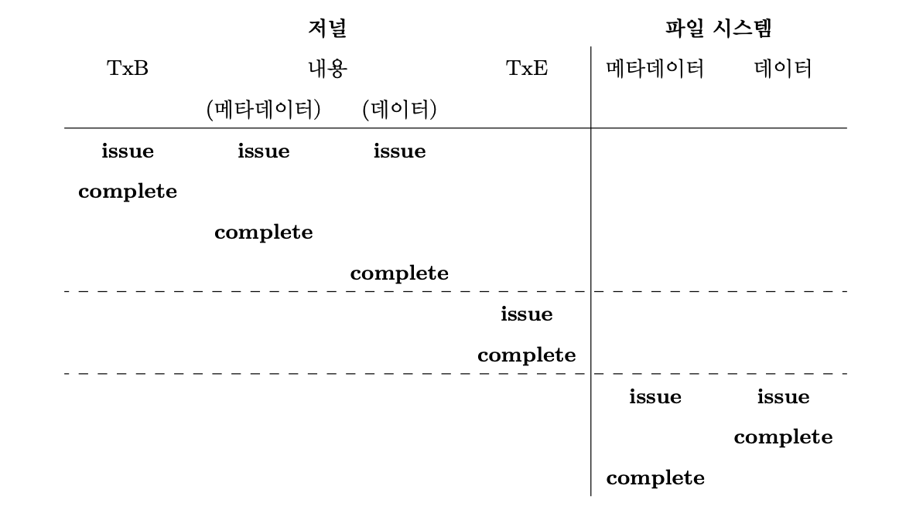
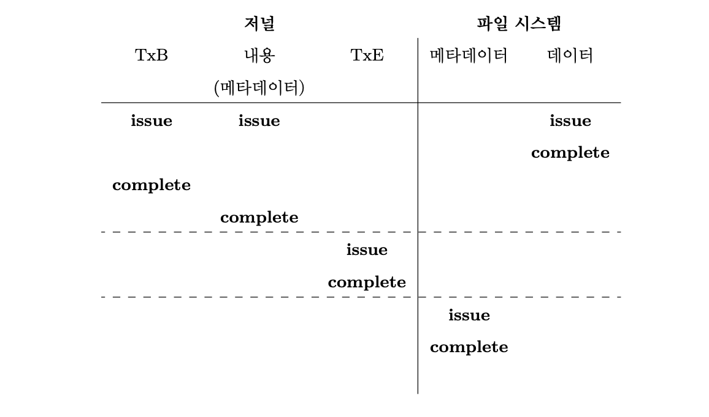
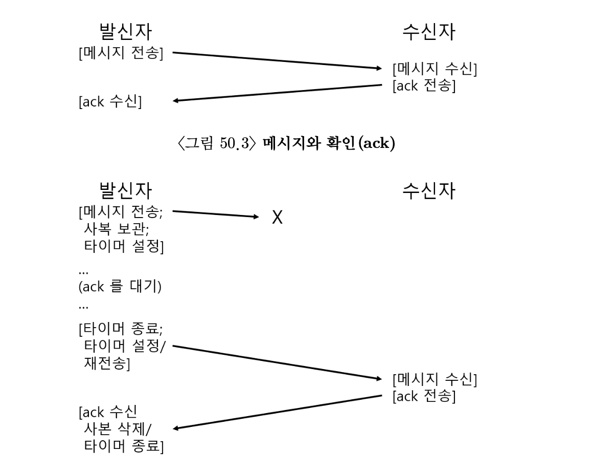
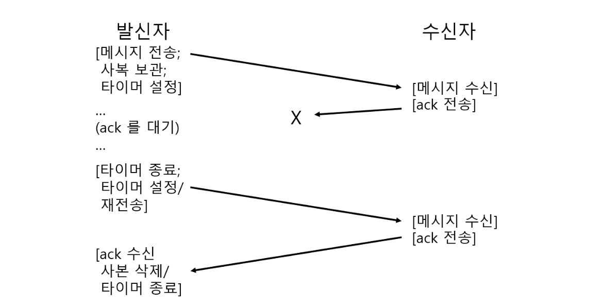
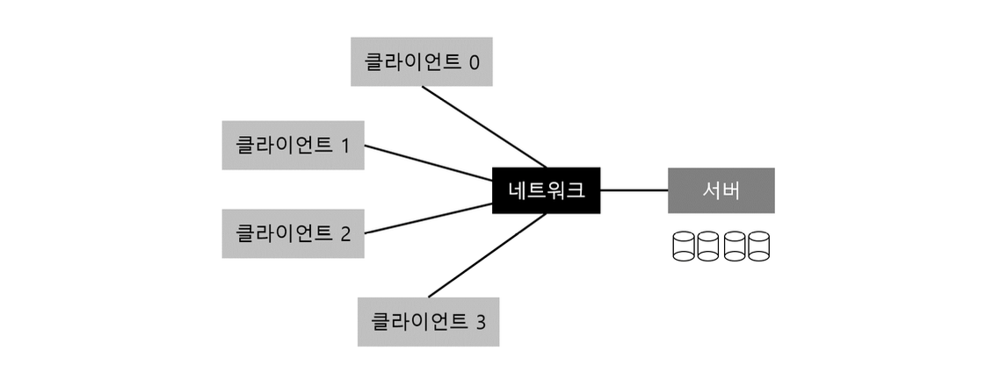
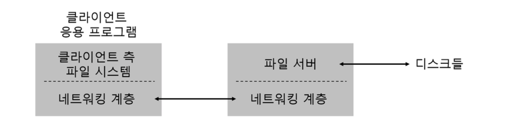

# 42장. 크래시 일관성: FSCK와 저널링

> 파일 시스템의 자료 구조는 안전하게 저장되어야 한다.
> 

### 크래시 일관성(crash-consistency)

어떤 전력 손실이나, 크래시 때문에 디스크 상의 자료 구조를 안전하게 갱신하는 것은 상당히 까다로운 작업이 된다. 그래서 우리는 가장 먼저 이 문제에 직면하게 된다.

두 가지 해결책을 앞으로 다루어 볼 것이다.

- **fsck** 또는 **파일 시스템 검사기**
- **저널링(journaling)** 또는 **write-ahead logging(WAL)**

### 크래시 시나리오

데이터를 갱신할 때, 아이노드, 비트맵, 데이터블럭을 쓴다고 예시를 들어보자.

만약 세 번의 쓰기 동작 중 한 번만 성공한 경우를 생각해보면, 다음 세 가지 경우가 있을 수 있다.

- 데이터 블록만 디스크에 기록됨
    - 데이터는 디스크에 있지만 그것을 가리키는 아이노드가 없고, 할당 여부를 나타내는 비트맵도 없다.
    - 하지만 크래시 일관성 측면에서는 문제가 없다.
- 갱신된 아이노드만 디스크에 기록됨
    - 데이터블록이 기록되지 않아서, 의미없는 데이터를 얻게 된다.
    - 또한 **일관성 손상**이라는 새로운 문제에 직면한다.
- 갱신된 비트맵만 디스크에 기록됨
    - 비트맵은 기록되었다고 표시하지만, 아이노드는 그렇지 않다.
    - 데이터블록을 파일시스템에서 사용할 수 없다.

또, 세 번의 쓰기 동작 중 두 번은 성공하고 한 번 실패한 경우는 다음과 같다.

- 데이터를 제외한 아이노드와 비트맵은 디스크에 기록됨
    - 아이노드와 비트맵은 같이 어떤 데이터를 가리키고 있으니 일관성이 보장된다.
    - 물론 의미없는 값이 들어있다.
- 비트맵을 제외한 아이노드와 데이터는 디스크에 기록됨
    - 아이노드가 데이터를 잘 가리키고 있지만, 비트맵과 전혀 일관성이 없다.
- 아이노드를 제외한 비트맵과 데이터는 디스크에 기록됨
    - 똑같이 아이노드와 비트맵의 내용이 일치하지 않는다.

### 크래시 일관성 문제

우리는 파일 시스템의 일관성이 항상 유지되도록 만들고자 한다. 하지만 중간중간 크래시나 전력 손실이 발생하면 우리의 목적을 쉽게 달성할 수가 없게 되는데, 이를 **크래시 일관성 문제**라고 부른다.

## 해법 1: 파일 시스템 검사기

**fsck** 라는 일관성 불일치를 발견하고 수정하는 Unix 도구를 사용해보자. 이 도구가 하는 기본적인 일들을 아래와 같이 정리할 수 있다.

- 슈퍼블럭: 슈퍼블럭 내용에 오류가 없는지를 검사한다.
- 프리블럭: 아이노드와 간접 블럭, 이중 간접 블럭 등을 살펴보고 파일 시스템에 현재 어떤 블럭들이 할당되었는지에 대한 정보를 생성한다.
- 아이노드 상태: 각 아이노드가 손상되었는지 다른 문제는 없는지 검사한다.
- 아이노드 링크: 각 할당된 아이노드의 링크 개수를 확인한다.
- 중복: 중복된 포인터가 있는지도 검사한다.
- 배드블럭: 모든 포인터 목록을 검사하면서 배드블럭 포인터들도 함께 검사한다.
- 디렉터리 검사: 파일의 내용을 파악하는 것은 불가능하나, 디렉터리 내용에 대해서는 모든 내용이 제대로 저장되어 있는지의 검사를 수행한다.

> 너무 느리다... 디스크 볼륨이 커지면 하루종일 보다 더 걸릴 수도 있다. 
>
>🤮 침대방 바닥에 열쇠를 흘리고 지하실로부터 시작해서 아래서 위로 모든 방을 다 돌아다니며 집 전체를 뒤져서 열쇠를 찾는 알고리즘이다.
> 

## 해법 2: 저널링(또는 Write-Ahead Logging)

→ 디스크 내용을 갱신할 때, 해당 자료구조를 갱신하기 전에, 먼저 수행하고자 하는 작업을 요약해서 기록해둔다.

### 데이터 저널링

- 물리 로깅 → 갱신해야 할 물리적 내용을 저널에 기록
- 논리 로깅 → 갱신에 명령어 자체를 저장

**체크포인팅**

- 저널에 기록된 내용을 실제 위치에 반영하는 과정

**트랜잭션 종료 블럭**

- 저널링에서 매우 중요한 역할을 한다.
- 저널링이 끝나지 않았는데 트랜잭션 종료 블럭이 기록되는 것을 막아야 한다.
- 다른건 몰라도 슈퍼블럭과 같은 핵심 자료구조는 저널링이 꼭 진행되어야 한다.

→ 그래서 파일 시스템은 트랜잭션을 두 단계로 나누어서 기록한다.

**지금까지의 과정**

1. 저널 쓰기: 트랜잭션의 내용을 로그에 쓴다.
2. 저널 커밋: 트랜잭션 커밋 블럭을 로그에 쓴다.
3. 체크포인트: 갱신한 내용을 디스크 최종 위치에 쓴다.

### 복구

위의 과정에서 트랜잭션이 로그에 기록되기 전에 크래시가 발생하면 아무것도 안하면 된다. 하지만 트랜잭션이 로그에 기록이 되었는데 체크포인트가 완료되기 전 크래시가 발생한다면 아래와 같이 복구할 수 있다.

- 시스템이 부팅할 때 로그를 탐색해서 디스크에 커밋된 트랜잭션이 있는지 파악한다.
- 커밋된 트랜잭션의 블럭들을 디스크 상의 원래의 위치에 쓴다.

→ 저널에 커밋된 트랜잭션을 replay하여 디스크 자료 구조 간에 일관성을 보장한다.

### 로그 기록을 일괄 처리 방식으로

지금까지의 데이터 저널링 방식은 디스크에 엄청난 트래픽을 유발한다. 그래서 우리는 여러 개의 저널로그를 모아서 한 번에 디스크에 커밋하는 방법을 사용한다.

### 로그 공간의 관리

로그 공간이 가득 차면 두 가지 문제가 발생한다.

- 로그가 커질수록 복구 소요 시간이 길어진다.
    - 로그에 있는 모든 트랜잭션을 재실행해야 하기 때문이다.
- 로그가 가득차면 디스크에 더 이상의 트랜잭션을 커밋할 수 없게 된다.
    - 파일 시스템을 갱신하는 모든 작업들이 실패한다.
    - 이는 파일 시스템이 쓸모없어 지는 것과 같다.

→ 그래서 우리는 환형 자료 구조 형식으로 사용한다. 끝까지 다 쓰면, 앞부터 다시 채워넣는 것이다.

**그럼 또 한번 지금까지의 과정을 정리해보자.**

1. 저널 쓰기
2. 저널 커밋
3. 체크포인트
4. 프리: 일정 시간 이후에 저널 슈퍼블럭을 갱신하여 저널의 트랜잭션을 해제한다.

> 그런데 사실 크래시는 별로 자주 안일어난다. 복구하려고 모든 데이터블럭을 디스크에 두 번씩 기록하는 것, 너무 부담스럽다.
> 

### 메타데이터 저널링

위의 방법보다 조금 간단하게 해보려고 한다. 이는 **Ordered journaling** 또는 **메타데이터 저널링** 이라고 한다.

저널에 데이터 블럭을 기록하지 않는다는 것을 빼면 거의 대부분이 앞과 동일하다.

→ 데이터블럭 대신에 파일의 메타데이터를 저널링 하겠다는 뜻이다.

메타데이터를 저널에 기록하기 전에, 반드시 관련 데이터 블럭들을 당연히 디스크에 먼저 써야한다.

1. 데이터 쓰기: 데이터를 최종 위치에 쓴다. 완료될 때까지 대기한다.
2. 저널 메타데이터 쓰기: 시작 블럭과 메타데이터를 로그에 쓴다. 완료될 때까지 기다린다.
3. 저널 커밋
4. 체크포인트 메타데이터: 갱신된 메타데이터의 내용을 파일 시스템 상에 있어야 할 최종 위치에 갱신한다.
5. 해제

→ 데이터가 먼저 기록되는 것을 강제하여 아이노드 포인터가 쓰레기 데이터를 가리키지 않는 것을 보장한다.

> 포인터의 대상이 되는 객체를 그것을 가리키는 객체보다 먼저 써라
> 

---

# 47장. 분산 시스템

> 웹 브라우저가 지구 상 어딘가에 있는 웹 서버에 접속하면 **클라이언트/서버** 분산 시스템이라는 구조에 한 구성원이 된다.
> 

### 분산 시스템의 핵심 사안

- 실패와 고장의 극복
- 시스템 성능은 매우 중요한 요소
- 보안 역시 매우 중요한 요소

> 최신 네트워킹의 핵심 가정은 “통신은 신뢰할 수 없다는 것”이다.
> 

## 신뢰할 수 없는 통신 계층

### UDP: 신뢰할 수 없는 통신 계층의 훌륭한 예제

→ 하지만 그렇다고 모든 실패에 방심하고 있지는 않다. **체크섬**을 포함하여 일부 패킷 손상은 검출할 수 있다.

## 신뢰할 수 있는 통신 계층

> 발신자는 수신자가 메시지를 수신했다는 것을 어떻게 알 수 있는가?
> 

### ACK

1. 발신자는 메시지를 수신자에게 보낸다.
2. 수신자는 받았다는 것을 알리기 위해서 짧은 메시지를 다시 보낸다.
3. 발신자가 메시지가 도착했다는 ack를 받는다.
4. 수신자가 메시지를 잘 받았다는 것을 확신한다.

> 발신자가 ack를 못 받으면?
> 

→ 그래서 **타임아웃(timeout)** 이라고 하는 추가적인 장치가 필요하다. 일정 시간이 지나면 다시 메시지를 전송하도록 재시도 하는 것이다.

그런데 이것도... 수신자는 사실 똑같은 메시지를 두 번 받은 것이기 때문에 완벽하지는 않은 것 같다. 신뢰성 있는 메시지 계층을 목표로 한다면 수신측도 각 메시지를 정확히 한 번만 받는다는 보장이 필요하다.

## 분산 공유 메모리

→ 하나의 프로세스가 서로 다른 기계들 위에서 커다란 가상 주소 공간을 공유할 수 있도록 하였음

- 대부분의 DSM 시스템은 운영체제의 가상 메모리 시스템 기반으로 동작한다.

## Remote Procedure Call (RPC)

근데 운영체제의 개념들을 활용하는 것은 좋지 않은 선택이라는 것을 깨닫고...

프로그래밍 언어 차원의 개념이 더 이치에 맞다는 것을 알게되었다.

→ 원격 기계에서의 코드 실행을 로컬 내의 함수를 부르는 것처럼 간단하게 만드는 것

### 스텁 생성기

장점

- 함수의 인자들을 묶는 불편함을 없앤다.
- 자동으로 메시지를 만든다.

단점

- 복잡한 구조의 인자나 다수의 인자를 전달하기 어렵다.
- 병행성을 고려하여 서버를 구성해야 한다.

### 런타임 라이브러리

극복해야 하는 도전거리

1. 원격 서비스의 위치를 찾는 문제
2. RPC를 어떤 전송 계층 프로토콜 위에 만들지 결정해야 한다.
    
    → 대부분 UDP와 같은 신뢰할 수 없는 계층을 사용한다. 그러면 자연스럽게 RPC 시스템이 신뢰성을 책임져야 한다.

---

# 48장. Sun 사의 네트워크 파일 시스템(NFS)

> 클라이언트 간 데이터 공유가 쉽다.
> 

기본적으로 클라이언트/서버 기반의 분산 파일 시스템에는 두 가지 핵심적인 소프트웨어가 있어야 한다.

- 클라이언트 측의 파일 시스템
- 파일 서버

## NFSv2

> 설계 핵심 목표: 서버의 간단하고 빠른 크래시 복구
> 

### 상태를 유지하지 않음 - 빠른 크래시 복구의 열쇠

상태를 유지한다고 가정하면, 클라이언트나 서버 둘 중 하나라도 크래시가 발생하면 어떤 형태로든 복구 프로토콜을 사용해야 한다.

하지만, 상태를 유지하지 않고 그때그때 필요한 정보를 모두 전송하면 그럴 필요가 없어진다.

> 요청만 하고 드러누우면 된다는 것이다.
> 

## NFSv2 프로토콜

### 파일 핸들(file handle)

→ 특정 연산을 수행할 파일이나 디렉터리를 고유하게 설명하는데 사용된다.

주요 구성 요소는 아래와 같다.

- 불륨 식별자
- 아이노드 번호
- 생성 번호

## 서버의 고장을 멱등연산으로 처리하기

NFSv2에서 클라이언트는 모든 종류의 고장들을 하나의 일관성있고 정교한 방식으로 대처한다.

→ 요청을 재전송 한다.

### NFS 요청이 가진 중요한 성질 - 멱등성(idempotent)

→ 연산을 아무리해도 한 번 수행한 것과 결과가 똑같다.

## 성능 개선하기: 클라이언트 측 캐싱

분산 파일 시스템은 많은 장점이 있지만 모든 읽기과 쓰기 요청들을 네트워크를 통해 전송해야 한다는 것 때문에 성능 상의 문제가 있다.

→ 클라이언트가 캐싱을 하면 된다.

근데 또 이러면 문제점이 나온다. **캐시 일관성 문제**이다.

## 캐시 일관성 문제

1. 다른 놈이 쓰기를 잠시 캐시에 보관할 때
2. 오래된 캐시 - 오래된 버전의 데이터가 캐시에 쌓여있을 때

NFSv2는 이 문제를 다음과 같은 방법으로 해결한다.

1. flush-on-close 일관성 시맨틱 이라는 것을 사용한다.
2. 캐시에 보관된 내용을 사용하기 전에 파일의 변경 여부를 먼저 검사한다.