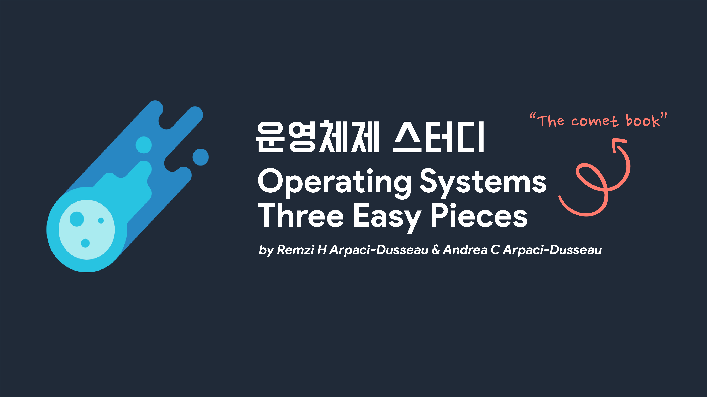

# 운영체제 스터디

## 📖 교재

- [**Operating Systems: Three Easy Pieces (OSTEP)**](https://pages.cs.wisc.edu/~remzi/OSTEP/)
    
    *[#1 Best Seller* in Computer Operating Systems Theory](https://www.amazon.com/gp/bestsellers/books/3863/ref=zg_b_bs_3863_1)
    
- 영문 PDF 파일
    
    [Operating Systems: Three Easy Pieces](https://pages.cs.wisc.edu/~remzi/OSTEP/)
    

## 📜 스터디 진행 방식

- [깃헙 Repository](https://github.com/2022-PNU-CS-Study/OperatingSystem)에 각자 각 장별로 공부한 내용을 정리합니다.
- 문서 양식은 따로 정해놓지 않을게요. 각자 자유롭게 자기 스타일로 정리해주세요.
- 단, 바로 main 브랜치에 push 하는 것이 아니라 PR을 생성해서 다른 팀원들에게 review 요청합니다.
- 다른 팀원들이 모두 approve 하면 PR 머지해주세요.
- 각자 다른 팀원들 글을 review 하면서 잘못되었거나 부족해 보이는 부분에 대해 부담없이 comment로 보충하고 토의했으면 좋겠습니다.
- 오프라인 미팅은 매주 수요일 저녁 18시 or 19시에 진행합니다.
- 미팅은 각 장별로 간단한 발표와 각자 공부했던 내용에 대해 공유하는 자리입니다.
- 발표에 대한 자세한 내용은 아래를 참고해주세요.

## 🎙 발표

- 각 장별로 (사이즈가 작으면 여러장) 한 명씩 발표하되, 발표자 제외 다른 팀원들도 물론 공부해와야 합니다.
- 발표 길이는 길지 않아도 무방합니다. (훑는 정도여도 무방, 발표 부담을 줄이기 위해)
- 발표 부담을 줄이는 대신, 모든 팀원들이 각 장별로 공부한 내용에 대해 할 말들을 좀 준비해왔으면 좋을 것 같습니다.
- 위의 할 말들에 대한 예시로는, "이런 부분은 좀 어려웠다.", "이런 부분이 흥미로웠다.", "이런 부분은 좀 더 싶게 공부해봤는데 이런 내용도 있더라.", "이런 내용 혹시 알고 있었냐"...등등 아무런 내용이라도 괜찮습니다.

## 🗂 Github 파일 컨벤션

- 각 챕터별 디렉토리에 각자 정리한 내용을 올려주세요.
- 디렉토리 이름은 해당 챕터의 이름입니다. (e.g. `Chapter 3 - 가상화에 관한 대화`)
- 마크다운 파일은 `chap1_김모모.md`으로 생성해주세요.
- 마크다운에 필요한 에셋들은 챕터별 디렉토리 안에 asset 디렉토리를 따로 생성해서 거기에 올려주세요.

## 🖋 PR

- PR 만드실 때 브랜치는 master에서 `chap1_김모모`으로 생성해주세요.
- PR title 이나 commit title 은 자유롭게 작성해주세요.

## 🥤불참 패널티

- 불참 OR 해당 주차 학습을 못했을 시
- 벌금은 조금 부담스러울 수 있으니 해당 주차 혹은 그 다음 주차에 팀원들에게 커피 한잔씩 사주기

## 👩‍💻🧑‍💻 스터디원
 |  |  | 
:---: | :---: | :---: | :---: |
혜원([@YumYumNyang](https://github.com/YumYumNyang)) | 진호([@zzzinho](https://github.com/zzzinho)) | 우영([@wooyoung-tom](https://github.com/wooyoung-tom)) | 재영([@jaeyeong951](https://github.com/jaeyeong951))
