# 13장. 주소 공간의 개념

시분할 시스템이 대중화되면서 운영체제에게 새로운 요구 사항이 부과되었다. 여러 프로그램이 메모리에 동시에 존재하려면 **보호(protection)** 가 중요한 문제가 된다.

## 주소 공간

- 운영 체제가 만든 **사용하기 쉬운(easy to use)** 메모리 개념
- 실행 중인 프로그램이 가정하는 메모리의 모습
- 실행 프로그램의 모든 메모리 상태를 갖고 있다. (예를 들어, 코드, 스택, 힙 등)

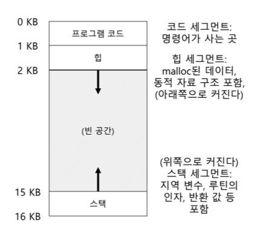

> ❓ 메모리를 어떻게 가상화하는가?
>
>운영체제는 물리 메모리를 공유하는 다수의 프로세스에게 어떻게 프로세스 전용의 커다란 주소 공간이라는 개념을 제공할 수 있는가?

운영체제가 **메모리를 가상화(virtualizing memory)** 한다

- 실행 중인 프로그램은 자신이 특정 주소의 메모리에 탑재되고 매우 큰 주소 공간을 가지고 있다고 생각하지만, 현실과는 다르기 때문이다.

## 가상화의 목표

### 투명성(transparency)

- 운영체제는 실행 중인 프로그램이 가상 메모리의 존재를 인지하지 못하도록 구현해야 한다.
- 프로그램은 메모리가 가상화되었다는 사실을 인지해서는 안된다.
- 오히려 프로그램은 자신이 전용 물리 메모리를 소유한 것 처럼 행동해야 한다.

### 효율성(efficiency)

- 운영체제는 가상화가 시간과 공간 측면에서 효율적이도록 해야 한다.
- 시간적으로는 프로그램이 너무 느리게 실행되서는 안된다.
- 공간적으로는 가상화를 지원하기 위한 구조를 위해 너무 많은 메모리를 사용해서는 안된다.

### 보호(protection)

- 운영체제는 프로세스를 다른 프로세스로부터 보호해야 한다.
- 운영체제 자신 또한 프로세스로부터 보호해야 한다.

## 고립(isolate)의 원칙

신뢰할 수 있는 시스템을 구축하는 데 중요한 원칙이다.

두 개체가 서로 적절하게 고립된 경우, 한 개체가 실패하더라고 상대 개체에 아무 영향을 주지 않는다는 것을 암시한다.

운영체제는 프로세스를 서로 고립시키기 위해 노력하고 이런 방식으로 한 프로세스가 다른 프로세스에게 피해를 주는 것을 방지한다.

더 나아가 메모리 고립을 사용하여 운영체제는 프로그램이 운영체제 동작에 영향을 줄 수 없다는 것을 보장한다.

---

# 14장. 막간: 메모리 관리 API

C 프로그램이 실행되면, 두 가지 유형의 메모리 공간이 할당된다.

- 스택(stack) 메모리
    - 할당과 반환은 컴파일러에 의해 *암묵적으로* 이루어진다.
    - 자동(automatic) 메모리 라고도 불린다.
    - 오래 유지되어야 하는 정보는 저장하지 않는 것이 좋다.
- 힙(heap) 메모리
    - 모든 할당과 반환이 프로그래머에 의해 *명시적으로* 처리된다.
    - 오래 유지되어야 하는 변수를 저장하기 위한 메모리이다.

## malloc() 함수

호출은 매우 간단하다. 힙에 요청할 공간의 크기를 넘겨주면, 성공했을 경우 새로 할당된 공간에 대한 포인터를 사용자에게 반환하고 실패했을 경우 `NULL`을 반환한다.

```c
#include <stdlib.h>
...
void *malloc(size_t size);
```

`malloc()` 의 인자는 `size_t` 타입의 변수이고, 이 변수는 필요 공간의 크기를 바이트 단위로 표시한 것이다.

`malloc()` 은 void 타입에 대한 포인터를 반환하는데, 이것은 주소만 넘겨주고 해당 주소 공간에 어떤 타입의 자료를 저장할 지는 프로그래머가 결정하게 하는 전형적인 C언어의 방식이다.

## free() 함수

더 이상 사용되지 않는 힙 메모리를 해제하기 위해 프로그래머는 `free()` 를 호출한다.

```c
int *x = malloc(10 * sizeof(int));
...
free(x);
```

`malloc()` 에 의해 반환된 포인터를 인자로 받는다. 할당된 영역의 크기는 라이브러리가 알고 있기 때문에 전달하지 않는다.

## 흔한 오류들

### 메모리 할당 잊어버리기

```c
char *src = "hello";
char *dest;  // 할당을 안했네?
strcpy(dest, src);  // segfault!
```

- **세그멘테이션 폴트(segmentation fault)** 가 발생할 가능성이 높다.

```c
char *src = "hello";
char *dest = (char *) malloc(strlen(src) + 1);  // malloc 으로 할당
strcpy(dest, src);  // 제대로 동작
```

### 메모리를 부족하게 할당받기

- **버퍼 오버플로우(buffer overflow)** 라고 불린다.

```c
char *src = "hello";
char *dest = (char *) malloc(strlen(src));  // src 보다 사이즈가 작다.
strcpy(dest, src);
```

### 할당받은 메모리 초기화하지 않기

- `malloc()` 을 제대로 호출했지만, 새로 하당받은 데이터 타입에 특정 값을 넣는 것을 잊었을 때
- **초기화되지 않은 읽기(uninitialized read)**, 즉 힙으로부터 알 수 없는 값을 읽는다.

### 메모리 해제하지 않기

- **메모리 누수(memory leak)**, 메모리 해제를 잊었을 때 발생한다.
- 장시간 실행되는 응용 프로그램이나 또는 운영체제 자체와 같은 시스템 프로그램에서 큰 문제이다.
- 한 바이트라도 명시적으로 할당받았으면, 해제하는 습관을 들이자.

### 메모리 사용이 끝나기 전에 메모리 해제하기 (dangling pointer)

- 추후에 그 포인터를 사용하면, 프로그램을 크래시 시키거나 유효 메모리 영역을 덮어쓸 수 있다.

### 반복적으로 메모리 해제하기 (이중 해제, double free)

- 메모리 할당 라이브러리가 어찌할 바 모르게 되고, 가장 흔히 크래시가 발생한다.

### free() 잘못 호출하기

- `free()` 에 `malloc()` 받은 포인터를 전달하는 게 아닌 다른 값을 전달했을 때 발생
- **유효하지 않은 해제(invalid free)** 는 매우 위험

---

# 15장. 주소 변환의 원리

>❓ 어떻게 효율적이고 유연하게 메모리를 가상화하는가
>
>- 어떻게 효율적인 메모리 가상화를 구축할 수 있을까?
>- 프로그램이 필요로 하는 유연성을 어떻게 제공하는가?
>- 프로그램이 접근할 수 있는 메모리의 위치에 대한 제어를 어떻게 유지하는가?
>- 메모리 접근을 어떻게 적절히 제한할 수 있는가?
>- 어떻게 이 모든 것을 효율적으로 할 수 있는가?

우리가 다룰 기법은 **하드웨어-기반 주소 변환(hardware-based address translation)** 또는 그냥 짧게 **주소 변환(address translation)** 이다.

프로그램의 모든 메모리 참조를 실제 메모리 위치로 재지정하기 위하여 하드웨어가 주소를 변환한다.

먼저 몇가지 가정이 필요하다.

- 사용자 주소 공간은 물리 메모리에 연속적으로 배치되어야 한다.
- 주소 공간의 크기는 너무 크지 않고, *물리 메모리 크기*보다 작다.
- 각 주소 공간의 크기는 같다.

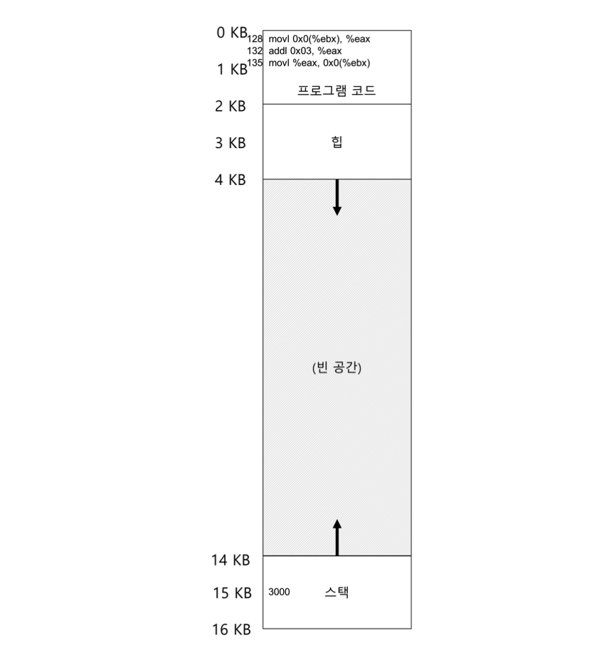

프로그램 관점에서 **주소 공간**은 주소 0부터 시작하여 최대 16KB 까지이다. 프로그램이 생성하는 모든 메모리 참조는 이 범위 내에 있어야 한다.

메모리 가상화를 위해 운영체제는 프로세스를 물리 메모리 주소 0이 아닌 다른 곳에 위치시키고 싶어한다. 어떻게 하면 프로세스 모르게 메모리를 다른 위치에 **재배치** 하느냐가 우리가 해결해야 할 문제이다.

이 프로세스의 주소 공간이 메모리에 배치되었을 때 가능한 물리 메모리 배치의 하나의 예시가 다음 그림과 같다.

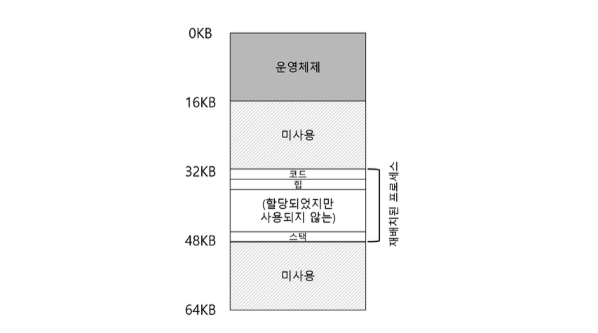

- 물리 메모리의 첫 번째 슬롯은 운영체제 자신이 사용한다.
- 위 예시의 프로세스는 물리 주소 32KB에서 시작하는 슬롯에 재배치 되었다.

## 동적(하드웨어-기반) 재배치 - 베이스와 바운드(base and bound)

>👉 주소의 재배치가 실행 시에 일어나고, 프로세스가 실행을 시작한 이후에도 주소 공간을 이동할 수 있다.

각 CPU 마다 2개의 하드웨어 레지스터가 필요하다.

- **베이스(base)** 레지스터
  - 원하는 위치에 주소 공간을 배치할 수 있게 한다.
  - `physical address = virtual address + base`
  - 프로세스가 생성하는 메모리 참조는 **가상 주소(virtual address)** 이다.
  - 하드웨어는 베이스 레지스터의 내용을 이 주소에 더하여 **물리 주소(physical address)** 를 생성한다.
- **바운드(bound)** 레지스터 - **한계(limit)** 레지스터
  - 보호를 지원하기 위해 존재한다.
  - 메모리 참조가 합법적인지 확인하기 위해 가상 주소가 바운드 안에 있는지 확인한다.
  - 프로세스가 오직 자신의 주소 공간에만 접근한다는 것을 보장한다.

베이스-바운드 방식의 가상 메모리 구현을 위해서 운영체제가 반드시 개입되어야 하는 중요한 세 개의 시점이 존재한다.

- 프로세스가 생성될 때 운영체제는 주소 공간이 저장될 메모리 공간을 찾아 조치를 취해야 한다.
- 프로세스가 종료될 때, 즉 정상적으로 종료될 때 또는 잘못된 행동을 하여 강제적으로 종료될 때 프로세스가 사용하던 메모리를 회수하여 다른 프로세스나 운영체제가 사용할 수 있게 해야 한다.
- 운영체제는 문맥 교환이 일어날 때에도 몇 가지 추가 조치를 취해야 한다.
  - 실행 중인 프로세스를 중단시킬 때, 프로세스 별 자료구조(**프로세스 구조체(process structure)** 또는 **프로세스 제어 블럭(process control block, PCB)**) 내에 베이스-바운드 레지스터의 값을 저장해야 한다.
  - 실행 중인 프로세스를 다시 시작할 때 또는 처음 실행시킬 때, 프로세스에 맞게 CPU의 베이스-바운드 값을 설정해야 한다.
- 운영체제는 예외 핸들러 또는 호출될 함수를 제공해야 한다.

---

# 16장. 세그멘테이션

기본적인 베이스-바운드 방식은 메모리 낭비가 심하며, 주소 공간이 물리 메모리보다 큰 경우 실행이 매우 어려워 유연성이 없다고 볼 수 있다.

>❓ 그렇다면 스택과 힙 사이에 잠재적으로 큰 빈 영역이 존재하는 주소 공간을 어떻게 지원할까?

## 세그멘테이션: 베이스/바운드(base/bound)의 일반화

오직 하나의 베이스-바운스가 존재하는 것이 아닌, 주소 공간의 논리적인 **세그멘트(segment)** 마다 베이스-바운스가 존재한다.

### 세그멘트(segment)

- 특정 길이를 가지는 연속적인 주소 공간
- 우리 기준의 주소 공간에는 코드, 스택, 힙 세 종류의 세그멘트가 있다.

>👉 운영체제는 각 세그멘트를 물리 메모리의 각기 다른 위치에 배치할 수 있고, 사용되지 않는 가상 주소 공간이 물리 메모리를 차지하는 것을 방지할 수 있다.

## 예시

아래 그림과 같은 주소 공간을 물리 메모리에 배치하려고 한다.

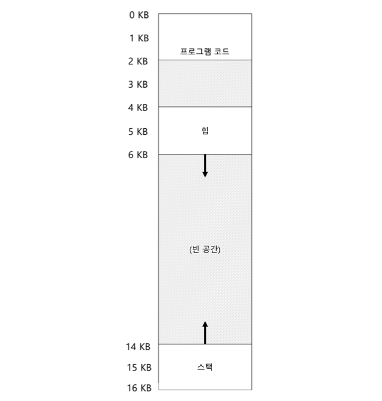

- 각 코드, 힙, 스택 세그먼트 각각의 베이스-바운드를 이용하여 독립적으로 물리 메모리에 배치할 수 있다.

아래 그림에서는 64KB 의 물리 메모리에 3개의 세그멘트와 운영체제용으로 예약된 16KB 영역이 존재한다.

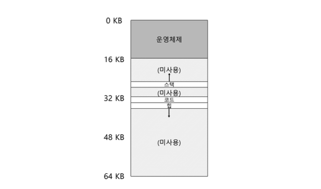

- 사용중인 메모리에만 물리 공간이 할당된다.
- **사용되지 않은 영역이 많은 대형 주소 공간(sparse address space)** 을 수용할 수 있다.

이 예시의 경우 3쌍의 베이스-바운드가 필요하다. 다음 그림은 각 레지스터의 값을 보여준다.


1. 가상 주소 100 번지를 참조한다고 가정하자. (코드 세그멘트)
  1. 하드웨어가 베이스 값에 이 세그멘트의 오프셋(이 경우, 100)을 더해 물리 주소는 `100+32KB` 또는 `32868` 이 된다.
  2. 주소가 범위 내에 있는지 검사하고, 물리 메모리 주소를 읽는다.
2. 가상 주소 4200 번지를 참조한다고 가정하자. (힙 세그멘트) - 주의!!
  1. 먼저 힙 안에서의 오프셋, 즉 주소가 참조하는 바이트가 이 세그멘트 시작으로부터 몇 번째 바이트인지를 얻어야 한다.
  2. 힙은 가상 주소 `4KB(4096)` 에서 시작하기 때문에 오프셋 4200은 실제로는 `4200-4096=104` 가 된다.
  3. 얻은 오프셋(104)을 베이스 레지스터의 물리주소(34KB)에 더해 원하는 결과 `34920` 을 얻게 된다.

그렇다면 하드웨어는 가상 주소가 어느 세그멘트를 참조하는지, 그리고 그 세그멘트 안에서 오프셋은 얼마인지를 어떻게 알 수 있는지 알아보자.

### 가상 주소의 최상위 몇 비트를 기준으로 주소 공간을 여러 세그멘트로 나눈다.

이 때까지의 예시로는 3개의 세그멘트가 있으니까 2비트가 필요하다.

아래 그림과 같이 나타낼 수 있을 것이다.


여기서 우리는 세 개의 세그멘트를 사용하기 때문에 2비트라면 하나는 미사용인 채로 남는데, 즉 전체 주소 공간의 1/4은 사용이 불가능하다는 것이다.

이를 해결하기 위해 일부 시스템은 코드와 힙을 하나의 세그멘트에 저장하고 1비트만 사용한다.

### 묵시적(implicit) 접근 방식에서는 주소가 어떻게 형성되었나를 관찰한다.

예를 들어 주소가 프로그램 카운터에서 생성되었다면(즉, 명령어 반입) 주소는 코드 세그멘트 내에 있을 것이다.

또한, 스택 또는 베이스 포인터에 기반을 둔다면 스택 세그멘트 내에 있을 것이다.

이제 주소 공간의 중요한 구성 요소인 스택을 다뤄보자.

## 스택

- 다른 세그멘트들과는 반대 방향으로 확장된다.
- 간단한 하드웨어가 추가로 필요하다.
  - 베이스-바운드 뿐만 아니라, 세그멘트가 어느 방향으로 확장하는지도 알아야 한다.


## 세그멘트 공유

메모리를 절약하기 위래 때로는 주소 공간들 간에 특정 메모리 세그멘트를 **공유**하는 것이 유용하다. 특히, **코드 공유**가 일반적이다.

공유를 지원하기 위해서는 하드웨어에 **protection bit** 의 추가가 필요하다.


- 이렇게 되면 가상 주소가 범위 내에 있는지 확인하는 것 이외에 특정 액세스가 허용되는지를 확인해야 한다.

## 당연히, 세그멘테이션도 문제점이 있다.

먼저 운영체제 문제,

- 문맥 교환 시 운영체제는 어떤 일을 해야하는가?
  - 세그멘트 레지스터의 저장과 복원
- 미사용 중인 물리 메모리 공간의 관리
  - 운영체제는 새로운 주소 공간의 세그멘트를 위한 비어있는 물리 메모리 영역을 찾을 수 있어야 한다.
  - 프로세스가 많은 세그멘트를 가질 수도 있고, 각 세그멘트의 크기가 다를 수 있다.

그 다음 일반적인 문제,

- 물리 메모리가 빠르게 작은 크기의 빈 공간들로 채워진다.
  - 새로 생겨나는 세그멘트에 할당하기가 힘들어진다.
  - 기존 세그멘트를 확장하는 데에도 도움이 되지 않는다.
  - 이를 **외부 단편화(external fragmentation)** 이라고 한다.

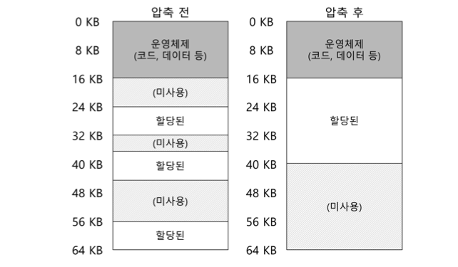

위 예시에서 새로운 프로세스가 생성되어 20KB를 할당하려고 한다고 가정해보자.

24KB의 빈 공간이 존재하기는 하지만, 하나의 연속된 공간이 아니기 때문에 요청을 충족시킬 수 없다.

이 문제의 해결책 중 하나는 기존의 세그멘트를 정리하여 물리 메모리를 **압축(compact)** 하는 것이다.

1. 운영체제는 현재 실행중인 프로세스를 중단한다.
2. 그들의 데이터를 하나의 연속된 공간에 복사한다.
3. 세그멘트 레지스터가 새로운 물리 메모리 위치를 가리키게 한다.

하지만, 세그멘트 복사는 메모리에 부하가 큰 연산이고 일반적으로 상당량의 프로세서 시간을 사용하기 때문에 압축은 비용이 많이 든다.

## 추가 정리 (Pros & Cons)

### Pros

- 주소 공간의 sparse allocation 이 가능하다.
  - 스택과 힙은 독립적으로 자란다.
  - 내부 단편화가 없다.
- 빠르고, 쉬우며 하드웨어에 알맞다.
- 세그멘트들을 공유하기 쉽다.
  - 베이스-바운드에 같은 정보를 넣을 수 있다.
  - 코드나 데이터 공유가 세그멘트 레벨에서 가능하다.
- 각각의 세그멘트 별로 동적 재할당이 지원된다.

### Cons

- 각각의 세그멘트가 연속적으로 할당되어야 한다.
- 세그멘테이션이 여전히 충분히 유연하지가 않다.

---

# 17장. 빈 공간 관리

>❓ 빈 공간을 어떻게 관리할까?
>
>- 가변 크기의 요구를 충족시켜야 할 때, 빈 공간은 어떻게 관리되어야 하는가?
>- 단편화를 최소화하기 위해 어떤 전략을 사용할 수 있는가?
>- 여러 대안들의 시간, 공간적 오버헤드는 어떻게 되는가?

## 먼저, 시작 전 가정부터 해보자.

- `malloc()` 과 `free()` 에서 제공하는 것과 같은 기본 인터페이스를 가정한다.
- 힙의 빈 공간을 관리하기 위해 링크드리스트를 사용한다.
  - 물론, 빈 공간을 표현할 수 있는 자료구조면 어떤 것이든 가능하다.
- 클라이언트에게 할당된 메모리는 다른 위치로 재배치될 수 없다.

## 저수준 기법들 부터 알아보자.

### 분할(splitting) 및 병합(coalescing)

빈 공간 리스트는 힙에 있는 빈 공간들의 집합이다. 아래와 같은 힙이 있다고 가정해보자.


그렇다면 빈 공간 리스트에 대한 그림은 아래와 같이 나타낼 수 있다.


여기서 10바이트를 초과하는 모든 요청은 실패하여 `NULL`을 반환한다. 10바이트에 대한 요청은 둘 중 하나 선택하면 되니까 쉽게 충족된다. 그렇다면 10바이트보다 작은 요청에 대해서는 어떻게 될까?

**분할(splitting)**

- 요청을 만족시킬 수 있는 빈 청크를 찾아 이를 둘로 분할한다.
- 첫 번째 청크는 호출자에게 반환된다.
- 두 번째 청크는 리스트에 남게 된다.

위에서 리스트의 두 번째 원소를 사용하여 요청을 충족시키기로 했다면, `malloc()` 은 20(1바이트가 할당된 영역의 주소) 을 반환하고 최종 빈 리스트는 다음과 같이 될 것이다.


분할에 당연히 동반되는 기법은 빈 공간의 **병합(coalescing)** 이다.

다시 예시를 보자. 만약 free(10)을 호출하여 힙 중간의 공간을 반환한다면 아래 리스트처럼 될 것이다.


이렇게 되면 힙 전체가 비어있지만, 청크가 3개로 나누어져 있기 때문에 20바이트를 요청하는 경우에 실패한다. 이를 해결하기 위해 메모리 청크가 반환될 때 빈 공간들을 합친다.

- 메모리 청크를 반환할 때 해제되는 청크의 주소와 바로 인접한 빈 청크의 주소를 살핀다.
- 새로 해제된 빈 공간이 왼쪽의 빈 청크와 바로 인접해 있다면 병합한다.


### 할당된 공간의 크기 파악

이 작업을 위해 추가 정보를 **헤더(header)** 블럭에 저장한다. 헤더 블럭은 메모리에 유지되며 보통 해제된 청크 바로 직전에 위치한다.

예를 살펴보자, 이번에는 `ptr`이 가리키는 크기 20바이트의 할당된 블럭을 검토하고있다. 사용자는 `malloc()` 을 호출하고 그 결과를 `ptr`에 저장하였다고 가정하자.

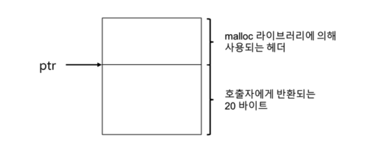

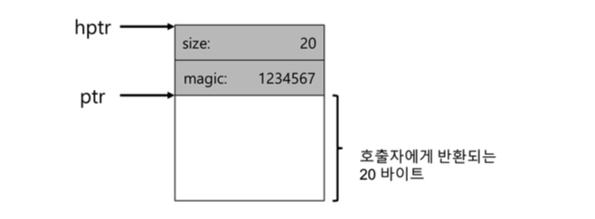

- 헤더는 적어도 할당된 공간의 크기는 저장한다.
- 해제 속도 향상을 위한 포인터, 무결성 검사를 위한 매직 넘버 및 기타 정보를 저장할 수 있다.

주의할 점이 있다. 빈 영역의 크기는 헤더 크기 더하기 사용자에게 할당된 영역의 크기가 된다.

### 빈 공간 리스트 내장

메모리 할당 라이브러리 루틴에서 `malloc()` 호출이 불가능하기 때문에, 빈 공간 내에 리스트를 구축해야 한다.

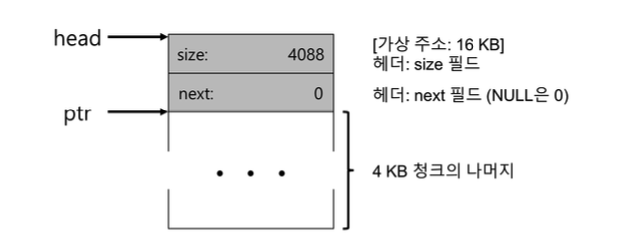

- 하나의 빈 청크만 가진 힙
- 헤더를 제외한 나머지 공간들이 빈 공간 리스트가 된다.

여기에 100바이트 메모리 청크가 요청되었다고 생각해보자.

하나의 청크가 100바이트를 충족하기 때문에 분할이 수행될 것이다. 헤더를 8바이트 크기라고 가정하면 아래 그림과 같아질 것이다.

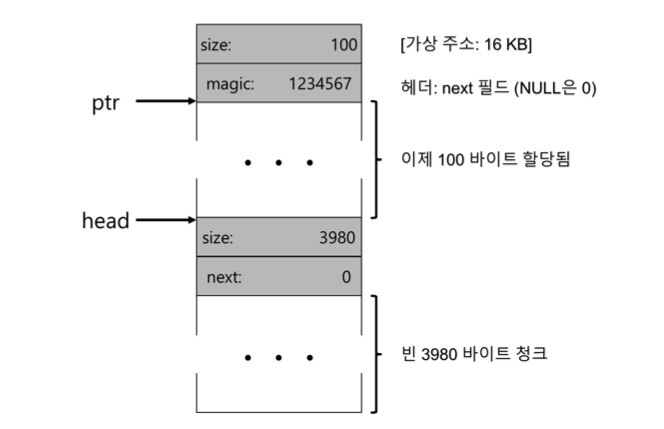

- 헤더 8바이트와 100바이트 요청을 합한 총 108바이트가 할당되었다.
- 남은 빈 노드는 3980바이트로 축소된다.

그렇다면 100바이트씩 할당된 3개의 공간이 존재하는 힙을 살펴보자.

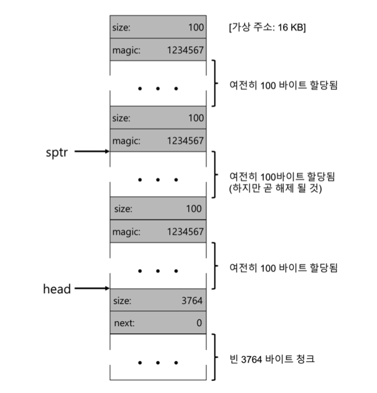

그렇다면 여기서 `free()` 를 통해 일부 메모리를 반환하면 어떻게 될지 알아보자.

위 그림에서 `free(16500)` 을 호출하여 가운데 청크를 반환하려고 한다.

- 라이브러리는 빈 공간의 크기를 파악한다.
- 빈 청크를 빈 공간 리스트에 삽입한다.

이 과정을 거치면 아래 그림과 같다.

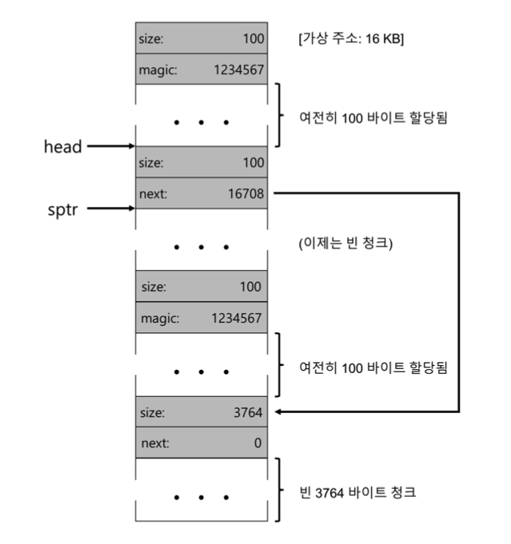

하지만 중간에 비워버린 100바이트 때문에 단편화가 발생한다.

해결책은 아주 간단하다. 리스트를 순회하면서 인접한 청크를 병합하면 된다.

### 힙의 확장

힙의 공간이 부족한 경우는 어떻게 할까? 가장 쉬운 방법은 단순히 실패를 반환하는 것이다.

`NULL`을 반환하는 것은 훌륭한 접근법이라고 할 수 있다.

## 빈 공간 할당을 위한 기본 전략들을 본격적으로 알아보자.

### 최적 적합(Best Fit)

- 빈 공간 리스트를 검색하여 요청한 크기와 같더나 더 큰 빈 메모리 청크를 찾는다.
- 후보 그룹 중 가장 작은 크기의 청크를 반환한다.
- 빈 공간 리스트를 한 번만 순회하면 반환할 정확한 블럭을 찾을 수 있다.
- 항상 전체를 검색해야 하므로 성능 저하를 초래할 수 있다.

### 최악 적합(Worst Fit)

- 가장 큰 빈 청크를 찾아 요청된 크기 만큼만 반환한다.
- 남는 부분은 빈 공간 리스트에 계속 유지한다.
- 이 또한 항상 전체를 검색해야 하므로 성능 저하를 초래할 수 있다.
- 엄청난 단편화가 발생하는 것 또한 주의해야 한다.

### 최초 적합(First Fit)

- 요청보다 큰 첫 번째 블럭을 찾아서 요청만큼 반환한다.
- 항상 빈 공간 리스트 전체를 탐색할 필요가 없어 빠르다.
- 빈 공간 리스트의 순서를 관리하는 것이 쟁점이다.
  - **주소-기반 정렬(address-based ordering)** 을 사용하는 방법이 있다.
  - 리스트를 주소로 정렬하여 병합을 쉽게 하고, 단편화를 감소시킨다.

### 다음 적합(Next Fit)

- 마지막으로 찾았던 원소를 가리키는 추가적인 포인터를 유지한다.
- 빈 공간 탐색을 리스트 전체에 더 균등하게 분산시킨다.
- 리스트 첫 부분에만 단편화가 집중적으로 발생하는 것을 막는다.

## 다른 접근법에 대해서도 몇 가지 알아보자.

### 개별 리스트(segregated list)

- 특정 응용 프로그램이 한두 개 자주 요청하는 크기가 있다면, 그 크기의 객체를 관리하기 위한 별도의 리스트를 유지하는 것이다.
- 장점이 분명하다.
  - 특정 크기의 요청을 위한 메모리 청크를 유지하니까 단편화 가능성이 줄어든다.
  - 요청된 크기의 청크만 있어서 복잡한 리스트 검색이 필요없다.
- 물론 문제도 있다.
  - 지정된 크기의 메모리 풀과 일반적인 풀에 얼마만큼의 메모리를 할당해야 하는가?
  
>👉 이 문제를 해결하기 위해 슬랩 할당기(slab allocator) 를 사용한다.

### 이진 버디 할당기(binary buddy allocator)

- 요청을 충족시키기에 충분한 공간이 발견될 때까지 빈 공간을 2개로 계속 분할한다.
- 2의 거듭제곱 크기만 할당할 수 있기 때문에 **내부 단편화**가 생길 가능성이 높다.
- 병합할 때 너무 편해서 좋다.

### 기타

앞에서 설명한 접근 방식들의 한가지 문제점은 모두 **확장성**이다.

- 빈 공간들의 개수가 늘어남에 따라 리스트 검색이 매우 느려질 수 있다.
- 좀 더 정교한 할당기는 복잡한 자료 구조를 사용하여 이 비용을 줄인다.
  - 단순함과 성능을 교환하는 것이다.
  - 균형 이진 트리, 스플레이 트리, 부분 정렬 트리 등이 있다.