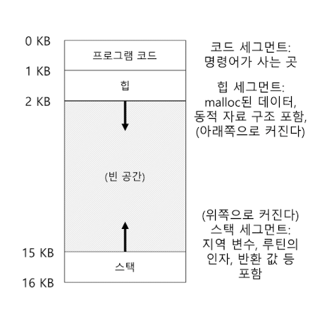
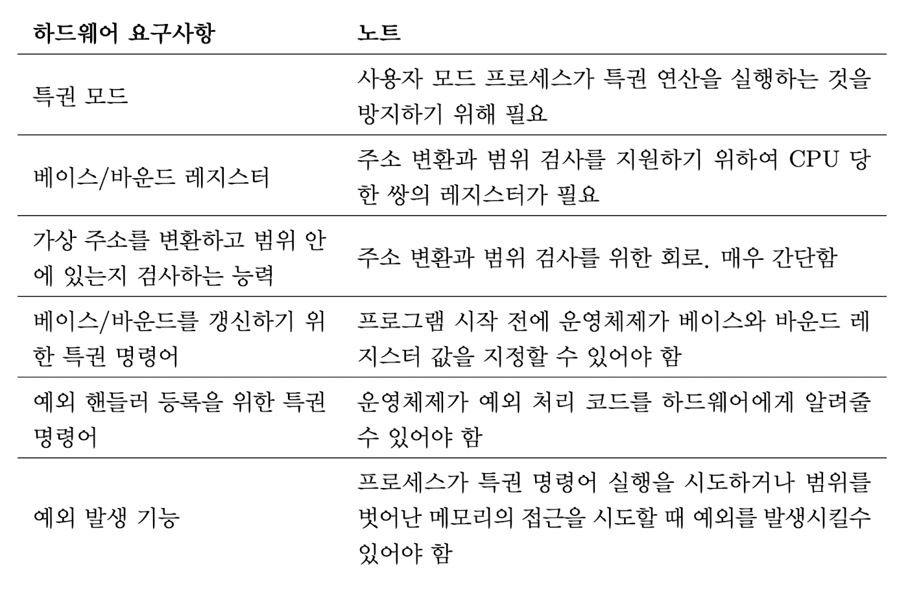

# 13 주소 공간의 개념

사용자 프로그램이 생성하는 모든 주소는 가상 주소

운영체제는 가상 주소를 실제 물리 주소로 변환해 원하는 정보의 위치를 찾아냄

가상 주소를 사용하는 이유?

- 사용하기 시스템을 제공하기 위함 - 대용량의 연속된 주소공간 제공
- 고립과 보호

# 1. 초기 시스템

메모리 0 부터 운영체제, 나머지 메모리에 실행중인 프로그램 존재

# 2. 멀티 프로그래밍과 시분할

멀티프로그래밍 - 여러 프로세스가 실행 준비, 운영체제가 전환하면서  실행

- CPU 이용률 증가
- 효율성 개선

→ 시분할 

## 시분할을 구현하는 방법

하나의 프로세스를 짧은 시간 동안 실행 

→ 너무 느리게 동작 (메모리가 커질수록 더) 

→ 프로세스 전환 시 프로세스를 메모리에 그대로 유지하면서, 운영체제가 시분할 시스템을 효율적으로 구현할 수 있게 해야함

### 새로운 요구 사항 → 보호(Protection)

한 프로세스가 다른 프로세스의 메모리를 읽거나 덮어 쓰면 안됨

# 3. 주소 공간

## 주소 공간(address space)

실행 중인 프로그램이 가정하는 메모리의 모습

- 코드
- 스택: 함수 호출 체인 상의 현재 위치, 지역 변수, 함수 인자와 반환 값, 하단에 위치
- 힙: 동적으로 할당되는 메모리, 상단에 위치
    
    
    
    

## 메모리 가상화(virtualizing memory)

실행중인 프로그램은 자신이 특정 주소의 메모리에 탑재되고 매우 큰 주소 공간을 가지고 있다고 생각

프로세스가 load 연산을 수행할 때, 운영 체제는 하드웨어의 지원을 통해 물리 주소를 읽도록 한다.

# 4. 목표

### 고립의 원칙

두 개체가 서로 적절하게 고립된 경우, 한 개체가 실패하더라도 상대 개체에 아무 영향을 주지 않음

메모리 고립을 사용하여 운영체제는 프로그램이 운영체제 동작에 영향을 줄 수 없다는 것을 보장

마이크로 커널은 모놀리식 커널보다 더 큰 신뢰성을 제공할 수 있음

## 투명성(transparency)

실행 중인 프로그램이 가상 메모리의 존재를 인지하지 못하도록 가상 시스템을 구현해야 함

## 효율성(efficiency)

운영체제는 가상화가 시간과 공간 측면에서 효율적이도록 해야함

## 보호(protection)

운영체제는 프로세스를 다른 프로세스로부터 보호해야하고 운영체제 자신도 프로세스로부터 보호해야 함

프로세스들을 서로 고립시킴

### 가상 주소

사용자 프로그램이 볼 수 있는 주소는 모두 가상 주소임

# 14 막간 메모리 관리 API

### 어떻게 메모리를 할당하고 관리해야 하는가

# 1. 메모리 공간의 종류

### 스택(stack) 메모리

할당과 반환이 컴파일러에 의해 암묵적으로 이루어짐

**자동 메모리**

### 힙(heap) 메모리

오랫동안 값이 유지되어야하는 변수를 위함

할당과 반환이 프로그래머에 의해 명시적으로 처리

# 2. malloc() 함수

힙에 요청할 공간의 크기를 넘겨주면 성공했을 경우에는 새로 할당된 공간에 대한 포인터 반환, 실패했을 경우 NULL 반환

malloc()의 인자는 size_t 타입의 변수 필요 공간의 크기를 바이트 단위로 표시

정확한 크기의 공간 요청을 위해 sizeof() 연산자를 사용

정수형 sizeof() 

- 4: 32비트 컴퓨터
- 8: 64비트 컴퓨터

문자열을 위한 공간 선언

malloc(strlen(s)+1) 

문자열 끝을 나타내는 문자를 위한 공간 확보

# 3. free() 함수

free()를 호출하여 더 이상 사용되지 않는 힙 메모리를 해제함

# 4. 흔한 오류

많은 새로운 언어들은 자동 메모리 관리(automatic memory management)를 지원

공간을 채제하기 위해 아무것도 호출하지 않음, 가비지 콜렉터가 참조되지 않는 메모리 해제

## 메모리 할당 잊어버리기

### 세그멘테이션 폴트(segmentation fault)

메모리 관련 문제 발생

## 메모리를 부족하게 할당받기

### 버퍼 오버플로우(buffer overflow)

목적지 버퍼 공간을 약간 부족하게 할당받는 것

## 할당받은 메모리 초기화하지 않기

### 초기화되지 않은 읽기(uninitiallized read)

새로 할당 받은 데이터 타입에 특정 값을 넣지 않은 경우

## 메모리 해제하지 않기

### 메모리 누수(memory leak)

메모리 해제을 잊었을 때

## 메모리 사용이 끝나기 전에 메모리 해제하기

### dangling pointer

메모리 사용이 끝나기 전에 메모리를 해제하면 이후에그 포인터를 사용했을 때 프로그램을 크래시시키거나 유효 메모리 영역을 덮어쓸 수 있음 

## 반복적으로 메모리 해제하기

### 이중 해제(double free)

프로그램 크래시가 일어남

> 프로세스가 종료한면 운영체제는 프로세스의 모든 메모리를 회수하므로 메모리 누수가 일어나지 않음
> 

## free() 잘못 호출하기

### 유효하지 않은 해제(invalid frees)

free()를 잘못 호출

## 요약

메모리 관련 오류 자주 발생

purify, valgrind - 오류를 찾아내는 도구

# 5. 운영체제의 지원

malloc, free는 시스템 콜이 아니라 라이브러리 함수

### brk 시스템 콜

프로그램의 break 위치를 변경하는  데 사용, 힙의 마지막 위치

새로운 break 주소를 나타내는 한 개의 인자를 받음

현재 break와 비교해 힙의 크기를 증가 또는 감소시킴

### sbrk 시스템 콜

brk와 비슷한 용도, 증가량만을 받아들임

### mmap() 함수

프로그램에 anonymous 메모리 영역을 만듦 - 스왑 공간에 연결된 영역

# 6. 기타 함수를

### calloc()

메모리 할당 영역을 0으로 채워서 반환, 초기화 오류를 방지

### realloc()

이미 할당된 공간에 대해 추가의 공간이 필요할 때

# 15 주소 변환의 원리

### 어떻게 효율적이고 유연하게 메모리를 가상화하는가

효율성과 제어, 유연성

### 하드웨어 기반 주소 변환(hardware-based address translation) 또는 주소 변환(address translation)

가상 주소를 물리 주소로 변환

하드웨어 - 저수준 기능 제공, 변환을 가속화

운영체제 - 정확한 변환, 메모리의 빈 공간, 사용 중인 공간을 항상 알고 있으며 메모리 사용 제어 및 관리

### 목표? 프로그램이 자신의 전용 메모리를 소유하고 그 안에 자신의 코드와 데이터가 있다는  환상

# 1. 가정

사용자 주소 공간은 물리 메모리에 연속적으로 배치되어야 한다고 가정

주소 공간이 물리 메모리 크기보다 작고, 각 주소 공간의 크기가 같다고 가정

# 2. 사례

프로그램 관점에서 주소 공간은 0~16KB라 하자

메모리 가상화를 위해 운영체제는 물리 메모리 주소 0이 아닌 다른 위치에 재배치 한다. 가상 주소 공간의 환상을 어떻게 제공할 수 있을까?

32KB 물리주소에 재배치 되었으면 16-32, 48-64 두 슬롯을 비어있음

# 3. 동적(하드웨어-기반) 재배치

## 베이스와 바운드(base and bound), 동적 재배치(dynamic relocation)

베이스, 바운드는 우리가 원하는 위치에 주소공간을 할당할 수 있도록 함, 프로세스가 오직 자신의 주소 공간에만 접근한다는 것을 보장

### 베이스(base) 레지스터

프로그램이 탑재될 물리 메모리 위치

physical address = virtual address + base

128: movl 0x0(%EBX), %eax

- 프로그램 카운터 128로 설정, 베이스 레지스터 값(32)에 가상주소(15)를 더해 물리주소(47)에 원하는 내용 탑재

### 바운드(bound) 또는 한계(limit) 레지스터

보호를 지원하기 위함, 위의 예시에서 바운드 레지스터는 항상 16KB

### 주소 변환, 동적 재배치

하드웨어는 프로세스가 참조하는 가사 주소를 받아들여 데이터가 실제로 존재하는 물리 주소로 변환 

<aside>
💡 소프트웨어 기반 재배치 - 정적 재배치
로더(loader)라는 소프트웨어가 실행파일의 모든 주소를 원하는 물리 메모리 오프셋으로 변경
보호기능이 없고 한번 배치되면 추후 주소 공간을 재배치하는 것이 어려움

</aside>

### 두 가지 방식

- 주소 공간의 크기를 저장하는 방식, 하드웨어가 가상 주소를 베이스 레지스터에 더하기 전에 먼저 바운드 레지스터와 비교
- 주소 공간의 마지막 물리 주소를 저장하는 방식, 하드웨어 먼저 베이스 레지스터를 더하고 결과가 바운드 안에 있는지 검사

# 4. 하드웨어 지원: 요약

운영체제는 특권(커널)모드에서 실행, 컴퓨터 전체에 대한 권한

응용프로그램은 사용자 모드에서 실행, 할 수 있는 일에 제한 

프로세스 상태 워드 - 현재 실행 모드

베이스 바운드 레지스터 자체적으로 제공 

하드웨어는 베이스 바운드 레지스터 값을 변경하는 명령어를 수행하기 위해 커널 모드에서 레지스터 변경

예외 발생시켜 예외 핸들러가 실행되도록 함

# 5. 운영체제 이슈

프로세스가 생성될 때 주소 공간이 저장될 메모리 공간을 찾아 조치를 취함 

### 운영체제가 반드시 개입되어야 하는 3개의 시점

1. 프로세스가 생성될 때 주소 공간이 저장될 메모리 공간을 빈 공간리스트에서 찾아 선택된 공간을 사용중이라 표시
2. 프로세스가 종료할 때 종료한 프로세스 메모리를 다시 빈 공간 리스트에 넣고 연관된 자료 구조 모두 정리
3. 프로세스 전환 시 베이스와 바운드 쌍을 저장하고 복원해야 함 - 프로세스 구조 (프로세스 제어 블럭)에 저장
4. 예외 핸들러 또는 호출될 함수를 제공

# 6. 요약

주소 변환 가상 메모리 기법을 통해 제한적 직접 실행 개념 확장

운영체제는 프로세스의 모든 메모리 접근을 제어, 항상 주소 공간의 범위 내에서 이루어지도록 보장

하드웨어를 사용해 빠르게 가상 주소를 물리 주소로 변환(효율성)

### 내부 단편화

할당된 영역의 내부 공간이 사용되지 않음

### 동적 재배치

내부 단편화 발생 → 비효율적

더 정교한 기법 필요 → 일반화된 base-and-bound 기법 “세그멘테이션(segmentation)”

# 16. 세그멘테이션

스택과 힙 사이에 사용되지 않는 큰 공간 → 메모리 낭비

### 대용량 주소 공간을 어떻게 지원하는가?

# 1. 세그멘테이션: 베이스 바운드의 일반화

주소 공간의 논리적인 세그멘트마다 베이스와 바운드 쌍이 존재

### 세그멘트

특정 길이를 가지는 연속적인 주소 공간

- 코드
- 스택
- 힙

각 세그멘트를 물리 메모리의 각기 다른 위치에 배치, 사용되지 않는 가상 주소 공간이 물리 메모리를 차지하는 것을 방지할 수 있음

참조가 일어나면 하드웨어는 베이스 값에 세그멘트의 오프렛을 더해 주소가 범위 내에 있는지 검사하고 내에 있으려면 물리 메모리 주소를 읽음

### 세그멘트 폴트, 세그멘트 위반

불법적인 주소 접근 시 발생

# 2. 세그멘트 종류의 파악

## 주소공간을 여러 세그멘트로 나눔

최상위 비트 2, 나머지 세그멘트 내의 오프셋

00 -  코드 세그멘트

01 - 힙 세그멘트

11 - 스택 

3개의 세그멘트만 존재해서 전체 주소 공간의 1/4 사용이 불가능 → 코드와 힙을 하나의 세그멘트, 세그멘트 선택에 1비트만 사용

### 묵시적(implicit) 접근 방식

주소가 어떻게 형성되었나를 관찰하여 세그멘트를 결정

# 3. 스택

다른 세그멘트들과 반대 방향으로 확장, 다른 방식의 변환 필요

## 세그멘트가 확장되는 방향를 저장하는 레지스터

주소가 커지는 쪽으로 확장 - 1

주소가 작아지는 쪽으로 확장 - 0

# 4. 공유 지원

메모리를 절약하기 위해 세그멘트 공유

공유를 지원하기 위해 하드웨어에 protection bit의 추가가 필요

코드 세그멘트를 읽거나 쓸수있는지, 실행시킬 수 있는지 나타냄

# 5. 소단위 대 대단위 세그멘테이션

### 대단위(coarse-grained)

소수의 세그멘트만을 지원하는 시스템에만 초점, 주소 공간을 큰 단위의 공간으로 분할

### 소단위(fine-grained)

주소 공간을 작은 크기의 공간으로 잘게 분할

### 세그멘트 테이블

여러 세그멘트의 정보를 메모리에 저장

# 6. 운영체제의 지원

시스템이 각 주소 공간 구성 요소를 별도로 물리 메모리에 재배치 하므로 물리 메모리를 엄청나게 절약할 수 있음

### 세그멘테이션의 문재

1. 문맥 교환 → 세그맨트 레지스터의 저장과 복원
2. 미사용 중인 물리 메모리 공간의 관리 
3. 외부 단편화 발생

### 외부 단편화(external fragmentatinon)

물리 메모리가 빠르게 작은 크기의 빈 공간들로 채워짐 

### 외부 단편화 해결 → 압축(compact)

실행 중인 프로세스를 중단하고 하나의 연속된 공간에 복사해 세그멘트 레지스터가 새로운 물리 메모리 위치를 가리키게 해큰 빈 공간을 확보할 수 있게 함

압축: 부하가 큼

### 빈공간 리스트를 관리하는 알고리즘 사용

- 최적 적합
- 최악 적합
- 최초 적합
- 버디 알고리즘

### 최적 적합

빈공간 리스트에서 요청된 크기와 가장 비슷한 크기의 공간을 할당

외부 단편화 여전히 존재

외부 단편화를 해결하는 유일한 최선책은 존재하지 않음

# 7. 요약

세그멘테이션 장점

- 메모리 가상화 효과적 실현
- 큰 공간에 대한 낭비를 피함
- 속도가 빠르고 변환 오버헤드 최소
- 코드 공유

문제

- 외부 단편화
- 유연성부족

# 17. 빈 공간 관리

### 빈 공간을 어떻게 관리하는가

세그멘테이션으로 물리 메모리 관리 → 외부 단편화 존재

관리하는 공간이 가변 크기 빈 공간들의 집합으로 구송

# 1. 가정

malloc과 free가 관리하는 공간은 힙(heap)

힙의 빈 공간 관리 링크드 리스트

외부 단편화 방지에 중점

클라이언트에게 할당된 메모리는 다른 위치로 재배치될 수 없다고 가정

# 2. 저수준 기법들

## 분할(splittng)

요청을 만족시킬 수 있는 빈 청크를 찾아  둘로 변환, 첫 번째 청크는 호출자에게 반환, 두 번째 청크는 리스트에 남음 

## 병합(coalescing)

인접한 빈 청크의 주소를 살펴보고 하나의 더 큰 빈 청크로 병합 

### 할당된 공간의 크기 파악

추가 정보를 헤더 블럭에 저장

- 해제 속도를 향상시키기 위한 추가 포인터, 부가적인 무결성 검사를 제공하기 위한 매직 넘버 및 기타 정보 저장

free(ptr)호출하면 라이브러리는 헤더의 시작 위치를 파악하기 위해 간단한 포인터 연산

매직넘버 기댓값과 비교해 안정성 검사 실시

새로 해제된 영역 계산(헤더크기 + 사용자에게 할당된 영역의 크기)

### 빈 공간 리스트 내장

힙을 초기화

메모리 청크 요청이 들어오면 충분한 크기의 청크를 탐색

분할하여 할당

할당된 공간 직전에 헤더 정보를 넣음

free를 호출하면 메모리 영역의 시작주소와 메모리 청크의 크기, 해제되는 청크의 헤더 크기를 모두 더한 값이 sptr

라이브러리 빈공간 크기 파악 후 빈공간 리스트에 삽입

단편화가 발생

리스트를 순회하면서 인접한 청크 병합

### 힙의 확장

힙의 공간이 부족한 경우?

- 실패 반환
- 더 많은 메모리 요청

# 3. 기본 전략

이상적인 할당기는 속도가 빠르고 단편화 최소

## 최적 적합(Best fit)

빈 공간 리스트에서 요청한 크기와 같거나 더 큰 빈 메모리 청크를 찾아 그 중 가장 작은 크기의 청크 반환

공간 낭비를 줄임, 전체를 검색해야해 성능 저하

## 최악 적합(Worst fit)

가장 큰 빈 청크를 찾아 요청된 크기만큼 반환, 남는 부분은 빈 공간 리스트에 계속 유지

엄청난 단편화 발생, 오버 헤드 큼

## 최초 적합(First fit)

요청보다 큰 첫 번째 블럭을 찾아 요청만큼 반환 

속도 빠름, 리스트의 시작에 크기가 작은 객체 많이 생길 수 있음

빈공간 리스트 순서를 관리하는 방법

- 주소 기반 정렬: 주소로 정렬하여 병합을 쉽게하고 단편화 감소

## 다음 적합(Next fit)

마지막으로 찾았던 원소를 가리키는 추가의 포인터

빈공간 탐색을 리스트 전체에 더 균등하게 분산 

리스트 첫 부분에만 단편이 집중적으로 발생하는 것을 방지 

최초 적합의 성능과 비슷

# 4. 다른 접근법

## 개별 리스트(Segregated list)

자주 요청하는 크기가 있으면 그 크기의 객체 관리를 위한 별도 리스트 유지

단편화 가능성을 줄이고 할당과 채제 요청을 신속하게

새로운 문제

- 얼마만큼의 메모리를 할당해야하는지

### 슬랩 할당기(slab allocator)

커널 객체를 위한 객체 캐시 할당

커널 객체: 자주 요청되는 자료구조

기존에 할당된 캐시 공간이 부족하면 상위 메모리 할당기에게 추가 슬랩 요청

빈 객체들을 사전에 초기화된 상태로 유지하므로 개별 리스트 방식보다 우수

객체당 잦은 초기화와 반납을 피해 오버헤드 감소

## 버디 할당

### 이지 버디 할당기(binary buddy allocator)

빈 메모리를 2^n인 하나의 큰 공간으로 생각, 충분한 공간이 발견될 때까지 2개로 분할 

내부 단편화 발생가능 

블럭이 채제될 때 재귀적으로 합병

## 기타 아이디어

### 확장성 문제 - 빈공간이 늘어날수록 검색 느려짐

- 균형 이진트리
- 스플레이 트리
- 부분 정렬 트리

### 현대 시스템 (멀티 프로세서 및 멀티 쓰레드) - Berger, Evans

# 5. 요약

기본적인 형태의 메모리 할당기