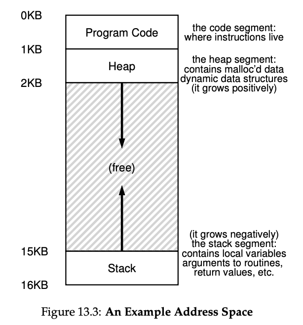
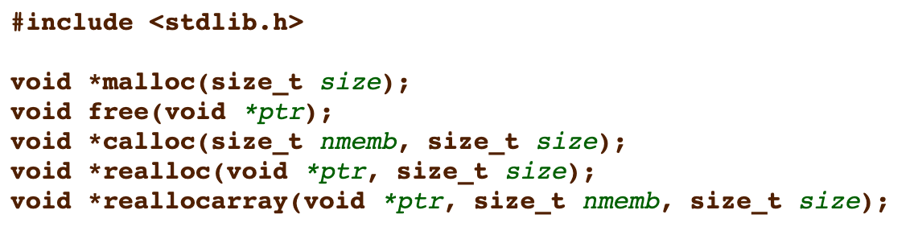
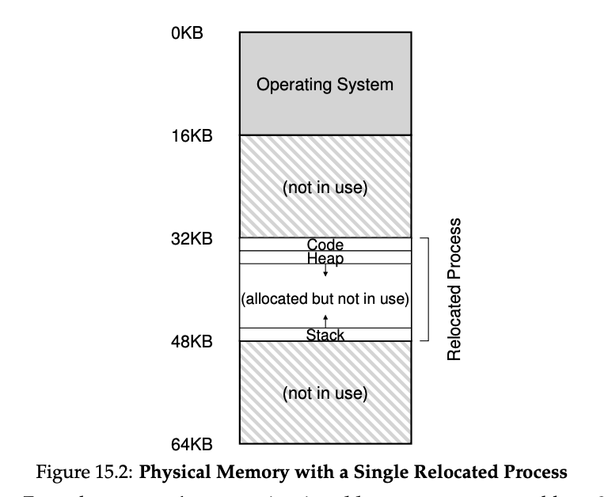
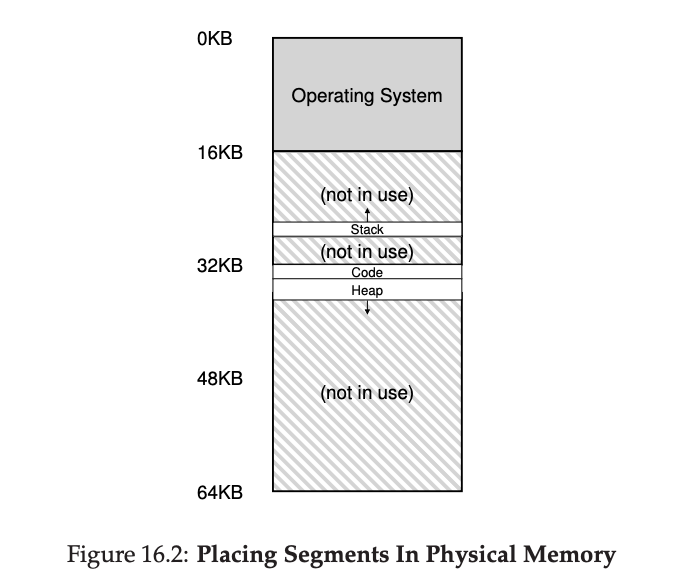
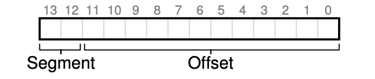
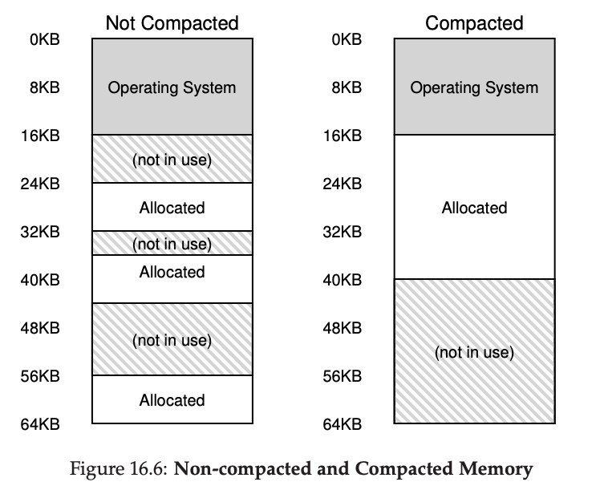

# 메모리 가상화

## 주소공간

> 운영체제는 프로세스에게 자신만의 전용 공간이 있다는 환상을 심어줄 책임이 있다.

주소 공간(address space)이란

- 현재 실행중인 프로그램이 가정한 메모리의 모습이다.
- 프로세스의 모든 메모리 상태를 나타낸다. (코드, 스택, 힙)

힙과 스택은 확장 가능해야 하기 때문에 주소 공간의 양 끝에 배치되어 크기가 커질수록 점점 중앙으로 모이는 형태가 만들어진다.

스택과 힙이라는 배치 형태는 꼭 지켜야만 하는 것은 아니며, 원한다면 주소 공간을 다른 방식으로 배치할 수 있다.



위 그림에서 0KB ~ 16KB 라는 주소는 프로세스가 보고있는 가상의 주소이며 실제 메모리의 물리 주소와는 다르다!

이와 같이 프로세스만의 주소 공간을 만드는 작업을 “메모리의 가상화”라고 부른다. 이는 운영체제가 담당하며 현대 모든 컴퓨터 시스템의 기저를 이룬다.

## 메모리 가상화의 목표

### 투명성

프로세스는 자신이 보고있는 메모리가 가상화 되었고 가상의 주소를 보고있다는 사실을 인지해서는 안된다.
자신만의 전용 물리 메모리를 소유한 것 처럼 보여야한다.

### 효율성

운영체제는 가상화를 시간, 공간적인 두가지 측면에서 모두 효율적으로 수행해야한다.

가상화를 너무 느리게 수행해서도 안되며, 가상화를 위해 너무 많은 메모리를 사용해서도 안된다.

이를 위해 운영체제는 TLB 와 같은 하드웨어의 지원을 받는다.

### 보호(격리)

운영체제는 프로세스를 다른 프로세스로부터 보호해야하고 운영체제 자신도 보호해야한다.

각 프로세스는 자신의 주소공간 밖의 어느 것도 접근할 수 있어서는 안된다. 이를 격리라고 부른다.

격리가 잘 유지되면 한 프로세스의 실패는 다른 프로세스에 아무런 영향도 줄 수 없다. 더 나아가 프로세스는 어떤 방식으로도 운영체제에 피해를 줄 수 없다. 이를 반드시 보장해야한다.

> 개발자가 프로그래밍을 하면서 볼 수 있는 모든 주소 또한 가상의 주소이다. 실제 물리 메모리의 주소를 알 수 있는 것은 오직 운영체제 뿐이다.

## 메모리 관리를 위한 API : malloc() & free()

주소 공간에는 메소드의 파라미터나 로컬 변수를 저장하기 위한 Stack과 더불어 동적으로 할당되는 변수를 저장하기 위한 Heap이 존재한다.

```cpp
void func() {
	int *x = (int *) malloc(sizeof(int));
}
```

위 코드를 잠시 살펴보자.

코드 한 줄에 스택과 힙의 할당이 모두 이루어지고있다. 우선 malloc()으로 int 크기만큼의 공간을 힙에 요구하고 그 주소를 반환받는다. 그리고 그 주소(힙 내부의 주소)는 스택에 저장되어 로컬 변수로 메소드 내에서 사용된다.



### malloc()

malloc 메소드는 인자로 힙에 요청하고 싶은 공간의 크기를 넘겨주면, 성공했을 경우 할당된 공간에 대한 포인터를 반환한다. (실패시 NULL)

malloc 은 void 타입에 대한 포인터를 반환하는데, 이는 주소만 넘겨주고 해당 주소 공간에 어떤 데이터를 저장하고 어떻게 사용할지는 개발자 당신이 알아서 하라는 전형적인 C 언어스러운 방식이다.

### free()

더 이상 사용되지 않는 힙 메모리를 할당 해제하기 위해 free() 메소드를 호출하자.

```cpp
int *x = malloc(10 * sizeof(int));
...
free(x);
```

아직 할당되지 않거나 유효하지 않은 포인터를 전달하면 무슨일지 일어날지 예상할 수 없다.

또 주의할 점이 있는데, free() 메소드를 호출했다고 해서 해당 주소에 있던 데이터가 당장 사라진다던지 내가 그 주소에 다시 할당받기 전까지 접근할 수 없는게 아니다.

### 동적 할당의 오류

> 프로그램이 한번 올바르게 실행되었음이 그 프로그램의 설계에 대한 올바름을 의미하지는 않는다.

malloc() 과 free() 를 사용하면서 흔히 발생하는 오류가 많다. 몇 가지를 살펴보자.

**할당받은 메모리 초기화하지 않기**

malloc() 으로 힙 메모리를 할당 받았지만 특정 값을 넣어서 초기화 하는 작업을 잊는 경우를 말한다.

이럴 경우 그 메모리에는 아무도 예상할 수 없는 이상한 값(쓰레기 값)이 들어가 있는데, 운이 좋으면 프로그램이 터지지는 않겠지만 아주 위험하다.

**메모리 할당 해제하지 않기 (메모리 누수 - memory leak)**

메모리 청크의 사용이 끝나면 반드시 할당 해제해야 한다. GC 기능이 있는 언어도 마찬가지이다. 사용하지 않는 메모리인데도 참조가 존재하면 GC는 아무 동작도 하지 않는다.

**메모리 사용이 끝나기 전에 메모리 해제하기**

해당 메모리의 사용이 끝나지도 않았는데 이르게 할당 해제하는 경우를 말한다. 흔히 dangling pointer 라고도 부른다.

당장은 문제가 없어보일 수도 있다. 해당 값을 쓰는데 크게 문제가 없어보이기 때문이다. 하지만 free() 로 할당 해제하는 순간 해당 포인터는 더 이상 어떻게 되던 내가 신경 안쓰겠다고 선언하는 것이다. 앞으로 누가 덮어써서 어떤 값이 들어있을지 모른다는 의미다.

**유효하지 않은 메모리에 할당 해제하기**

한마디로 free()를 이상하게 쓰는 경우이다. 이 또한 매우 위험하고 당연히 피해야한다.

## 주소 변환

> 어떻게 조금이라도 더 효율적이고 유연하게 메모리를 가상화할 수 있을까?

모든 작업의 목표는 프로그램이 자신의 전용 메모리를 소유하고 그 안에 자신의 코드와 데이터가 있다는 환상을 제공하는 것이다.

간단한 주소 변환부터 시작하기 위해 몇가지 가정을 가져간다.

1. 주소 공간은 물리 메모리에 연속적으로 배치된다.
2. 주소 공간은 물리 메모리 크기보다 작다.
3. 각 주소 공간의 크기는 같다.(16KB)

비현실적이지만 차차 완화하면서 살펴본다.

프로그램의 관점에서 자신의 주소 공간은 주소 0에서 시작하여 16KB 까지이다. 해당 프로그램이 생성하는 모든 메모리 참조는 이 범위 내에 있어야 한다.

하지만 우리는 가상화를 통해 이를 물리 메모리 0이 아닌 다른 곳에 위치시킬 것이다.

### 동적 재배치

아주 간단한 동적 재배치 아이디어인 **베이스-바운드**를 알아보자.



CPU 마다 베이스 레지스터, 바운드 레지스터 두개의 레지스터를 사용하여 주소 공간을 변환한다.

베이스 레지스터의 내용을 가상 주소와 더하여 물리 주소를 얻어내는 것이다.

`물리 주소 = 가상 주소 + 베이스`

이 과정이 우리가 이때까지 말했던 주소 변환이다.

이 주소 변환은 실행 시 에 일어나고, 프로세스가 실행을 시작한 이후에도 주소 공간의 변화가 가능하기 때문에 동적 재배치라고도 불린다.

베이스 바운드 레지스터는 CPU의 일부인 MMU(메모리 관리 장치)에 저장되는데, 변환 과정이 복잡해질 수록 MMU의 크기도 커질 것이다.

### 문제점

주소 변환을 사용하여 프로세스의 접근이 항상 자신의 주소 공간의 범위 내에서 이루어지도록 보장했다. → 보호는 운영체제의 가장 중요한 목표중의 하나이다.

하드웨의 도움을 받아 가상 - 물리 주소의 변환의 속도 또한 빠르게 가져갔다.

하지만 이번에 살펴봤던 동적 재배치는 비효율적이다. 스택과 힙 사이의 공간이 낭비되고 있다. 둘 사이의 대부분이 사용하지 않는 공간이다.

이를 "내부 단편화" 라고 부른다. 할당된 영역의 내부 공간이 사용되지 않기 때문에 단편화가 발생하여 낭비되는 것이다.

물리 메모리를 조금 더 유연하게 사용하여 내부 단편화를 방지해야한다.

## 세그멘테이션

> 스택과 힙 사이의 비어있는 잉여공간을 활용하자.

베이스 - 바운드 레지스터 방식은 유연하지 못해서 메모리 낭비가 심하다. 이를 해결하기 위한 아이디어가 세그멘테이션(segmentation)이다.

MMU 마다 하나의 베이스와 바운드 값이 존재하는게 아니라 각 세그먼트(segment) 마다 베이스와 바운드 값이 존재하는 것이다.

우리 기준으로 주소 공간에는 코드, 스택, 힙 3 종류의 세그먼트가 있다.

기존 주소 공간과는 다르게 물리 메모리의 전체 영역 중에서 연속하지 않아도 상관없도록 각각 3 종류의 세그먼트를 위치시키는 것이다.



그렇게 되면 위와 같은 그림이 나올텐데, 확실히 기존보다는 공간을 유연하게 활용하는 것처럼 보인다.

하지만 만약 각 세그먼트를 벗어난 가상 주소로 접근을 하려고 하면 어떤 일이 벌어질까? 하드웨어가 이를 감지하고 운영체제에 트랩을 발생시킨다. 이 트랩에 대한 대부분의 운영체제의 반응은 해당 프로세스의 종료이다. → Segmentation Fault

### 세그먼트 종류 파악

하드웨어는 주소 변환을 위해 세그먼트 레지스터를 사용한다. 해당 가상 주소가 어느 세그먼트를 참조하는지, 그리고 그 세그먼트 안에서의 주소(오프셋)은 얼마인지 알기 위함이다.



세그먼트의 종류를 구분하기 위해서 2개의 비트를 사용하고 나머지는 오프셋으로 활용한다.

물론 우리의 경우 세그먼트가 3 종류 뿐이기 때문에 2비트를 할당하면 4개 중 하나는 버리는 꼴이 된다. 이 때문에 일부 시스템은 코드와 힙을 하나의 세그먼트로 통일하고 1비트만 사용하기도 한다.

### 공유 지원

메모리를 절약하기 위해 때로는 주소 공간들 간에 특정 메모리 세그먼트를 공유해야한다. 주로 코드공간의 공유가 일반적이다.

이를 위해 protection bit를 도입한다.

세그먼트 마다 protection bit를 사용하여 해당 세그먼트를 현재 읽거나 쓸 수 있는지를 판단하는 것이다.

protection bit를 사용하면 가상 주소가 현재 범위 내에 있는지 확인하는 것 이외에 특정 액세스가 허용되는지도 물론 판단해야한다.

### 운영체제의 지원

세그멘테이션의 도입을 위해서는 운영체제가 몇가지 문제를 해결해야한다.

1. 문맥교환 시 세그먼트 레지스터의 저장과 복원
2. 빈 공간이 부족할 시 해당 세그먼트의 크기 변경
3. 미사용 중인 물리 메모리 공간의 관리

세그먼트가 무수히 생겨나다보면, 각 세그먼트 사이사이에 작은 빈 공간들이 생기기 마련이다. 이런 빈 공간들은 새로운 세그먼트에 할당하기도 힘들고 기존 세그먼트들이 확장으로 활용하기에도 어렵다.

이 문제를 우리는 "외부 단편화” 라고 부른다.



새로운 프로세스가 생성되어 20KB의 세그먼트를 요구하는데 현재 물리 메모리에 그 정도의 빈공간은 충분하지만 문제는 그 공간들이 연속적이지 않아서 할당해줄 수가 없는 상황이다.

이 문제의 해결책 중 하나가 기존 세그먼트를 새로이 위치시키는 압축(compact) 작업이다.

운영체제가 현재 실행중인 프로세스를 잠시 중단하고 그들의 데이터를 하나의 연속된 공간에 복사한 후 세그멘트 레지스터가 새로운 물리 메모리 위치를 가리키게 하는 것이다.

물론 이 작업은 메모리에 부하가 크고 일반적으로 프로세서 시간 또한 많이 사용한다.

이 때문에 매번 압축하는 작업 보다는 항시에 빈 공간들을 최적의 알고리즘을 사용하여 관리하는 게 좋다.

> 알고리즘이 아무리 정교하게 동작한다고 해도 외부 단편화는 여전히 존재한다. 좋은 알고리즘은 외부 단편화를 가능한 줄이는 것이 목표이다.

> 외부 단편화 문제는 가변 길이 할당의 태생적인 문제이기 때문에 회피하기 어렵다.

