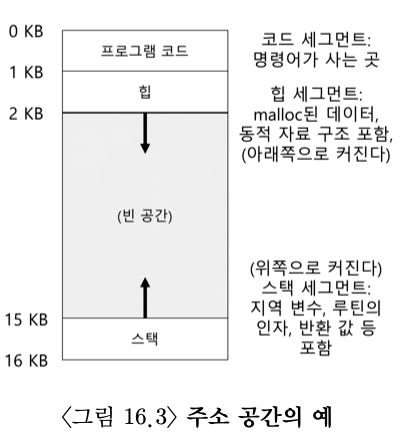
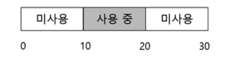
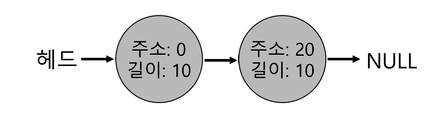
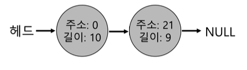
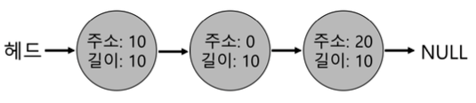
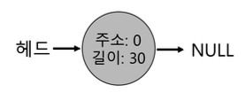
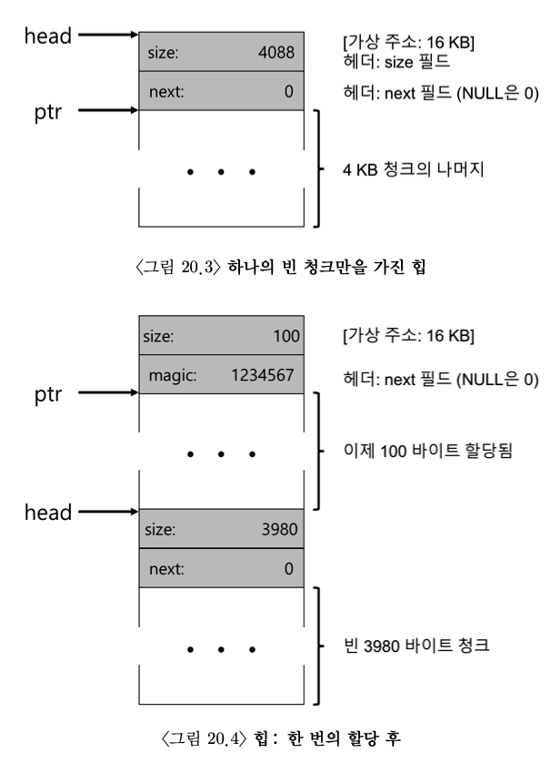
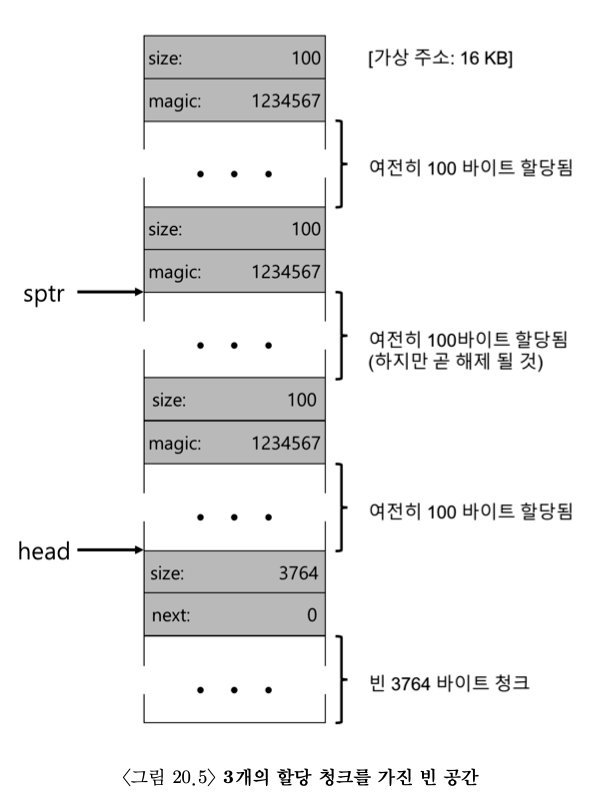

# 메모리
---
# 주소 공간(Address Space)

- 실행중인 프로그램이 가정하는 메모리
- code: 명령어
- stack: 함수 호출 체인상의 현재위치, 지역 변수, 함수인자와반환 값등을 저자
- heap: 동적으로 사용되는 메모리를 위해 사용

## VM의 목표
1. 투명성(transparency): 실행중인 프로그램이 가상 메모리의 존재를 인지 못해야한다.
2. 효율성(efficiency): 시간과 공간 측면에서 효율적이어야 한다.
3. 보호(protection): 프로세스를 다른 프로세스로부터 보호해야하고 운영체제 자신도 프로세스로부터 보호해야한다.

## 메모리 관리 api
### malloc()
힙에 요청할 공간의 크기를 넘겨주면 성공 했을 경우 새로 할당된 공간에 대한 포인터를 반환. 실패할 경우 null을 반환
### free()
사용되지 않는 힙 메모리를 해제할 때 사용
## 메모리 관리 시 주의해야할 점
### 메모리 할당
```
char *src = "hello";
char *dst = (char*)malloc(strlen(src) +1);
strcpy(dst, src)
// strdup()를 사용하면 편하게 해결할 수 있다.
```
메모리 공간을 사용하기 전에 할당 해주었는지 확인해야한다. 메모리 할당 없이 사용하게 되면 segmentation fault가 발생하게 된다.
### 버퍼 오버플로우
```
char *src = "hello";
char *dst = (char*) malloc(strlen(src))
strcpy(dst, src)
```
사용할 메모리 공간을 부족하게 할당하게 되면 다른 메모리 공간을 침범할 수 도 있다.
### 할당받은 메모리 초기화
malloc()을 통해서 메모리를 제대로 할당했지만 데이터 타입에 특정 값을 넣지 않게 되면 발생한다. 할당된 메모리 공간에 값을 입력하지 않으면 알수없는 값을 참조하여 사용하게 된다.
### 메모리 해제
사용된 메모리를 해제하지 않으면 메모리 누수(memory leak)가 발생하여 장시간 사용되는 프로그램에서 메모리 부족을 유발하게 된다. 
### 메모리 사용 중 메모리 해제
메모리를 다 사용하기 전에 메모리를 해제하게 되면 해당 메모리를 가리키는 포인터는 **dangliing pointer**가 되어 잘못된 공간을 참조하게 된다.
### 반복적인 메모리 해제
해제된 메모리를 한번더 해제하게 되면 시스템은 예측할 수 없는 기능을 하게된다.
### 잘 못 호출된 free()
malloc()된 포인터가 아닌 것을 해제하게 되면 **invalid frees**가 된다.
# 주소 변환
**하드웨어-기반 주소 변환(hardware-based address transloation)** 은 주소변호나이라고 불리며 CPUdㅢ 제한적 직접 실행 방식데 부가적으로 사용되는 기능이다. 주소 변환을 통해서 하드웨어는 명령어 반입, 탑재, 저장 등의 **가상** 주소를 정보가 실제 존재하는 **물리** 주소로 변환한다. 
## 가정
메모리 가상화 이해하기 위해서 간단한 메모리 가상화부터 학습할 것이다. 간단한 메모리 가상화를 학습하기 위해서 아래와 같은 가정을 한다.
- 사용자 주소 공간은 물리 메모리에 연속적으로 배치된다.
- 주소 공간의 크기가 너무 크지 않다고 가정한다.
- 각 주소 공간의 크기는 같다고 가정한다.
## 동적(하드웨어 -기반) 재배치
동적 재배치는 베이스와 바운드(base and bound)라고도 불린다. 각 cpu마다 베이스(base)와 바운드(bound) 레지스터가 필요하다. 각 프로그램은 주소 0에 탑재되는 것처럼 가상화되고 컴파일 된다. 프로그램을 시작하게 되면 운영체제가 프로그램이 탑재될 물리 메모리 위치를 결정하고 베이스 레지스터를 그 주소로 지정한다. 

$physicalAddress=virtualAddress + base$

위의 식을 사용하여 가상 주소를 물리 주소로 변환할 수 있다.

바운드 레지스터는 프로세서가 메모리 참조를 할 때 합법적인 메모리 주소인지 확ㅇ니하기 위해 바운드 레지스터를 사용한다. 바운드 레지스터는 항상 16KB로 설정되고 프로세스가 바운드 보다 큰 가상 주소 또는 음수인 가상 주소를 참조하게 되면 cpu는 예외를 발생 시켜 프로세스를 종료시킨다.

베이스와 바운드 레지스터느 cpu에 있는 하드웨어 구조이고 주소 변환에 도움을 주는 프로세서의 일부를 **메모리 관리 장치(memory management unit, MMU)** 라고 부른다. 더 정교한 메모리 관리 기법을 개발하기 위해서 MMU에 더 많은 회로를 추가하게 된다.

# 세그멘테이션
베이스 바운드 레지스터 방식을 사용하게 되면 스택과 힙 사이의 공간이 낭비되게 되고 주소 공간이 물리 메모리보다 큰 경우에는 실행이 어려워 유연하지 않다는 단점이있다.
## 베이스/바운드의 일반화
MMU에는 베이스/바우드 한쌍의 레지스터만 존재하는 것이 아닌 주소 공간의 논리적인 세그멘트(segment)마다 베이스와 바운드 쌍이 존재한다. 세그멘트는 특정 길이를 가지는 연속적인 주소공간이다. 세그멘테이션을 사용하게 되면 운영체제는 각 세그멘트를 물리 메모리의 다른 위치에 배치하여 사용되지 않은 가상 주소 공간이 물리 메모리를 차지하는 것을 방지할 수 있다.
## 스택
- 스택은 다른 세그멘트들과는 반대 방향으로 확장된다.
- 간단한 하드웨어가 추가로 필요하다.
- 베이스과 바운드 값뿐 아니라 하드웨어는 세그먼트가 어느 방향으로 확장하는지도 알아야한다.
## 세그멘트의 문제점
1. 문맥 교환 시에 세크멘트 레지스터를 저장하고 복원해야한다. 각 프로세스는 자신의 가상 주소 공간을 가지고 운영체제는 프로세스가 다시 실행하기 전에 레지스터들을 올바르게 설정해야한다.
2. 미사용중인 물리 메모리 관리하 어렵다. 새로운 주소 공간이 생성되면 운영체제는 비어인ㅆ는 주소공간을 찾아야한다. 하지만 각 세그멘트의 크기가 다르기 때문에 찾기 어렵다.
3. 세그먼트의 그기가 일정하지 않기 때문에 외부 단편화 발생
# 빈공간 관리


위의 그림의 주소공간에서 30의 주소 공간중에 20의 빈 공간이 있지만 15바이크를 할당하려고 하면 연속된 15바이트의 주소공간이 없어서 할당할 수 없는 상황이 발생한다.
## 가정
- 힙의 빈공간을 관리하기 위해 링크드 리스트 사용
- 클라이언테에게 할당된 메모리는 다른 위치로 재배치될 수 없다

## 저수준 기법
1. 분할(splitting)



위의 그림에는 각 10의 길이를 가지는 0과 20에서 시작하는 주소 공간이 있다. 현상황에서 1만큼의 길이를 가지는 주소 공간을 요청하게 되면 분할을 사용하여 사용할 공간만 분할해서 반환 할 수 있다.



길이 1을 요청 했을 때 위의 그림처름 20에서 1만큼의 길이를 분할해서 반환하고 두번째 노드는 21에서 시작하는 주소 공간으로 변경해준다.

2. 병합(coalescing)



분할의 첫번째 그림에서 주소10에서 시작하는 길이 10의 주소 공간을 반환하게 되면 위의 그림처럼 바뀌게 된다 그렇게 되면 주소 0부터 길이 30의 주소 공간으로 병합해 줄 수 있게 된다.



병합을 완료하게 되면 위의 그림처럼 주소 0에서 시작하는 길이 30의 메모리 공간이 되게 된다.

## 힐딩된 공간의 크기 파악
메모리 공간을 할당하여 할당된 공간을 가리키는 포인터를 반환하면 실제 메모리상에는 해당 포인터의 위에 헤더의 크기만큼 공간을 차지는 부분이 있다. 해당 부분은 포인터의 크기와 매직 넘버를 저장하게 된다.
```
typedef struct __header_t {
    int size;
    int magic;
} header_t;
```
이러한 헤더 구조를 가지기 때문에 할당된 메모리를 헤제하게 되면 free()함수는 헤더에 저장된 값을 보고 메모리를 헤제해주게 된다.
```
void free(void *ptr){
    header_t *hptr = (void*)ptr - sizeof(header_t);
    ...
}
```
## 빈 공간 리스트 내장
빈 공간을 리스트를 사용하여 가지고 있다. 메모리의 전체 크기가 4088이라고 가정하면 최초의 메모리는 4088의 크기의 하나의 항목만을 가지는 리스트가 생성된다. head 포인터는 영역의 시작 주소를 가지고 있고 다음 노드를 가리키는 포인터는 null을 가지고 있다.



위의 그림처럼 최조의 리스트 상태는 천번째와 같다. 여기서 100만큼의 요청이오면 헤더를 포함하며 108바이트의 공간을 할당하게되고 헤더를 제외한 할당영역을 가리키는 ptr를 반환하게된다. 



100 만큼의 공간을 추가로 요청받아 3곳의 할당된 리스트를 확인 할 수 있다. 여기서 가운데에 있는 메모리를 반환하게 되면 빈 공간의 주소값을 가지고 있는 sptr리스트에 추가하게 된다. 추가로 빈공간이 해제될 경우 sptr인 빈 공간 리스트에 추가하여 빈공간을 관리해주게 된다. 
## 기본 전략
빈 공간 할당을 위한 기본 전략들이다. 이상적인 할당기는 속도가 빠르고 단편화를 최소로 해야한다. 할당과 해제 요청 스트림은 무작위로 실행되기 때문에 어느 특정 전략도 잘 맞지 않은 입력을 만나면 안 좋은 성능을 도출할 수 있다. 
### 최적 적합(Best Fit)
빈 공간 리스트를 검색하여 요청한 크기와 같거나 더 큰 빈 메모리 청크를 찾는다. 후보자 그릅 중에서 가장 작은 크기의 청크를 반환한다. 요청받은 공간의 크기와 가장 가까운 블럭을 반환함으로서 낭비를 줄일 수 있다. 하지만 항상 검색을 해야하기 때문에 성능이 좋지않다.
### 최악 적합(Worst Fit)
최적 적합의 반대로 가장 큰 빈 청크를 찾아 요청된 크기만큼만 반환하고 남은 부분은 빈 공간 리스트에 계속 유지한다. 최악 적합은 최대한 요청된 크기를 제외하고 가장 큰 빈 청크를 남기기위해 사용된다. 하지만 역시 검색을 해야하기 때문에 성능이 좋지 않다.
### 최초 적합(First Fit)
요청보다 큰 빈 블럭을 검색할때 가장 먼저 찾은 블럭을 요청만큼 반환한다. 최초 적합은 속도가 빠르다는 장점이있지만 리스트의 시작에 크기가 작은 객체가 많이 생기기 때문에 할당기가 빈 공간 리스트의 순서를 관리하는 방법이 필요한다. 관리하는 벙법으로 **주소-기반 정렬(address-based ordering)** 을 사용한다. 리스트를 주소로 정렬하여 병합을 쉽게 하고 단편화를 감소시킬 수 있다.
### 다음 적합(Next Fit)
항상 리스트의 처음부터 탐색하지 않고 마지막으로 찾았던 원소를 시작으로 탐색한다. 이를 위해 마지막으로 찾은 원소를 가리키틑 추가 포인터가 필요하다. 다음 적합을 사용하면 앞부분에 단편화가 많이 생기는 것을 방지할 수 있다.
## 추가적인 접근법
### 개별 리스트(segregated list)
특정 응용프로그램이 자쥬 요청하는 크기가 있다면 그 크기의 객체를 관리하기 위한 별도의 리스트를 유지한다. 다른 모든 요청은 더 이반적인 메모리 할당기에 전달된다.
- 장점
  - 특정 크기의 요청을 위한 메모리 청크를 유지하기 때문에 단편화 가능성을 줄인다.
  - 폭잡한 겁색이 필요하지 않아 할당과 해제 속도가 빠르다.
- 단점
  - 지정된 크기의 메모리 풀과 일반적인 풀에 얼마만큼의 메모리를 할당해야하는지 알수 없다.
### 이진 버디 할당(binary buddy allocatior)
할당 요청을 충족하는 공간을 발견할 때까지 공간을 2개로 분할하여 탐색한다. 하지만 2의 거듭제곱만큼의 크기로만 할당할 수 있기 때문에 내부 단편화가 발생한다. 버디 할당은 해제에서 빠른 속도를 보인다. 메모리를 반환하면 할당기는 버디(같은 크기 옆 공간)가 비어있는지 확ㅇ니하고 비어있다면 두 블럭을 병합한다. 병합된 블럭의 버디도 비어있다면 또 둘을 병합한다. 이러한 방식을 재귀형식으로 사용하게 되어 병합을 빠르게 할 수 있다.