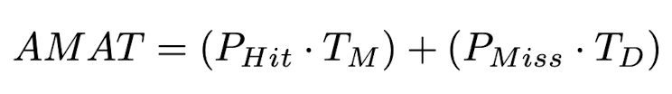
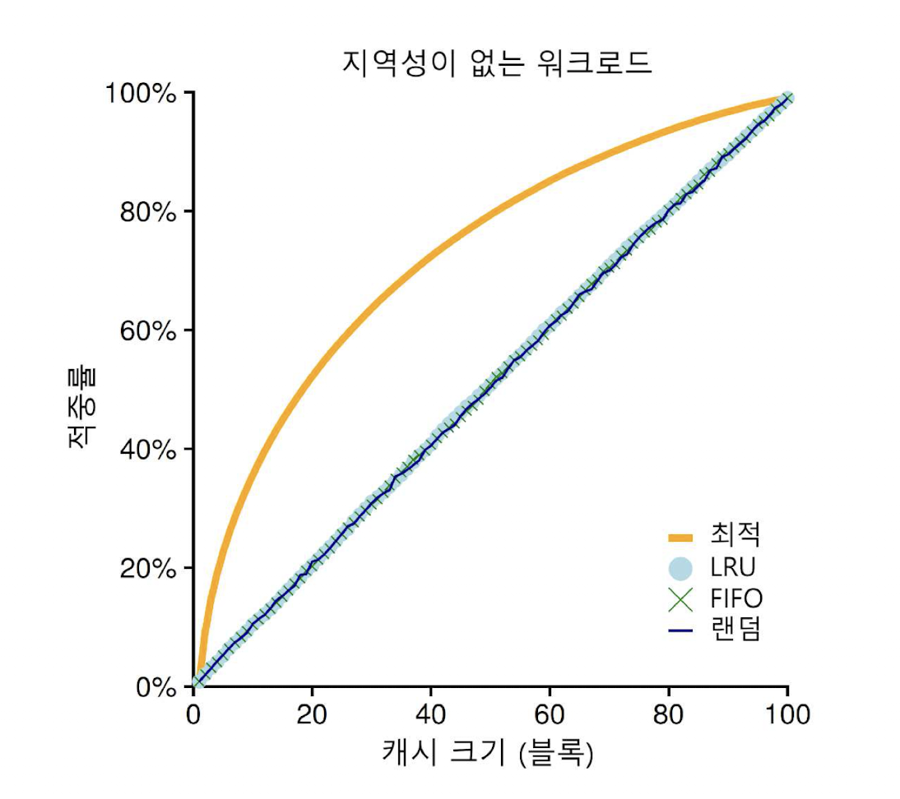
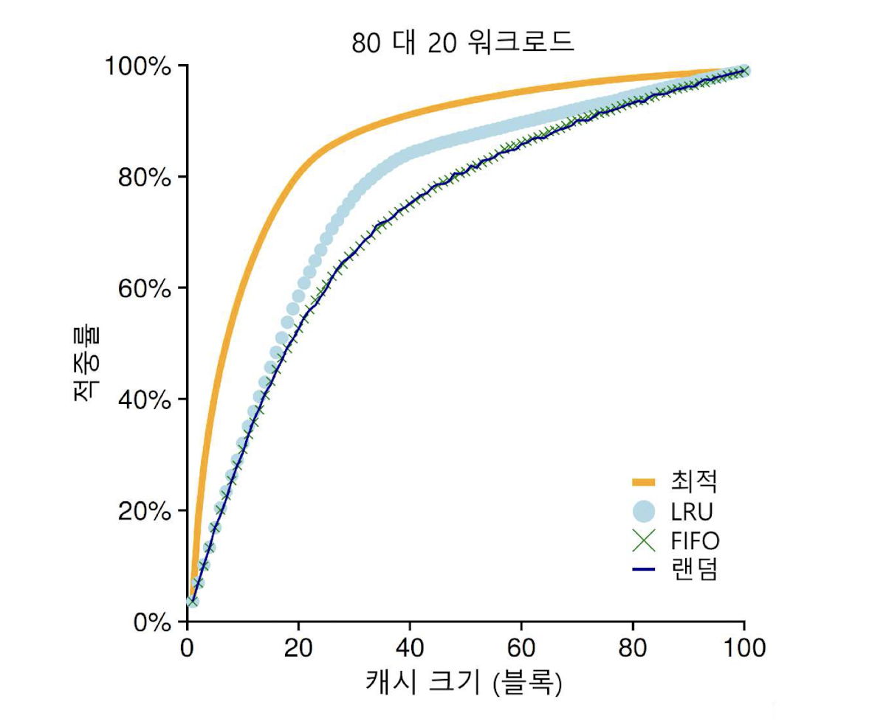
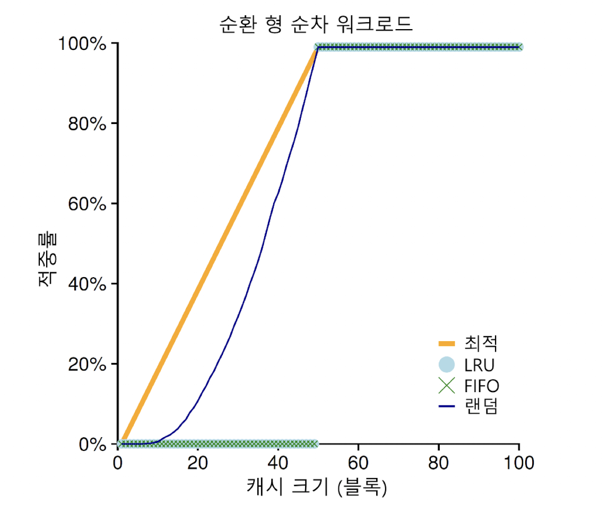

# 18. 페이징

공간 관리 방법 

1. 세그멘테이션: 가변 크기 분할 - 단편화
2. 페이징: 동일 크기 분할 

## 페이징

가상 메모리에서 공간을 동일 크기의 조각으로 분할하는 것

- 페이지: 고정 크기 단위
- 페이지 프레임: 고정 크기의 슬롯의 배열

## 페이징의 장점

### 유연성

효율적으로 주소 공간 개념을 지원할 수 있음

### 빈공간 관리의 단순함

페이지 테이블: 프로세스마다 존재하는 각 가상 페이지에 대한 물리 메모리 위치 기록 (주소 변환 정보 저장)

## 주소 변환

### 가상 페이지 번호(virtual page number, VPN) → 물리 프레임 번호(physical frame number, PFN)

페이지 테이블의 인덱스로 사용하여 물리 프레임 번호(physical frame number, PFN) 혹은 물리 페이지 번호(physical page number, PPN)으로 교체하여 가상 주소 변환

### 오프셋

페이지 내에서 바이트의 위치

## 페이지 테이블

가상-물리 주소 변환을 저장하여 주소 공간의 각 페이지의 물리 메모리 위치를 알 수 있게 함

프로세스마다 하나씩 존재

## 페이지 테이블 저장

페이지 테이블이 매우 커질 수 있으므로 각 프로세스의 페이지 테이블을 메모리에 저장

## 페이지 테이블 구성

### 선형 페이지 테이블(linear page table)

단순한 배열 형태, 원하는 물리 프레임 번호(PFN)을 찾기 위하여 가상 페이지 번호(VPN)으로 배열의 항목에 접근, 그 항복의 페이지 테이블 항목(PTE)를 검색

## PTE의 비트

### Valid bit

특정 변환의 유효 여부 - 미사용 공간 무효, 접근 시 트랩 후 kill

### Protection bit

페이지가 읽을 수 있는지, 쓸 수 있는지, 실행될 수 있는지 표시 

허용되지 않은 접근이면 트랩

### Present bit

페이지가 물리 메모리에 있는지 디스크에 있는지 (스왑 아웃 여부)

- 스와핑: 드물게 사용하는 페이지를 운영체제가 디스크로 이동시켜 메모리를 비우는 것

### Dirty bit

메모리에 반입된 후 페이지 변경 여부

### Reference bit (or Accessed bit)

페이지가 접근되었는지를 추적하기 위해 사용

## 페이징: 너무 느림

페이징의 과정

프로세스의 페이지 테이블에서 적절한 PTE를 가져와서 변환 수행 후 물리 메모리에서 데이터 탑재

메모리 참조 → 비용 비쌈

페이징 테이블 

⇒ **시스템 느려짐**

⇒ **너무 많은 메모리 차지**

# 19. 페이징: 더 빠른 변환(TLB)

### 주소 변환 속도를 어떻게 향상할까?

## TLB(translation-lookaside buffer)

칩의 메모리 관리부(memory-management unit, MMU)의 일부

자주 참조되는 가상 주소-실주소 변환 정보를 저장하는 하드웨어 캐시

(주소 변환 캐시)

가상 메모리 참조 시, 하드웨어는 먼저 TLB에 원하는 변환 정보가 있는지 확인

→있으면 테이지 테이블을 통하지 않고 변환 수행

## TLB 히트

해당 VPN의 TLB 존재

## TLB 미스

TLB에 존재하지 않는 경우

이 때, 하드웨어가 페이지 테이블에 접근하여 유효하고 접근 가능하면 해당 변환 정보를 TLB로 읽어들임

(메모리 참조때문에 느린 작업)

TLB 미스를 최소화해야함

### 공간 지역성(spatial locality)

x를 읽거나 쓰면 x와 인접한 메모리 주소를 접근할 확률이 높음

페이지 크기가 클수록 TLB 미스 감소

### 시간 지역성(temporal  locality)

한번 참조된 메모리 영역이 짧은 시간 내 재 참조

## TLB 미스 처리

### 

### 하드웨어 - CISC(complex instruction set computers)

복잡한 명령어로 구성된 하드웨어

TLB 미스를 하드웨어가 처리하도록 설계

1. 페이지 테이블에서 원하는 페이지 테이블 항목을 찾음
2. 필요한 변환 정보 추출
3. TLB 갱신
4. TLB 미스 발생한 명령어 재실행

인텔 x86 - **멀티 레벨 페이지 테이블 사용**

### 소프트웨어 - RISC(reduced instruction set computers)

최근에 등장한 컴퓨터 구조

소프트웨어 관리 TLB 사용

1. TLB 미스 발생 하드웨어 예외 시그널 발생
2. 운영체제 명령어 실행 잠정 중지
3. 커널 모드로 변경
4. 커널 코드 실행 준비
5. 트랩 핸들러 실행

장점 - 유연성, 단순함

- TLB 미스 처리 트랩 핸들러는 시스템 콜 호출 시 사용되는 트랩 핸들러와 다름
    - TLB 미스의 경우 트랩을 발생시킨 명령 재실행 ⇒ TLB 히트
    - 운영 체제 트랩 발생의 원인에 따라 현재 PC 값 or 다음 명령어 PC 값 저장
- TLB 미스가 무한 반복되지 않도록 주의
    - TLB 미스 핸들러를 접근하는 과정에서 TLB 미스 발생
        
         → TLB 미스 핸들러 물리 메모리에 위치 시킴
        

## TLB 구성

32 or 64 or 128개의 엔트리

완전 연관(fully associative) 방식으로 설계 - 변환 정보 TLB 내 어디든 위치 가능, 검색 병렬 수행

- VPN
- PFN
- valid bit
- protection bit
- 주소 공간 식별자
- 더티 비트

등등

### TLB valid bit ≠ 페이지 테이블 valid bit

페이지 테이블 무효는 해당 페이지가 프로세스에 할당되지 않았음을 의미

TLB는 탑재되어 있는 해당 변환 정보가 유효한지 

## TLB 문맥 교환

TLB에 있는 가상 주소와 실제 주소간의 변환 정보는 그것을 탑재시킨 프로세스에서만 유효

### 다음 프로세스가 실행되기 전에 기존 TLB 내용 비우기

모든 valid bit를 0으로 설정

성능 부담, TLB 미스 발생 

- TLB 내 주소 공간 식별자(ASID): PID와 유사
    - 프로세스 별로 TLB 변환 정보 구분 가능
    - 공유 페이지 사용 가능

## 캐시 교체 정책: 최저 사용 빈도(least-recently-used, LRU)

## TLB 범위 벗어남

프로그램이 짧은 시간 동안 접근하는 페이지들의 수가 TLB 용량보다 많음 ⇒ TLB 미스 발생

## TLB 접근 병목

- 물리적으로 인덱스된 캐시일 경우 특히 문제 → 가상적으로 인덱스된 캐시

# 20. 페이징: 더 작은 테이블

### 페이지 테이블을 어떻게 더 작게 만들까

## 페이지 크기 증가

내부 단편화 부작용 발생

## 하이브리드 접근 방법: 페이징과 세그멘트

프로세스의 전체 주소 공간을 위해 하나의 페이지 테이블을 두는 대신, 논리 세그멘트마다 따로 페이지 테이블을 둠

→ 코드, 힙, 스택 세그멘트에 대한 페이지 테이블을 각각 둠

- 베이스 레지스터 - 세그멘트의 페이지 테이블의 시작주소
- 바운드 레지스터 - 페이지 테이블의 끝

- 세그멘트마다 바운드 레지스터 따로 존재
- 각 바운드 레지스터 값 - 세그멘트의 최대 유효 페이지 개수

장점

선형 페이지 테이블에 비해 메모리 사용 개선

단점

세그멘테이션 사용해야함 - 유연성이 떨어짐

외부 단편화를 유발

## 멀티 레벨 페이지 테이블

선형 페이지 테이블을 트리구조로 표현

많은 현대 시스템에서 사용됨

1. 페이지 테이블을 페이지 크기 단위로 나눔
2. 페이지 테이블의 페이지가 유효하지 않은 항목만 있으면 해당 페이지를 할당하지 않음
3. 페이지 디렉터리를 사용해 각 페이지의 할당 여부와 위치 파악

페이지 디렉터리 

- 페이지 디렉터리 항목으로 구성 - 각 페이지의 존재 여부와 위치 정보 (유효 비트와 페이지 프레임 번호)

장점

1. 사용된 주소 공간의 크기에  비례하여 페이지 테이블 공간이 할당되므로 보다 작은 크기의 페이지 테이블로 주소 공간 표현 가능
2. 페이지 크기로 분할해 메모리 관리 용이

단점

1. 추가 비용 발생 - TLB 미스시 두배 시간 소요
2. 복잡도

## 변환 과정

1. TLB 검사
2. 히트 시 페이지 테이블 참조 없이 물리 주소 직접 구성
3. 미스 시 멀티 레벨 페이지 테이블의 모든 단계 거쳐 물리 주소 구함
4. 2단계 페이지 테이블 주소 변환을 위해 2번의 추가 메모리 접근 발생

## 역 페이지 테이블(inverted page table)

시스템에 단 하나의 페이지 테이블만 둠

페이지 테이블: 물리페이지 → 가상 주소 페이지 변환

각 항목: 물리페이지를 사용중인 프로세스 번호, 가상 페이지 번호

탐색 속도 향상을 위해 해시 테이블 사용

## 페이지 테이블 디스크로 스와핑

시스템의 메모리가 부족한 경우 페이비 테이블들을 디스크로 스왑 함

## 페이지 테이블의 구성

공간을 많이 소모하는 테이블 구조 - TLB 미스 처리속도 빨라짐

공간을 적게 소모하는 테이블 구조 - 처리속도 느려짐

# 21. 물리 메모리 크기의 극복: 매커니즘

## 물리 메모리 이상으로 나아가기 위해서 어떻게 할까

하드 디스크 드라이브- 메모리 공간보다 더 크고 느림

## 프로세스에게 큰 주소 공간을 제공해야하는 이유

편리함과 사용 용이성

## 스왑 공간 추가

운영체제는 각 프로세스들에게 큰 가상 메모리가 있는 것 같은 환상을 줄 수 있음

멀티프로그래밍, 사용 편의성을 위해 필요

### 스왑 공간

디스트에 페이지들을 저장할 수 있는 일정 공간 확보

운영체제는 스완 공간에 있는 모든 페이지들의 디스크 주소를 기억해야 함

스왑 공간 이외에도 코드 영역의 페이지들이 차지하는 물리 페이지를 사용할 수 있음

## Present Bit

각 페이지 테이블 항복에 어떤 페이지가 존재하는지를 표현

1 - 물리 메모리에 해당 페이지가 존재함

0 - 존재하지 않고 디스크 어딘가에 존재

### 페이지 폴트

존재하지 않는 페이지를 접근하는 행위

페이지 폴트 발생시 페이지 폴트 핸들러 실행

### TLB 미스 처리 방법

- 하드웨어 기반 TLB - 하드웨어가 페이지 테이블을 검색하여 원하는 변환 정보를 찾음
- 소프트웨어 기반 TLB - 운영체제가 처리

둘다 페이지 폴트 발생 시 운영체제의 페이지 폴트 핸들러가 처리

페이지 테이블 항ㅂ목에서 해당 페이지의 디스크 상 위치 파악 후 메모리로 탑재 

디스크 I/O 완료 후 해당 페이지 테이블 항복을 탑재된 페이지의 메모리 위치로 갱신

페이지 폴트 발생시킨 명령어 재실행

재실행으로 인해 TLB 미스 발생 미스 처리 과정에서 TLB 값 갱신

재실행하여 TLB에서 주소 변환 정보 찾음

원하는 데이터나 명령어 가져옴

I/O 전송 중에 해당 프로세스 blocked 

페이지 폴트 시 다른 프로세스 실행 가능

## 메모리 빈 공간 부족 → 페이지 교체 정책

하나 이상 페이지들을 먼저 페이지 아웃하고 공간을 확보한 후 탑재하고자 하는 새로운 페이지들을 페이지 인 함

## 페이지 폴트 처리

하드웨어 처리 과정 TLB 미스 발생

- 페이지가 존재하며 유효한 경우 -TLB 미스 핸들러가 PTE에서 PFN 가져와서 명령어 재시도
- 페이지가 유효하지만 존재하지 않는 경우 - 페이지 폴트 핸들러 반드시 실행, 제대로 된 페이지지만 물리 메모리에 없는 페이지
- 페이지가 유효하지 않은 경우 - 프로그램 버그 등으로 잘못된 주소 접근 운영체제 트랩 핸들러에의해 처리, 프로세스 종료

소프트웨어 처리 과정

1. 운영체제가 탑재할 페이지를 위한 물리 프레임 확보
2. 교체 알고리즘 실행하여 메모리에서 페이지 내보내고 여유 공간 확보
3. I/O 요청을 통해 스왑 영역에서 페이지 읽어옴
4. 페이지 테이블 갱신, 명령어 재시도 
5. TLB 미스 발생, 재시도
6. TLB 히트 

## 교체

운영체제 - 메모리 여유 공간 최댓값, 최솟값 설정

최솟값보다 작아지면 백그라운드 쓰레드 실행해 최댓값에 이를 때까지 페이지 제거 후 슬립 모드

백그라운드 쓰레드 = 스왑 데몬 = 페이지 데몬

다수의 페이지를 클러스터나 그룹으로 묶어 한번에 스왑 파티션에 저장해 디스크 효율을 높임

# 22. 물리 메모리 크기의 극복: 정책

## 내보낼 페이지는 어떻게 결정하는가

## 캐시 관리

메인 메모리를 시스템의 가상 메모리 페이지를 가져다 놓기 위한 캐시로 생각

캐시 미스 횟수 최소화, 캐시 히트 횟수 최대화

### 평균 메모리 접근 시간(Average memory access time, AMAT)

메모리 접근 비용과 캐시에서 히트될 확률을 곱한 것과 미스될 확률과 디스크 접근 비용을 곱한 것을 더한 것이다.

## 최적 교체 정책

가장 먼 시점에 필요하게 될 페이지를 버림

## 캐시 미스의 종류

- 강제 미스(최초 시작 미스): 캐시가 비어있었고 그 항목을 처음으로 참조할 때 발생
- 용량 미스: 캐시의 공간이 다차서 새로운 항목을 캐시에 넣기 위해 어떤 항목을 내보내야 할 때 발생
- 충돌 미스: 세트 연관 매핑때문에 하드웨어에서 발생

## FIFO

교체를 해야할 경우 큐의 테일에 있는 페이지가 내보내짐(먼저 들어온 페이지가 내보내짐)

구현이 쉽다는 장점

최적 교체 정책에 비해 성능이 좋지 않음

## 무작위 선택

메모리 압박이 있을 때 페이지를 무작위로 선택하여 교체

FIFO보다 더 좋은 성능, 최적 방법보다 나쁜 성능을 보임

## 과거 정보의 사용: LRU

빈도수와 최근성 - 지역성의 원칙 기반 

Least Frequently Used LFU - 가장 적은 빈도로 사용된 페이지 교체

Least Recently Used LRU - 가장 오래 전에 사용하였던 페이지 교체

## 워크로드에 따른 성능 비교

### 지역성이 없는 워크로드

페이지가 무작위적으로 참조 - 워크로드에 지역성이 없다면 어느 정책을 사용하든 상관 없음, 캐시가 충분히 커도 마찬가지임, 최적 기법이 가장 좋은 성능

### 80 대 20 워크로드

인기 있는 페이지 들을 캐시에 더 오래두는 LRU 성능이 좋음

최적 기법이 여전히 가장 좋음 - LRU 과거 정보가 완벽하지 않음

### 순차 반복 워크로드

LRU와 FIFO에서 가장 안좋은 성능 - 오래된 페이지들을 내보냄

무작위 선택 정책 - 이상한 코너 케이스가 발생하지 않음

## 과거 이력 기반 알고리즘 구현

LRU를 구현하려면 많은 작업 필요

- 각 페이지 접근마다 자료 구조 갱신 필요
- 하드웨어의 지원 - 하드웨어가 메모리 시간 필드 갱신하도록

완벽한 LRU를 구현하는 것은 너무 비쌈

## LRU 정책 근사

### use bit

시스템의 각 페이지마다 하나의 use bit

페이지 참조될 때마다 use bit - 1

0으로 바꾸는 것은 운영체제의 몫

- 시계 알고리즘 : 시계 바늘이 특정 페이지를 가리켰을 때 1이면 교체하지 않고 0인 것을 찾을 때까지 반복
- 주기적으로 use bit 지우는 방법

## 갱신된 페이지(Dirty Page)의 고려

어떤 페이지가 변경되어 더티 상태가 되었다면 페이지를 내보내기 위해 비싼 비용 지불해야 함 

깨끗한 페이지를 내보내는 것을 선호

하드웨어 - modified bit(dirty bit) 포함, 페이지가 변경될 때마다 1로 설정

## 다른 VM 정책들

### 페이지 선택 정책

- 요구 페이징 정책 - 체이지가 실제로 접근될 때 운영체제가 해당 페이지를 메모리로 읽어들임, 선반입
- 클러스터링 or 모으기 - 기록해야할 페이지들을 메모리에 모은 후 한번에 디스크에 기록

## 쓰래싱

실행 중인 프로세스가 요구하는 메모리가 가용 물리 메모리 크기를 초과하는 경우 끊임없이 페이징을 할 수 밖에 없는 상황

### 워킹 셋 : 진입 제어

프로세스가 실행 중에 일정 시간동안 사용하는 페이지들의 집합 

### 메모리 부족 킬러

많은 메모리를 요구하는 프로세스를 골라 죽임