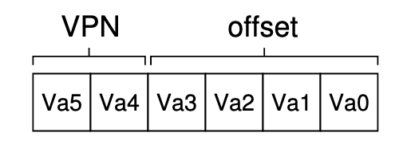
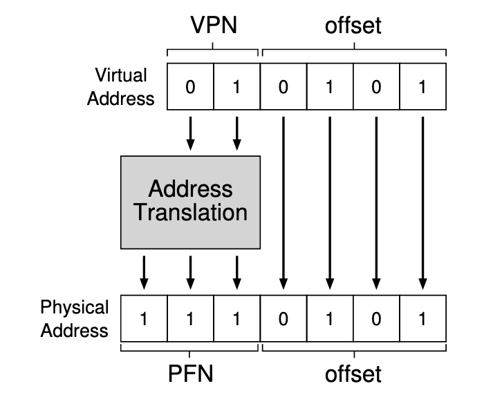
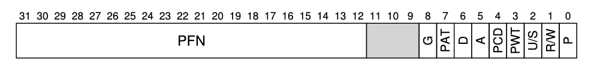
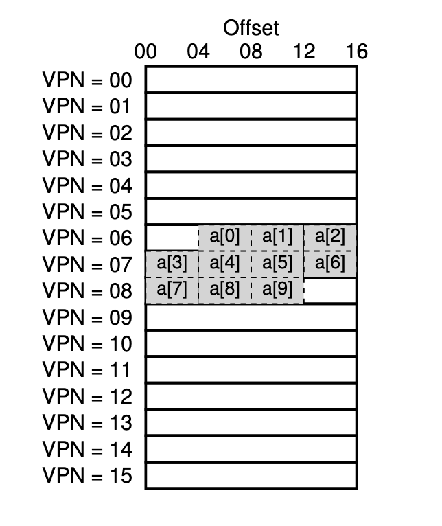
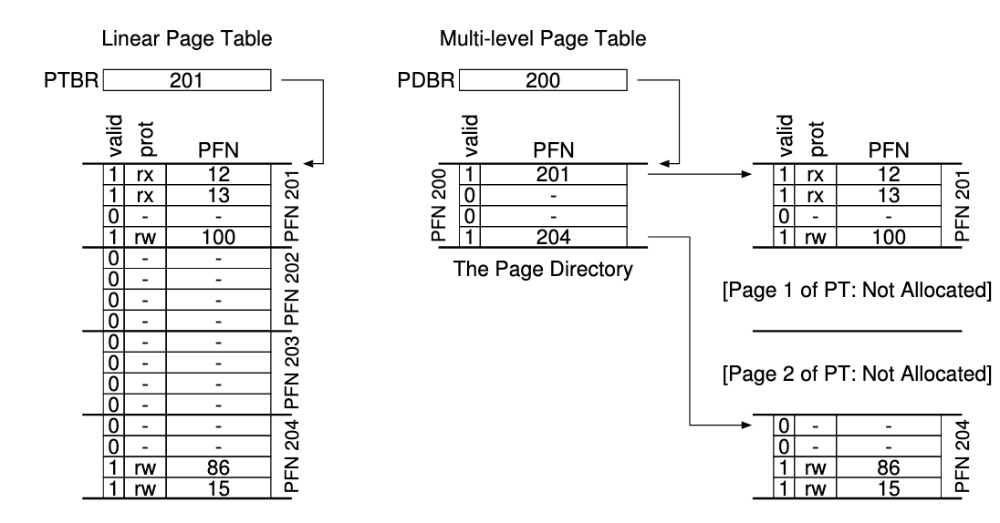

# 페이징 (chap.18 - 24)

## 페이징

> 세그멘테이션의 외부 단편화 문제를 어떻게 해결할까?

### 페이징 이란?

- 메모리 공간을 동일 크기의 조각으로 분할하는 것
- 주소 공간을 몇개의 가변 크기의 논리 세그먼트로 나누는 것이 아니라 고정크기의 단위로 나누는 것

세그멘테이션이 외부 단편화 문제를 야기했던 이유는 세그먼트의 크기가 가변적이어서 세그먼트 사이 사이에 작은 빈공간들이 생겼기 때문이다. 페이징은 메모리를 나누되 그 크기를 동일하게 가져감으로서 외부 단편화를 최소화한다.

### 페이지 테이블

- 각 가상 페이지가 저장된 물리 메모리의 위치가 어디인지 기록된 테이블
- 정확히는 VPN과 PFN의 매핑 정보가 기록된 테이블
- 프로세스마다 존재

페이징을 위해 가상 주소를 VPN(Virtual Page Number)와 해당 페이지내의 오프셋의 조합으로 관리한다.

위 같이 VPN과 offset의 조합으로 이루어진 가상 주소를 물리 주소로 변환해보자.

offset은 동일하게 가져가고 VPN을 PFN(Physical Frame Number)로 변환하는 과정을 거치면 물리 주소를 얻을 수 있다.

위 그림에서 Address Translation 에 사용되는게 페이지 테이블이다.

페이지 테이블의 각 항목을 PTE(Page Table Entry)라고 부른다.

페이지 테이블은 그 크기가 꽤 크기때문에 MMU 안에 유지할 수 없고 메모리에 저장한다.

### 페이지 테이블의 구조

페이지 테이블은 가상 주소(VPN)와 물리 주소(PFN)의 매핑 정보가 기록된 자료 구조이다.

**선형 페이지 테이블**(가장 간단한 형태의 페이지 테이블)에서는 운영체제는 원하는 PFN을 찾기 위해 VPN으로 배열의 항목에 접근하여 PTE를 얻어낸다.

### 페이징의 단점

페이지 테이블의 크기가 메모리 상에서 매우 크게 증가할 수 있는데, 이럴 경우 그 처리 속도가 굉장히 느려진다.

운영체제는 원하는 데이터의 물리 주소를 얻기 위해 최소한 두번의 메모리 참조(페이지 테이블 참조, 실제 데이터 참조)가 필요하다.

페이지 테이블을 위한 메모리 공간 할당으로 인한 메모리 낭비가 존재한다.

## TLB

페이지 테이블은 그 매핑 정보 저장을 위해 큰 메모리 공간을 요구한다. 게다가 가상 주소를 물리 주소로 변환하기 위해 매번 메모리에 접근해야한다. 시간적으로나 공간적으로나 모두 손해가 심각하다.

> 페이징의 주소 변환 속도를 어떻게 향상시킬 수 있을까?

### 하드웨어의 도움

하드웨어를 조금 활용해보자. CPU의 MMU(Memory Management Unit)에 자주 참조되는 VPN-PFN 매핑 정보를 캐싱해두고 가져다 쓰자. 그리고 이를 TLB(Translation Look-aside Buffer)라 부르자.

정확히는 Address-Translation Cache 라 부르는게 좀 더 적합하다.

> MMU는 가상주소와 물리주소의 변환정보를 저장하고 메모리의 접근을 제어하는 CPU 내부 하드웨어이다.

TLB에 변환 정보가 존재하면 TLB 히트, 존재하지 않으면 TLB 미스라 부른다.

TLB는 “주소 전환 정보가 대부분의 경우 캐시에 있다.”라는 가정을 전제로 만들어졌다. 당연히 히트가 많을수록 성능이 좋고 TLB 미스가 발생하는 경우를 최대한 피해야 한다.

크기가 10개인 배열을 순회하면서 접근하는 경우를 생각해보자.

페이지는 메모리에서 데이터를 읽어오는 최소 단위이다.

각 페이지의 첫 원소인 a[0], a[3], a[7] 은 TLB 미스지만 나머지 원소는 모두 TLB 히트이다.

페이지 단위로 읽어오기때문에 인접한 원소들은 모두 TLB 히트가 발생해서 성능의 향상을 가져올 수 있다. 이를 **공간 지역성(Spatial Locality)**라 부른다.

당연하게도 이미 TLB에 저장된 원소를 다시 읽으면 TLB 히트인데, 이처럼 최근에 접근했던 데이터를 재참조함으로서 일어나는 성능 향상을 **시간 지역성(Temporal Locality)**라 부른다.

위 예제만 봐도 알겠지만, 페이지의 크기는 TLB의 효용성에 매우 중요한 역할을 한다. 페이지의 크기가 클 수록 TLB 미스 횟수는 줄어들것이다. 하지만 무조건 한번에 많이 가져오는게 능사는 아닐것이다.

> 캐시가 그렇게 좋다면, 왜 초대용량 캐시를 제작하여 모든 내용을 저장하지 않을까?

> 빠르게 하려면 크기가 작아야한다. 크게 만들면 느려진다.

> 캐시가 캐시의 역할을 하려면 작아햐한다는 말이다.

> 우리의 숙제는 작은 캐시를 어떻게 잘 사용하는가이다.

### TLB 미스 처리

보통 CISC는 TLB 미스 처리로직이 하드웨어적에 있고, RISC는 소프트웨어에 있다.

소프트웨어 처리를 간단히 살펴보자.

TLB 미스가 발생할 경우 하드웨어는 예외 시그널을 발생시키고 운영체제는 트랩 핸들러를 실행한다.
이때 실행되는 트랩 핸들러는 TLB 미스 처리 로직을 담당하는 운영체제 코드이다.
이 트랩 핸들러는 페이지 테이블을 검색하여 변환 정보를 획득, TLB를 갱신한 후 리턴한다.

특이한 점은 다른 트랩 핸들러와는 다르게 반환 다음 지점부터 실행하는게 아니라 해당 명령을 처음부터 다시 실행한다. 그래서 재실행한 시점에서 이제는 TLB 히트가 날것이다.

보통 TLB 미스로 인한 핸들러 코드에서 무한 루프를 방지하기 위해 TLB 미스 핸들러는 unmap 되어있는 경우가 많다. → 주소 변환이 필요 없다.

> TLB 덕분에 RAM은 사실 더 이상 Random Access Memory 라고 부를 수가 없게되었다.

> RAM이라는 이름은 메모리 공간의 어느 지점에 접근하든 같은 속도를 보장하기 때문에 붙여진 이름인데, TLB 덕분에 어느 주소에 접근하냐에 따라 그 속도가 달라지게 되었기 때문이다.

> Look-aside 라는 단어는 사실상 Cache 와 동치인데, 시간이 지나면서 Look-aside 는 버려지고 Cache가 주로 쓰이게 되었다.
그런데 어떤 이유때문인지는 몰라도 Look-aside는 안쓰이는데 TLB는 계속 사용되고있다.

### Multi Level Page Table

앞서 TLB로 페이징의 성능 문제는 어느정도 해결한 듯 보인다. 하지만 공간 문제는 어떻게 해결할까?

페이지 하나의 크기를 증가시키면 페이지 테이블의 크기는 줄어든다. 하지만 **페이지 크기의 증가는 페이지 내부 단편화를 필연적으로 유발한다.**

페이지 크기와 타협하면서 페이지 테이블의 크기도 줄일 수 없을까?

**MLPT는 기존 선형 페이지 테이블을 트리 구조로 표현한다.**

기본 개념은 간단하다. **페이지 테이블을 다시 페이지 크기의 단위로 나눈다.**

그리고 페이지 테이블의 항목이 가리키는 페이지가 유효하지 않은 항목만 있다면 해당 페이지를 할당하지 않는다.

Page Directory 라는 자료 구조를 사용하여 페이지 테이블 각 페이지의 할당 여부와 위치를 파악한다.

MLTP는 사용된 주소 공간의 크기에 비례하여 페이지 테이블 공간이 할당된다.
그래서 보다 작은 크기의 페이지 테이블로 주소 공간을 표현할 수 있다.

하지만 이에 따른 추가 비용도 존재한다.

TLB 미스 발생시 주소 변환을 위해 두 번의 메모리 로드가 발생한다.(PDE, PTE 접근 각각)

시간을 희생하고 공간을 얻은 셈이다.

> 일반적으로 자료 구조의 접근 속도를 향상시키려면, 해당 구조를 위해 공간을 더 사용해야한다.

### 물리 메모리의 크기가 부족하다면?

지금까지는 실행 중인 프로세스의 전체 주소 공간에 메모리에 모두 탑재될 수 있다고 가정했다. 이를 이제는 완화해보자.

> 운영체제는 어떻게 크고 느린 장치인 하드 디스크를 사용하면서 마치 커다란 가장 주소 공간이 있는 것같은 환상을 만들어낼까?

하드 디스크에 당장 쓰이지 않는 데이터는 내려보내고 그때 그때 필요한 데이터만 메모리로 올려보내자.

디스크에 메모리 페이지를 저장할 수 있는 일정 공간을 확보하고 이를 **스왑 공간(swap space)**라 부르자.

디스크에 페이지를 내보내는 작업을 swap out, 반대로 메모리로 다시 읽어들이는 작업을 swap in 이라 부른다.

물리 메모리에 아직 존재하지 않는 페이지에 접근하려 하는 행위를 Page Fault 라 한다. 페이지 폴트가 발생하면, 운영체제는 페이지 폴트 핸들러를 실행한다.

> 하드웨어가 어떻게 다뤄야 할지 모르는 어떤 일이 발생한다면, 상황의 개선을 기대하며 하드웨어는 제어권을 운영체제에게 넘긴다.

> "해줘”

페이지 폴트 핸들러의 동작은 예상과 같다.

만약 요청된 페이지가 메모리에 없고, 디스크로 스왑되었다면, 운영체제는 해당 페이지를 하드 디스크에서 메모리로 swap in 한다.

메모리가 가득 찼다면 현재 들어있는 페이지들 중 특정 알고리즘에 의해 판단하여 가장 내보내기 적합한 페이지를 swap out 해야한다.

> ### 가장 중요한건 이 모든 작업은 프로세스가 인지하지 못하는 상황에서 처리되어야 한다는 점이다.

