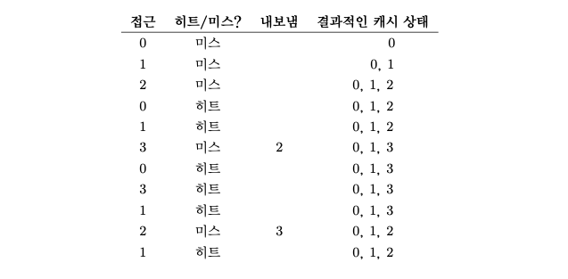
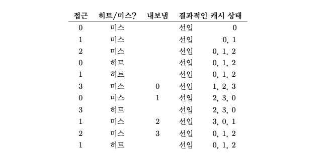
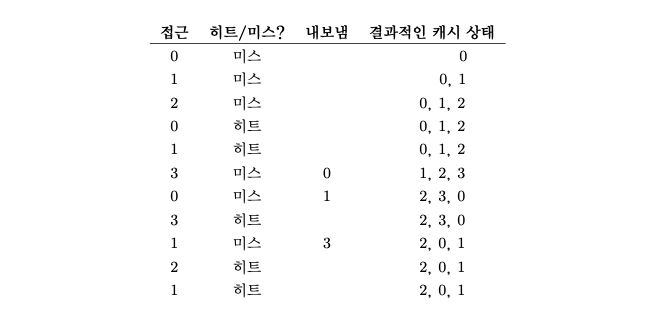
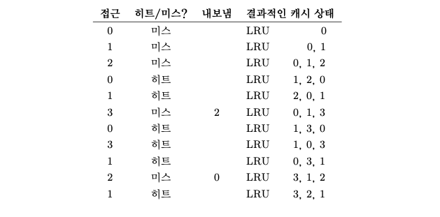

# 18장. 페이징: 개요

운영체제는 거의 모든 공간 관리 문제를 해결할 때 두 가지 방법 중 하나를 사용한다.

### 세그멘테이션 (공간을 가변 크기의 조각들로 분할)

- 가변 크기로 분할하게 되면 공간 자체의 단편화가 발생할 수 있다.
- 메모리 할당이 점점 더 어려워 진다.

### 페이징 (공간을 동일 크기의 조각들로 분할)

- 유연성이 개선된다.
    - 프로세스의 주소 공간 사용방식과는 상관없이 효율적으로 주소 공간 개념을 지원할 수 있게된다.
- 빈 공간 관리의 단순함
    - 운영체제는 모든 비어있는 페이지의 빈 공간 리스트만 유지하면 된다.
    - 운영체제는 1)**페이지 테이블(page table)** 을 2)*프로세스 마다* 유지
        - 1) 주소 공간의 가상 페이지에 대한 물리 메모리 위치 기록
        - 1) 주소 공간의 가상 페이지 주소 변환 정보를 저장하는 역할
        - 2) 새로운 프로세스의 가상 페이지는 다른 물리 페이지에 존재한다.

## 페이지 테이블은 어디에 저장되는가?

페이지 테이블은 매우 크기 때문에 현재 실행중인 프로세스의 페이지 테이블을 저장할 수 있는 회로를 MMU 안에 유지하지는 않을 것이다.

대신 각 프로세스의 페이지 테이블을 *메모리에* 저장한다.

당분간 페이지 테이블은 운영체제가 관리하는 물리 메모리에 상주한다고 가정하자.

## 페이지 테이블에는 실제 무엇이 있는가?

페이지 테이블의 가장 간단한 형태는 **선형 페이지 테이블(linear page table)** 이다. (그냥 배열이다)

그렇다면 페이지 테이블 항목(Page Table Entry, PTE) 에는 무엇이 있는지 알아보자.

### Valid bit

- 특정 주소 변환의 유효 여부 확인
- 할당되지 않은 주소 공간을 표현하기 위해 필요
- 물리 프레임을 할당할 필요를 없애 대량의 메모리를 절약

### Protection bit

- 페이지가 읽을 수 있는지, 쓸 수 있는지, 또는 실행될 수 있는지를 표시

### Present bit

- 이 페이지가 물리 메모리에 있는지 혹은 디스크에 있는지 표시

### Dirty bit

- 메모리에 반입된 후 페이지가 변경되었는지에 대한 여부

### Reference bit (Accessed bit)

- 페이지가 접근되었는지를 추적하기 위해 사용
- 어떤 페이지가 많이 사용되었고, 메모리에 유지되어야 하는지 결정하는데 사용

## 해결해야 할 문제점

페이지 테이블의 크기가 메모리 상에서 매우 크게 증가할 수 있다. 그렇게 되면 메모리 참조를 한 번더 해야 하는 상황이 발생하고, 오버헤드가 커진다. 그에 따라 시스템의 처리 속도가 저하될 수 있다.

우리가 해결해야 할 문제점을 두 가지 발견할 수 있다.

1. 시스템이 페이지 테이블로 인해 매우 느려질 수 있다.
2. 페이지 테이블의 크기가 커졌으므로 너무 많은 메모리를 차지하게 된다.

---

# 20장. 페이징: 더 작은 테이블

페이징의 두 번째 문제점인 페이지 테이블의 크기가 크면 메모리 공간을 많이 차지하는 것에 대해 이야기해보자.

## 간단한 해법: 더 큰 페이지

페이지 테이블의 크기를 간단하게 페이지 크기를 증가시키면 줄일 수 있다. 
하지만 역시 **내부 단편화(internal fragmentation)** 가 발생한다는 부작용이 있다.

## 페이징과 세그멘트를 같이 쓰면 어떨까?

프로세스의 전체 주소 공간을 위해 하나의 페이지 테이블을 두는 대신, 논리 세그멘트마다 따로 페이지 테이블을 둬보자.
세그멘테이션과 마찬가지로 베이스-바운드 레지스터가 필요하다.

- 베이스 레지스터: 세그멘트의 페이지 테이블의 시작 주소
- 바운드 레지스터: 페이지 테이블의 끝

### 핵심: 세그멘트마다 바운드 레지스터가 따로 존재한다.

- 각 바운드 레지스터의 값은 세그멘트의 최대 유효 페이지의 개수를 나타낸다.
- 해당 세그멘트의 범위가 넘어가는 곳에 대한 메모리 접근은 예외를 발생시킨다.

이렇게 하면, 스택과 힙 사이의 할당되지 않은 페이지들은 페이지 테이블 상에서 더 이상 공간을 차지하지 않게된다.

### 하지만, 문제점이 물론 존재한다.

1. 여전히 세그멘테이션을 사용해야 한다.
    1. 주소 공간 사용방식 패턴을 강제하기 때문에 유연하지 못하다.
    2. 드문드문 사용되는 힙의 경우에 여전히 페이지 테이블의 낭비를 막지 못한다.
2. 외부 단편화를 유발한다.
    1. 페이지 테이블 크기에 제한이 없으며 다양한 크기를 갖는다.

## 멀티 레벨 페이지 테이블

### 기본 개념

1. 페이지 테이블을 페이지 크기의 단위로 나눈다.
2. 페이지 테이블의 페이지가 유효하지 않은 항목만 있으면, 해당 페이지를 할당하지 않는다.

### 페이지 디렉터리(page directory)

- 페이지 테이블 각 페이지의 할당 여부와 위치를 파악한다.
- 페이지 테이블을 구성하는 각 페이지의 존재 여부와 위치 정보를 가지고 있다.
- **페이지 디렉터리 항목(page directory entries, PDE)** 들로 구성된다.
    - Valid bit 와 **페이지 프레임 번호(page frame number, PFN)** 를 갖고 있다.
    - 추가 구성 요소가 존재할 수 있다.
    - PTE의 유효비트와 PDE의 유효 비트는 다르다는 것을 주의하자.
        - PDE 항목이 유효하다는 것은 그 항목이 가리키고 있는 페이지들 중 최소한 하나가 유효하다는 것을 의미한다.
        - 만약 PDE의 항목이 유효하지 않다면, PDE는 실제 페이지가 할당되어 있지 않은 것이다.

### 장점

1. 멀티 레벨 테이블은 사용된 주소 공간의 크기에 비례하여 페이지 테이블 공간이 할당된다.
    1. 그래서 보다 작은 크기의 페이지 테이블로 주소 공간을 표현할 수 있다.
2. 페이지 테이블을 페이지 크기로 분할함으로써 메모리 관리가 매우 용이하다.

### 단점

1. 페이지 테이블 크기를 줄였으나, 메모리 접근 시간이 증가했다.
    1. TLB 미스 시, 주소 변환을 위해 두 번의 메모리 로드가 발생
2. 복잡도
    1. 페이지 테이블 검색이 단순 선형 페이지 테이블보다 복잡하다.

## 역 페이지 테이블(inverted page table)

- 시스템에 단 하나의 페이지 테이블만 둔다.
- 페이지 테이블은 물리 페이지를 가상 주소 상의 페이지로 변환한다.
- 해당 물리 페이지를 사용 중인 프로세스 번호, 해당 가상 페이지 번호를 갖고 있다.

---

# 21장. 물리 메모리 크기의 극복: 메커니즘

이제 가상 주소 공간이 비현실적으로 작아서 모두 물리 메모리에 탑재가 가능하다는 가정을 한번 완화해보자.

우리는 이제 다수의 프로세스들이 동시에 각자 큰 주소 공간을 사용하고 있는 상황을 가정한다.
이를 위해 **메모리 계층**에 레이어(현대의 하드 디스크) 의 추가가 필요하다.

### 왜 프로세스에게 “큰” 주소 공간을 제공하는가?

- 편리함과 사용 용이성
- 프로그램의 자료 구조들을 위한 충분한 메모리 공간이 있는지 걱정하지 않아도 된다.
- 필요하면 운영체제에 메모리 할당 요청만 하면된다.

## 스왑 공간

스왑 공간이 추가되면 운영체제는 실행되는 각 프로세스들에게 큰 가상 메모리가 있는 것 같은 환상을 줄 수 있다.

- 운영체제는 스왑 공간에 있는 모든 페이지들의 **디스크 주소**를 기억해야 한다.
- 스왑 공간의 크기는 매우 중요하다.
    - 시스템이 사용할 수 있는 메모리 페이지의 최대수를 결정하기 때문
- 꼭 스왑 공간에서만 스왑을 할 수 있는 것은 아니다.

## Present Bit

하드웨어가 PTE에서 해당 페이지가 물리 메모리에 존재하지 않는다는 것을 표현한다.

- 1로 설정되어 있다면 물리 메모리에 해당 페이지가 존재
- 0으로 설정되어 있다면 메모리말고 디스크 어딘가에 존재한다는 것을 의미
    - 물리 메모리에 없는 페이지에 접근하면 **페이지 폴트(page fault)**
    - 페이지 폴트 발생시 **페이지 폴트 핸들러(page fault handler)** 실행

## 페이지 폴트

만약, 요청된 페이지가 메모리에 없고 디스크로 스왑되었다면 운영체제는 해당 페이지를 메모리로 스왑해 온다.

그렇다면 여기서 자연스럽게 질문이 생긴다.

> 원하는 페이지의 위치를 어떻게 파악하는가?
>

많은 시스템들에서 해당 페이지의 스왑 공간상에서의 위치를 페이지 테이블에 저장한다. 운영체제는 PFN과 같은 PTE 비트들을 페이지의 디스크 주소를 나타내는 데 사용할 수 있다.

페이지 폴트 발생 시, 운영체제는 페이지 테이블 항목에서 해당 페이지의 디스크 상 위치를 파악하여, 메모리로 탑재한다.

디스크 I/O 가 완료되면 운영체제는 해당 PTE의 PFN 값을 탑재된 페이지의 메모리 위치로 갱신하고, 페이지 폴트를 발생시킨 명령어를 재실행한다.

마지막으로, 재실행 시 TLB에서 주소 반환 정보를 찾게 되고, 이를 이용하여 물리 주소에서 원하는 데이터나 명령어를 가져온다.

> I/O 전송 중에는 해당 프로세스가 차단된(blocked) 상태가 된다는 것을 유의하자.
>

## 메모리에 빈 공간이 없다면?

새로운 페이지들을 위한 공간을 확보하기 위해서 **페이지 아웃(page out)** 하려고 한다. 그에 따른 **페이지 교체 정책(page-replacement policy)** 이 필요하다.

## 페이지 폴트의 처리

TLB 미스 발생 시 다음과 같은 세 가지 중요한 경우가 있다.

### 페이지가 존재하며 유효한 경우

- TLB 미스 핸들러가 PTE에서 PFN을 가져와서 명령어를 재시도한다.

### 페이지가 유효하지만 존재하지 않는 경우

- 페이지 폴트 핸들러가 반드시 실행되어야 한다.
- 프로세스가 사용할 수 있는 페이지이긴 하지만, 물리 메모리에 존재하지 않기 때문이다.

### 페이지가 아예 유효하지 않는 경우

- 하드웨어는 운영체제의 트랩 핸들러에 의해 처리되도록 해야한다.
- 문제의 프로세스는 종료될 수 있다.

---

# 22장. 물리 메모리 크기의 극복: 정책

이전 장에서, 메모리에 빈 공간이 없을 때 새로운 페이지들을 위한 공간을 확보하기 위해 **페이지 아웃(page out)** 하며, 그를 위한 정책이 필요하다고 했었다. 이번 장에서 그 정책들에 대해 알아보자.

## 캐시 관리

먼저, 시스템의 전체 페이지들 중 일부분만이 메인 메모리에 유지된다는 것을 가정한다면, 메인 메모리는 시스템의 가상 메모리 페이지를 가져다 놓기 위한 **캐시**로 생각될 수 있다.

이 캐시를 위한 교체 정책의 목표는 **캐시 미스**를 최소화하는 것이다. (**캐시 히트**를 최대화하는 것)

## 최적 교체 정책

*가장 나중에 접근될* 페이지를 교체하는 것이 최적이며, 가장 적은 횟수의 미스를 발생시킨다.

> 당연히, 미래를 알 수 없기 때문에 이 정책은 비현실적이다. 혹시라도 현실적이라고 생각한다면 꼭 만들어서 떼돈을 벌자!

## 간단한 FIFO

가장 먼저 들어온 것이 가장 먼저 나간다.

최적 방법에 비하면 확실히 눈에 띄게 성능이 좋지 않다는 것을 알 수 있다. 아무리 많이 접근되는 페이지라도, 가장 먼저 들어왔다면 어김없이 나가야 하기 때문이다.

## 간단한 무작위 선택

페이지 요청이 들어왔을 때 나가야 하는 페이지를 랜덤으로 정하여 내보낸다.

얼마나 운이 좋은지 나쁜지에 따라 성능이 달라진다. 운이 억수로 좋다면 최적이 될 수도 있지만, 운이 억수로 나쁘다면 그냥 캐시를 안쓰는 것과 같아질 수도 있을 것이다.

>👉 Belady’s anomaly
> 
>우리는 일반적으로 캐시 용량이 늘어나면, 캐시 히트율이 높아질 것이라고 생각할 수 있다. 하지만, FIFO 정책이나 무작위 선택 정책에서는 그렇지 않다는 것을 발견할 수 있을 것이다.

>👉 그럼 왜 FIFO 나 Random 만 그런가?
> 
>LRU 같은 다른 정책들은 stack property, 즉 스택 특성을 가지기 때문에 이 특성을 가진 알고리즘들의 경우, 캐시 용량이 N+1로 증가하게 되면 자연적으로 캐시 크기 N일 때의 내용을 포함하게 되어 있다. 그러므로 캐시의 크기가 증가하면 히트율은 그대로 유지되거나 향상된다.

## 과거 정보의 사용: LRU, LFU

과거의 빈도수와 최근성에 기반한 정책

- 이런 류의 정책은 **지역성의 원칙(principle of locality)** 특성에 기반을 둔다.
- 프로그램들은 특정 코드들과 자료 구조를 상당히 빈번하게 접근하는 경향이 있다.
- **LRU(Least-Recently-Used)**, **LFU(Least-Frequently-Used)** 가 있다.

아래는 LRU의 예시이다.

이 결과에서는 LRU가 최적 기법에 아주 가까운 수준의 성능을 보여주는 것을 알 수 있다.

- 물론 페이지 접근 순서를 우리 임의로 설정했기 때문에 그런것이다.

>👉 지역성의 종류
> 
>- 공간 지역성(spatial locality): 어떤 페이지가 접근되면 그 주변의 페이지들이 참조되는 경향이 있다는 것을 의미한다.
>- 시간 지역성(temporal locality): 가까운 과거에 참조되었던 페이지는 가까운 미래에 다시 접근되는 경향이 있다는 것을 의미한다.

### 물론, 문제점도 있다.

LRU에서 어떤 페이지가 가장 최근에 또는 가장 오래 전에 사용되었는지를 관리하기 위해서 *모든 메모리 참조 정보*를 기록해야 한다. 주의 없이 정보를 기록하면 성능이 크게 떨어질 수 있다.

이를 해결하기 위해 하드웨어가 메모리의 시간 필드를 갱신해주는 도움을 받을 수 있으나, 매우 고비용의 연산이 된다. 그렇다면 완벽하게 오래된 페이지를 찾는 것보다 비슷하게 오래된 페이지를 찾아도 되지 않을까?

## LRU와 비슷하게 만들기

이 개념에서는 **use bit(다르게는 reference bit)** 라는 하드웨어 지원이 필요하다.

간단한 활용법인 **시계 알고리즘(clock algorithm)** 에서 사용되는데, 시스템의 모든 페이지들이 환형 리스트를 구성하고, use bit 를 통해서 교체대상이 되는지 아닌지 판단한다.

또한 개선을 위해 **modified bit**(**dirty bit**라고도 한다) 를 추가하여 해당 페이지가 변경된 페이지인지 아닌지 판단한 후 use bit와 함께 사용하여 페이지를 교체하는 방식도 있다.

## 쓰레싱(Thrashing)

>👉 메모리 사용 요구가 감당할 수 없을 만큼 많고 실행중인 프로세스가 요구하는 메모리가 가용 물리 메모리 크기를 초과하는 경우에 운영체제는 어떻게 해야하는가?

위와 같은 경우가 발생하면 끊임없이 페이징을 하게되고, 이 상황을 **쓰래싱(thrashing)** 이라고 한다.

- 다수의 프로세스가 존재할 때, 일부 프로세스를 실행중지 시킨다.
- 최근에는 과감하게 메모리 부족 킬러(out-of-memory killer)를 실행시키는 경우도 있다.