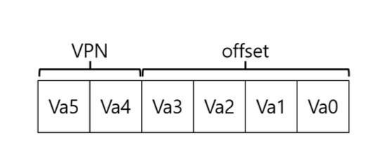
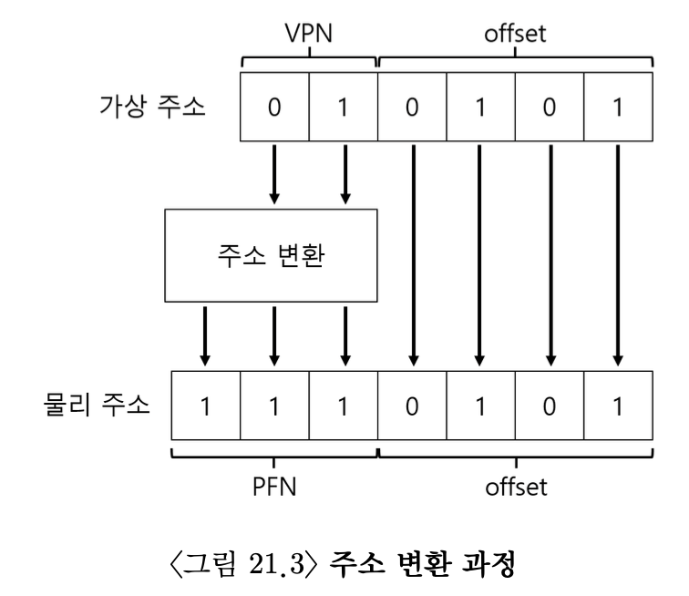

# 페이징(Paging)
세그멘테이션 방범을 사용하게 되면 단편화로 인한 공간 낭비와 할당의 어려움이 발생한다. 이를 해결하기 위해서 동일 크기의 조각으로 나누는 페이징 기법을 사용한다. 
### 장점
- 주소 공간의 사용 방식과는 상관없이 효율적으로 주소 공간 개념 지원 가능
  - 힙과 스택이 어느 방향으로 커지고 어떻게 사용되는지 가정하지 않아도 된다.
- 주소 공간을 할당하기 위해서 **빈 공간 리스트** 에서 찾기만 하면 된다. 

페이징 기법은 위 그림에서처럼 주소공간을 지정된 단위로 분할하여 관리한다. 운영체제는 **_프로세스마다_** 각 가상 페이지에 대한 물리 메모리를 저장하기 위해서 **페이지 테이블(Page Table)** 이라는 자료구조를 가지고 있다. 페이지 테이블은 주소 공간의 가상 페이지의 **주소 변환** 정보를 저장한다. 



가상 주소 =  VPN(virtual page number) + offset

64바이트의 물리 주소를 가질때 16바이트로 페이지의 크기를 나누면 6비트를 사용해서 물리 주소를 나타낼 수 있다.  앞의 2비트는 VPN으로 가상 페이지 번호를 가지고 잇고 offset은 해당 페이지 번호에서 특정하고 있는 바이트의 위치를 나타낸다. offset은 각 페이지의 모든 바이트를 지정할 수 있어야하기 때문에 최댓값이 페이지의 크기-1을 가진다. 



VPN을 사용해서 해당 페이지의 물리 주소를 찾아 낼 수 있다. offset은 가상페이지와 물리주소상에서 동일하기 때문에 변환하지 않는다.

- PTE(Page Tabel Entry): 가상 주소를 물리 주소로 변환하기 위한 정보를 갖는다.

## TLB(Translation-Lookaside Buffer, 변환-색인 버퍼)
TLB는 메모리관리부(Memory-Management Unit,MMU)의 일부이며 자주 참조되는 가상 주소 -> 실제 주소 변환 정보를 저장하는 하드웨어 캐시이다. 주소-변환 캐시(address-translation cache)라고도 불린다.

### CISC(Complex-Instruction Set Computers)
TLB 미스를 처리해주는 하드웨어로 페이지 테이블에 대한 명확한 정보를 가지고 있다.
- TLB 미스 발생시
  1. 페이지 테이블에서 원하는 페이지 테이블 엔트리를 찾는다.
  2. 필요한 변환 정보 추출
  3. TLB 갱신
  4. TLB 미스가 발생한 명령어 재실행
```
VPN = (VirtualAddress & VPN_MASK) >> SHIFT
(Success, TlbEntry) = TLB_Lookup(VPN)
if(Success == True)
  if(CanAccess(TlbEntry.ProtectBits) == True)
    Offset = VirtualAddresss & OFFSET_MASK
    PhysAddr = (TlbEntry.PFN << SHIFT) | Offset
    Register = AccessMemory(PhysAddr)
  else
    RaiseException(PROTECTION_FAULT)
else
  RaiseException(TLB_MISS)
```
### RISC(Reduced Instruction Set Computing)
CISC보다 최근데 등장한 컴퓨터 구조로 **소프트웨어 관리 TLB(Softeware-managed TLB)** 를 사용.
- 미스 처리 과정
  1. TLB에 데이터 없으면 하드웨어는 예외 발생
  2. 운영체제가 예외 핸들링 담당하여 명령어 실행을 잠정 중지
  3. 실행 모드를 커널 모드로 변경하여 커널 코드 실행 준비
  4. 커널 모드에서 트랩 핸들러 실행
  5. 트랩 핸들러는 페이지 테이블을 검색해서 변환 정보를 찾음
  6. 특권 명령어를 사용하여 TLB 갱신 후 리턴
  7. 하드웨어 재실행

- TLB 미스 트랩 핸들러와 시스템콜 트랩 핸들러 차이점
1. 핸들링 후에 실행하는 명령어 차이
  - 시스템 콜의 경우 트랩 핸들러에서 리턴 후 시스템 콜을 호출한 명령어 바로 다음 명령어 실행
  - TLB 미스의 경우 트랩에서 리턴하면 트랩을 발생시킨 명령어를 **다시** 실행해야한다.
    - 다시 실행하면 TLB 히트가 발생하게 된다.
    - 트랩이 발생하면 PC(Program Counter)에 다시 실행할 명령어의 주소를 저장
- 요약
> PC = (트랩 핸들러 == TLB Miss) ? 지금 명령어 : 다음 명령어
## 문맥 교환시에 TLB 처리
문맥 교환을 하게되면 이전 프로세스가 사용하고 있던 TLB의 정보들을 필요없게 된다. 그래서 문맥교환을 할때마다 TLB를 비워주게 되면 안전하기는 하지만 성능에 큰 부담을 주게 된다. 그렇기에 **주소공간 식별자(ASID, Address Space IDentifier)** 필드를 추가했다. ASID를 사용함으로 여러 프로세스들이 TLB의 공간을 공유하여 사용할 수 있다. 

# 작은 페이지 테이블
현대의 컴퓨터들을 많은 수의 프로세스가 실행된다. 각각의 프로세스마다 페이지 테이블을 가지게 되면 지나친 공간을사용하기 때문에 페이지 테이블을 작게 만들어야한다. 
### 세그먼트 + 페이지
페이지 테이블의 크기를 줄이기 위한 간단한 방법으로는 페이지의 크기를 늘리는 것이다. 하지만 페이지가 커지게 되면 내부 단편화 현상이 심해지게 되며 또 이를 해결하기위해서 페이지 내부를 세그먼트를 사용하여 분리해준다. 
> VirtualAddresss = SegNum | VPN | AddressOfPTE
### 단점
- 세그멘테이션은 특정 패턴을 가정하기 때문에 유연하지 못하다.
- sparsely used heap은 페이지 테이블을 낭비한다.
- 외부 단편화 유발
## 멀티 레벨 페이지 테이블
선형 페이지 테이블을 트리 구조로 표현하여 사용한다. 현대의 시스템에서 사용된다. 
- 페이지 디렉터리(page directory): 페이지 테이블의 각 페이지의 할당 여부와 위치 파악
  


- 장점
  - 사용된 주소 공간의 크기에 비례하여 페이지 테이블을 할당 -> 작은 크기의 페이지 테이블로 주소공간 표현 가능
  - 페이지 테이블을 페이지 크기로 분할하여 메모리 관리 유용
- 단점
  - 추가비용 발생, TLB 미스일 때 페이지 디렉터리와 TPE 접근을 위해 총 2번의 메모리 로드 발생
  - 복잡도가 높다. 

# 물리 메모리 크기 이슈
프로세스는 램에 있는 데이터의 위치 뿐만아니라 하드 디스크에 있는 데이터를 사용할 수도 있다.
## 스왑 공간(swap space)
스왑 공간은 디스크에 페이지들이 저장된 공간이다. 메모리 페이지를 읽어서 이곳에 쓰고 여기서 페이지를 읽어서 메모리에 탑재 시킨다. 스왑 공간의 입출력의 단위는 페이지의 크기이다. 스왑 공간을 사용하기 위해서 운영체제는 스왑 공간에 저장된 모든 페이지들의 위치를 기억하고 있어야한다. 
### Present Bit
페이지가 디스크로 스왑되게할려면 하드웨어가 해당 PTE가 물리 메모리에 존재하지 않는다는 것을 표현해야한다. 이를 위해서 **Present Bit** 를 사용한다. Present bit가 1로 되어있으면 물리 메모리에 해당 페이지가 존재한다는 것으로 기존의 TLB를 사용한 방법으로 데이터를 전달해주면 된다. 하지면 0으로 설정되어 있다면 메모리가 아닌 하드 디스크에 데이터가 존재하는 것이기 때문에 **페이지 폴트(page fault)** 를 발생 시켜서 운영체제로 제어권을 넘긴다. 이 처리를 **페이지 폴트 핸들러**가 처리한다.
### Page Fault Handler
페이지 폴트가 발생하면 핸들러는 디스크I/O를 실행하여 디스크에서 원하는 페이지를 가져온다. 이 때 디스크의 주소는 PFN과 같은 PTE 비트들을 사용하여 나타낸다.
### 메모리에 빈 공간이 없는 경우
메모리에 디스크에서 가져온 페이지를 저장할 공간이 없으면 캐시 처리정책처럼 메모리 공간을 비워주는(교체, replace)해주는 **페이지 교체 정책**이 필요하다.
## 메모리 교환 정책
1. FIFO: 선입선출
2. Random: 무작위로 evict
3. LRU: 오래된 것 evict
## 쓰레싱(Thrashing)
메모리 사용 요구가 감당할 수 없을 만큼 많고 실행 중인 프로세스가 요구하는 메모리가 가용 물리 메모리 크기를 초과하는 경우 시스템은 끊임없이 페이징을 해야한다. 이러한 상황을 쓰래싱이라고 한다. 
# 용어
- COW(Copy on Write): 하나의 페이지를 두개의 페이지 테이블이 가리키고 있는 상태이다. 하지만 양쪽 주소공간에서 읽기 전용으로 사용된다. 