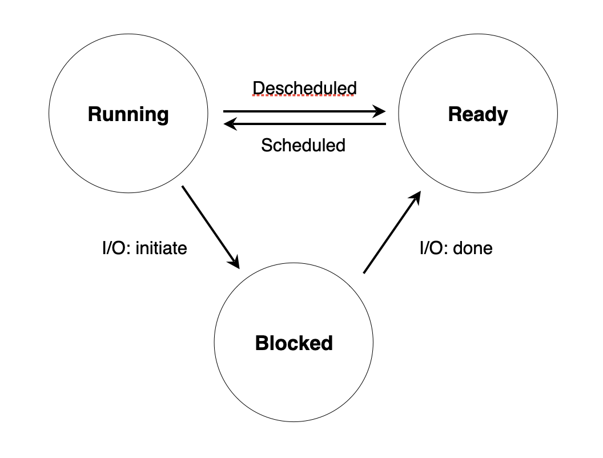
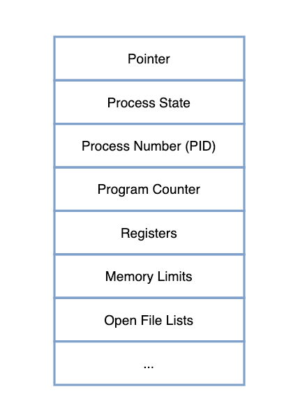

# 4장

### 운영체제는 어떻게 CPU 가 여러개 존재하는 듯한 환상을 만들어 낼 수 있을까?

## 프로세스

> 프로세스란 실행중인 프로그램을 말합니다.
하나의 CPU는 한 순간에 하나의 프로세스만 실행할 수 있습니다.
> 

### 프로세스 생성 과정

운영체제는 **어떤 과정을 거쳐서** 프로그램을 프로세스로 변환할까?

1. **디스크에 존재하는 프로그램 코드와 정적 데이터를 메모리에 로드**
    - 초기 운영체제들은 코드와 데이터를 미리 메모리에 모두 올려놓고 시작했습니다.
    - 현대의 운영체제들은 이 작업을 뒤로 미뤘습니다. 프로그램을 실행하면서 그때 그때 필요한 부분만 메모리에 로드합니다.
2. **스택(stack)과 힙(heap)을 위한 공간을 메모리에 할당**
    - stack : 지역 변수, 매개 변수, 반환값 등을 저장
    - heap: 가변적인 자료 구조를 저장 → 할당해야 할 메모리의 크기가 런타임에 결정되는 데이터들
    혹은 malloc() 과 free() 를 이용하여 프로그래머가 필요에 따라 메모리를 임의로 할당하거나 소멸시키기 위해 사용하는 메모리 공간
3. **입출력 초기화 작업**
    - STDIN, STDOUT, STDERR

위 과정을 거친 후 마지막으로 프로그램의 엔트리 포인트인 main() 메소드를 실행하는 작업만이 남습니다.

### 프로세스 상태 관리

운영체제는 프로세스의 상태를 `실행(running)`, `준비(ready)`, `대기(blocked)` 로 분류합니다. 그리고 프로세스들을 **상태전이**를 통해 체계적으로 관리합니다.

프로세스 상태전이

프로세스가 생성되면 준비상태가 되고 준비리스트에 추가됩니다. 그리고 운영체제의 스케줄링 정책에 따라 스케줄되면 실행상태로 전이되고, CPU 연산을 마친 후 자원을 반납하는 경우 앞의 경우와 반대로 실행상태에서 준비상태로 전이됩니다. 
프로세스가 입출력(I/O)을 요청했고 그것의 완료를 기다려야하는 경우라면 해당 프로세스는 대기상태로 전이되고 다른 프로세스가 CPU 자원을 가져갑니다. 입출력이 완료된다면 해당 프로세스는 준비상태로 전이된 후 준비리스트에 추가되고 다시 자기 차례가 오면 실행상태로 전이되어 입출력작업 후 하려던 작업을 마저 수행합니다.

### 프로세스의 구조

운영체제가 수많은 프로세스들을 관리하고 스케줄링하려면 현재 실행, 대기 혹은 중단된 모든 프로세스들 각각에 대한 정보가 필요할겁니다. 이를 위해 운영체제는 시스템에 존재하는 모든 프로세스의 정보를 기록하고 있는 **프로세스 리스트**라는 자료구조를 유지하고 있고, 프로세스 리스트의 각 노드는 **PCB(Process Control Block)**라는 자료구조로 이루어져 있습니다. PCB는 프로세스에 대한 중요한 메타 데이터를 저장해놓은 자료구조입니다.

Process Control Block - PCB

운영체제에 따라 그 모양은 조금씩 다를 수 있지만, 일반적으로 PCB는 위의 그림과 같은 정보들을 포함하고 있습니다. 운영체제는 프로세스를 PCB의 형태로 바라보며, 각 프로세스가 생성될 때 고유의 PCB가 생성되고, 프로세스가 완전히 종료되면 PCB도 제거됩니다. 이 정보들이 프로세스 리스트에 남아있기 때문에 **프로세스가 CPU 자원을 반납하고 대기상태로 전이되더라도 다시 실행상태로 돌아와서 자기가 하던 작업을 마저 진행**할 수 있는거죠.
