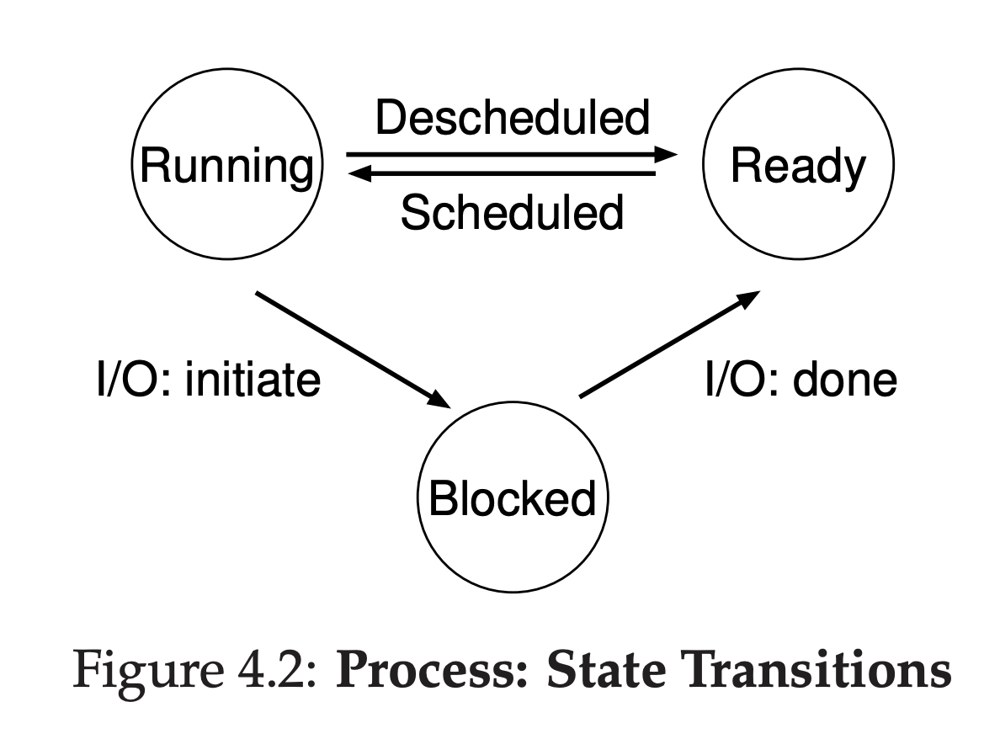

# 프로세스(Process)
> 일반적으로 실행중인 프로그램을 의미
---
## 프로세스의 구성요소

- Code 영역: 프로세스가 접근하는 명령어 저장
- Data 영역: 프로세스가 사용하는 전역변수/static 변수 저장
- heap 영역: 동적 할당
- stack영역: 지역변수, 전달 인자

- 프로그램 카운터(program counter, PC): 명령어 포인터(instruction pointer, IP)라고도 불리며 프로세스가 어떤 멸영어가 실행 중인지를 저장한다.
- 스택 포인터(Stack Pointer): 함수의 변수와 리턴 주소를 저장한느 스택을 관리할 때 사용하는 래지스터이다.

## 프로세스 생성
1. Load(탑재): 영구 저장장치에서 코드와 정적 데이터를 탑재하기 위해서 바이트 메모리를 읽어서 메모리에 저장한다.
    - 모든 데이터를 탑재할 수 없기 때문에 **페이징(Paging)** 과 **스와핑(Swapping)** 기법을 사용한다.
2. stack 할당
3. heap 할당 
## 프로세스 상태
프로세스의 상태는 **실행(Running)** , **준비(Ready)** , **대기(Blocked)** 가 있다.
- Running: 프로레스가 프로세서에서 실행중이다.
- Ready: 실행할 준비가 되어있지만 운영체제가 다른 프로세스를 실행하고 있어서 대기중이다.
- Blocked: 프로세스가 IO와 같은 다른 사건을 기다리는 동안 프로세스의 수행이 중단된 상태이다. 대기 상태가 끝나면 준비 상태로 변환되어 스케줄링을 기다린다.
- Initial(초기): 프로세스가 완전히 생성되기 전까지의 상태
- Final(최종): 프로세스는 종료되었지만 해당 프로세스가 사용하던 자원들이 완전히 반납되지 않은 상태(Unix에서는 **Zombie** 상태라고 불린다.)
  - 어떤 프로세스가 다른 프로세스가 성공적으로 실행을 마쳤는지 파악하기 위해 사용된다.
운영체제는 **스케줄(Schedule)** 정책에 따라서 준비 상태의 프로세스를 실행 상태로 변환시킨다. 
### 시분할(time sharing)
- cpu를 가상화하여 여러 프로세스가 동시에 사용할 수 있도록 한다.
- 각 프로세스의 성능은 낮아지지만 전체 시간당 처리하는 양을 늘리수 있다.
### 문맥교환(Context switching)

- 문맥(Context): 프로세스가 사용중이고 접근한 주소 값을 의미한다. 명령어가 문장이라고 하면 다음 문장을 자연스럽게 이어가기 위해서는 문맥 파악을 잘해야한다.
- CPU의 관점에서 특정 프로세스의 명령어를 처리 중에 다른 프로세스를 처리해야한다면 현제 저리 중인 프로세스의 문맥을 저장해놓고 다음 프로세스의 문맥을 가져와서 이어간다.
> 여러 사람과 한문장씩 돌아가면서 대화를 해야한다면 수첩에 각 사람과 어디까지 얘기를 했는지 적어놔야 할 것이다.
### 프로세스 리스트
각 프로세스의 상태를 파악하기 위한 프로세스 리스트 자료구조가 운영체제에 있다. 준비 상태의 프로세스가 다른 프로세스의 상태를 확인 할 때 사용된다.
