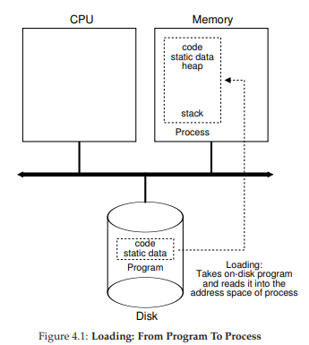
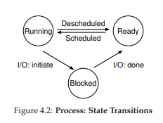

# 4. 프로세스의 개념

## 프로세스 → 실행 중인 프로그램

>❔ CPU가 여러 개 존재한다는 환상을 어떻게 제공하는가
>
> 적은 개수의 CPU밖에 없더라도, 운영체제는 어떻게 거의 무한개에 가까운 CPU가 있는 듯한 환상을 만들 수 있을까?

>
>❕ 운영체제는 CPU를 가상화하여 이러한 환상을 만들어 낸다.
>
> 하나의 프로세스를 실행하고, 얼마 후 중단시키고 다른 프로세스를 실행하는 작업을 반복하면서 실제 하나 또는 소수의 CPU로 여러 개의 가상 CPU가 존재하는 듯한 환상을 만들어 낸다.

---

## 가상화

### 시분할 (time sharing)

- 원하는 수 만큼의 프로세스를 동시에 실행할 수 있게 한다.
- CPU를 공유하기 때문에, 각 프로세스의 성능은 낮아진다.

### 메커니즘 (mechanism)

- 필요한 기능을 구현하는 방법이나 규칙

### 운영체제의 지능 - 정책 (policy)

- 운영체제 내에서 어떤 결정을 내리기 위한 알고리즘
- 예시) 스케줄링 정책 (scheduling policy)

---

## 프로세스의 구성 요소

### 하드웨어 상태 (machine state)

- 프로세스의 하드웨어 상태 중 가장 중요한 구성 요소는 *메모리*이다.
    - 명령어는 메모리에 저장된다.
    - 실행 프로그램이 읽고 쓰는 데이터 역시 메모리에 저장된다.
    - 프로세스가 접근할 수 있는 메모리(**주소 공간(address space)**)는 프로세스를 구성하는 요소
- *레지스터*도 프로세스의 하드웨어 상태를 구성하는 요소 중 하나
    - 많은 명령어들이 레지스터를 직접 읽거나 갱신한다.
    - **프로그램 카운터 (program counter, PC)**
        - 프로그램의 어느 명령어가 실행 중인지를 알려준다.
        - **명령어 포인터 (instruction pointer, IP)** 라고도 불린다
    - **스택 포인터(stack pointer)와 프레임 포인터(frame pointer)**
        - 함수의 변수와 리턴 주소를 저장하는 스택을 관리할 때 사용하는 레지스터이다.

---

## 프로세스 API

- 생성 (Create)
- 제거 (Destroy)
- 대기 (Wait)
- 각종 제어 (Miscellaneous Control)
- 상태 (Status)

---

## 프로세스 생성

프로그램 실행을 위해 운영체제가 하는 첫 번째 작업은 프로그램 **코드(code)**와 **정적 데이터(static data)**를 메모리, 프로세스의 주소 공간에 **탑재(load)**하는 것이다.

프로그램은 디스크 또는 요즘 시스템에서는 플래시-기반 SSD에 특정 실행 파일 형식으로 존재한다.

코드와 정적 데이터가 메모리로 탑재된 후, 프로세스를 실행시키기 전에 운영체제가 해야할 일이 몇 가지 있다.

- 일정량의 메모리가 프로그램의 **실행시간 스택**(run-time stack, 혹은 그냥 스택) 용도로 할당되어야 한다.
- 운영체제는 프로그램의 **힙(heap)**을 위한 메모리 영역을 할당한다.
- 입출력과 관계된 초기화 작업을 수행한다.

위 세가지 과정을 마치게 되면, 운영체제는 프로그램의 시작 지점(entry point), 즉 `main()`에서부터 프로그램 실행을 시작하는 마지막 작업을 제외하고 준비를 마치게 된다.

---

## 프로세스 상태

- 실행 (Running)
- 준비 (Ready)
- 대기 (Blocked)

>➕ 자료 구조 - 프로세스 리스트
>
> 운영체제의 다양한 중요 자료구조가 있는데, 첫 번째가 프로세스 리스트이다. 이 자료구조를 이용하여 시스템에서 실행중인 프로그램을 관리한다.
프로세스의 관리를 위한 정보를 저장하는 자료구조를 **프로세스 제어 블럭(Process Control Block, PCB)**라고 부른다.

---

## 자료 구조

**레지스터 문맥(register context)** 자료구조는 프로세스가 중단되었을 때 해당 프로세스의 레지스터값들을 저장한다. 이 레지스터 값들을 복원하여 운영체제는 프로세스 실행을 재개한다. → **문맥 교환(context switch)**