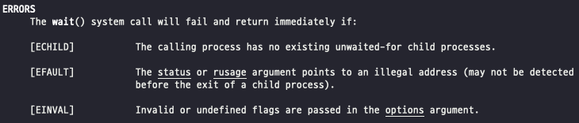

# 5. 막간: 프로세스 API

Unix는 프로세스를 생성하기 위하여 `fork()`와 `exec()` 시스템 콜을 사용한다.

`wait()`는 프로세스가 자신이 생성한 프로세스가 종료되기를 기다리기 원할 때 사용된다.

> ❔ 핵심 질문: 프로세스를 생성하고 제어하는 방법
>
> - 프로세스를 생성하고 제어하려면 운영체제가 어떤 인터페이스를 제공해야 하는가?
> - 유용하고 편하게 사용하기 위해서 이 인터페이스는 어떻게 설계되어야 하는가?

---

## fork() 시스템 콜

프로세스 생성에 `fork()` 시스템 콜이 사용된다.

```c
#include <stdio.h>
#include <stdlib.h>
#include <unistd.h>

int
main(int argc, char *argv[])
{
    printf("hello world (pid:%d)\n", (int) getpid());
    int rc = fork();
    if (rc < 0) {
        // fork failed; exit
        fprintf(stderr, "fork failed\n");
        exit(1);
    } else if (rc == 0) {
        // child (new process)
        printf("hello, I am child (pid:%d)\n", (int) getpid());
    } else {
        // parent goes down this path (original process)
        printf("hello, I am parent of %d (pid:%d)\n",
	       rc, (int) getpid());
    }
    return 0;
}
```

위 코드 프로그램에서 어떤 일들이 벌어지는지 더 자세히 알아보자.

실행이 시작될 때 프로세스는 “hello world...”메시지를 출력하는데, 이 메시지에는 **PID**로도 알려진 **프로세스 식별자(process identifier)** 가 포함된다.

그 후에 재밌는 일이 일어난다.

1. 프로세스는 `fork()` 시스템 콜을 호출한다.
    1. 운영체제는 프로세스 생성을 위해 이 시스템 콜을 제공한다.
2. 생성된 프로세스가 *호출한 프로세스의 복사본*이다.
    1. 새로 생성된 프로세스는(일반적으로 **자식** 프로세스, 생성한 프로세스는 **부모** 프로세스라 불린다) `main()` 함수 첫 부분부터 시작하지 않았다는 것을 알 수 있다.

자식 프로세스는 부모 프로세스와 완전히 동일하지는 않다. 자식 프로세스는 자신의 주소 공간, 자신의 레지스터, 자신의 PC 값을 갖는다.

`fork()` 시스템 콜의 반환 값이 서로 다르다. `fork()`로 부터 부모 프로세스는 생성된 자식 프로세스의 PID를 반환받고, 자식 프로세스는 0을 반환받는다.

**CPU 스케줄러(scheduler)** 는 실행할 프로세스를 선택한다.

스케줄러의 동작은 일반적으로 상당히 복잡하고 상황에 따라 다른 선택이 이루어지기 때문에, 어느 프로세스가 먼저 실행된다 라고 단정하는 것은 매우 어렵다.

이런 **비결정성(nondeterminism)** 으로 인해 멀티 쓰레드 프로그램 실행 시 다양한 문제가 발생한다.

---

## wait() 시스템 콜

부모 프로세스가 자식 프로세스의 종료를 대기해야 하는 경우도 발생할 수 있다.

이러한 작업을 위해 `wait()` 시스템 콜이 (혹은 더 많은 기능을 가진 `waitpid()`)있다.

```c
#include <stdio.h>
#include <stdlib.h>
#include <unistd.h>
#include <sys/wait.h>

int
main(int argc, char *argv[])
{
    printf("hello world (pid:%d)\n", (int) getpid());
    int rc = fork();
    if (rc < 0) {
        // fork failed; exit
        fprintf(stderr, "fork failed\n");
        exit(1);
    } else if (rc == 0) {
        // child (new process)
        printf("hello, I am child (pid:%d)\n", (int) getpid());
	sleep(1);
    } else {
        // parent goes down this path (original process)
        int wc = wait(NULL);
        printf("hello, I am parent of %d (wc:%d) (pid:%d)\n",
	       rc, wc, (int) getpid());
    }
    return 0;
}
```

위 예제 코드에서 부모 프로세스는 `wait()` 시스템 콜을 호출하여 자식 프로세스 종료 시점까지 자신의 실행을 잠시 중지시킨다. 자식 프로세스가 종료되면 `wait()`는 리턴한다.

`wait()` 호출을 위와 같이 코드에 추가하면 프로그램은 항상 동일한 결과를 출력한다.

>❕ 부모 프로세스가 항상 자식 프로세스가 끝나기를 기다렸다가 동작하기 때문에, 자식 프로세스의 “hello, I am child...” 메시지가 항상 먼저 나타난다.

---
> ➕ `wait()`가 자식 프로세스가 종료하기 전에 리턴하는 몇 가지 경우가 있다.



- **[ECHILD]** - 호출 프로세스가 대기중인 자식 프로세스가 없을 때.
- **[EFAULT]** - status 또는 rusage 인자가 유효하지 않은 주소값을 가리킬 때 (아마도 자식 프로세스를 나오기 전 까지는 발생하지 않을 것).
- **[EINVAL]** - options 인자에 유효하지 않거나 정의되지 않은 플래그가 넘겨졌을 때.
---

## exec() 시스템 콜

이 시스템 콜은 자기 자신이 아닌 다른 프로그램을 실행해야할 때 사용한다.

`fork()` 시스템 콜은 자신의 복사본을 생성하여 실행하지만, `exec()` 시스템 콜은 자신의 복사본이 아닌 다른 프로그램을 실행한다.

`exec()` 시스템 콜은 다음과 같은 과정으로 수행된다.

1. 실행 파일의 이름과 약간의 인자가 주어지면, 해당 실행 파일의 코드와 정적 데이터를 읽어 들여 현재 실행 중인 프로세스의 코드 세그멘트와 정적 데이터 부분을 덮어 쓴다.
2. 힙과 스택 및 프로그램 다른 주소 공간들로 새로운 프로그램의 실행을 위해 다시 초기화된다.
3. 운영체제는 프로세스의 `argv`와 같은 인자를 전달하여 프로그램을 실행시킨다.
    1. 새로운 프로세스를 생성하지는 않는다.
    2. 현재 실행 중인 프로그램을 다른 실행 중인 프로그램으로 대체하는 것이다.

---

## 왜, 이런 API를?

새로운 프로세스를 생성하는 간단한 작업 같은데, 왜 이런 이상한 인터페이스를 사용할까?

Unix의 쉘을 구현하기 위해서는 `fork()`와 `exec()`을 분리해야 한다. 그래야만 쉘이 `fork()`를 호출하고 `exec()`를 호출하기 전에 코드를 실행할 수 있다.