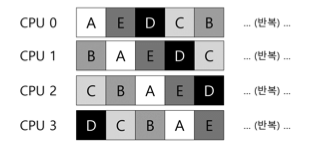

# 10장. 멀티프로세서 스케줄링 (고급)

지금까지 우리는 단일프로세서 스케줄링의 많은 원칙들에 대해 다루었다.

이 원칙들을 여러 CPU에서 동작하도록 어떻게 확장할 수 있을까?

>❓ 여러 CPU에 작업을 어떻게 스케줄 해야 하는가
>- 운영체제는 어떻게 작업을 여러 CPU에 스케줄 하는가?
>- 어떤 새로운 문제가 등장하는가?
>- 예전 기술을 적용할 것인가 아니면 새로운 아이디어가 필요한가?

---

## 배경: 멀티프로세서 구조

멀티프로세서 스케줄링에 대한 새로운 문제점을 이해하기 위해서는 단일 CPU 하드웨어와 멀티 CPU 하드웨어의 근본적인 차이에 대한 이해가 필요하다.

다수의 프로세서간의 데이터 공유, 하드웨어 캐시의 사용방식에서 근본적인 차이가 있다.

- 단일 CPU 시스템에는 하드웨어 캐시 계층이 존재한다.
    - 캐시는 메인 메모리에서 자주 사용되는 데이터의 복사본을 저장하는 작고 빠른 메모리이다.
    - 캐시는 지역성(locality) 에 기반한다.
        - 시간 지역성(temporal locality) → 데이터가 한 번 접근되면 가까운 미래에 다시 접근되기 쉽다.
        - 공간 지역성(spatial locality) → 프로그램이 주소 x의 데이터를 접근하면 x 주변의 데이터가 접근되기 쉽다.

### 문제점 - 캐시 일관성 문제(cache coherence)

1. CPU 1에서 실행 중인 프로그램이 주소 A를 읽는다.
2. CPU 1의 캐시에 데이터가 존재하지 않기 때문에 메인 메모리로부터 값을 가져온다.
3. 프로그램은 주소 A의 값을 변경한다. (변경은 캐시에 존재하는 값만 갱신한다.)
4. 운영체제가 CPU 2로 이동하기로 결정한다.
5. 프로그램이 다시 주소 A의 값을 읽으려고 한다.
6. CPU 2의 캐시에는 데이터가 존재하지 않으므로 메인 메모리로부터 값을 가져온다.
7. 변경되기 전 주소 A의 값을 가져오게 된다.

---

## 동기화를 잊지 말자

CPU들이 동일한 데이터 또는 구조체에 접근할 때, 올바른 연산 결과를 보장하기 위해 락과 같은 상호 배제를 보장하는 동기화 기법이 많이 사용된다.

---

## 마지막 문제점: 캐시 친화성(cache affinity)

CPU에서 실행될 때 프로세스는 해당 CPU 캐시와 TLB에 상당한 양의 상태 정보를 올려 놓게 된다. 다음 번에 프로세스가 실행될 때 동일한 CPU에서 실행되는 것이 유리할 것이다.

따라서 가능한 한 프로세스를 동일한 CPU에서 실행하려고 노력하는 방향으로 결정해야 한다.

---

## 단일 큐 스케줄링(single queue multiprocessor scheduling, SQMS)

가장 기본적인 방식은 단일 프로세스 스케줄링의 기본 프레임워크를 그대로 사용하는 것이다.

장점은 단순함이다. 기존 정책을 다수 CPU에서 동작하도록 하는 데는 많은 변경이 필요하지 않다. CPU가 2개면 작업을 두 개 선택하면 된다.

하지만 명백한 단점이 있다.

- **확장성(scalability)** 결여
    - 스케줄러가 다수의 CPU에서 제대로 동작하게 하기 위해 코드에 일정 형태의 락을 삽입
        - 락은 SQMS 코드가 단일 큐를 접근할 때 올바른 결과가 나오도록 한다.
    - 락은 성능을 크게 저하시킬 수 있으며, CPU 개수가 증가할수록 더욱 그렇다.
    - 단일 락에 대한 경쟁이 증가할수록 시스템은 락에 점점 더 많은 시간을 소모하게 되고, 실제 필요한 일에 쓰는 시간은 줄어들게 된다.
- 캐시 친화성
    
    - 각 CPU는 공유 큐에서 다음 작업을 선택하기 때문에 각 작업은 CPU를 옮겨 다니게 된다.
    
    - SQMS 스케줄러는 이를 해결하기 위해 가능한 한 프로세스가 동일한 CPU에서 재실행될 수 있도록 시도한다.
    
    - 특정 작업들에 대해서 캐시 친화성을 고려하여 스케줄링하고, 다른 작업들은 오버헤드를 균등하게 하기 위해 여러 군데로 분산시키는 정책을 사용한다.

---

## 멀티 큐 스케줄링(multi-queue multiprocessor scheduling, MQMS)

- SQMS에 비하여 확장성이 좋다.
    - CPU개수가 증가할수록, 큐의 개수도 증가하기 때문에 락과 캐시 경합(cache contention)은 더이상 문제가 되지 않는다.
- MQMS는 본질적으로 캐시 친화적이다.
    - 작업이 계속 같은 CPU에서 실행되기 때문에 캐시에 저장된 내용을 재사용하는 이점을 얻는다.

하지만, 새로운 문제점에 봉착하게 되었다.

멀티 큐 기반 방식의 근본적인 문제점은 **워크로드의 불균형(load imbalance)** 이다.

위의 그림에서 작업 C가 끝났다고 가정해보자.

여기서 알 수 있듯이, A가 B, D보다 2배의 CPU를 차지하고 있으며, 이는 우리가 원하는 바가 아니다. 여기에 더해서 만약 A마저 종료되고 B, D만 남게 되었다고 가정하면 아래와 같아진다.

아주 당연한 답이겠지만, 작업을 이리저리 이동시키는 것이 해결책이다.

이를 **이주(migration)** 이라고 부른다. 작업을 한 CPU에서 다른 CPU로 migration 함으로써 워크로드의 균형을 달성한다.

좀 더 명확하게 알 수 있도록 위에서 사용했던 예시를 다시 사용해보자.

누가봐도 B 또는 D를 CPU 0으로 이동시켜 작업해야 할 것만 같다. 하지만 이보다 좀 더 까다로운 경우는 이전 예시에서 보았다.

이 경우에는 한 번의 이동만으로는 해결되지 않는다. 그렇다면 어떻게 해야할까?

작업들을 지속적으로 이주시키면 된다. 아래의 타임라인 예시처럼 계속해서 작업을 이주하는 것이다.

- 큐를 너무 자주 검사하게 되면 높은 오버헤드로 확장성에 문제가 발생한다.
    - 확장성은 멀티 큐 스케줄링의 가장 중요한 목적인데?
- 그렇다고 다른 큐를 자주 검사하지 않으면 심각한 워크로드의 불균형을 초래한다.