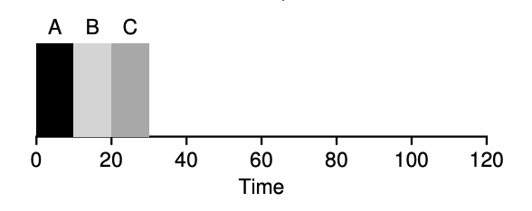
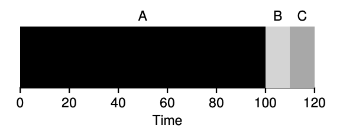
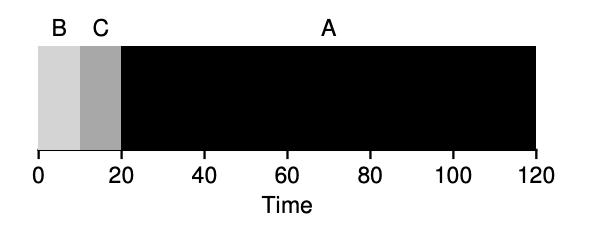
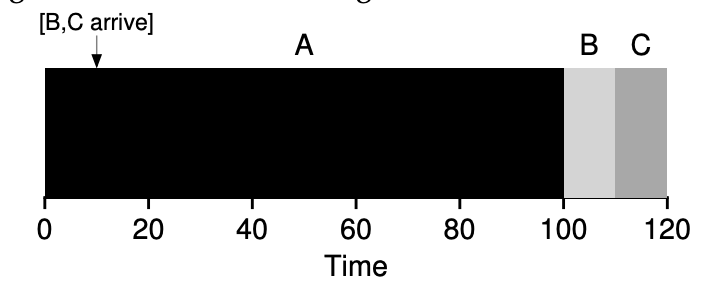
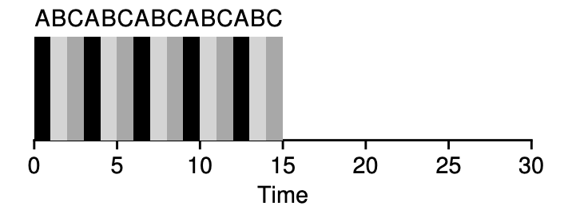
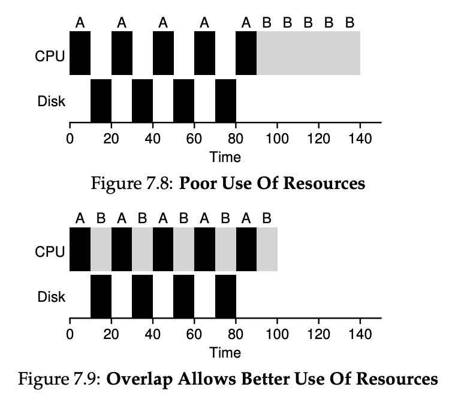
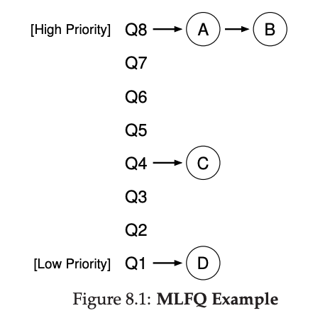
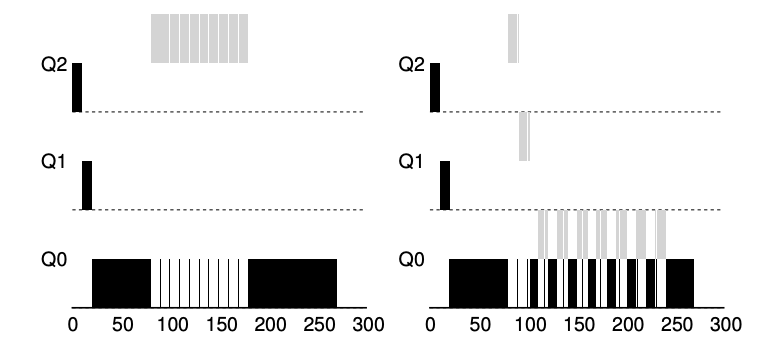
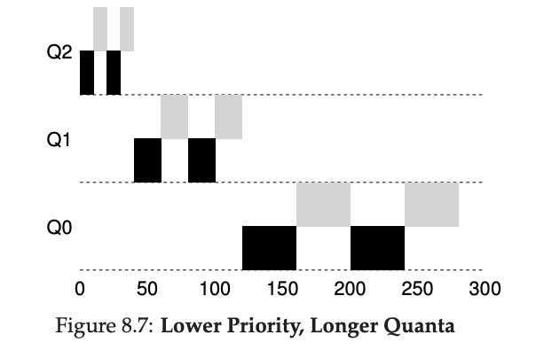

## CPU의 가상화

> 하나 뿐인 CPU를 어떻게 나눠써야할까?

CPU 가상화의 개념은 심플하다. 한 프로세스를 잠시 실행하고 멈추고 또 다른 프로세스를 잠깐 실행하고 멈추고 이런 식으로 계속 진행하면 된다. 이렇게 CPU를 시간별로 조금씩 나눠씀으로써 CPU 가상화를 구현할 수 있었다.

하지만 시간별로 나누어서 쓴다는게 말처럼 쉽지가 않다. 프로세스들이 너도나도 쓰고싶어하는 귀중한 CPU를 어떻게 해야 한 프로세스가 독점하지 않고 소외받는 프로세스가 생기지 않으면서 이를 제어하는 운영체제에 부하도 덜 줄 수 있을까?

## 스케줄링

CPU를 할당하기 위한 스케줄링 정책들을 살펴보기에 앞서 몇가지 비현실적인 가정을 가지고 들어간다.

1. 모든 작업은 같은 시간 동안 실행된다.
2. 모든 작업은 동시에 도착한다.
3. 작업은 일단 시작하면 최종적으로 종료될 때까지 실행된다.
4. 모든 작업은 CPU만 사용한다. (입출력을 수행하지 않는다는 의미)
5. 각 작업의 실행 시간은 사전에 알려져 있다.

정말 비현실적이고 이상적인 가정이지만 하나씩 점차 완화하면서 살펴볼 예정이다.

### 스케줄링의 평가 항목 (scheduling metric)

반환 시간(turnaround time)

$$
T_{turnaround} = T_{completion} - T_{arrival}
$$

작업 반환 시간은 작업이 완료된 시각에서 작업이 도착한 시각을 뺀 시간이다. 당장은 2번 가정때문에 반환 시간과 완료 시간이 같지만 위 조건들은 점차 완화할 예정이다.

### FCFS (First Come First Served)

이름만 봐도 어떤 스케줄링인지 알것같다. 먼저 들어온 작업을 먼저 처리한다는 뜻이다.

위 그림에서 A는 10, B는 20, C는 30에 종료했다. 세 작업의 평균 반환 시간은 20이다.
여기서 1번 가정을 완화해보자. 그럼 FCFS는 어떻게 동작할까? 어떤 문제가 발생할까?

100초 동안이나 실행하는 긴 작업인 A 프로세스가 먼저 도착해서 먼저 CPU를 선점했다. 그래서 뒤의 짧은 작업을 수행하는 B와 C 프로세스는 A 가 끝날때까지 하염없이 기다려야한다. 그런 탓에 평균 반환시간은 100으로 훌쩍 늘어났다.

이와 같은 현상을 convoy effect 라 부른다. (아마 B와 C같이 밀려버린 프로세스가 앞의 프로세스가 끝날때까지 호위하는 것 같은 그림이 그려져서 붙은 이름이지 싶다.) 이를 해결하려면 어떤 스케줄링이 필요할까?

### SJF (Shortest Job First)

이 스케줄링도 이름처럼 쉽다. 실행시간이 가장 짧은 프로세스를 먼저 실행시킨다.

평균 반환 시간이 100초에서 50초로 2배 이상 짧아졌다.

모든 작업이 동시에 도착한다는 가정하에 SJF는 최적의 스케줄링 알고리즘임이 증명되었다.
하지만 가정 2를 완화해서 각 작업이 임의의 시간에 도착한다고 해보자. 이번엔 어떤 문제가 발생할까?

SJF는 기본적으로 비선점형(non-preemptive) 스케줄링 알고리즘이다. 이미 실행중인 프로세스는 CPU를 먼저 양보하지 않는다는 뜻이다.

그래서 위 그림처럼 오래걸리는 작업을 수행중인 A가 먼저 도착하면 짧은 B나 C가 도착해도 FCFS의 convoy effect가 다시 발생해버린다. 이를 해결하기위해 A같은 프로세스는 잠시 중단시킬 수 있도록 해보자.

### STCF(Shortest Time-to-Completion First)

가정 3을 완화해서 모든 작업은 실행 도중에 중단될 수 있다고 하자. 타이머 인터럽트를 발생시켜서 문맥 교환이 가능하다면 B나 C가 도착했을 때 A 작업을 중단하고 B나 C 작업으로 스위칭이 가능하다.

앞에서 설명했던 SJF는 비선점형 스케줄러이기 때문에 이미 실행중인 작업은 중단할 수 없다. 
이런 SJF에 선점 기능을 추가한 스케줄러가 STCF이다. 새로운 작업이 도착하면, 이 스케줄러는 현재 실행중인 작업의 잔여 실행 시간과 새로운 작업의 잔여 실행 시간을 비교하여, 잔여 실행 시간이 가장 작은 작업으로 스케줄링한다.

평균 반환 시간이 단축되어서 50까지 내려왔다. 반환 시간만 본다면 지금가지는 STCF가 최고의 스케줄링 알고리즘이다.

### 새로운 스케줄링 평가 항목

응답 시간 (response time)

$$
T_{response} = T_{firstrun} - T_{arrival}
$$

반환 시간만으로는 좋은 스케줄링 알고리즘은 선별하기 부족했다. 사용자는 터미널에서 작업하게 되어 시스템에게 상호작용을 원활히 하기위한 성능을 요구하게 되었다. 응답 시간이 바로 그것을 평가하기 위한 새로운 기준이다.

STCF는 반환 시간 기준으로는 매우 훌륭한 반면, 응답 시간과 상호작용 측면에서는 매우 나쁜 알고리즘이다.

이제 응답 시간을 고려한 스케줄링 알고리즘들을 살펴보자.

### R-R (Round Robin)

응답 시간 문제를 해결하기 위해 라운드 로빈이라는 스케줄링 알고리즘을 도입한다.

라운드 로빈은 한 작업이 끝날때 까지 기다리지 않고 일정 시간 동안만 실행한 후 CPU를 반납하도록 하고 다른 작업이 실행될 수 있도록 한다. 이때 작업이 수행되는 일정한 시간을 타임 슬라이스(time slice) 또는 스케줄링 퀀텀(scheduling quantum)이라 부른다.

위 그림을 보면 라운드 로빈의 평균 응답 시간은 1로 매우 준수하다.

라운드 로빈에게 타임 슬라이스의 길이는 매우 중요하다. 타임 슬라이스가 짧을수록 응답 시간은 좋아지지만 문맥 교환 비용이 늘어나서 전체 성능에 큰 악영향을 준다. 최적의 타임 슬라이스를 판단해야한다.

응답 시간만 평가하자면 라운드 로빈은 굉장히 좋은 알고리즘이다. 하지만 반환 시간을 측정해보자. 평균 14의 반환 시간을 보인다. 이는 매우 저조한 성능이라고 볼 수 있다.

반환 시간만 보자면 라운드 로빈은 최악이며, 단순한 FCFS보다 성능이 나쁠 수 있다.

### 입출력 연산의 고려

이제 입출력 연산도 고려한 스케줄링 알고리즘을 살펴보자. 현재 실행중인 프로세스가 입출력 작업을 요청한 경우 해당 프로레스는 입출력이 완료될 때 까지 대기 상태가 된다. 스케줄러는 그 시간을 낭비하기 보다는 (Figure 7.8) 다른 작업을 수행하는게 당연히 좋을것 이다.(Figure 7.9)

### 작업이 얼마나 걸릴지 절대 미리 알 수 없다.

마지막 가정인 5번째 가정은 가장 비현실적인 가정이었다. 우리가 미래를 볼 수 있는 능력자가 아닌 이상 작업의 길이를 미리 알 수가 없다. 여기서 우리가 할 수 있는 최선은 프로세스가 현재까지 해왔던 행적을 보고 미래에 어떻게 행동할 지 예측하는 것이다. 과거를 보고 미래를 예측하는게 쉽지는 않겠지만 이 방식으로 문제를 해결해보자.

### MLFQ (Multi-level Feedback Queue)

MLFQ는 앞에서 얘기했던 두 가지 평가지표를 모두 만족시키고자한다.

1. 반환 시간
2. 응답 시간

MLFQ의 기본적인 알고리즘은 다음과 같다.

- 여러개의 큐(Queue)가 존재한다.
- 큐는 각각 다른 우선순위(priority level)를 가진다.
- 실행할 프로세스를 결정하기 위해 우선순위를 활용한다.
- 즉, 높은 우선순위 큐에 존재하는 프로세스가 먼저 실행된다.
- 우선순위가 같으면 라운드 로빈 방식으로 실행된다.

위와 더불어 MLFQ의 핵심은 우선순위를 정하는 방식일 것이다.

### 우선순위의 하향 조정

프로세스가 어느 우선순위의 큐에 있을 지 결정하기 위해 우선 워크로드의 특성을 반영한다.

- 처음 진입하면 가장 높은 우선순위(맨 위)의 큐에 놓여진다.
- 주어진 타임 슬라이스를 모두 사용하면 우선순위는 낮아진다.
- 타임 슬라이스를 모두 사용하기 전에 CPU를 양보하면 우선순위를 유지한다.

이 알고리즘의 핵심은 작업이 짧은 작업인지 긴 작업인지 알 수 없으니까 일단 짧은 작업일거라 가정하고 높은 우선순위를 먼저 부여하는 것이다. 진짜 짧은 작업이라면 빨리 실행되고 바로 종료될 것이다. 긴 작업은 스스로 아래쪽 큐로 내려오게 된다.

하지만 이 알고리즘으로는 완벽하지 않다. 아니 오히려 문제가 많다.

### 현 MLFQ의 문제점

1. 기아 상태(starvation)이 발생할 수 있다.
- 실행시간이 타임 슬라이스보다도 짦은 대화형 작업들이 존재하면 그들이 모든 CPU 시간을 독점해서 작업 시간이 긴 프로세스들은 CPU 시간을 하나도 할당받지 못할것이다.
2. 스케줄러가 자신에게 유리하게 작동하도록 프로그램을 작성할 수 있다.
- 타임 슬라이스가 끝나기 직전에 CPU를 양보해서 계속 높은 레벨의 큐에 의도적으로 머무를 수 있다.
3. 프로그램은 시간이 지남에 따라 그 특성이 변할 수 있다.
- 처음에는 긴 작업을 수행하다가도 나중에는 대화형 작업만 주로 수행할 수도 있다. 하지만 지금의 MLFQ 로는 한번 긴 작업을 수행한 프로세스는 다시 높은 레벨의 큐로 올라갈 수 없다.

### 우선순위의 상향 조정

규칙을 보완해서 위 문제들을 해결해보자. 우선 기아 상태를 해결한다. 일정 시간이 지나면 모든 작업의 우선 순위를 상향 조정하는건 어떨까?

- 새로운 규칙: 일정 기간 S가 지나면, 모든 작업을 최상위 큐로 이동시킨다.

위 새 규칙은 프로세는 굶지않음을 보장해줄 뿐만 아니라 3번 문제였던 특성의 변화에도 대응할 수 있다.
프로세스가 긴 작업에서 대화형 작업으로 그 특성이 변하더라도 일정 시간후에는 다시 최상위 큐로 이동하기 때문에 그에 대응이 가능해진다.

하지만 그 주기인 S를 결정하기가 쉽지가 않다는 단점이 존재한다.

### 높은 우선순위에 머무르지 못하도록 막자.

스케줄러가 자신에게 유리하게 동작하도록 유도하는것을 막아보자.

기존에는 타임 슬라이스를 모두 소진하는 것만 아니면 같은 레벨에 머무를 수 있었지만 이를 바꾼다. 현재 프로세스가 소진한 CPU 시간을 누적해서 타임 슬라이스를 소모하면 아래 큐로 강등시키면 어떨까?

- 새로운 규칙: 주어진 단계에서 시간 할당량을 소진하면, 우선순위는 낮아진다.

위 그림을 보자. 기존에는 꼼수를 쓰면 왼쪽처럼 우선순위를 높게 유지할 수 있었지만 새로운 규칙을 적용하면 그게 불가능해진다. CPU 사용시간이 누적되기 때문에 결국에는 아래로 강등당할 수 밖에 없다.

### MLFQ의 다른 쟁점들

> 디폴트 값이 현장에서 잘 작동하기를 바랄 뿐이다.

MLFQ의 작동에 필요한 변수들을 어떻게 설정해야할까? 예를 들면, 몇개의 큐가 존재해야하며 타임 슬라이스의 크기는 얼마다 되어야 하냐는 것이다.

위 질문들에 쉽게 답할수는 없고 충분히 경험하고 계속 조정해 나가면서 균형점을 찾아야한다.

그래서 대부분의 MLFQ 기법들은 큐 별로 타임 슬라이스르 변경할 수 있다. 우선순위가 높은 큐는 보통 짧은 타임 슬라이스를 설정하고 반대로 낮은 큐는 길게 설정하는 식이다.

MLFQ는 구현에 따라 그 방식이 다양하다. FreeBSD 스케줄러 같은 경우 작업의 현재 우선순위를 계산하기 위해 해당 프로세스가 사용한 CPU 시간을 기초로 한 공식을 사용한다. 일부 다른 스케줄러의 경우 가장 높은 우선순위 큐는 운영체제의 작업을 위해 예약해두기도 한다.

### Multi-Level Feedback Queue 정리

- Multi-Level 의 Priority Queue 가 존재하며,
- 특정 작업의 Priority 를 결정하기 위해 Feedback 을 활용한다.

MLFQ의 규칙을 다시 한번 정리하면 다음과 같다.

1. 우선 순위(A) > 우선 순위(B) 일 경우, A는 실행, B는 실행되지 않는다.
2. 우선 순위가 같을 경우 라운드 로빈 방식으로 실행된다.
3. 작업이 맨 처음 시스템에 진입하면 최상위 큐에 배치된다.
4. 주어진 단계에서 시간 할당량을 소진하면, 우선순위는 낮아진다.
5. 일정 기간 S가 지나면, 모든 작업을 최상위 큐로 이동시킨다.

MLFQ는 작업의 실행을 관찰하고 그 정보를 토대로 우선순위를 배정하고 스케줄링 한다는 점에서 굉장히 흥미롭다. 
반환 시간과 응답 시간을 모두 최적화했다. 짧은 대화형 작업은 빠른 응답 시간을 제공하고 오래 걸리는 CPU 집중 작업같은 경우 대화형 작업들 사이에서도 조금씩이라도 진행되게하여 빠른 반환 시간을 제공한다.

