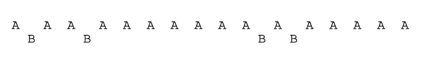

# 6 제한적 직접 실행 원리

### 제어를 유지하면서 효과적으로 CPU를 가상화하는 방법

## 제한적 직접 실행(Limited Direct Execution)

프로그램을 CPU상에서 그냥 직접 실행시키는 것 

1. 운영체제가 원치않는 일을 어떻게 보장하는가?
2. 운영체제는 어떻게 프로그램의 실행을 중단하고 다른 프로세스로 전환시킬 수 있는가? 

## 문제점 1: 제한된 연산

직접실행의 장점은 빠른 실행, 하지만 프로세스가 특수한 종류의 연산을 수행하기 원한다면?

1. 방치하는 방안 ⇒ 바람직하지 않음
2. 사용자 모드 도입

### 사용자 모드

응용 프로그램은 하드웨어 자원에 대한 접근 권한이 일부 제한되어 있음

### 커널 모드

운영체제는 컴퓨터의 모든 자원에 대한 접근 권한을 가짐

### trap

커널 안으로 분기, 특권 수준을 커널 모드로 상향 조정

 trap 명령어를 수행할 때 호출한 프로세스의 필요한 레지스터들을 저장해 return-from-trap 명령어 실행 시에 사용자 프로세스로 제대로 리턴할 수 있도록 함

### return-from-trap

사용자 모드로 조정

### 트랩 테이블

커널은 부팅 시에 트랩 테이블을 만들고 이를 이용해 시스템을 통제함. 


각 프로세스는 커널 모드로 진입하거나 진출할 때 하드웨어에 의해 프로그램 카운터와 범용 레지스터 등의 레지스터를 저장하고 복원하는 용도로 커널 스택을 사용함 

## 문제점 2: 프로세스 간 전환

### 협조 방식: 시스템 콜 기다리기

운영체제가 프로세스들이 합리적으로 행동할 것이라호 신뢰, 주기적으로 CPU를 포기할 것이라고 가정

- yield 시스템 콜 : 협조 방식에서 운영체제에게 제어를 넘겨 운영체제가 다른 프로세스를 실행할 수 있게 함

응용 프로그램이 비정상적인 행위 → 트랩을 발생시켜 운영체제에게 제어가 넘어가고 프로세스를 종료시킴

### 비협조 방식: 운영체제가 전권을 행사

협조적 방법에서 프로세스가 무한루프에 빠지면 → 컴퓨터를 다시 부팅

### 협조없이 제어를 얻는 방법? → 타이머 인터럽트

타이머 장치는 수 밀리 초마다 인터럽트를 발생시키도록 프로그램 가능

인터럽트 발생시 수행 중인 프로세스 중단, 인터럽트 핸들러 실행

CPU는 제어권을 다시 얻고 원하는 일을 할 수 있음

## 문맥의 저장과 복원

스케줄러가 현재 실행 중인 프로세스를 계속 실행 또는 다른 프로세스로 전환할 것인지 결정

### 문맥 교환(context switch)

현재 실행 중인 프로세스의 레지스터 값을 커널 스택 같은 곳에 저장, 곧 실행될 프로세스의 커널 스택으로부터 레지스터 값 복원


### 두번의 레지스터 저장/복원

1. 타이머 인터럽트가 발생했을 때
    
    실행 중인 프로세스의 사용자 레지스터가 암묵적으로 저장, 저장 장소는 해당 프로세스의 커널 스택
    
2. 운영체제가 A에서 B로 전환하기로 결정했을 때
    
    커널 레지스터는 운영체제에 의하여 해당 프로세스의 프로세스 구조체에 저장 
    

## 병행성이 걱정

운영체제는 인터럽트 또는 트랩을 처리하는 도중에 다른 인터럽트가 발생하는 일에 대해 고려해야함

→ 병행성

- 인터럽트를 불능화
- 락 기법

## 요약

제한적 직접 실행: CPU 가상화를 구현하기 위한 핵심적인 저수준 기법들

운영체제 CPU에 안전장치 - 부팅시 트랩 햅들러 함수 셋업, 인터럽트 타이머 시작, 제한된 모드에서만 프로세스가 실행되도록 함, 운영체제는 특별한 연산 수행할 때만 개입

# 7 스케줄링


## 스케줄링 정책은 어떻게 개발하는가

## 1. 워크로드에 대한 가정

### 워크로드(workload)

일련의 프로세스들이 실행하는 상황

### 워크로드에 대한 가정

1. 모든 작업은 같은 시간 동안 실행된다. 
2. 모든 작업은 동시에 도착한다. 
3. 각 작업은 시작되면 완료될 때까지 실행된다. 
4. 모든 작업은 CPU만 사용한다.
5. 각 작업의 실행 시간은 사전에 알려져 있다. 

(참고로 이 가정들은 비현실적임.)

## 2. 스케줄링 평가 항목

### 반환 시간(turnaround time)

반환 시간 = 완료된 시각 - 작업이 시스템에 도착한 시간

이때, 모든 작업은 동시에 도착한다고 가정했으므로 작업이 시스템에 도착한 시간 = 0 

### 성능과 공정성(fairness)

서로 상충됨 

## 3. 선입선출(First In First Out, First Come First Served)


예시를 보면 A,B,C는 모두 거의 0에 간발의 차이로 A, B, C 순서대로 도착했다고 가정.

A의 반환 시간 = 10

B의 반환 시간 = 20

C의 반환 시간 = 30

평균 반환 시간  =  20

1번 가정 “작업 실행 시간이 모두 같음"을 완화했을 때, 

A = 100

B = 110

C = 120

평균 = 110


### Convoy Effect

짧은 시간동안 자원을 사용할 프로세스들이 자원을 오랫동안 사용하는 프로세스의 종료를 기다리는 현상을 말함

위의 예시에서는 B,C가 A의 종료를 오랜시간 기다려야 함

## 4. 최단 작업 우선(Shortest Job First, SJF)

가장 짧은 실행 시간을 가진 작업을 먼저 실행시킴

평균 반환 시간이 강조되는 모든 시스템에 적용될 수 있는 일반적인 스케줄링 원리임

B = 10

C = 20

A  = 120

 평균 = 50 


모든 작업이 동시에 도착한다면 SJF가 최적의 스케줄링 알고리즘

가정 2 “모든 작업이 동시에 도착함”의 가정을 완화시켜보자

평균 반환 시간 = 103.33 

B와 C가 A 바로 뒤에 도착하더라도 기다려야 하므로 Convoy 문제가 발생


### 선점형 스케줄러

현대 모든 스케줄러는 선점형, 다른 프로세스를 실행시키기 위하여 필요하면 현재 프로세스의 실행을 중단 

스케줄러는 문맥 교환을 수행, 실행중인 프로세스 잠시 중단, 다른 프로세스 재게 또는 시작할 수 있음

## 5. 최소 잔여시간 우선(Shortest Time-to-Completion First, STCF)

SJF는 비선점형이므로 작업 A를 중지하고 B나 C를 실행할 수 없다. 

최소 잔여시간 우선 또는 선점형 최단 작업 우선(PSJF)은 언제든 새로운 작업이 시스템에 들어오면 남아있는 작업과 새로운 작업의 잔여 실행시간을 계산하여 그 중 가장 적은 잔여 실행 시간을 가진 작업을 스케줄함

평균 반환 시간 = 120 + 10 + 20 / 3 = 50 

새로운 가정(동시에 도착하지 않음)하에서 STCF가 최적임 


## 6. 새로운 평가 기준: 응답 시간

응답 시간은 작업이 도착할 때부터 처음 스케줄 될 때까지의 시간

응답시간 = 처음 스케줄  - 도착

위의 예시에서 

A의 응답시간 = 0

B의 응답시간 = 0

C의 응답시간 = 10

평균 = 3.33

STCF와 비슷한 류의 정책들은 반환 시간 기준은 훌륭하지만 응답시간과 상호작용 측면에서는 나쁜 방법.

## 7. 라운드 로빈(Round-Robin, RR) (타임 슬라이싱)

라운드 로빈은 타임 슬라이스 동안 실행한 후 실행 큐의 다음 작업으로 전환하여 실행한다. 

### 타임 슬라이스(time slice), 스케줄링 퀀텀(scheduling quantum)

작업이 실행되는 일정 시간 

타임 슬라이스의 길이는 타이머 인터럽트 주기의 배수

 


SJF를 사용하면 

A의 응답시간 = 0

B의 응답시간 = 5

C의 응답시간 = 10

평균 = 5

라운드 로빈을 사용하면 

A의 응답시간 = 0

B의 응답시간 = 1

C의 응답시간 = 2

평균 = 1

### 타임 슬라이스 길이 결정

타임 슬라이스가 짧을 수록 응답 시간 측면에서 RR 성능은 좋아지지만 문맥 교환 오버헤드 

문맥 교환 비용을 상쇄할 수 있을 만큼 길어야 하며 응답시간이 너무 길어지면 안됨

### 문맥 교환 비용

- 레지스터 저장/복원
- CPU 캐시, TLB, 분기 예측 등 프로그램과 관련된 다양한 작업 정보

### 라운드 로빈의 반환 시간 측면

A의 반환 시간 = 13

B의 반환 시간 = 14

C의 반환 시간 = 15

RR과 같은 공정한 정책은 반환 시간과 같은 평가 기준에서 능이 나쁨 

스케줄러 유형

- (SJF, STCF) 반환 시간을 최적화하지만 응답 시간은 나쁜 유형
- 응답 시간을 최적화하지만 반환 시간이 나쁜 유형

## 8. 입출력 연산의 고려

가정 4 ”작업은 입출력을 하지 않는다” 을 완화하여 입출력을 수행한다고 가정

입출력 작업을 요청한 경우 스케줄러는 다음에 어떤 작업을 실행할지 결정(현재 실행 중인 작업은 입출력이 완료될 때까지 CPU를 사용하지 않을 것임)

입출력 요청을 발생시킨 작업 ⇒ 대기 상태 

스케줄러는 입출력 완료 시  인터럽트 발생, 운영 체제 실행, 프로세스:  대기 상태 ⇒ 준비 상태 


A,B는 50msec의 CPU 시간을 필요로 함, A는 10msec 동안 실행 된  후 입출력 요청


연산의 중첩을 사용하여 A의 소 작업이 완료된 후 B를 사용한다. 프로세스의 입출력이 끝날 때까지 CPU는 다른 프로세스에 의해 사용됨

스케줄러는 대화형 프로세스가 더 자주, 유리하게 실행되는 것을 보장

## 9. 만병통치약은 없다 (No More Oracle)

각 작업의 실행 시간을 알고있다고 가정했지만, 실제로 작업의 길이에 대해서 알 수 없음 

## 10. 요약

- 남아 있는 작업 중 실행 시간이 제일 짧은 작업을 수행, 반환 시간 최소화
- 모든 작업을 번갈아 실행시키고 응답 시간을 최소화

⇒ 두 가지 부류의 절충이 필요

⇒ 실제로는 작업의 길이에 대해 알 수 없음 → 가까운 과거를 이용해 미래를 예측하는 스케줄러: 멀티레벨 피드백 큐

숙제

```python
#! /usr/bin/env python

import sys
from optparse import OptionParser
import random

parser = OptionParser()
parser.add_option("-s", "--seed", default=0, help="the random seed", 
                  action="store", type="int", dest="seed")
parser.add_option("-j", "--jobs", default=3, help="number of jobs in the system",
                  action="store", type="int", dest="jobs")
parser.add_option("-l", "--jlist", default="", help="instead of random jobs, provide a comma-separated list of run times",
                  action="store", type="string", dest="jlist")
parser.add_option("-m", "--maxlen", default=10, help="max length of job",
                  action="store", type="int", dest="maxlen")
parser.add_option("-p", "--policy", default="FIFO", help="sched policy to use: SJF, FIFO, RR",
                  action="store", type="string", dest="policy")
parser.add_option("-q", "--quantum", help="length of time slice for RR policy", default=1, 
                  action="store", type="int", dest="quantum")
parser.add_option("-c", help="compute answers for me", action="store_true", default=True, dest="solve")

(options, args) = parser.parse_args()

random.seed(options.seed)

print( 'ARG policy', options.policy)
if options.jlist == '':
    print( 'ARG jobs', options.jobs)
    print( 'ARG maxlen', options.maxlen)
    print( 'ARG seed', options.seed)
else:
    print( 'ARG jlist', options.jlist)

print( '')

print( 'Here is the job list, with the run time of each job: ')

import operator

joblist = []
if options.jlist == '':
    for jobnum in range(0,options.jobs):
        runtime = int(options.maxlen * random.random()) + 1
        joblist.append([jobnum, runtime])
        print( '  Job', jobnum, '( length = ' + str(runtime) + ' )')
else:
    jobnum = 0
    for runtime in options.jlist.split(','):
        joblist.append([jobnum, float(runtime)])
        jobnum += 1
    for job in joblist:
        print( '  Job', job[0], '( length = ' + str(job[1]) + ' )')
print( '\n')

if options.solve == True:
    print( '** Solutions **\n')
    if options.policy == 'SJF':
        joblist = sorted(joblist, key=operator.itemgetter(1))
        options.policy = 'FIFO'
    
    if options.policy == 'FIFO':
        thetime = 0
        print( 'Execution trace:')
        for job in joblist:
            print( '  [ time %3d ] Run job %d for %.2f secs ( DONE at %.2f )' % (thetime, job[0], job[1], thetime + job[1]))
            thetime += job[1]

        print( '\nFinal statistics:')
        t     = 0.0
        count = 0
        turnaroundSum = 0.0
        waitSum       = 0.0
        responseSum   = 0.0
        for tmp in joblist:
            jobnum  = tmp[0]
            runtime = tmp[1]
            
            response   = t
            turnaround = t + runtime
            wait       = t
            print( '  Job %3d -- Response: %3.2f  Turnaround %3.2f  Wait %3.2f' % (jobnum, response, turnaround, wait))
            responseSum   += response
            turnaroundSum += turnaround
            waitSum       += wait
            t += runtime
            count = count + 1
        print( '\n  Average -- Response: %3.2f  Turnaround %3.2f  Wait %3.2f\n' % (responseSum/count, turnaroundSum/count, waitSum/count))
                     
    if options.policy == 'RR':
        print( 'Execution trace:')
        turnaround = {}
        response = {}
        lastran = {}
        wait = {}
        quantum  = float(options.quantum)
        jobcount = len(joblist)
        for i in range(0,jobcount):
            lastran[i] = 0.0
            wait[i] = 0.0
            turnaround[i] = 0.0
            response[i] = -1

        runlist = []
        for e in joblist:
            runlist.append(e)

        thetime  = 0.0
        while jobcount > 0:
            # print( '%d jobs remaining' % jobcount
            job = runlist.pop(0)
            jobnum  = job[0]
            runtime = float(job[1])
            if response[jobnum] == -1:
                response[jobnum] = thetime
            currwait = thetime - lastran[jobnum]
            wait[jobnum] += currwait
            if runtime > quantum:
                runtime -= quantum
                ranfor = quantum
                print( '  [ time %3d ] Run job %3d for %.2f secs' % (thetime, jobnum, ranfor))
                runlist.append([jobnum, runtime])
            else:
                ranfor = runtime;
                print( '  [ time %3d ] Run job %3d for %.2f secs ( DONE at %.2f )' % (thetime, jobnum, ranfor, thetime + ranfor))
                turnaround[jobnum] = thetime + ranfor
                jobcount -= 1
            thetime += ranfor
            lastran[jobnum] = thetime

        print( '\nFinal statistics:')
        turnaroundSum = 0.0
        waitSum       = 0.0
        responseSum   = 0.0
        for i in range(0,len(joblist)):
            turnaroundSum += turnaround[i]
            responseSum += response[i]
            waitSum += wait[i]
            print( '  Job %3d -- Response: %3.2f  Turnaround %3.2f  Wait %3.2f' % (i, response[i], turnaround[i], wait[i]))
        count = len(joblist)
        
        print( '\n  Average -- Response: %3.2f  Turnaround %3.2f  Wait %3.2f\n' % (responseSum/count, turnaroundSum/count, waitSum/count))

    if options.policy != 'FIFO' and options.policy != 'SJF' and options.policy != 'RR': 
        print( 'Error: Policy', options.policy, 'is not available.')
        sys.exit(0)
else:
    print( 'Compute the turnaround time, response time, and wait time for each job.')
    print( 'When you are done, run this program again, with the same arguments,')
    print( 'but with -c, which will thus provide you with the answers. You can use')
    print( '-s <somenumber> or your own job list (-l 10,15,20 for example)')
    print( 'to generate different problems for yourself.')
    print( '')
```

문제 

1. 길이가 200인 세개의 작업 

SJF,FIFO 둘다 

1번 작업 응답 0 반환 시간 200

2번 작업 응답 200 반환 시간 400

3번 작업 응답 400 반환 시간 600

작업이 모두 200으로 길이가 같다 

1. 길이가 100, 200, 300인 경우

SJF

1번 응답 0 반환 100

2번 응답 100 반환 300

3번 응답 300 반환 600

FIFO도 마찬가지, 작업의 길이가 적은 순서대로 들어오므로 

1. 2번과 같은 조건으로 타임 슬라이스가 1인 RR 스케줄러

1번 응답 0 반환 298

2번 응답 1 반환 300+199 = 499 

3번 응답 2 반환 500 + 100 = 600 

1. SJF와 FIFO가 같은 반환 시간을 보이는 워크로드의 유형

작업 길이가 작거나 같은 순서대로 들어오는 유형

1. SJF가 RR과 같은 응답 시간을 보이기 위한 워크로드와 타임퀀텀의 길이

모든 작업의 길이와 타임 퀀텀의 길이가 같으면 같은 응답 시간이 나옴 

1. 작업의 길이가 증가하면 SJF의 응답 시간은 어떻게 되는가? 

응답 시간은 안좋아짐

1. 타임 퀀텀의 길이가 증가하면 RR의 응답시간은? N개의 작업이 주어졌을 때, 최악의 응답 시간을 계산하는 식?

타임 퀀텀의 길이가 증가하면 RR의 응답시간은 안좋아짐. 최악의 응답시간은 타임퀀텀의 길이를 n개의 작업중 가장 긴 작업의 길이로 설정하는 것.


# 8 스케줄링: 멀티 레벨 피드백 큐


## 멀티 레벨 피드백 큐(Multi-level Feedback Queue, MLFQ)

### 1. 짧은 작업을 먼저 실행시켜 반환 시간을 최적화

SJF, STCF과 같은 알고리즘은 작업의 실행 시간 정보를 필요로 하지만 실행시간을 미리 알 수 없음

### 2. 대화형 사용자를 위해 응답시간을 최적화

RR은 응답 시간을 단축시키지만 반환 시간은 거의 최악

## 정보 없이 스케줄 하는 방법은 무엇인가

## 1. MLFQ: 기본 규칙

MLFQ는 여러 개의 큐로 구성, 각각 다른 우선순위가 배정됨

높은 우선순위를 큐에 존재하는 작업이 선택됨

큐에 둘 이상의 작업이 존재할 수 있으며 동일한 큐에 있는 작업은 모두 같은 우선순위를 가짐

동일한 큐의 작업들: 라운드 로빈(RR) 스케줄링 알고리즘이 사용

### 우선순위를 정하는 방식

각 작업의 특성에 따라 우선순위 부여

- 대화형 프로세스: 우선순위 높게 유지
- 긴 시간동안 CPU를 집중적으로 사용: 우선순위 낮게

### 기본  규칙 1: Priority(A) > Priority(B) 이면 A가 실행

### 기본 규칙 2: Priority(A) = Priority(B) A와 B는 RR 방식으로 실행


## 2. 시도 1: 우선순위의 변경

작업의 우선순위를 변경 → 작업이 존재할 큐를 결정

### 기본 규칙 3: 작업이 시스템에 진입하면, 가장 높은 우선순위, 맨 위의 큐에 놓여짐

### 기본 규칙 4a: 주어진 타임 슬라이스를 모두 사용하면 우선순위는 낮아짐, 한 단계 아래 큐로 이동

### 기본 규칙 4b: 타임 슬라이스를 소진하기 전에 CPU를 양도하면 같은 우선순위를 유지

### 예 1: 한 개의 긴 실행 시간을 가진 작업


처음에 작업은 최고 우선 순위로 진입하고 타임 슬라이스가 지날 수록 우선순위가 낮아진다. 맨 아래 큐에 이동한 이후에는 계속 그 큐에 머물게 된다. 

### 예 2: 짧은 작업과 함께

A: 오래 실행되는 CPU 위주 작업 

B: 짧은 대화형 작업


B가 T = 100에 도착하면 높은 우선순위에 놓여져 두번의 타임 슬라이스를 소모한 후에는 B가 다시 실행된다. 

### MLFQ의 목표

작업의 길이를 알 수 없으므로 짧은 작업이면 빨리 실행되고 바로 종료될 것이고 아니면 아래 큐로 이동하여 스스로 긴 배치형 작업임을 증명한다. SJF를 근사할 수 있다. 

### 예 3: 입출력 작업에 대해서는 어떻게?

대화형 작업이 자주 입출력을 수행하면 타임 슬라이스가 종료되기 전에 CPU를 양도

A(검정색): 긴 배치형 작업

B(회색): 대화형 작업 


### 현재 MLFQ의 문제점

### 1. 기아 상태(starvation)

시스템에 너무 많은 대화형 작업이 존재하면 긴 실행 시간 작업은 CPU를 할당받지 못할 수 있음


### 2. 스케줄러를 자신에게 유리하게 동작하도록 할 수 있음

스케줄러를 속여서 지정된 몫보다 더 많은 시간을 할당하게 만들 수 있음

### 3. 시간 흐름에 따라 특성이 변할 수 있음

CPU 위주 작업이 대화형으로 바뀔 수 있음

## 3. 시도 2: 우선순위의 상향 조정

기아 문제를 방지할 수 있게 주기적으로 모든 작업위 우선순위를 상향조정(boost)할 수 있음 

### 기본 규칙 5:  일정 기간 S가 지나면 시스템의 모든 작업을 최상위 큐로 이동시킨다.

1. 프로세스가 굶지 않음을 보장 
2. CPU위주의 작업이 대화형 작업으로 특성이 변할 경우 변경된 특성에 적합한 스케줄링 방법을 적용

### S값의 결정

→ 부두 상수: 정확하게 결정할 수 없음, 너무 크면 기아 발생해 안되고 너무 작아도 대화형 작업이 적절한 양의 CPU 시간을 사용할 수 없어서 안됨

## 4. 시도 3: 더 나은 시간 측정

스케줄러를 작신에게 유리하게 동작시키는 것을 막는 방법

→ MLFQ의 각 단계에서 CPU 총 사용 시간을 측정, 현재 단계에서 프로세스가 타임 슬라이스에 해당하는 시간을 모두 소진하면 우선순위를 낮춤

### 규칙 4: 주어진 단계에서 시간 할당량을 소진하면 우선순위는 낮아진다.


## 5. MLFQ 조정과 다른 쟁점들

- 필요한 변수들을 스케줄러가 어떻게 설정해야하는지
    - 몇 개의 큐?
    - 큐당 타임 슬라이스 크기?
    - 얼마나 자주 우선순위의 상향 조정?

### 큐 별로 타임 슬라이스 변경

우선순위가 높은 큐는 짧은 타임 슬라이스, 낮은 우선순위는 긴 타임 슬라이스


솔라리스의 MLFQ

- 결정 테이블 존재

다른 MLFQ 스케줄러

- 수학 공식을 사용하여 우선 순위 조정. 프로세스가 사용한 CPU 시간을 기초로 한 공식을 사용

### 다른 여러 기능 제공

- 일부 스케줄러, 가장 높은 우선순위를 운영체제 작업을 위해 예약
- 사용자가 우선순위를 정하는 데 도움을 줄 수 있도록 허용

## 6. MLFQ: 요약

MLFQ는  여러 레벨의 큐를 가지고 있으며 작업의 우선순위를 정하기 위해 피드백을 사용함. 

### 1. 우선순위(A)  > 우선순위(B) , A가 실행, B는 실행되지 않음

### 2. 우선순위(A) = 우선순위(B), A와 B는 RR 방식으로 실행

### 3. 작업이 시스템에 들어가면 최상위 큐에 배치

### 4. 작업이 지정된 단계에서 배정받은 시간을 소진하면 작업의 우선순위는 감소

### 5. 일정 주기 S가 지난 후, 시스템의 모든 작업을 최상위 큐로 이동시킴

- 작업의 특성에 대한 정보없이 우선순위 지정
- 반환 시간 응답 시간 모두 최적화


# 9 비례 배분

## 어떻게 CPU를 정해진 비율로 배분할 수 있는가

비례 배분(Proportional Share) 스케줄러, 공정 배분(Fair Share) 

반환 시간이나 응답 시간을 최적화하는 대신 각 작업에게 CPU의 일정 비율을 보장하는 것이 목적

비례 배분의 예시: 추첨 스케줄링(Lottery scheduling)

## 1. 기본 개념: 추첨권이 당신의 몫을 나타낸다.

### 추첨권(티켓)

프로세스가 받아야할 자원의 몫을 나타내는 데 사용

### 무작위성

추첨권 스케줄링의 큰 장점

- 무작위 방식은 저통적인 방식이 잘 해결하지 못하는 특이 상황에 잘 대응
- 관리해야 할 상태정보가 없어 가볍다.
- 빠르다.

### 추첨 방식

추첨 스케줄링은 확률적으로 CPU를 일정 비율만큼 할당한다. 

전체 100장의 추첨권이 있으면 A: 0~74, B: 75~99 

뽑힌 추첨권 값에 따라 프로세스가 결정됨




원하는 비율을 정확하게 보장하지는 않지만 장시간 실행될수록 원하는 비율을 달성할 가능성이 높아짐

## 2. 추첨 기법

### 추첨권 화폐(ticket currency)

추첨권을 자신의 화폐 가치로 추첨권을 자유롭게 할당할 수 있도록 허용

A: 100. B: 100

A1, A2: A가 정한 화폐로 500

B1: B가 정한 화폐 10

아래와 같이 변환된다


### 추첨권 양도(ticket transfer)

양도를 통해 일시적으로 추첨권을 다른 프로세스에게 넘겨줄 수 있음

클라이언트/서버 환경에서 유용: 클라이언트가 서버에게 추첨권을 전달하고 요청을 수행하는 동안 서버의 성능 극대화

### 추첨권 팽창(ticket inflation)

일시적으로 자신이 소유한 추첨권의 수를 늘이거나 줄일 수 있음

서로 신뢰할 때 유용

## 3. 구현

### 추첨 스케줄링의 장점: 구현이 단순

```c
//counter : 당첨자를 발견했는지 추적하는 데 사용됨
int counter = 0;

//winner : 0부터 총 추첨권의 수 사이의 임의의 값을 얻기 위해 난수 발생기를 호출함
int winner = getrandom(0, totaltickets);

//current : 작업 목록을 탐색하는 데 사용
node_t *current = head; 

//티켓 값 > winner를 만족할 때까지 반복
while(current){
	counter = counter + curren->tickets;
	if(counter > winner)
		break; 
	current = current->next;
}
```


A: 0-99

B: 100-149

C: 150-399

300이 winnder인 경우 프로세스 리스트를 순회하면서 카운터의 값이 winner 값을 초과할 때까지 추첨권의 개수를 counter에 더한다. 값이 초과하게 되면 리스트의 현재 원소가 당첨자가 된다. 

리스트를 내림차순으로 정렬하면 검색횟수를 최소화할 수 있음

적은 수의 프로세스가 대부분의 추첨권을 소유하고 있는 경우에 효과적

## 4. 예제

두 개의 작업, 각 프로세스는 같은 개수의 추첨권(100)을 가지고 동일한 R 실행시간을 갖는다고 가정

추첨 스케줄링의 무작위성 → 한 작업이 다른 작업보다 먼저 종료될 수 있음

### 불공정 지표 U

첫 번째 작업이 종료된 시간 / 두 번째 작업이 종료된 시간

작업이 충분한 기간동안 실행되면 추첨 스케줄러가 원하는 결과에 가까워짐


## 5. 추첨권 배분 방식

사용자가 알아서 추첨권 배분 → 해결책이 되지 못함

## 6. 왜 결정론적(Deterministic) 방법을 사용하지 않는가

 무작위성을 이용하면 스케줄러를 단순하게 만들 수 있지만, 정확한 비율 보장할 수 없음

### 보폭 스케줄링(stride scheduling)

결정론적 공정 배분 스케줄러

보폭 = 자신이 가지고 있는 추첨권 수에 반비례하는 값

프로세스가 실행될 때마다 pass라는 값을 보폭만큼 증가시켜 CPU 사용량을 추적

가장 작은 pass값을 가진 프로세스를 선택


### 추첨 스케줄링 vs 보폭 스케줄링

추첨스케줄링은 정해진 비율에 따라 확률적으로, 보폭 스케줄링은 각 스케줄링 주기마다 정확한 비율로 CPU를 배분

 

### 추첨 스케줄링은 상태정보가 필요없음 → 새 프로세스를 쉽게 추가할 수 있다.

## 7. 요약

### 비례 배분 스케줄링

- 추첨권 스케줄링 : 무작위성
- 보폭 스케줄링: 결정적 방법

→ 둘다 널리 사용되고 있지 않음, 입출력과 맞물렸을 때 제대로 동작하지 않고 추첨권 할당이 어려움


# 10 멀티프로세서 스케줄링(고급)

Created: February 8, 2022 12:36 PM
Reviewed: No

## 여러 CPU에 작업을 어떻게 스케줄 해야하는가

멀티코어 프로세서 대중화 → 멀티 프로세서 시스템은 일반적이게 됨

전통적 응용프로그램은 오직 하나의 CPU만 사용 → 병렬로 실행되도록 하기 위해 쓰레드 사용

## 1. 배경: 멀티 프로세서 구조

### 단일 CPU 하드웨어와 멀티 CPU 하드웨어의 근본적인 차이

- 다수의 프로세서 간 데이터 공유
- 하드웨어 캐시의 사용방식

### 캐시

메인 메모리에서 자주 사용되는 데이터의 복사본을 저장하는 작고 빠른 메모리

메인 메모리에는 모든 데이터가 저장되어 있지만 느림

### 캐시: 지역성에 기반

- 시간 지역성(temporal locality)
    - 데이터가 한 번 접근되면 가까운 미래에 다시 접근되기 쉬움
- 공간 지역성(spatial locality)
    - 프로그램이 주소 x의 데이터를 접근하면 x주변의 데이터가 접근되기 쉬움


### 캐시 일관성 문제 (cache coherence)

하드웨어에 의해 해결책 제공됨

버스 기반 시스템 → 버스 스누핑 기법

- 캐시 데이터에 대한 변경 발생하면 복사본 무효화 또는 갱신

## 2. 동기화를 잊지 마시오

일관성 유지에 대한 모든 일을 캐시가 담당하더라도 프로그램 또는 운영체제가 공유데이터에 접근할 때 문제가 발생할 수 있음

동일한 데이터 또는 구조체에 접근할 때 올바른 연산 결과 보장을 위해 **락**과 같은 상호 배제를 보장하는 동기화 기법 사용

cpu 개수가 증가할수록 동기화된 자료구조에 접근하는 연산은 느려짐

## 3. 마지막 문제점: 캐시 친화성(cache affinity)

CPU에서 실행될 때 프로세스는 해당 CPU 캐시와 TLB에 상당한 양의 상태 정보를 올려놓음 매번 다른 CPU에서 실행되면 실행되면 실행할 때마다 정보를 다시 탑재해야하므로 프로세스 성능은 나빠짐 따라서 가능한 한 캐시 친화성을 고려하여 동일한 CPU에서 실행하려고 해야함

## 4. 단일 큐 스케줄링(single queue multiprocessor scheduling, SQMS)

- 장점: 단순함
- 단점
    1. **확장성 결여 (동기화 오버헤드)**
    - 단일 락에 대한 경쟁이 증가할 수록 락에 많은 시간을 소모
    1. **캐시 친화성** 
        
        
        
    - 각 작업은 CPU를 옮겨 다니게 됨
    - 가능한 한 프로세스가 동일한 CPU에서 재실행될 수 있도록 시도
        
        
        
    - 하지만 구현이 복잡해짐
    

## 5. 멀티 큐 스케줄링(Multi-queue multiprocessor scheduling, MQMS)

CPU마다 큐를 하나씩 둔다. 

작업이 하나의 스케줄링 큐에 배치되면 정보 공유 및 동기화 문제를 피할 수 있음


- 장점
    - 확장성 좋음
    - 락과 캐시 경합이 문제가 되지 않음
    - 캐시 친화적
- 문제
    - 워크로드의 불균형


위 예시에서 A가 끝나게 되면 CPU0이 놀게된다. 


### 워크로드 불균형 해소

작업을 이주시킴

- 작업들을 지속적으로 ㅇ이주시킴
- 작업 훔치기: 작업의 개수가 낮은 큐가 훨씬 많은 수의 작업이 있는지 검사
    - 큐를 너무 자주 검사하면 오버헤드로 확장성에 문제

## 6. Linux 멀티프로세서 스케줄러

### 멀티 큐

- O(1) 스케줄러: 우선순위 기반 스케줄러
- CFS : 결정론적 비례배분

### 단일 큐

- BFS : 비례배분 방식

## 7. 요약

### 단일 큐 방식

- 구현, 워크로그 균형 맞추기 용이
- 확장성과 캐시 친화성이 좋지 않음

### 멀티 큐 방식

- 확장성 좋고 캐시 친화성 좋음
- 워크로드 불균형, 구현 복잡