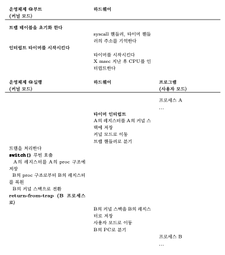
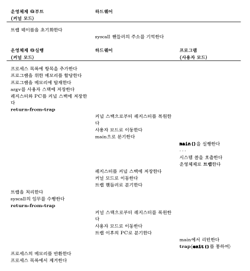

# 6장. 제한적 직접 실행 원리

CPU의 가상화 기법을 구현하기 위해서는 몇 가지 문제를 해결해야 한다.

- 성능 저하
    - 시스템에 과중한 오버헤드를 주지 않으면서 가상화를 구현할 수 있을까?
- 제어 문제
    - CPU에 대한 통제를 유지하면서, 프로세스를 효율적으로 실행시킬 수 있는 방법은 무엇인가?

운영 체제의 입장에서는 자원 관리의 책임자로서 특히 제어 문제가 중요하다. 제어권을 상실하면 한 프로세스가 영원히 실행을 계속할 수 있고 컴퓨터를 장악하거나 접근해서는 안 되는 정보에 접근하게 된다.

---

## 기본 원리: 제한적 직접 실행

운영체제 개발자들은 프로그램을 빠르게 실행하기 위하여 **제한적 직접 실행(Limited Direct Execution)** 이라는 기법을 개발하였다.

여기서 “직접 실행”은 정말 간단하게 프로그램을 CPU 상에서 그냥 직접 실행시키는 것이다.

그러나 이 접근법은 CPU를 가상화함에 있어 몇 가지 문제를 일으킨다.

- 프로그램을 직접 실행시킨다면 프로그램이 운영체제가 원치않는 일을 하지 않는다는 것을 어떻게 보장할 수 있는가?
- 프로세스 실행 시, 운영체제는 어떻게 프로그램의 실행을 중단하고 다른 프로세스로 전환시킬 수 있는가?
    - 즉, CPU를 가상화하는 데 필요한 시분할(time sharing) 기법을 어떻게 구현할 수 있는가?

---

## 문제점 1: 제한된 연산

직접 실행의 장점은 빠르게 실행된다는 것이다. 기본적으로 프로그램이 하드웨어 CPU에서 실행되기 때문이다.

그러나 CPU에서 직접 실행시키면 새로운 문제가 발생한다.

- 만일 프로세스가 특수한 종류의 연산을 수행하길 원한다면 어떻게 될 것인가?

> 💡 팁: 보호된 제어 양도
>
> 하드웨어는 두 가지 실행모드를 제공하여 운영체제를 돕는다.
> - **사용자 모드(user mode)** 에서 응용 프로그램은 하드웨어 자원에 대한 접근 권한이 일부 제한되어 있다.
> - 운영체제는 컴퓨터의 모든 자원에 대한 접근 권한을 **커널 모드(kernel mode)** 에서 가진다.

사용자 프로세스가 디스크를 읽는 것과 같은 특권 명령어를 실행하는 제한적인 작업을 허용하기 위해 거의 모든 하드웨어는 사용자 프로세스에게 시스템 콜을 제공한다.

---

- 커널은 부팅 시에 트랩 테이블(trap table) 을 만들고, 이를 이용하여 시스템을 통제한다.
- 운영체제는 특정 명령어를 사용하여 하드웨어에게 **트랩 핸들러(trap handler)** 의 위치를 알려준다.

---

## 문제점 2: 프로세스 간 전환

직접 실행의 두 번째 문제점은 프로세스 간 전환을 할 수 있어야 한다는 점이다.

>❓ 운영체제는 어떻게 CPU를 다시 획득하여 프로세스를 전환할 수 있는가?

### 협조(cooperative) 방식: 시스템 콜 기다리기

이 방식에서는 운영체제가 프로세스들이 합리적으로 행동할 것이라고 신뢰한다.

협조 방식의 스케줄링 시스템에서 운영체제는 시스템 콜이 호출되기를 기다리거나 불법적인 연산이 일어나기를 기다려서 CPU의 제어권을 다시 획득한다.

### 비협조 방식: 운영체제가 전권을 행사

**타이머 인터럽트(timer interrupt)**

- 타이머 장치는 수 밀리 초마다 인터럽트를 발생
- 인터럽트가 발생하면 현재 수행 중인 프로세스는 중단
- 미리 구성된 운영체제의 **인터럽트 핸들러(interrupt handler)** 가 실행

>💡 팁: 제어를 다시 획득하기 위해 타이머 인터럽트 사용하기
>
>**타이머 인터럽트** 기능을 추가하면 운영체제는 프로세스가 비협조적으로 행동하는 상황에서도 CPU 상에서 실행될 수 있는 능력을 가지게 된다. 타이머 인터럽트 하드웨어 기능은 운영체제가 컴퓨터의 제어를 유지하는
>핵심적인 기능이다.

### 문맥의 저장과 복원

현재 실행중인 프로세스를 계속 실행할 것인지, 아니면 다른 프로세스로 전환할 것인지 결정해야 한다. 이 결정은 운영체제의 **스케줄러(scheduler)** 라는 부분에 의해 내려진다.

다른 프로세스로 전환하기로 결정되면 운영체제는 **문맥 교환(context switch)** 이라고 알려진 코드를 실행한다.

운영체제가 해야하는 작업은 현재 실행 중인 프로세스의 레지스터 값을 커널 스택 같은 곳에 저장하고, 곧 실행될 프로세스의 커널 스택으로부터 레지스터 값을 복원하는 것이 전부다.

위의 과정이 실행되는 동안, 두 번의 레지스터 저장 및 복원이 일어난다.

- 타이머 인터럽트가 발생했을 때
  - 실행 중인 프로세스의 사용자 레지스터가 하드웨어에 의해 암묵적으로 저장
  - 저장 장소로 해당 프로세스의 커널 스택이 사용된다.
- 운영체제가 A에서 B로 전환하기로 결정했을 때
  - 커널 레지스터는 운영체제에 의하여 해당 프로세스의 프로세스 구조체에 저장된다.

---

## 병행성이 걱정

운영체제가 할 수 있는 간단한 해법은 인터럽트를 처리하는 동안 인터럽트를 불능화 시키는 것이다.

이럴 경우에 하나의 인터럽트가 처리되고 있는 동안 다른 어떤 인터럽트도 CPU에게 전달되지 않는다.

물론, 운영체제는 이 작업을 신중하게 해야한다. 인터럽트를 너무 오랫동안 불능화시키면 인터럽트를 놓치게 되고 기술적으로도 좋지 않다.