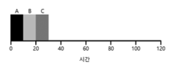

# 7장. 스케줄링: 개요

앞 장에서 운영체제의 프로세스를 실행시키기 위한 문맥 교환 등의 저수준 기법에 대해서 이해했다면, 이제는 운영체제 스케줄러의 고수준 정책에 관해서 이야기 해 보자.

이제부터 다양한 **스케줄링 정책(scheduling policy)** 을 소개하고, 그에 관한 이해를 높일 것이다.

>❓ 스케줄링 정책은 어떻게 개발하는가?
>- 스케줄링 정책을 생각하기 위한 기본적인 프레임워크를 어떻게 만들어야 하는가?
>- 핵심 가정은 무엇인가?
>- 어떤 평가 기준이 중요한가?
>- 컴퓨터 시스템의 초창기에 사용되었던 기본 접근법은 무엇인가?

---

## 워크로드에 대한 가정

**워크로드(workload)** - 일련의 프로세스들이 실행하는 상황

아래의 가정은 비현실적이지만 최종적으로는 **제대로 동작하는 스케줄링 정책**을 만들게 될 것이다.

우리는 시스템에서 실행중인 프로세스 혹은 작업(job)에 대해 다음과 같은 가정을 한다.

1. 모든 작업은 같은 시간 동안 실행된다.
2. 모든 작업은 동시에 도착한다.
3. 각 작업은 시작되면 완료될 때까지 실행된다.
4. 모든 작업은 CPU 만 사용한다(즉, 입출력을 수행하지 않는다).
5. 각 작업의 실행 시간은 사전에 알려져 있다.

---

## 스케줄링 평가 항목

워크로드에 대한 가정 이외에 스케줄링 정책의 비교를 위해 **스케줄링 평가 항목(scheduling metric)** 을 결정해야 한다. 스케줄링의 경우 다양한 평가 기준이 존재한다.

- **반환 시간(turnaround time)**
    - 작업 반환 시간은 작업이 완료된 시각에서 작업이 시스템에 도착한 시각을 뺀 시간으로 정의
    - **성능** 측면에서의 평가 기준

성능 이외에 다른 평가 기준은 **공정성(fareness)** 이다. 성능과 공정성은 스케줄링에 있어서 서로 상충되는 목표이다.

---

## 선입선출

가장 기초적인 알고리즘은 **선입선출(First In First Out, FIFO)** 또는 **선도착선처리(First Come First Served, FCFS)** 스케줄링이라고 알려져 있다.

위 그림에서의 평균 반환 시간은 20이다. 

이제 가정 중 1번 가정을 완화하여 작업 실행 시간이 모두 같지 않다고 해보자.

위 그림에서는 A가 B, C 보다 먼저 100초 동안 실행되기 때문에 평균 반환시간이 110초로 늘어난다.

해당 문제점은 **convoy effect** 라고 칭해지며, 짧은 시간 동안 자원을 사용할 프로세스들이 자원을 오랫동안 사용하는 프로세스의 종료를 기다리는 현상을 말한다.

---

## 최단 작업 우선 (Shortest Job First, SJF)

말 그대로 가장 짧은 실행 시간을 가진 작업을 먼저 실행시킨다.

위의 예시를 이번에는 SJF로 스케줄링 해 보자. B, C, A 순서로 실행시킴으로써 SJF는 평균 반환 시간을 110초에서 50초로 2배 이상 향상시킨 것을 확인할 수 있다.

모든 작업이 동시에 도착한다면 SJF가 최적의 스케줄링 알고리즘임을 증명할 수 있다. 

이제 두 번째 가정을 완화하여 모든 작업이 동시에 도착하는 것이 아니라 임의의 시간에 도착할 수 있다고 가정한다.

위 그림처럼 B, C가 A보다 10초 뒤에 도착했다면 이미 A가 실행중인 상태이므로 이전 FIFO와 같이 convoy effect가 다시 발생한다.

---

## 최소 잔여시간 우선 (Shortest Time-to-Completion First, STCF)

위 그림 7.4의 문제를 해결하기 위해서는 세 번째 가정(작업은 끝날 때까지 계속 실행된다.)을 완화해야 한다.

SJF는 비선점형 스케줄러이기 때문에, 중간에 작업을 멈추고 다른 작업을 실행할 수 없다.

이에 대한 해법으로 최소 잔여시간 우선(Shortest Time-to-Completion First, STCF) 또는 선점형 최단 작업 우선(Preemption Shortest Job First, PSJF) 스케줄러를 사용할 수 있다.

이는 남아 있는 작업과 새로운 작업의 잔여 실행 시간을 계산하고, 그 중 가장 적은 잔여 실행 시간을 가진 작업을 스케줄한다.

위 그림을 보면, A가 실행중이다가 B, C가 도착하고 나서 A를 중단한 후 가장 잔여시간이 짧은 작업인 B부터 C까지 순차적으로 처리한 뒤 다시 A를 재개하는 방식을 사용하고 있다.

---

## 새로운 평가 기준: 응답 시간

작업의 길이를 미리 알고 있고, 작업이 오직 CPU만 사용하며, 평가 기준이 반환 시간 하나라면, STCF는 매우 훌륭한 정책이다. 

하지만 시분할 컴퓨터의 등장 이후, 사용자와 시스템의 상호작용을 원활히 하기 위한 성능을 요구하게 되었고, **응답시간(response time)** 이라는 새로운 평가 기준이 생겼다.

- 응답시간
    - 작업이 도착할 때부터 처음 스케줄 될 때까지의 시간

이전까지 다루었던 스케줄링 방식들은 응답시간이 그리 썩 좋지 않다. 먼저 실행된 작업들이 *완전히 끝날 때까지* 기다려야 하기 때문이다.

---

## 라운드 로빈 (Round-Robin, RR)

RR은 작업이 끝날 때까지 기다리지 않는다. 대신 일정 시간 동안 실행한 후, 실행 큐의 다음 작업으로 전환한다.

이 때 작업이 실행되는 일정 시간을 **타임 슬라이스(time slice)** 또는 **스케줄링 퀀텀(scheduling quantum)** 이라고 한다.

이러한 이유로 RR은 때때로 **타임 슬라이싱** 이라고 불린다. 타임 슬라이스의 길이는 타이머 인터럽트 주기의 배수여야 한다.

타임 슬라이스의 길이는 RR에게 매우 중요하다.

- 짧을수록 응답 시간 기준으로 RR의 성능이 좋아진다.
- 그러나 타임 슬라이스를 너무 짧게 지정하면 문제가 생긴다.
    - 문맥 교환 비용이 전체 성능에 큰 영향을 끼칠 수 있기 때문이다.
- 문맥 교환 비용을 상쇄할 수 있을 만큼 길어야 하지만 그렇다고 응답 시간이 너무 길어지면 안된다.

---

## 입출력 연산의 고려

우선 네 번째 가정을 완화하자. 모든 프로그램은 입출력 작업을 수행한다.

입출력 작업을 요청한 경우 스케줄러는 다음에 어떤 작업을 실행할지를 결정해야 한다. 현재 실행 중인 작업은 입출력이 완료될 때까지 CPU를 사용하지 않을 것이기 때문이다.

아래는 완료하는데 50msec이 소요되지만 10msec마다 입출력을 요청하는 작업 A와 입출력 없이 50msec이 걸리는 작업 B를 STCF 스케줄러로 수행한 그림이다.

위를 해결하기 위한 일반적인 접근 방식은 A의 각 10msec 하위 작업을 독립적인 작업으로 다루는 것이다.

---

## 만병통치약은 없다.(No More Oracle)

스케줄러가 각 작업의 실행 시간을 알고있다는 마지막 가정에 대해 이야기할 차례가 되었다.

가장 비현실적인 가정이다. 운영체제는 작업의 길이에 대해서 알 수 있는 길이 없다.

>😂 미래를 아는 운영체제와 함께라면, 이미 나는 복권에 당첨되었을지도?
> 
>아무리 컴퓨터라도 미래를 알 수는 없으니, 가까운 과거를 이용해서라도 미래를 예측해보자.
> 
>다음 장에서 **멀티 레벨 피드백 큐(multi-level feedback queue)** 가 기다린다.