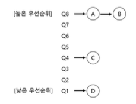
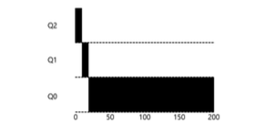
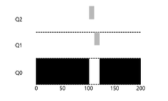
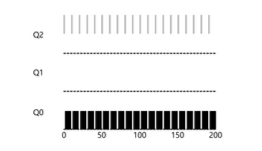

# 8장. 스케줄링: 멀티 레벨 피드백 큐

멀티 레벨 피드백 큐(Multi-level Feedback Queue, MLFQ)가 해결하려고 하는 기본적인 두가지 문제부터 알아보자.

1. 짧은 작업을 먼저 실행시켜 *반환시간*을 최적화하자.
2. MLFQ는 대화형 사용자에게 응답이 빠른 시스템이라는 느낌을 주고 싶기 때문에 *응답시간*을 최적화하자.

지금 우리가 직면한 문제는 다음과 같다.

- 프로세스에 대한 정보가 없다면 이런 스케줄러를 어떻게 만들 수 있을까?
- 실행 중인 작업의 특성을 알아내고 이를 이용하여 더 나은 스케줄링 결정을 하기 위한 방법은 무엇인가?

---

## MLFQ: 기본 규칙

MLFQ의 기본적인 알고리즘을 알아보자.

- MLFQ는 여러 개의 큐로 구성되며, 각각 다른 우선순위가 배정된다.
- 실행 준비가 된 프로세스는 이 중 하나의 큐에 존재한다.
- MLFQ는 실행할 프로세스를 결정하기 위하여 우선순위를 사용한다.
    - 높은 우선순위를 가진 작업이, 즉 높은 우선순위 큐에 존재하는 작업이 선택된다.
- 큐에 둘 이상의 작업이 존재할 수 있다. (당연히 Queue 자료구조니까)
    - 이들은 모두 같은 우선순위를 가진다.
    - 이 작업들 사이에는 라운드 로빈 스케줄링 알고리즘이 사용된다.
- MLFQ는 각 작업에 고정된 우선순위를 부여하는 것이 아니다.
    - *특성에 따라* 동적으로 우선순위를 부여한다.
    - 반복적으로 CPU를 양보하게 되면 우선순위를 높게 유지한다.
    - 한 작업이 긴 시간동안 CPU를 점유하면 해당 작업의 우선순위를 낮춘다.

MLFQ의 두 가지 기본 규칙은 다음과 같다.

- **규칙 1:** Priority(A) > Priority(B) 이면, A가 실행된다 (B는 실행되지 않는다).
- **규칙 2:** Priority(A) = Priority(B) 이면, A와 B는 RR 방식으로 실행된다.

---

## 시도 1: 우선순위의 변경

MLFQ가 작업의 우선순위를 어떻게 바꿀 것인지 결정해야 한다.

- **규칙 3:** 작업이 시스템에 진입하면, 가장 높은 우선순위, 즉 맨 위의 큐에 놓여진다.
- **규칙 4a:** 주어진 타임 슬라이스를 모두 사용하면 우선순위는 *낮아진다*. 즉, 한 단계 아래 큐로 이동한다.
- **규칙 4b:** 타임 슬라이스를 소진하기 전에 CPU를 양도하면 *같은* 우선순위를 유지한다.

### 예 1: 한 개의 긴 실행 시간을 가진 작업

### 예 2: 짧은 작업과 함께

위의 두가지 예시에서 주요 목표를 알 수 있다.

- 스케줄러는 작업이 짧은 작업인지 긴 작업인지 알 수 없기 때문에 일단 짧은 작업이라고 *가정하여* 높은 우선순위를 부여한다.

### 예 3: 입출력 작업에 대해서는 어떻게?

대화형 작업이 키보드나 마우스로부터 사용자 입력을 대기하며 자주 입출력을 수행하면 타임 슬라이스가 종료되기 전에 CPU를 양도하게 될 것이다. 그런 경우 동일한 우선순위를 유지하게 하는 것이다.

### 현재 MLFQ의 문제점

- 기아 상태(starvation) 가 발생할 수 있다.
    - 시스템에 너무 많은 대화형 작업이 존재하면 그들이 모든 CPU 시간을 소모하게 될 것
    - 긴 실행 시간 작업은 CPU 시간을 할당받지 못할 것
- 스케줄러를 자신에게 유리하게 동작하도록 프로그램을 다시 작성할 수 있다.
    - 스케줄러를 자신에게 유리하게 동작시킨다는 것은 일반적으로 스케줄러를 속여서 지정된 몫보다 더 많은 시간을 할당하도록 하게 만드는 것을 가리킨다.
- 프로그램은 시간 흐름에 따라 특성이 변할 수 있다.
    - CPU 위주 작업이 대화형 작업으로 바뀔 수 있다.

---

## 시도 2: 우선순위의 상향 조정

주기적으로 모든 작업의 우선순위를 **상향조정(boost)** 하는 것이다.

목적을 달성하기 위해 여러 방법이 존재하지만 간단한 방법을 사용하기로 하자. 모두 최상위 큐로 보내는 것이다.

- **규칙 5:** 일정 기간 S가 지나면, 시스템의 모든 작업을 최상위 큐로 이동시킨다.

새로운 규칙은 두 가지 문제를 한 번에 해결한다.

1. 프로세스는 기아 상태가 되지 않는다. 최상위 큐에서 RR 방식으로 동작할 것이기 때문이다.
2. CPU 위주의 작업이 대화형 작업으로 특성이 변할 경우 우선순위 상향을 통해 스케줄러가 변경된 특성에 적합한 스케줄링 방법을 적용한다.

---

## 시도 3: 더 나은 시간 측정

해결해야 할 문제가 하나 더 있다. 스케줄러를 자신에게 유리하게 동작시키는 것을 어떻게 막을 수 있을까?

MLFQ의 각 단계에서 CPU 총 사용 시간을 측정하는 것이다.

- **규칙 4:** 주어진 단계에서 시간 할당량을 소진하면, 우선순위는 낮아진다.

---

## MLFQ 규칙 다시 한번 정리

- 규칙 1: 우선순위(A) > 우선순위(B) 일 경우, A가 실행, B는 실행되지 않는다.
- 규칙 2: 우선순위(A) = 우선순위(B) 일 경우, A와 B는 RR 방식으로 실행된다.
- 규칙 3: 작업이 시스템에 들어가면 최상위 큐에 배치된다.
- 규칙 4: 작업이 지정된 단계에서 배정받은 시간을 소진하면, 작업의 우선순위는 낮아진다.
- 규칙 5: 일정 주기 S가 지난 후, 시스템의 모든 작업을 최상위 큐로 이동시킨다.